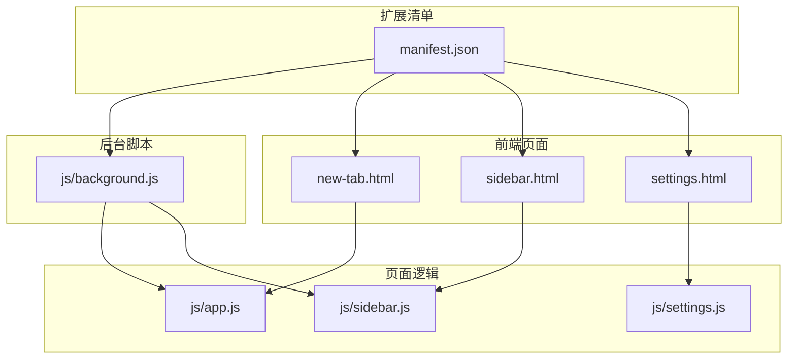
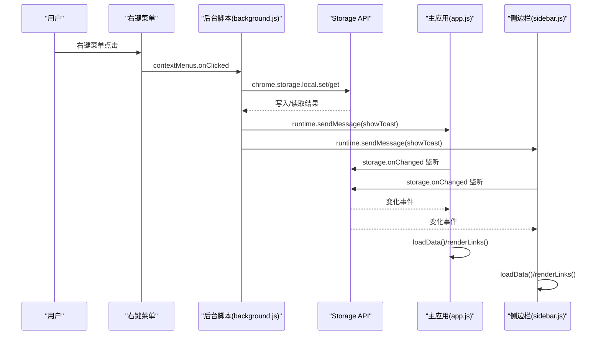
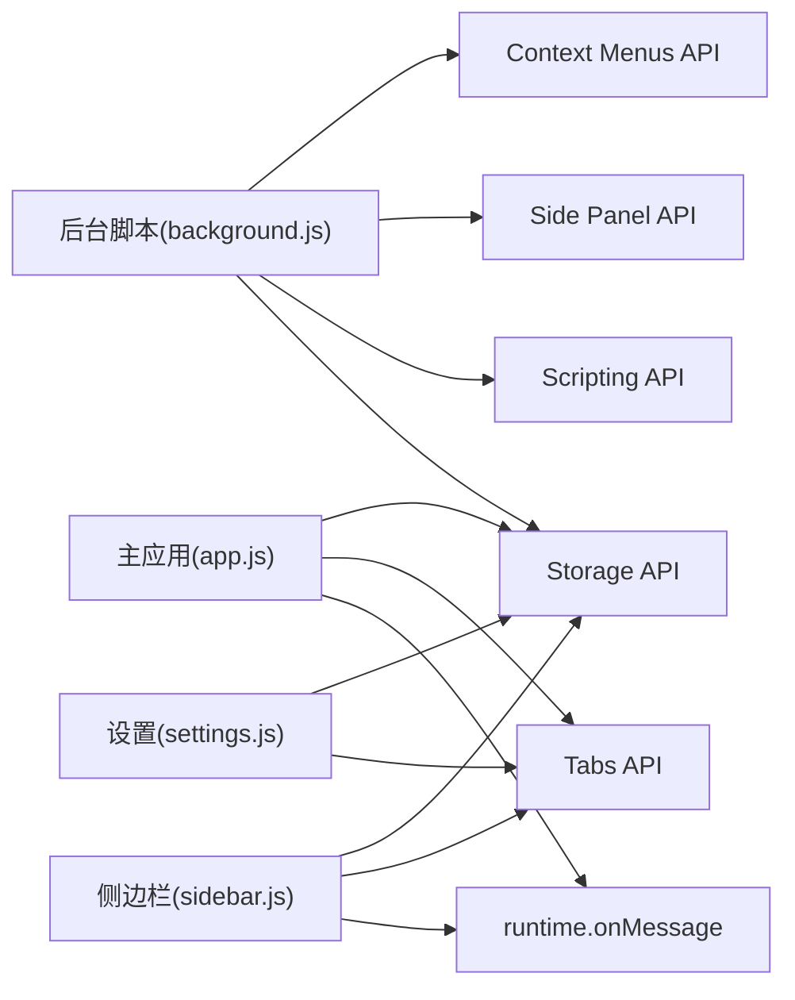

# API 参考

<cite>
**本文引用的文件**
- [manifest.json](file://manifest.json)
- [js/app.js](file://js/app.js)
- [js/background.js](file://js/background.js)
- [js/sidebar.js](file://js/sidebar.js)
- [js/settings.js](file://js/settings.js)
- [new-tab.html](file://new-tab.html)
- [sidebar.html](file://sidebar.html)
- [settings.html](file://settings.html)
- [README.md](file://README.md)
- [GUIDE.md](file://GUIDE.md)
</cite>

## 目录
1. [简介](#简介)
2. [项目结构](#项目结构)
3. [核心组件](#核心组件)
4. [架构总览](#架构总览)
5. [详细组件分析](#详细组件分析)
6. [依赖关系分析](#依赖关系分析)
7. [性能考量](#性能考量)
8. [故障排查指南](#故障排查指南)
9. [结论](#结论)
10. [附录](#附录)

## 简介
本参考文档面向开发者，系统梳理书签白板 Chrome 扩展的 API 使用与内部模块接口，涵盖以下方面：
- Chrome Extension API：Storage API、Context Menus API、Tabs API、Side Panel API、Scripting API
- 内部模块 API：主应用模块、侧边栏模块、设置模块的公共方法与接口
- 参数说明、返回值定义、调用时机、错误处理、性能与最佳实践
- 完整的集成指南与示例路径，帮助快速理解与使用各接口

## 项目结构
书签白板采用 Manifest V3 架构，主要文件组织如下：
- manifest.json：声明权限、背景脚本、侧边栏默认路径等
- new-tab.html：新标签页主界面，加载主应用逻辑
- sidebar.html：侧边栏界面，加载侧边栏逻辑
- settings.html：设置页面，加载设置模块逻辑
- js/app.js：主应用逻辑（新标签页）
- js/sidebar.js：侧边栏逻辑
- js/settings.js：设置模块逻辑
- js/background.js：后台脚本（右键菜单、消息通信、通知注入）

图表来源
- [manifest.json:1-38](file://manifest.json#L1-L38)
- [new-tab.html:1-206](file://new-tab.html#L1-L206)
- [sidebar.html:1-51](file://sidebar.html#L1-L51)
- [settings.html:1-281](file://settings.html#L1-L281)

章节来源
- [manifest.json:1-38](file://manifest.json#L1-L38)
- [new-tab.html:1-206](file://new-tab.html#L1-L206)
- [sidebar.html:1-51](file://sidebar.html#L1-L51)
- [settings.html:1-281](file://settings.html#L1-L281)

## 核心组件
- Storage API：用于本地数据持久化（chrome.storage.local）
- Context Menus API：右键菜单（页面、链接、打开侧边栏）
- Tabs API：查询当前标签页、创建新标签页
- Side Panel API：启用侧边栏、打开侧边栏
- Scripting API：向页面注入脚本以显示 Toast 通知

章节来源
- [manifest.json:9-15](file://manifest.json#L9-L15)
- [README.md:41-51](file://README.md#L41-L51)

## 架构总览
扩展由后台脚本集中协调，主应用与侧边栏通过 Storage API 实时同步，右键菜单触发后台脚本写入数据并通过消息通知页面刷新；Scripting API 用于在当前页面注入通知脚本。

图表来源
- [js/background.js:39-69](file://js/background.js#L39-L69)
- [js/background.js:112-167](file://js/background.js#L112-L167)
- [js/app.js:116-121](file://js/app.js#L116-L121)
- [js/sidebar.js:142-149](file://js/sidebar.js#L142-L149)

章节来源
- [js/background.js:1-174](file://js/background.js#L1-L174)
- [js/app.js:116-121](file://js/app.js#L116-L121)
- [js/sidebar.js:142-149](file://js/sidebar.js#L142-L149)

## 详细组件分析

### Chrome Extension API 使用

#### Storage API（chrome.storage.local）
- 作用：本地持久化书签数据、主题设置、提示状态等
- 关键使用点
  - 主应用读取/写入 links、groups、autoGroupNames、tipHidden、darkMode
  - 侧边栏读取 links
  - 设置模块读取 links、groups、autoGroupNames、darkMode
  - 后台脚本写入 links 并广播消息
- 调用时机
  - 页面初始化时加载数据
  - 用户操作（增删改）后保存
  - 右键菜单添加书签后，后台脚本写入并通知页面刷新
- 错误处理
  - 读取失败时使用默认值（空数组/空对象）
  - 写入失败时捕获异常并记录日志
- 性能建议
  - 批量写入（一次性 set 多个键）
  - 使用 storage.onChanged 监听，避免轮询
  - 对大列表进行分页渲染（侧边栏）

章节来源
- [js/app.js:81-106](file://js/app.js#L81-L106)
- [js/app.js:469-473](file://js/app.js#L469-L473)
- [js/sidebar.js:37-41](file://js/sidebar.js#L37-L41)
- [js/sidebar.js:311-313](file://js/sidebar.js#L311-L313)
- [js/settings.js:96-110](file://js/settings.js#L96-L110)
- [js/settings.js:411-414](file://js/settings.js#L411-L414)
- [js/background.js:92-109](file://js/background.js#L92-L109)

#### Context Menus API（chrome.contextMenus）
- 权限：contextMenus
- 菜单项
  - 添加到书签白板（页面）
  - 添加链接到书签白板（链接）
  - 打开书签白板侧边栏（页面）
- 行为
  - 点击“打开侧边栏”：调用 sidePanel.open
  - 点击“添加到书签白板”：调用 storage 写入并显示通知
  - 点击“添加链接到书签白板”：优先使用 selectionText/linkText，获取 favicon，调用 storage 写入并显示通知
- 调用时机
  - 扩展安装时创建菜单
  - 用户右键点击菜单项时触发
- 错误处理
  - URL 解析失败时降级为默认标题
  - 通知注入失败时捕获并记录

章节来源
- [manifest.json:10-12](file://manifest.json#L10-L12)
- [js/background.js:6-37](file://js/background.js#L6-L37)
- [js/background.js:39-69](file://js/background.js#L39-L69)
- [js/background.js:71-109](file://js/background.js#L71-L109)

#### Tabs API（chrome.tabs）
- 权限：tabs
- 使用点
  - 侧边栏手动添加：查询当前活动标签页，获取 url/title/favIconUrl
  - 主应用拖拽添加：查询匹配的标签页以获取标题
  - 右键菜单：获取 tabId 以便在当前页面注入通知
- 调用时机
  - 侧边栏“添加当前页面”按钮点击
  - 主应用拖拽释放时
  - 右键菜单“添加链接到书签白板”时
- 错误处理
  - 查询不到匹配标签页时使用域名作为标题
  - favicon 获取失败时使用默认图标

章节来源
- [js/sidebar.js:106-114](file://js/sidebar.js#L106-L114)
- [js/app.js:151-159](file://js/app.js#L151-L159)
- [js/background.js:52-68](file://js/background.js#L52-L68)

#### Side Panel API（chrome.sidePanel）
- 权限：sidePanel
- 使用点
  - 扩展安装时启用侧边栏并设置默认路径
  - 右键菜单“打开书签白板侧边栏”时打开侧边栏
  - action.onClicked 时打开侧边栏
- 调用时机
  - runtime.onInstalled
  - contextMenus.onClicked
  - action.onClicked
- 错误处理
  - 无显式错误处理，遵循 Chrome API 默认行为

章节来源
- [manifest.json:23-26](file://manifest.json#L23-L26)
- [js/background.js:6-37](file://js/background.js#L6-L37)
- [js/background.js:40-45](file://js/background.js#L40-L45)
- [js/background.js:169-174](file://js/background.js#L169-L174)

#### Scripting API（chrome.scripting）
- 权限：scripting
- 使用点
  - 在当前页面注入脚本以显示 Toast 通知
- 调用时机
  - 右键菜单添加书签后，在当前页面显示通知
- 错误处理
  - 注入失败时捕获并记录日志

章节来源
- [manifest.json:13](file://manifest.json#L13)
- [js/background.js:112-167](file://js/background.js#L112-L167)

### 内部模块 API

#### 主应用模块（new-tab.html + js/app.js）
- 公共方法与职责
  - 初始化与主题加载：loadTheme()
  - 数据加载与渲染：loadData()、renderLinks()、renderGroups()
  - 事件绑定：setupEventListeners()（拖拽、搜索、排序、主题切换、提示栏隐藏、手动添加、导入）
  - 书签操作：addLinkFromUrl()、editGroup()、deleteGroup()、showGroupContextMenu()、showBookmarkContextMenu()
  - 存储：save()（批量写入 links/groups）
  - 通知：showToast()（页面内提示）
- 关键参数
  - links：书签数组
  - groups：分组数组
  - filterText：搜索关键字
  - sortBy：排序规则
  - currentView：视图类型（all/pinned/recent）
- 返回值
  - renderLinks()/renderGroups()：无返回值，负责更新 DOM
  - addLinkFromUrl()：无返回值，添加后保存并渲染
- 调用时机
  - 页面 load 事件后加载主题与数据
  - storage.onChanged 事件触发后刷新
  - 用户交互触发相应操作
- 错误处理
  - URL 解析失败时降级为默认标题
  - 导入文件格式错误时提示并记录日志
- 性能建议
  - 使用域名缓存 domainCache 减少 URL 解析
  - 渲染时清理缓存以保持一致性
  - 大列表分批渲染（主应用未实现，但侧边栏实现）

章节来源
- [new-tab.html:1-206](file://new-tab.html#L1-L206)
- [js/app.js:64-106](file://js/app.js#L64-L106)
- [js/app.js:108-373](file://js/app.js#L108-L373)
- [js/app.js:469-542](file://js/app.js#L469-L542)
- [js/app.js:618-758](file://js/app.js#L618-L758)
- [js/app.js:760-800](file://js/app.js#L760-L800)

#### 侧边栏模块（sidebar.html + js/sidebar.js）
- 公共方法与职责
  - 初始化与主题加载：loadTheme()、toggleTheme()、updateThemeIcon()
  - 数据加载与渲染：loadData()、renderLinks()、getFilteredLinks()、createBookmarkCard()
  - 事件绑定：setupEventListeners()（关闭、主题切换、添加当前页面、搜索、手动添加、拖拽）
  - 书签操作：editBookmark()、deleteBookmark()、addBookmark()、showSidebarToast()
  - 手动添加对话框：showManualAddDialog()、fetchWebsiteInfo()
  - 拖拽添加：setupDragAndDrop()
  - 存储：saveData()
- 关键参数
  - links：书签数组
  - filterText：搜索关键字
  - SIDEBAR_DISPLAY_LIMIT：侧边栏最大显示数量
- 返回值
  - renderLinks()：无返回值
  - addBookmark()：无返回值
- 调用时机
  - DOMContentLoaded 后加载数据与主题
  - storage.onChanged 事件触发后刷新
  - 用户交互触发相应操作
- 错误处理
  - favicon 加载失败时回退默认图标
  - URL 格式校验失败时提示
- 性能建议
  - 限制显示数量（SIDEBAR_DISPLAY_LIMIT）
  - 分批渲染（requestAnimationFrame + 批大小）
  - 搜索过滤在 getFilteredLinks() 中进行

章节来源
- [sidebar.html:1-51](file://sidebar.html#L1-L51)
- [js/sidebar.js:9-68](file://js/sidebar.js#L9-L68)
- [js/sidebar.js:30-202](file://js/sidebar.js#L30-L202)
- [js/sidebar.js:294-335](file://js/sidebar.js#L294-L335)
- [js/sidebar.js:315-335](file://js/sidebar.js#L315-L335)
- [js/sidebar.js:490-506](file://js/sidebar.js#L490-L506)
- [js/sidebar.js:508-601](file://js/sidebar.js#L508-L601)

#### 设置模块（settings.html + js/settings.js）
- 公共方法与职责
  - 初始化与主题加载：initMenuState()、loadTheme()
  - 数据加载与渲染：loadData()、renderLinks()、renderGroups()
  - 导航与菜单状态：setupNavigation()、saveCurrentMenu()
  - 事件绑定：setupEventListeners()（storage 监听、搜索）
  - 书签操作：editBookmark()、deleteBookmark()、saveData()
  - 批量操作：setupBatchMode()（全选/取消全选/批量删除/批量添加分组）
  - 分组管理：setupGroupManagement()、editGroup()、deleteGroup()、generateAutoGroups()
  - 数据管理：setupDataManagement()、exportData()、handleImportFile()、encryptData()/decryptData()
  - 弹窗与提示：showEditModal()、showConfirmModal()、showGroupSelectionModal()、showToast()
- 关键参数
  - links：书签数组
  - groups：分组数组
  - filterText：搜索关键字
  - sortBy：排序规则
  - selectedLinks：批量选择集合
  - isBatchMode：批量模式开关
  - autoGroupNames：自动分组自定义名称映射
- 返回值
  - renderLinks()：无返回值
  - generateAutoGroups()：返回自动分组数组
- 调用时机
  - DOMContentLoaded 后初始化菜单、加载数据与主题
  - storage.onChanged 事件触发后刷新
  - 用户交互触发相应操作
- 错误处理
  - 导入文件格式错误时提示并记录日志
  - 加密/解密失败时提示并记录日志
- 性能建议
  - 搜索过滤在 renderLinks() 中进行
  - 批量操作减少多次写入，统一保存

章节来源
- [settings.html:1-281](file://settings.html#L1-L281)
- [js/settings.js:26-65](file://js/settings.js#L26-L65)
- [js/settings.js:67-92](file://js/settings.js#L67-L92)
- [js/settings.js:94-110](file://js/settings.js#L94-L110)
- [js/settings.js:112-191](file://js/settings.js#L112-L191)
- [js/settings.js:193-230](file://js/settings.js#L193-L230)
- [js/settings.js:232-270](file://js/settings.js#L232-L270)
- [js/settings.js:411-414](file://js/settings.js#L411-L414)
- [js/settings.js:416-531](file://js/settings.js#L416-L531)
- [js/settings.js:533-733](file://js/settings.js#L533-L733)
- [js/settings.js:1002-1150](file://js/settings.js#L1002-L1150)
- [js/settings.js:1152-1216](file://js/settings.js#L1152-L1216)

## 依赖关系分析
- 权限依赖
  - storage：主应用、侧边栏、设置模块均依赖
  - contextMenus：后台脚本创建菜单并处理点击
  - tabs：主应用、侧边栏、后台脚本查询标签页
  - sidePanel：后台脚本启用与打开侧边栏
  - scripting：后台脚本向页面注入通知脚本
- 模块耦合
  - 主应用与侧边栏通过 storage.onChanged 实时同步
  - 后台脚本与主应用/侧边栏通过 runtime.sendMessage 通信
  - 设置模块与主应用共享数据结构与存储键

图表来源
- [manifest.json:9-15](file://manifest.json#L9-L15)
- [js/background.js:1-174](file://js/background.js#L1-L174)
- [js/app.js:116-121](file://js/app.js#L116-L121)
- [js/sidebar.js:142-149](file://js/sidebar.js#L142-L149)

章节来源
- [manifest.json:9-15](file://manifest.json#L9-L15)
- [js/background.js:1-174](file://js/background.js#L1-L174)
- [js/app.js:116-121](file://js/app.js#L116-L121)
- [js/sidebar.js:142-149](file://js/sidebar.js#L142-L149)

## 性能考量
- 数据访问
  - 使用 chrome.storage.local.get 批量读取，避免多次请求
  - 使用 chrome.storage.local.set 批量写入，减少 I/O 次数
- 渲染优化
  - 侧边栏实现分批渲染（requestAnimationFrame + 批大小），建议主应用也采用类似策略
  - 限制侧边栏显示数量（SIDEBAR_DISPLAY_LIMIT），避免长列表卡顿
- 计算缓存
  - 主应用使用 domainCache 缓存域名解析结果
- 事件监听
  - 使用 storage.onChanged 替代轮询，降低 CPU 占用
- 页面注入
  - Scripting API 注入通知脚本时捕获异常，避免影响页面稳定性

[本节为通用性能建议，不直接分析具体文件]

## 故障排查指南
- 右键菜单未显示
  - 重新安装扩展（移除后重新加载）
- 书签丢失
  - 清除浏览器数据会导致 chrome.storage.local 中数据丢失
- 侧边栏不自动刷新
  - 确保使用最新版本（v3.2.5+），必要时关闭并重新打开侧边栏
- 导入失败
  - 检查文件格式与完整性，确保为加密 JSON 文件
  - 导入会覆盖当前所有数据，请谨慎操作
- 通知未显示
  - Scripting API 注入失败时会捕获并记录日志，检查权限与页面 CSP

章节来源
- [README.md:248-258](file://README.md#L248-L258)
- [GUIDE.md:393-397](file://GUIDE.md#L393-L397)
- [js/background.js:164-167](file://js/background.js#L164-L167)

## 结论
书签白板通过 Chrome Extension API 与内部模块协同，实现了本地化的书签管理体验。Storage API 提供稳定的数据持久化，Context Menus、Tabs、Side Panel、Scripting API 构成便捷的操作入口与交互体验。内部模块以清晰的职责划分与事件驱动的方式实现高效同步与渲染。开发者可依据本文档的参数、返回值、调用时机与错误处理建议，快速集成与扩展功能。

[本节为总结性内容，不直接分析具体文件]

## 附录

### API 调用时机与最佳实践
- Storage API
  - 调用时机：初始化加载、用户操作后保存、右键菜单写入后通知刷新
  - 最佳实践：批量读写、使用 onChanged 监听、对大列表分批渲染
- Context Menus API
  - 调用时机：扩展安装时创建菜单；右键点击时触发
  - 最佳实践：菜单项明确、标题友好、降级处理 URL 解析失败
- Tabs API
  - 调用时机：侧边栏添加当前页面、主应用拖拽获取标题、右键菜单注入通知
  - 最佳实践：查询失败时使用域名作为标题，favicon 获取失败回退默认图标
- Side Panel API
  - 调用时机：安装时启用；右键菜单与 action 点击时打开
  - 最佳实践：遵循 Chrome 默认行为，避免异常处理
- Scripting API
  - 调用时机：右键菜单添加书签后在当前页面显示通知
  - 最佳实践：捕获注入异常，确保页面稳定性

章节来源
- [js/background.js:6-37](file://js/background.js#L6-L37)
- [js/background.js:39-69](file://js/background.js#L39-L69)
- [js/background.js:112-167](file://js/background.js#L112-L167)
- [js/sidebar.js:106-114](file://js/sidebar.js#L106-L114)
- [js/app.js:151-159](file://js/app.js#L151-L159)

### 集成指南与示例路径
- 新标签页主界面
  - HTML：new-tab.html
  - 逻辑：js/app.js
- 侧边栏界面
  - HTML：sidebar.html
  - 逻辑：js/sidebar.js
- 设置页面
  - HTML：settings.html
  - 逻辑：js/settings.js
- 后台脚本
  - JS：js/background.js
  - 清单：manifest.json

章节来源
- [new-tab.html:1-206](file://new-tab.html#L1-L206)
- [sidebar.html:1-51](file://sidebar.html#L1-L51)
- [settings.html:1-281](file://settings.html#L1-L281)
- [js/background.js:1-174](file://js/background.js#L1-L174)
- [manifest.json:1-38](file://manifest.json#L1-L38)