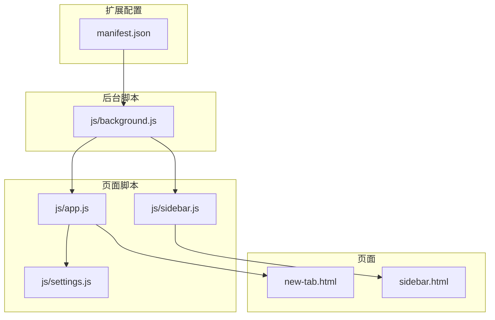
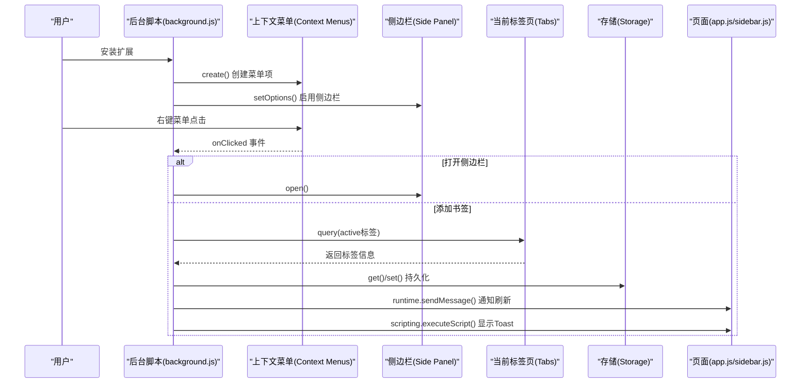
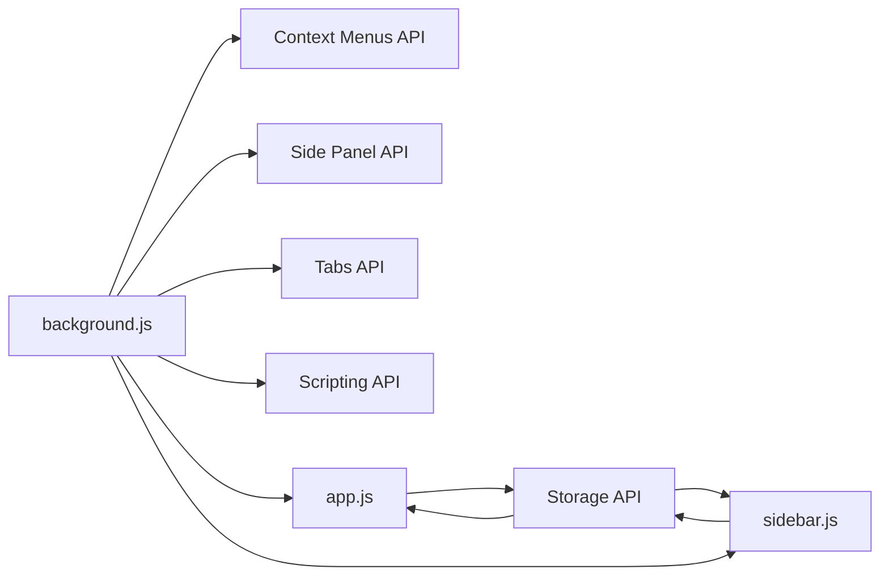

# Chrome 扩展 API

<cite>
**本文引用的文件**
- [manifest.json](file://manifest.json)
- [background.js](file://js/background.js)
- [app.js](file://js/app.js)
- [sidebar.js](file://js/sidebar.js)
- [settings.js](file://js/settings.js)
- [new-tab.html](file://new-tab.html)
- [sidebar.html](file://sidebar.html)
- [README.md](file://README.md)
- [GUIDE.md](file://GUIDE.md)
</cite>

## 目录
1. [简介](#简介)
2. [项目结构](#项目结构)
3. [核心组件](#核心组件)
4. [架构总览](#架构总览)
5. [详细组件分析](#详细组件分析)
6. [依赖关系分析](#依赖关系分析)
7. [性能考量](#性能考量)
8. [故障排查指南](#故障排查指南)
9. [结论](#结论)
10. [附录](#附录)

## 简介
本文件面向书签白板项目的 Chrome 扩展 API 使用文档，围绕 Manifest V3 的四大核心 API 展开：Storage API、Context Menus API、Tabs API、Side Panel API，并补充 Scripting API 的页面脚本注入与通知显示机制。文档基于实际代码实现，提供参数说明、调用时机、错误处理、性能优化与最佳实践，帮助开发者与使用者高效理解与维护该扩展。

## 项目结构
- Manifest V3 配置声明了扩展权限与侧边栏默认路径，后台脚本负责右键菜单与侧边栏控制。
- 主页面与侧边栏分别通过 Storage API 读写本地数据，实现跨页面实时同步。
- Scripting API 用于在当前页面注入脚本以显示 Toast 通知。

图表来源
- [manifest.json](file://manifest.json)
- [background.js](file://js/background.js)
- [app.js](file://js/app.js)
- [sidebar.js](file://js/sidebar.js)
- [settings.js](file://js/settings.js)
- [new-tab.html](file://new-tab.html)
- [sidebar.html](file://sidebar.html)

章节来源
- [manifest.json](file://manifest.json)
- [new-tab.html](file://new-tab.html)
- [sidebar.html](file://sidebar.html)

## 核心组件
- Storage API：用于本地数据持久化，键包括 links、groups、autoGroupNames、darkMode、tipHidden 等。
- Context Menus API：注册右键菜单项，监听点击事件，触发侧边栏打开与书签添加。
- Tabs API：查询当前标签页信息，辅助书签标题与图标获取。
- Side Panel API：启用侧边栏、设置侧边栏选项、打开侧边栏。
- Scripting API：在当前页面注入脚本以显示 Toast 通知。

章节来源
- [background.js](file://js/background.js)
- [app.js](file://js/app.js)
- [sidebar.js](file://js/sidebar.js)
- [manifest.json](file://manifest.json)

## 架构总览
扩展运行时的关键交互如下：
- 安装时后台脚本创建右键菜单并启用侧边栏。
- 用户通过右键菜单或扩展图标触发侧边栏与书签添加。
- 主页面与侧边栏通过 Storage API 读写数据，实现跨页面同步。
- Scripting API 注入脚本在当前页面显示 Toast 通知。

图表来源
- [background.js](file://js/background.js)
- [app.js](file://js/app.js)
- [sidebar.js](file://js/sidebar.js)

## 详细组件分析

### Storage API 数据持久化
- 数据键与用途
  - links：书签数组，包含 url、title、icon、groups、createdAt 等字段。
  - groups：分组数组，包含 id、name、color、icon、createdAt 等字段。
  - autoGroupNames：自动分组自定义名称映射。
  - darkMode：主题开关。
  - tipHidden：提示栏隐藏状态。
- 读取与写入
  - 主页面与侧边栏均使用 chrome.storage.local.get() 一次性读取所需键。
  - 写入使用 chrome.storage.local.set()，批量写入以减少回调次数。
- 监听与同步
  - 主页面与侧边栏使用 chrome.storage.onChanged 监听本地存储变化，实现跨页面自动刷新。
- 错误处理
  - Storage API 调用通常无显式异常抛出；若需健壮性，可在 set() 回调中进行幂等检查或重试。
- 性能优化
  - 批量读写：一次性读取多个键，避免多次异步往返。
  - 增量更新：仅在数据变更时调用 set()。
  - 缓存：对域名解析结果进行缓存，降低重复计算成本。

章节来源
- [app.js](file://js/app.js)
- [sidebar.js](file://js/sidebar.js)
- [settings.js](file://js/settings.js)

### Context Menus API 右键菜单
- 菜单项创建
  - addToBookmarkBoard：在页面右键菜单中添加当前页面。
  - addLinkToBookmarkBoard：在链接右键菜单中添加该链接。
  - openSidebar：在页面右键菜单中打开侧边栏。
- 事件监听
  - onClicked：根据 menuItemId 分支处理，分别打开侧边栏或添加书签。
- 菜单项配置要点
  - contexts：限定菜单出现的上下文（page/link）。
  - documentUrlPatterns：限制生效的 URL 模式。
- 调用时机
  - onInstalled 时创建菜单。
  - 用户右键点击时触发 onClicked。
- 错误处理
  - 若菜单未显示，需完全卸载后重新加载扩展。
- 最佳实践
  - 保持菜单项简洁明确，避免过多冗余选项。
  - 对链接右键菜单优先使用 selectionText 或 linkText 作为标题来源。

章节来源
- [background.js](file://js/background.js)
- [manifest.json](file://manifest.json)

### Tabs API 标签页管理
- 查询当前标签页
  - 在侧边栏一键添加与拖拽添加时，使用 chrome.tabs.query({ active: true, currentWindow: true }) 获取当前活动标签页。
- 查询匹配 URL
  - 在拖拽添加场景中，使用 chrome.tabs.query({ url: cleanUrl }) 获取已有标签页的标题与图标，提升书签标题质量。
- 调用时机
  - 侧边栏添加当前页面时。
  - 拖拽 URL 到侧边栏时。
- 错误处理
  - 若查询不到标签页，回退使用域名作为标题与图标来源。
- 最佳实践
  - 优先使用 active 标签页信息，其次再回退到 URL 解析与 favicon 生成。

章节来源
- [sidebar.js](file://js/sidebar.js)
- [background.js](file://js/background.js)

### Side Panel API 侧边栏控制
- 启用与设置
  - onInstalled 时调用 chrome.sidePanel.setOptions({ enabled: true, path: 'sidebar.html' }) 启用侧边栏并设置默认路径。
- 打开侧边栏
  - 右键菜单 openSidebar 或扩展图标点击时，调用 chrome.sidePanel.open({ tabId: tab.id }) 打开侧边栏。
- 调用时机
  - 安装时启用侧边栏。
  - 用户通过右键菜单或扩展图标触发打开。
- 错误处理
  - 若侧边栏不自动刷新，尝试关闭并重新打开。
- 最佳实践
  - 保持侧边栏路径与 manifest 中的 side_panel.default_path 一致。
  - 通过 tabId 精确控制打开目标标签页。

章节来源
- [background.js](file://js/background.js)
- [manifest.json](file://manifest.json)

### Scripting API 页面脚本注入与通知显示
- 注入与执行
  - 使用 chrome.scripting.executeScript() 在当前页面注入函数，动态创建并插入 Toast 通知元素。
  - 参数 target 指定 tabId，func 为注入函数，args 为传入参数（消息与类型）。
- 通知类型
  - 成功：绿色背景，显示成功图标。
  - 警告：浅黄背景，显示警告图标。
- 调用时机
  - 添加书签成功或失败时，在当前页面显示 Toast。
- 错误处理
  - executeScript() 可能因页面策略或权限受限而失败，使用 .catch() 捕获并记录日志，避免影响主流程。
- 最佳实践
  - 通知样式与动画通过内联样式实现，确保在不同页面环境下稳定显示。
  - 通知自动消失，避免干扰用户操作。

章节来源
- [background.js](file://js/background.js)

## 依赖关系分析
- 权限与入口
  - manifest.json 声明 permissions: storage、contextMenus、tabs、scripting、sidePanel。
  - background.js 作为 service worker，负责菜单与侧边栏控制。
  - app.js 与 sidebar.js 分别处理主页面与侧边栏逻辑。
- 数据流
  - Storage API 作为数据中枢，主页面与侧边栏双向读写。
  - Scripting API 作为 UI 通知通道，单向注入当前页面。
- 事件链
  - 用户操作 → Context Menus → Background → Side Panel/Tabs/Storage → Page Scripts → UI 更新。

图表来源
- [manifest.json](file://manifest.json)
- [background.js](file://js/background.js)
- [app.js](file://js/app.js)
- [sidebar.js](file://js/sidebar.js)

章节来源
- [manifest.json](file://manifest.json)
- [background.js](file://js/background.js)
- [app.js](file://js/app.js)
- [sidebar.js](file://js/sidebar.js)

## 性能考量
- 存储层面
  - 批量读写：一次性读取多个键，减少异步往返。
  - 增量更新：仅在数据变更时 set()，避免不必要的写入。
  - 缓存：域名解析结果缓存，降低重复计算。
- 页面渲染
  - 侧边栏渲染采用分批渲染（requestAnimationFrame），限制显示数量（默认 50），提升大列表性能。
- 通知显示
  - 通过注入脚本在当前页面直接 DOM 操作，避免额外通信开销。
- 调用时机
  - 在安装时集中初始化菜单与侧边栏，避免运行时频繁初始化。

章节来源
- [app.js](file://js/app.js)
- [sidebar.js](file://js/sidebar.js)
- [background.js](file://js/background.js)

## 故障排查指南
- 右键菜单未显示
  - 完全卸载后重新加载扩展。
- 书签丢失
  - 清除浏览器数据会删除 chrome.storage.local 中的书签，建议定期导出备份。
- 侧边栏不自动刷新
  - 确保使用最新版本，必要时关闭并重新打开侧边栏。
- 无法在页面显示通知
  - 检查 Scripting API 权限与页面策略，executeScript() 可能因权限或 CSP 限制失败，需捕获并降级处理。

章节来源
- [README.md](file://README.md)
- [GUIDE.md](file://GUIDE.md)
- [background.js](file://js/background.js)

## 结论
书签白板项目通过 Manifest V3 的四大核心 API 实现了完整的本地书签管理闭环：右键菜单与侧边栏提供便捷入口，Tabs API 辅助书签信息获取，Storage API 提供可靠持久化，Scripting API 实现即时 UI 反馈。整体架构清晰、职责分离，具备良好的可维护性与扩展性。

## 附录

### API 使用清单与参数说明

- Storage API
  - chrome.storage.local.get(keys, callback)
    - 参数：keys 可为字符串或数组；callback(result) 返回对象。
    - 用途：读取 links、groups、autoGroupNames、darkMode、tipHidden 等。
  - chrome.storage.local.set(items, callback?)
    - 参数：items 为键值对对象；callback 可选。
    - 用途：写入 links、groups、autoGroupNames、darkMode 等。
  - chrome.storage.onChanged.addListener(listener(changes, namespace))
    - 参数：listener 接收 changes 与 namespace。
    - 用途：监听本地存储变化，触发页面刷新。

- Context Menus API
  - chrome.contextMenus.create(createProperties, callback?)
    - 参数：createProperties 包含 id、title、contexts、documentUrlPatterns 等。
    - 用途：创建右键菜单项。
  - chrome.contextMenus.onClicked.addListener(listener(info, tab))
    - 参数：info 包含 menuItemId、linkUrl、selectionText、linkText 等；tab 为触发标签页。
    - 用途：处理菜单点击事件。

- Tabs API
  - chrome.tabs.query(queryInfo, callback)
    - 参数：queryInfo 支持 active、currentWindow、url 等。
    - 用途：获取当前活动标签页或匹配 URL 的标签页。

- Side Panel API
  - chrome.sidePanel.setOptions(options)
    - 参数：options.enabled、options.path。
    - 用途：启用侧边栏并设置默认路径。
  - chrome.sidePanel.open(openProperties)
    - 参数：openProperties.tabId。
    - 用途：打开指定标签页的侧边栏。

- Scripting API
  - chrome.scripting.executeScript(details, callback?)
    - 参数：details.target.tabId；details.func 注入函数；details.args 传参。
    - 用途：在当前页面注入脚本以显示 Toast 通知。

章节来源
- [background.js](file://js/background.js)
- [app.js](file://js/app.js)
- [sidebar.js](file://js/sidebar.js)
- [manifest.json](file://manifest.json)