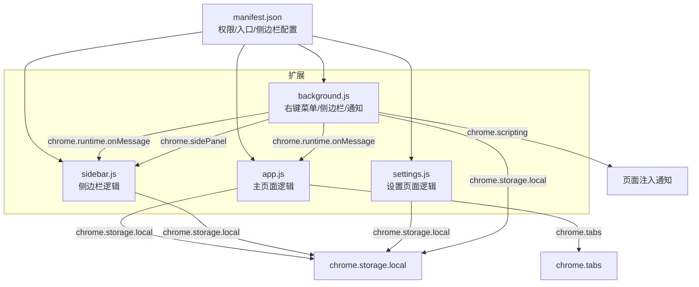
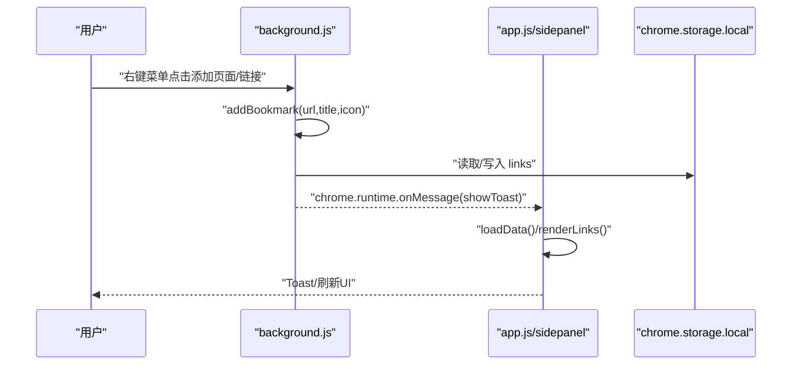
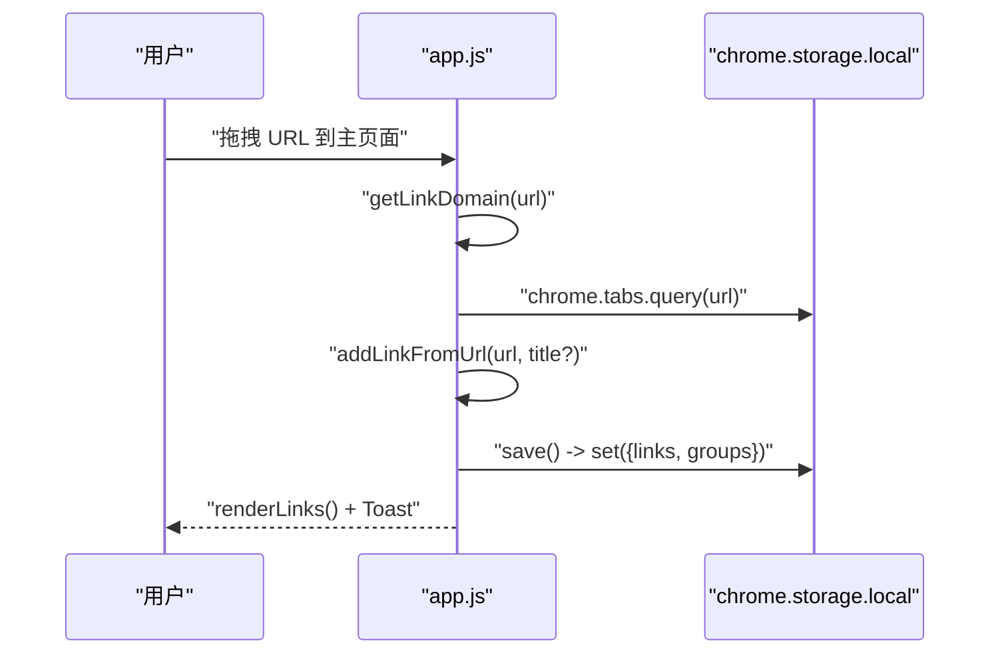
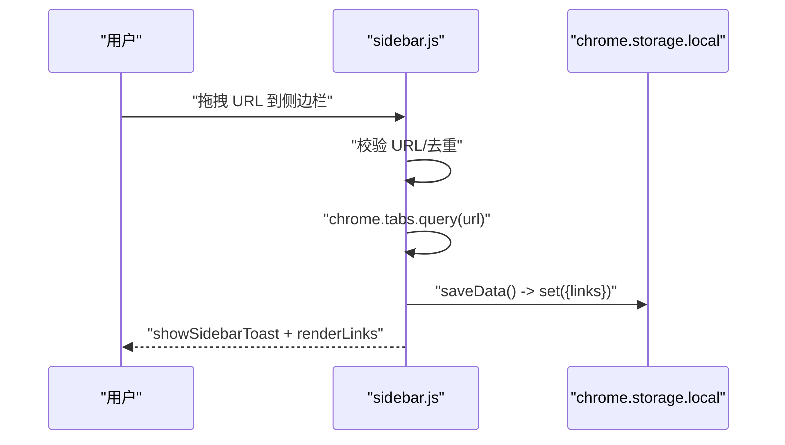
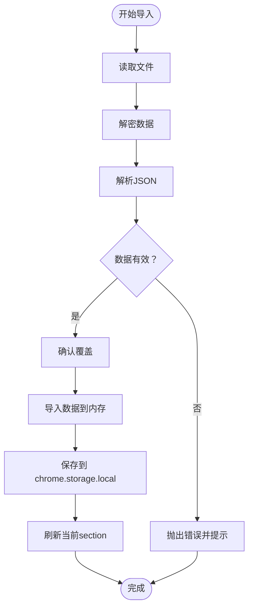
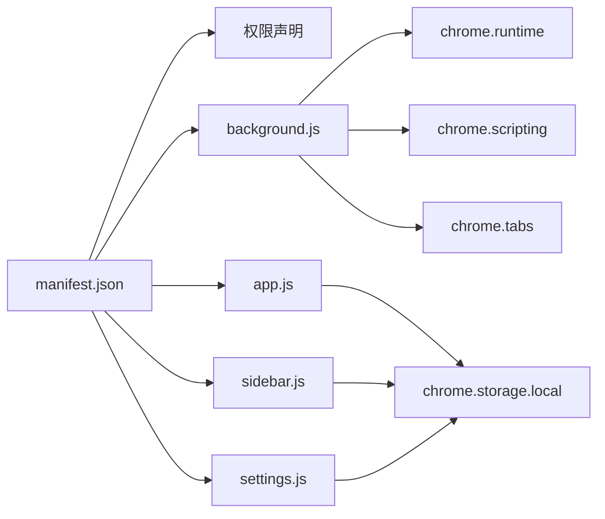

# 内部模块 API

<cite>
**本文引用的文件**
- [js/app.js](file://js/app.js)
- [js/sidebar.js](file://js/sidebar.js)
- [js/settings.js](file://js/settings.js)
- [js/background.js](file://js/background.js)
- [manifest.json](file://manifest.json)
- [README.md](file://README.md)
</cite>

## 目录
1. [简介](#简介)
2. [项目结构](#项目结构)
3. [核心组件](#核心组件)
4. [架构总览](#架构总览)
5. [详细组件分析](#详细组件分析)
6. [依赖关系分析](#依赖关系分析)
7. [性能考量](#性能考量)
8. [故障排查指南](#故障排查指南)
9. [结论](#结论)
10. [附录](#附录)

## 简介
本文件为“书签白板”项目的内部模块 API 参考文档，面向开发者与高级用户，系统梳理主应用模块（app.js）、侧边栏模块（sidebar.js）与设置模块（settings.js）的公共方法与接口，涵盖书签管理、数据操作、UI 更新、事件处理、实时同步、主题切换、快捷操作、响应式布局、数据导入导出、分组管理、用户偏好设置与配置验证等。文档同时给出模块间调用关系、数据传递格式与错误处理机制，并提供最佳实践与注意事项。

## 项目结构
- Manifest V3 扩展，包含主页面（新标签页）、侧边栏页面与后台脚本。
- 主应用模块负责主页面的书签渲染、搜索、排序、分组、上下文菜单、拖拽添加、主题切换、导入导出、批量操作等。
- 侧边栏模块负责侧边栏的实时数据同步、主题切换、快捷添加、拖拽添加、搜索与卡片渲染。
- 设置模块负责设置页面的导航、书签管理、分组管理、数据导入导出、批量操作与配置验证。
- 后台脚本负责右键菜单、侧边栏开关、向页面注入通知等。

图表来源
- [manifest.json:1-38](file://manifest.json#L1-L38)
- [js/background.js:1-174](file://js/background.js#L1-L174)
- [js/app.js:1-120](file://js/app.js#L1-L120)
- [js/sidebar.js:1-60](file://js/sidebar.js#L1-L60)
- [js/settings.js:1-120](file://js/settings.js#L1-L120)

章节来源
- [manifest.json:1-38](file://manifest.json#L1-L38)
- [README.md:132-154](file://README.md#L132-L154)

## 核心组件
- 主应用模块（app.js）
  - DOM 元素管理、状态管理（书签、分组、过滤、排序、视图、域名缓存、自动分组自定义名）
  - 初始化与事件监听（拖拽、搜索、排序、主题切换、移动端搜索、空状态导入、模态框、右键菜单消息）
  - 数据操作（保存、编辑分组、删除分组、上下文菜单、添加书签、导入导出）
  - UI 更新（渲染分组、渲染链接、渲染分区、提示栏、主题图标）
- 侧边栏模块（sidebar.js）
  - DOM 元素管理、状态管理（书签、过滤、显示上限）
  - 初始化与事件监听（关闭、主题切换、添加书签、搜索、手动添加、拖拽）
  - 数据操作（加载、保存、编辑、删除、添加）
  - UI 更新（渲染列表、卡片、分批渲染、提示）
- 设置模块（settings.js）
  - DOM 元素管理、状态管理（书签、分组、过滤、排序、批量模式、选中集合、自动分组自定义名）
  - 初始化与事件监听（菜单状态、返回主页面、存储变化监听、搜索）
  - 数据操作（加载、保存、编辑、删除、批量删除、批量分组、分组编辑/删除、导入导出、加密/解密）
  - UI 更新（渲染书签列表、渲染分组列表、渲染统计、批量操作面板、分组选择弹窗、确认弹窗、Toast）

章节来源
- [js/app.js:1-120](file://js/app.js#L1-L120)
- [js/sidebar.js:1-160](file://js/sidebar.js#L1-L160)
- [js/settings.js:1-120](file://js/settings.js#L1-L120)

## 架构总览
- 数据层：统一使用 chrome.storage.local 存储 links、groups、autoGroupNames、darkMode、sortBy 等。
- 通信层：background.js 通过右键菜单触发添加书签并向页面注入通知；页面通过 chrome.runtime.onMessage 与 background.js 通信；chrome.storage.onChanged 实现跨页面实时同步。
- UI 层：主页面、侧边栏、设置页面分别维护各自的 DOM 与状态，通过统一的数据源进行渲染与更新。

图表来源
- [js/background.js:39-109](file://js/background.js#L39-L109)
- [js/app.js:310-318](file://js/app.js#L310-L318)
- [js/sidebar.js:135-140](file://js/sidebar.js#L135-L140)

章节来源
- [js/background.js:1-174](file://js/background.js#L1-L174)
- [README.md:189-193](file://README.md#L189-L193)

## 详细组件分析

### 主应用模块 API（app.js）
- 公共方法与接口
  - 初始化与事件监听
    - loadTheme(): 加载主题（深色/浅色），避免 FOUC，跟随系统主题变化。
    - loadData(): 从 chrome.storage.local 恢复 links、groups、autoGroupNames、提示栏状态等，兼容旧字段。
    - setupEventListeners(): 绑定拖拽、搜索、排序、主题切换、移动端搜索、空状态导入、模态框、右键菜单消息、分组筛选、视图切换、新建分组等事件。
  - 数据操作
    - save(): 保存 links、groups 到 chrome.storage.local，并清理域名缓存。
    - editGroup(groupId): 编辑自定义分组或自动分组的显示名称（自动分组存储 autoGroupNames）。
    - deleteGroup(groupId): 删除分组并从所有书签移除该分组，切换回“全部”视图。
    - showGroupContextMenu(group, x, y): 显示分组上下文菜单（编辑/删除）。
    - showBookmarkContextMenu(link, x, y): 显示书签上下文菜单（置顶/取消置顶、编辑、删除、分组选择）。
    - addLinkFromUrl(url, draggedTitle?): 从 URL 添加书签，去重、提取标题与图标、插入到顶部并保存。
    - addManualBtn 点击回调：弹出模态框输入 URL，校验后添加。
  - UI 更新与渲染
    - renderGroups(): 渲染分组标签与计数。
    - renderLinks(): 根据 filterText、sortBy、currentView、activeGroupFilter 过滤与排序并渲染。
    - renderSections(): 根据 currentView 渲染分区。
    - showToast(message): 显示 Toast 提示。
    - updateThemeIcon(isDark): 更新主题图标。
  - 导入导出与空状态
    - 空状态导入：监听 importEmptyFileInput，读取文件、解密、解析、校验、确认覆盖、保存并刷新。
    - 模态框：showModal({ title, message, input?, defaultValue?, onConfirm })。
  - 工具函数
    - getLinkDomain(link): 从 URL 提取域名并缓存。
    - bindEmptyStateEvents(): 重新绑定空状态按钮事件（克隆节点以移除旧监听）。
- 参数与返回值
  - 所有方法均为内部封装，主要通过 DOM 与 chrome.storage.local 交互，无显式返回值。
  - addLinkFromUrl(url, draggedTitle?)：无返回值，内部保存并渲染。
  - editGroup(groupId)/deleteGroup(groupId)：无返回值，内部保存并渲染。
- 错误处理
  - URL 校验失败时提示“请输入有效的网址”。
  - 导入文件读取/解密/解析失败时捕获异常并提示“导入失败”。
  - 右键菜单添加时若已存在则提示“该链接已存在”。

图表来源
- [js/app.js:140-160](file://js/app.js#L140-L160)
- [js/app.js:760-800](file://js/app.js#L760-L800)
- [js/app.js:469-473](file://js/app.js#L469-L473)

章节来源
- [js/app.js:64-106](file://js/app.js#L64-L106)
- [js/app.js:108-373](file://js/app.js#L108-L373)
- [js/app.js:469-542](file://js/app.js#L469-L542)
- [js/app.js:544-758](file://js/app.js#L544-L758)
- [js/app.js:760-800](file://js/app.js#L760-L800)
- [js/app.js:221-297](file://js/app.js#L221-L297)
- [js/app.js:310-318](file://js/app.js#L310-L318)

### 侧边栏模块 API（sidebar.js）
- 公共方法与接口
  - 初始化与事件监听
    - setupCloseListener(): 监听 toggleSidebar 消息以关闭侧边栏窗口。
    - loadData(): 从 chrome.storage.local 加载 links 并渲染。
    - loadTheme(): 读取 localStorage 或系统偏好设置主题，监听系统主题变化。
    - setupEventListeners(): 绑定关闭、主题切换、添加书签、搜索、手动添加、拖拽。
    - setupStorageListener(): 监听 chrome.storage.onChanged 实时刷新。
    - setupDragAndDrop(): 处理拖拽进入、离开、放下，校验 URL、查询标签页标题与图标、去重后添加。
  - 数据操作
    - saveData(): 保存 links 到 chrome.storage.local。
    - addBookmark(url, title, iconUrl): 添加书签，去重，插入到顶部。
    - editBookmark(link): 修改标题并保存。
    - deleteBookmark(link): 确认后删除并保存。
  - UI 更新与渲染
    - renderLinks(): 过滤、限制显示数量（最多 50）、分批渲染（requestAnimationFrame）。
    - createBookmarkCard(link): 创建卡片元素（图标、标题、域名、操作按钮）。
    - showSidebarToast(message, type?): 显示 Toast。
    - showManualAddDialog(): 手动添加对话框（输入 URL/标题，校验并添加）。
- 参数与返回值
  - addBookmark(url, title, iconUrl): 无返回值。
  - editBookmark(link): 无返回值。
  - deleteBookmark(link): 无返回值。
  - renderLinks(): 无返回值。
- 错误处理
  - URL 格式不正确时提示“URL 格式不正确”。
  - 已存在书签时提示“该书签已存在！”。
  - 拖拽无法获取链接时提示“无法获取链接地址”。

图表来源
- [js/sidebar.js:508-601](file://js/sidebar.js#L508-L601)
- [js/sidebar.js:315-335](file://js/sidebar.js#L315-L335)
- [js/sidebar.js:311-313](file://js/sidebar.js#L311-L313)

章节来源
- [js/sidebar.js:9-68](file://js/sidebar.js#L9-L68)
- [js/sidebar.js:87-149](file://js/sidebar.js#L87-L149)
- [js/sidebar.js:151-202](file://js/sidebar.js#L151-L202)
- [js/sidebar.js:217-292](file://js/sidebar.js#L217-L292)
- [js/sidebar.js:315-335](file://js/sidebar.js#L315-L335)
- [js/sidebar.js:508-601](file://js/sidebar.js#L508-L601)

### 设置模块 API（settings.js）
- 公共方法与接口
  - 初始化与导航
    - initMenuState(): 恢复上次菜单状态，进入相应 section。
    - setupNavigation(): 切换菜单项与 section，保存当前菜单到 localStorage。
    - setupBackButton(): 返回主页面并清除菜单状态。
  - 数据加载与事件监听
    - loadTheme(): 从 chrome.storage.local 恢复 darkMode。
    - loadData(): 从 chrome.storage.local 加载 links、groups、autoGroupNames。
    - setupEventListeners(): 监听 chrome.storage.onChanged、搜索输入。
  - 书签管理
    - getLinkDomain(link): 域名缓存。
    - sortLinks(linksToSort): 按 createdAt/title/clickCount 与 asc/desc 排序。
    - renderLinks(): 过滤（标题/URL/域名）、排序、渲染列表项。
    - createBookmarkListItem(link): 创建列表项（图标、标题、URL、统计、操作按钮）。
    - editBookmark(link)/deleteBookmark(link): 编辑/删除书签。
    - formatTimeAgo(timestamp): 格式化“多久前”。
    - saveData(): 保存 links。
  - 批量操作
    - setupBatchMode(): 切换批量模式、全选/取消全选、批量删除、批量添加分组。
    - toggleSelection(url, checked): 切换选中状态并更新 UI。
    - updateSelectedCount(): 更新选中数量。
  - 分组管理
    - setupGroupManagement(): 新建分组、渲染分组列表、编辑/删除分组。
    - renderGroups(): 合并自动分组与自定义分组并渲染。
    - createGroupListItem(group): 渲染分组项（图标、名称、计数、操作）。
    - editGroup(group)/deleteGroup(groupId): 编辑/删除分组。
    - generateAutoGroups(): 基于域名统计生成自动分组。
    - saveGroups(): 保存 groups。
  - 数据导入导出
    - setupDataManagement(): 绑定导出/导入按钮与文件选择。
    - updateDataStats(): 统计总数、分组数、点击次数。
    - exportData(): 收集数据、加密、下载文件。
    - handleImportFile(event): 读取文件、解密、解析、校验、确认覆盖、保存并刷新。
    - encryptData(data)/decryptData(encryptedText): 加密/解密算法（UTF-8/Base64/XOR/Base64）。
  - 弹窗与提示
    - showEditModal(link, onConfirm, customTitle?, customMessage?): 编辑弹窗。
    - showConfirmModal(title, message, onConfirm): 确认弹窗。
    - showGroupSelectionModal(onSelect): 分组选择弹窗。
    - showToast(message): Toast 提示。
- 参数与返回值
  - 所有方法均为内部封装，主要通过 DOM 与 chrome.storage.local 交互。
  - encryptData(data)/decryptData(encryptedText): 返回字符串（加密/解密结果）。
- 错误处理
  - 导入文件格式不正确或解密失败时提示“导入失败”。
  - 批量操作前检查选中集合，未选中时提示“请先选择要删除的书签”。

图表来源
- [js/settings.js:1078-1150](file://js/settings.js#L1078-L1150)
- [js/settings.js:1178-1215](file://js/settings.js#L1178-L1215)

章节来源
- [js/settings.js:27-82](file://js/settings.js#L27-L82)
- [js/settings.js:95-110](file://js/settings.js#L95-L110)
- [js/settings.js:176-191](file://js/settings.js#L176-L191)
- [js/settings.js:233-270](file://js/settings.js#L233-L270)
- [js/settings.js:417-531](file://js/settings.js#L417-L531)
- [js/settings.js:534-561](file://js/settings.js#L534-L561)
- [js/settings.js:564-590](file://js/settings.js#L564-L590)
- [js/settings.js:660-705](file://js/settings.js#L660-L705)
- [js/settings.js:712-733](file://js/settings.js#L712-L733)
- [js/settings.js:1003-1034](file://js/settings.js#L1003-L1034)
- [js/settings.js:1037-1076](file://js/settings.js#L1037-L1076)
- [js/settings.js:1078-1150](file://js/settings.js#L1078-L1150)
- [js/settings.js:1152-1215](file://js/settings.js#L1152-L1215)

## 依赖关系分析
- 权限与入口
  - permissions: storage、contextMenus、tabs、scripting、sidePanel
  - host_permissions: http://*/*、https://*/*
  - background: service_worker
  - side_panel: default_path
  - action: default_title
- 模块耦合
  - app.js 与 sidebar.js 通过 chrome.storage.local 实时同步，互不直接调用。
  - settings.js 与 app.js/sidepanel 共享数据结构，但不直接依赖彼此。
  - background.js 与页面通过 runtime.onMessage 通信，注入通知到页面。
- 外部依赖
  - Chrome Extension APIs（storage、tabs、scripting、sidePanel、contextMenus）
  - Font Awesome 图标库（通过 CDN 或本地引入）

图表来源
- [manifest.json:9-29](file://manifest.json#L9-L29)
- [js/background.js:1-174](file://js/background.js#L1-L174)

章节来源
- [manifest.json:1-38](file://manifest.json#L1-L38)
- [README.md:158-169](file://README.md#L158-L169)

## 性能考量
- DOM 操作优化
  - 主应用与设置模块使用 DocumentFragment 与 requestAnimationFrame 分批渲染，减少主线程阻塞。
  - 侧边栏限制显示数量（最多 50），并在超过阈值时提示用户使用搜索。
- 数据缓存
  - 主应用与设置模块对域名解析结果进行缓存（Map），避免重复计算。
- 存储与同步
  - 使用 chrome.storage.local 存储，通过 onChanged 监听实现跨页面实时同步，降低轮询成本。
- 用户体验
  - 首屏加载时延迟加载数据，避免阻塞渲染；主题切换即时生效，避免闪烁。

章节来源
- [js/app.js:56-60](file://js/app.js#L56-L60)
- [js/app.js:31-33](file://js/app.js#L31-L33)
- [js/sidebar.js:170-202](file://js/sidebar.js#L170-L202)
- [js/sidebar.js:7-7](file://js/sidebar.js#L7-L7)

## 故障排查指南
- 右键菜单未显示
  - 重新安装扩展（移除后重新加载）。
- 书签丢失
  - 数据保存在浏览器本地，清除浏览器数据会导致丢失；建议定期备份。
- 侧边栏不自动刷新
  - 确保使用最新版本（v3.2.1+），检查 chrome.storage.onChanged 是否正常工作。
- 导入失败
  - 检查文件格式与完整性，确认解密密钥一致；导入前会进行格式校验。
- URL 格式不正确
  - 手动添加或拖拽时会进行 URL 校验，不符合规范会提示错误。

章节来源
- [README.md:250-258](file://README.md#L250-L258)
- [js/app.js:221-297](file://js/app.js#L221-L297)
- [js/sidebar.js:536-554](file://js/sidebar.js#L536-L554)
- [js/settings.js:1095-1099](file://js/settings.js#L1095-L1099)

## 结论
本项目通过清晰的模块划分与统一的数据存储策略，实现了主页面、侧边栏与设置页面的一致体验。模块间通过 Chrome Extension APIs 实现低耦合的通信与同步，保证了良好的性能与可维护性。建议在后续迭代中进一步完善键盘快捷键、云端备份与收藏夹同步等高级功能。

## 附录
- 数据结构概览（来自 README）
  - links: 数组，每项包含 id、url、title、icon、groups、createdAt 等字段。
  - groups: 数组，每项包含 id、name、color、icon、createdAt 等字段。
  - autoGroupNames: 对象，键为自动分组 ID，值为用户自定义显示名称。
  - darkMode: 布尔值或 undefined（跟随系统）。
  - sortBy: 字符串，如 "createdAt-desc"、"title-asc" 等。
- 最佳实践与注意事项
  - 保持 DOM 与状态分离，所有 UI 更新通过统一的渲染函数进行。
  - 使用 chrome.storage.local 进行数据持久化，注意键名一致性与兼容性。
  - 对外部输入（URL、文件）进行严格校验，及时提示错误。
  - 在高频操作（拖拽、搜索、批量操作）中使用节流/防抖与分批渲染。
  - 遵循 Chrome Extension Manifest V3 权限最小化原则，合理使用 scripting 注入通知。

章节来源
- [README.md:171-187](file://README.md#L171-L187)