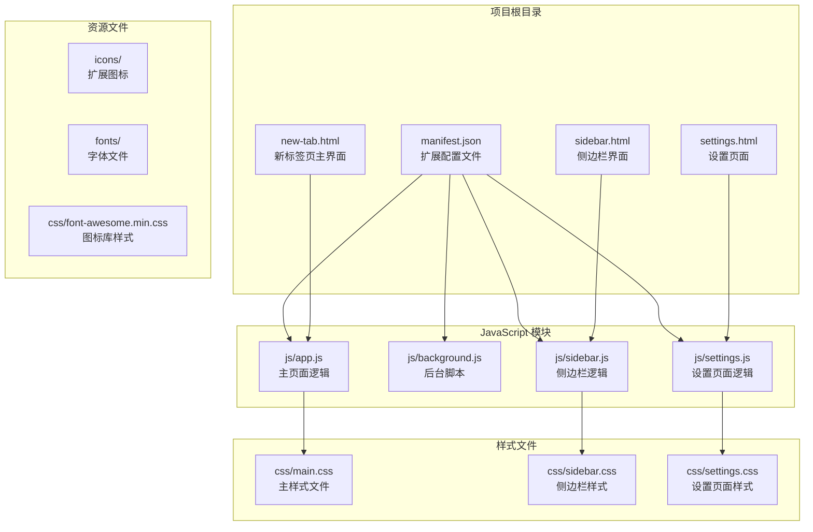
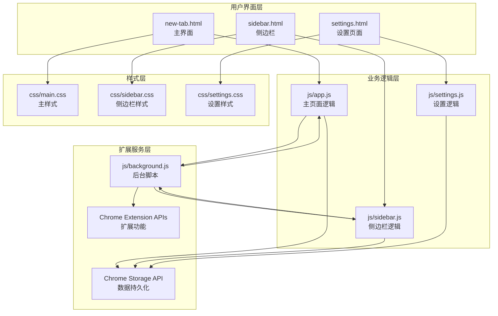
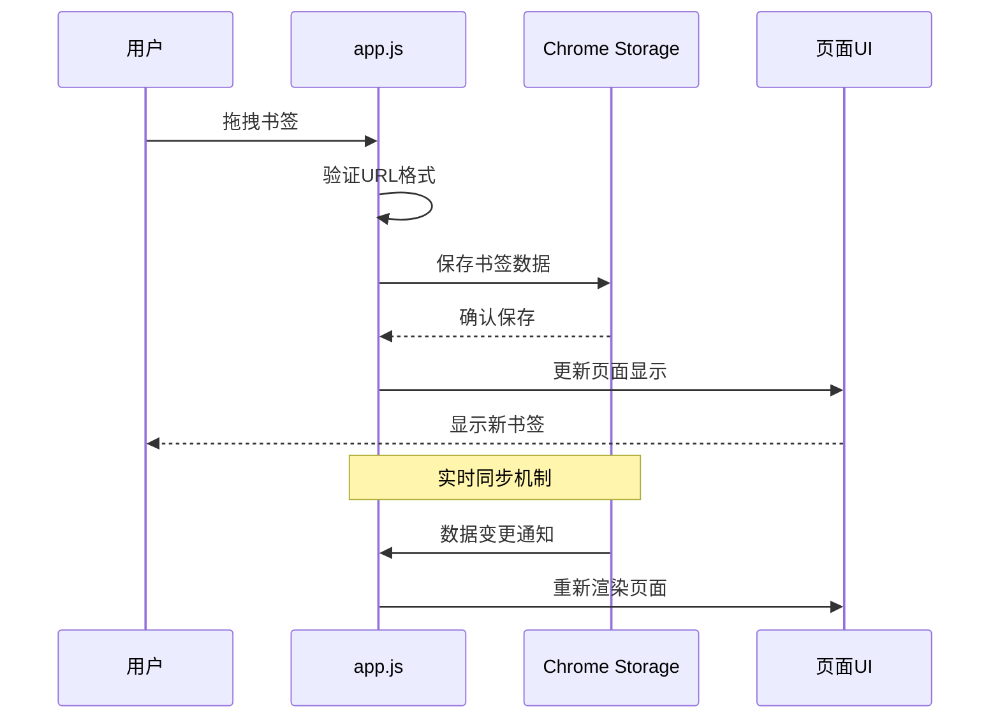
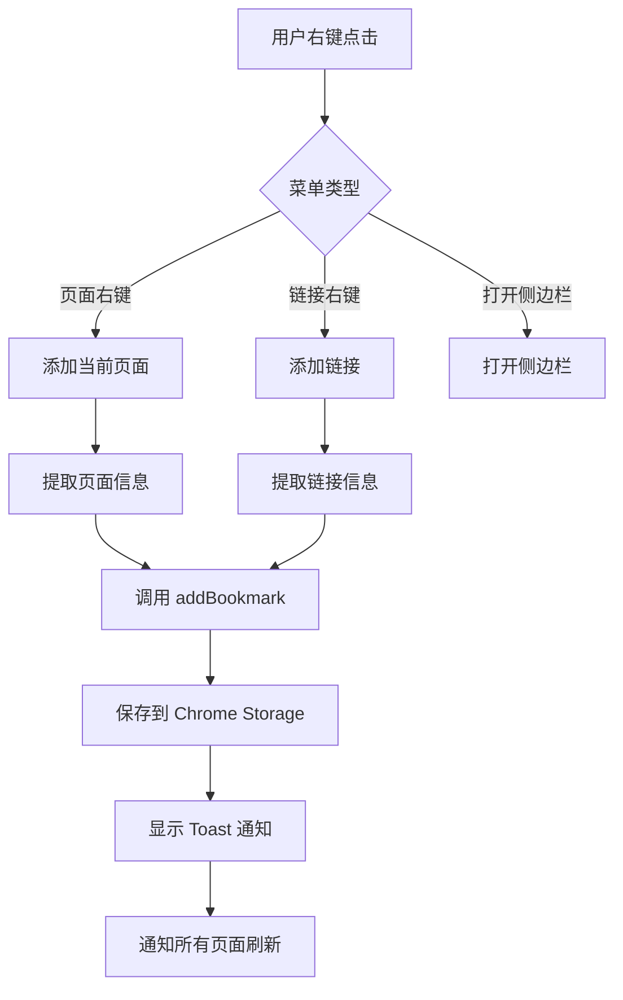
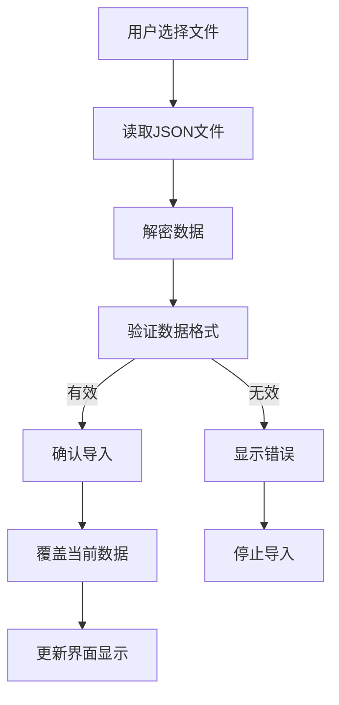
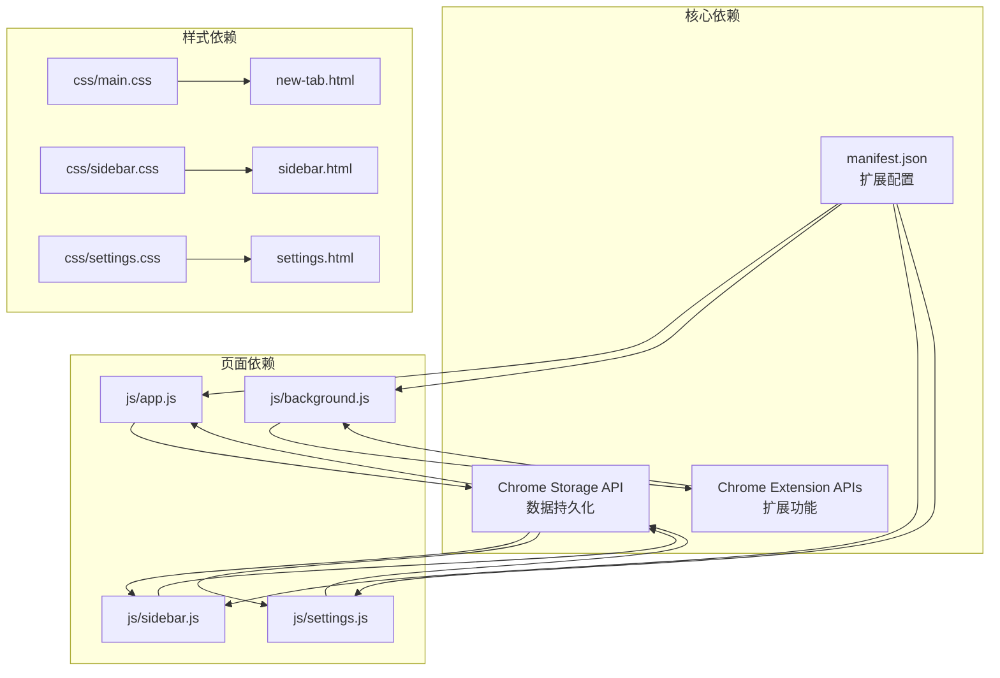

# 开发环境搭建

<cite>
**本文档引用的文件**
- [manifest.json](file://manifest.json)
- [README.md](file://README.md)
- [GUIDE.md](file://GUIDE.md)
- [new-tab.html](file://new-tab.html)
- [sidebar.html](file://sidebar.html)
- [settings.html](file://settings.html)
- [js/app.js](file://js/app.js)
- [js/background.js](file://js/background.js)
- [js/sidebar.js](file://js/sidebar.js)
- [js/settings.js](file://js/settings.js)
- [css/main.css](file://css/main.css)
- [css/sidebar.css](file://css/sidebar.css)
- [css/settings.css](file://css/settings.css)
</cite>

## 目录
1. [简介](#简介)
2. [项目结构](#项目结构)
3. [核心组件](#核心组件)
4. [架构概览](#架构概览)
5. [详细组件分析](#详细组件分析)
6. [依赖关系分析](#依赖关系分析)
7. [性能考虑](#性能考虑)
8. [故障排除指南](#故障排除指南)
9. [结论](#结论)

## 简介

书签白板是一个基于 Chrome 扩展 Manifest V3 的隐私优先本地书签管理工具。该项目提供了现代化的界面设计、丰富的交互功能和完整的开发环境支持。

## 项目结构

项目采用模块化的文件组织结构，主要包含以下核心目录和文件：

**图表来源**
- [manifest.json:1-38](file://manifest.json#L1-L38)
- [new-tab.html:1-206](file://new-tab.html#L1-L206)
- [sidebar.html:1-51](file://sidebar.html#L1-L51)
- [settings.html:1-281](file://settings.html#L1-L281)

**章节来源**
- [manifest.json:1-38](file://manifest.json#L1-L38)
- [README.md:132-154](file://README.md#L132-L154)

## 核心组件

### 扩展配置 (manifest.json)

扩展的核心配置文件定义了以下关键功能：

- **Manifest V3**: 使用最新的 Chrome 扩展标准
- **权限管理**: 包含 storage、contextMenus、tabs、scripting、sidePanel 权限
- **功能特性**: 
  - 新标签页覆盖 (newtab)
  - 侧边栏功能 (side_panel)
  - 图标配置 (icons)
  - 内容安全策略 (content_security_policy)

### 主页面组件

项目包含三个主要的用户界面组件：

1. **新标签页界面** (`new-tab.html`): 主要的书签管理界面
2. **侧边栏界面** (`sidebar.html`): 移动端友好的书签访问界面  
3. **设置页面** (`settings.html`): 扩展功能配置和管理界面

**章节来源**
- [manifest.json:6-29](file://manifest.json#L6-L29)
- [new-tab.html:1-206](file://new-tab.html#L1-L206)
- [sidebar.html:1-51](file://sidebar.html#L1-L51)
- [settings.html:1-281](file://settings.html#L1-L281)

## 架构概览

书签白板采用模块化的架构设计，各组件之间通过 Chrome 扩展 API 进行通信：

**图表来源**
- [js/app.js:1-800](file://js/app.js#L1-L800)
- [js/background.js:1-174](file://js/background.js#L1-L174)
- [js/sidebar.js:1-602](file://js/sidebar.js#L1-L602)
- [js/settings.js:1-800](file://js/settings.js#L1-L800)

## 详细组件分析

### 主页面逻辑 (js/app.js)

主页面逻辑负责处理书签的增删改查、用户交互和数据管理：

#### 核心功能模块

1. **DOM 元素管理**: 统一管理页面元素引用
2. **状态管理**: 维护书签数据、分组、搜索条件等状态
3. **事件监听**: 处理拖拽、搜索、主题切换等用户交互
4. **数据持久化**: 通过 Chrome Storage API 管理本地数据

#### 数据处理流程

**图表来源**
- [js/app.js:108-121](file://js/app.js#L108-L121)
- [js/app.js:468-473](file://js/app.js#L468-L473)

#### 性能优化策略

- **域名缓存**: 使用 Map 对象缓存域名解析结果
- **分组渲染**: 动态生成分组标签，避免重复计算
- **防抖处理**: 搜索功能使用防抖机制减少重绘

**章节来源**
- [js/app.js:1-800](file://js/app.js#L1-L800)

### 后台脚本 (js/background.js)

后台脚本处理扩展的核心功能和服务：

#### 右键菜单功能

**图表来源**
- [js/background.js:39-69](file://js/background.js#L39-L69)
- [js/background.js:71-109](file://js/background.js#L71-L109)

#### 侧边栏管理

- **自动启用**: 安装时自动启用侧边栏功能
- **路径配置**: 设置默认侧边栏路径为 sidebar.html
- **打开控制**: 通过扩展图标或右键菜单控制侧边栏显示

**章节来源**
- [js/background.js:1-174](file://js/background.js#L1-L174)

### 侧边栏逻辑 (js/sidebar.js)

侧边栏提供移动端友好的书签访问体验：

#### 核心特性

1. **移动端优化**: 强制横向布局，适合触摸操作
2. **实时同步**: 通过 Chrome Storage 监听数据变更
3. **拖拽支持**: 支持从其他页面拖拽链接到侧边栏
4. **主题独立**: 侧边栏拥有独立的主题设置

#### 性能优化

- **分批渲染**: 使用 requestAnimationFrame 分批渲染书签卡片
- **显示限制**: 最多显示 50 个书签，超过数量时显示提示
- **懒加载**: 图标加载失败时自动回退到默认图标

**章节来源**
- [js/sidebar.js:1-602](file://js/sidebar.js#L1-L602)

### 设置页面逻辑 (js/settings.js)

设置页面提供扩展的配置和管理功能：

#### 功能模块

1. **书签管理**: 列表式管理所有书签
2. **分组管理**: 创建、编辑、删除分组
3. **数据管理**: 导出和导入书签数据
4. **批量操作**: 支持批量选择和操作

#### 数据导入导出

**图表来源**
- [js/settings.js:230-270](file://js/settings.js#L230-L270)

**章节来源**
- [js/settings.js:1-800](file://js/settings.js#L1-L800)

## 依赖关系分析

项目采用松耦合的设计，各模块之间的依赖关系清晰明确：

**图表来源**
- [manifest.json:9-22](file://manifest.json#L9-L22)
- [js/app.js:81-105](file://js/app.js#L81-L105)
- [js/sidebar.js:37-40](file://js/sidebar.js#L37-L40)
- [js/settings.js:96-110](file://js/settings.js#L96-L110)

**章节来源**
- [manifest.json:1-38](file://manifest.json#L1-L38)

## 性能考虑

### 渲染优化

1. **虚拟滚动**: 侧边栏使用分批渲染技术，避免大量 DOM 操作
2. **缓存机制**: 域名解析结果缓存，减少重复计算
3. **防抖处理**: 搜索功能使用防抖，减少不必要的重绘

### 内存管理

1. **事件清理**: 及时移除不再使用的事件监听器
2. **对象复用**: 复用 DOM 元素和样式对象
3. **垃圾回收**: 及时清理临时变量和闭包引用

### 网络优化

1. **图标缓存**: 默认图标和网站 favicon 的本地缓存
2. **异步加载**: 非关键资源异步加载，不影响首屏显示
3. **CDN 优化**: 字体文件使用 CDN 加速

## 故障排除指南

### 常见问题及解决方案

#### 右键菜单不显示

**问题描述**: 右键菜单项不出现或显示异常

**解决方案**:
1. 完全卸载并重新安装扩展
2. 检查扩展权限是否正确授予
3. 确认 Chrome 版本兼容性

**章节来源**
- [README.md:250-251](file://README.md#L250-L251)

#### 书签数据丢失

**问题描述**: 书签数据在浏览器重置后丢失

**原因分析**: 
- 书签数据存储在 `chrome.storage.local`
- 清除浏览器数据会删除本地存储

**预防措施**:
1. 定期使用设置页面导出备份
2. 重要数据及时备份到云端
3. 避免清理浏览器数据

**章节来源**
- [README.md:253-254](file://README.md#L253-L254)

#### 侧边栏不自动刷新

**问题描述**: 侧边栏内容不随主页面更新而刷新

**解决方案**:
1. 确保使用最新版本 (v3.2.1+)
2. 关闭并重新打开侧边栏
3. 检查 Chrome Storage 同步状态

**章节来源**
- [README.md:256-257](file://README.md#L256-L257)

#### 拖拽功能异常

**问题描述**: 拖拽添加书签功能失效

**排查步骤**:
1. 检查拖拽事件监听器是否正常绑定
2. 验证 URL 格式验证逻辑
3. 确认 Chrome Storage 权限

**章节来源**
- [js/app.js:140-160](file://js/app.js#L140-L160)

### 开发调试技巧

#### 浏览器开发者工具使用

1. **扩展页面调试**: 
   - 打开 `chrome://extensions/`
   - 启用"开发者模式"
   - 点击"检查视图"查看扩展页面

2. **控制台监控**:
   - 监控 Chrome Storage API 调用
   - 检查网络请求状态
   - 跟踪事件监听器执行情况

3. **性能分析**:
   - 使用 Performance 面板分析渲染性能
   - 监控内存使用情况
   - 检查事件循环阻塞

#### 断点调试

1. **条件断点**: 在关键数据处理节点设置条件断点
2. **异步断点**: 监控 Promise 和 async/await 调用链
3. **存储断点**: 监控 Chrome Storage 数据变更

#### 热重载配置

由于 Chrome 扩展的特殊性，建议采用以下开发流程：

1. **手动刷新**: 修改代码后手动刷新扩展页面
2. **开发模式**: 使用 Chrome 的"加载已解压的扩展程序"功能
3. **日志输出**: 使用 `console.log` 输出调试信息

**章节来源**
- [README.md:55-61](file://README.md#L55-L61)

## 结论

书签白板项目展现了现代 Chrome 扩展开发的最佳实践，具有以下特点：

1. **架构清晰**: 模块化设计，职责分离明确
2. **性能优秀**: 采用多种优化策略提升用户体验
3. **功能完整**: 涵盖书签管理的各个方面
4. **易于维护**: 清晰的代码结构和完善的注释

对于开发者而言，该项目提供了良好的学习和参考价值，特别是在 Chrome 扩展开发、前端性能优化和用户体验设计方面。