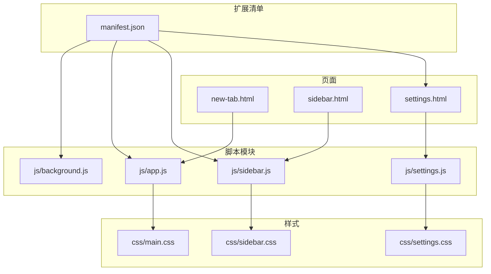
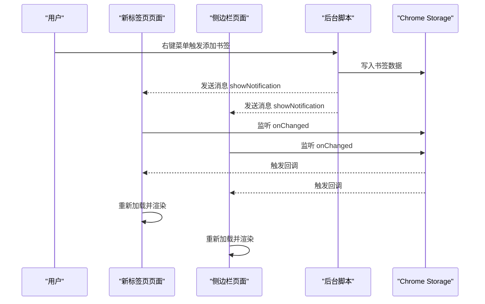
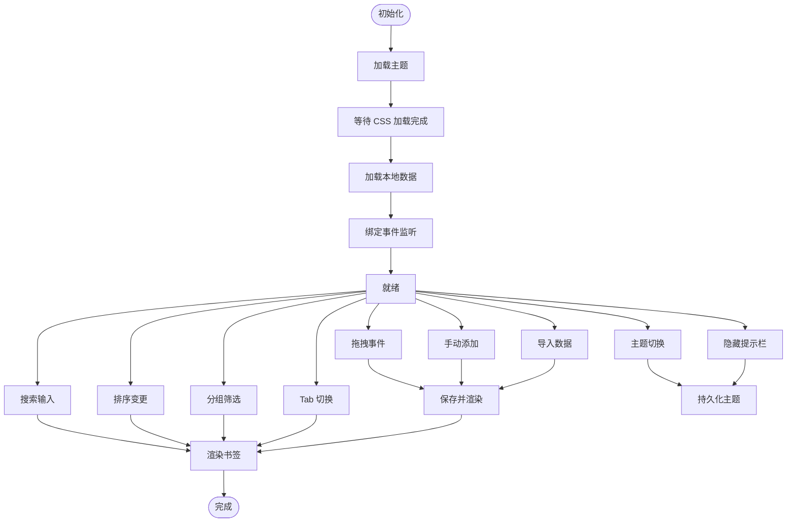
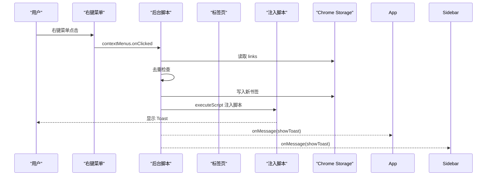
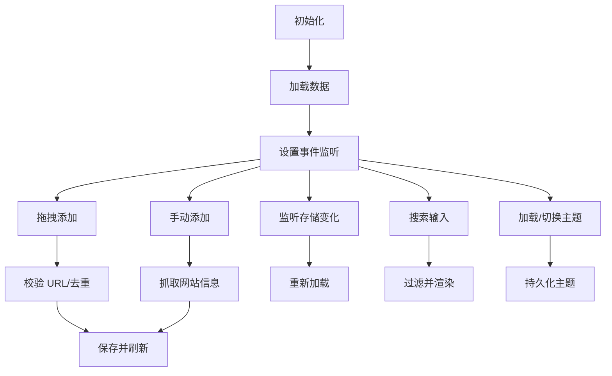
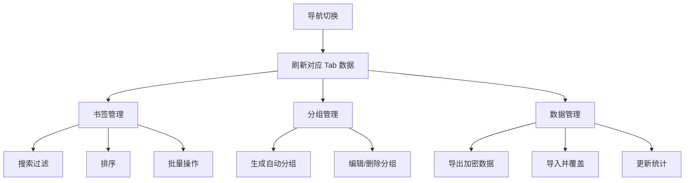
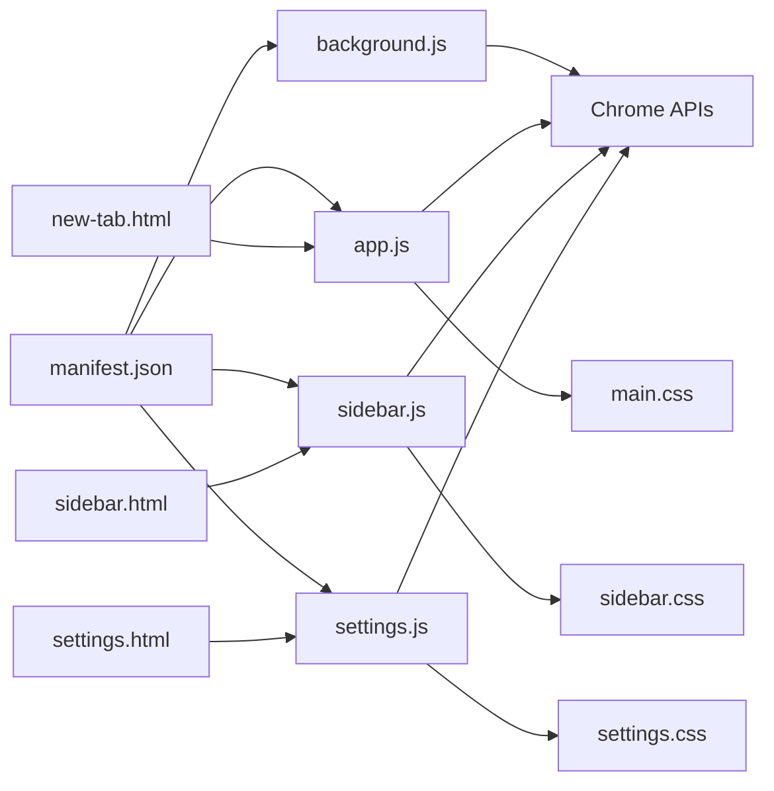

# 开发者指南

<cite>
**本文引用的文件**
- [manifest.json](file://manifest.json)
- [README.md](file://README.md)
- [GUIDE.md](file://GUIDE.md)
- [new-tab.html](file://new-tab.html)
- [sidebar.html](file://sidebar.html)
- [settings.html](file://settings.html)
- [js/app.js](file://js/app.js)
- [js/background.js](file://js/background.js)
- [js/sidebar.js](file://js/sidebar.js)
- [js/settings.js](file://js/settings.js)
- [css/main.css](file://css/main.css)
- [css/sidebar.css](file://css/sidebar.css)
- [css/settings.css](file://css/settings.css)
</cite>

## 目录
1. [简介](#简介)
2. [项目结构](#项目结构)
3. [核心组件](#核心组件)
4. [架构总览](#架构总览)
5. [详细组件分析](#详细组件分析)
6. [依赖关系分析](#依赖关系分析)
7. [性能考虑](#性能考虑)
8. [故障排查指南](#故障排查指南)
9. [结论](#结论)
10. [附录](#附录)

## 简介
书签白板是一个基于 Chrome 扩展 Manifest V3 的本地书签管理工具，强调隐私优先与高效管理体验。它提供卡片式布局、实时搜索、批量操作、侧边栏、主题切换、拖拽添加等多种功能，并通过 Chrome Storage API 实现数据持久化与跨页面同步。

本指南面向开发者，涵盖开发环境搭建、核心模块实现细节、模块间关系、扩展开发流程、代码规范、测试与部署建议，以及贡献流程的最佳实践。

## 项目结构
项目采用“页面 + 模块脚本 + 样式”的组织方式，核心文件如下：
- 配置与入口
  - manifest.json：扩展清单，声明权限、后台脚本、侧边栏路径、图标等
  - new-tab.html：新标签页主界面
  - sidebar.html：侧边栏界面
  - settings.html：设置页面
- 脚本模块
  - js/app.js：新标签页主逻辑（数据管理、UI 渲染、事件绑定）
  - js/background.js：后台脚本（右键菜单、消息通信、通知）
  - js/sidebar.js：侧边栏逻辑（主题、搜索、拖拽、增删改）
  - js/settings.js：设置页面逻辑（导航、书签管理、分组管理、数据导入导出）
- 样式
  - css/main.css：主样式（CSS 变量、主题系统、响应式网格）
  - css/sidebar.css：侧边栏样式（移动端布局、卡片操作）
  - css/settings.css：设置页面样式（导航、列表、弹窗）

图表来源
- [manifest.json:1-38](file://manifest.json#L1-L38)
- [new-tab.html:1-206](file://new-tab.html#L1-L206)
- [sidebar.html:1-51](file://sidebar.html#L1-L51)
- [settings.html:1-281](file://settings.html#L1-L281)
- [js/app.js:1-800](file://js/app.js#L1-L800)
- [js/background.js:1-174](file://js/background.js#L1-L174)
- [js/sidebar.js:1-602](file://js/sidebar.js#L1-L602)
- [js/settings.js:1-800](file://js/settings.js#L1-L800)
- [css/main.css:1-800](file://css/main.css#L1-L800)
- [css/sidebar.css:1-287](file://css/sidebar.css#L1-L287)
- [css/settings.css:1-800](file://css/settings.css#L1-L800)

章节来源
- [README.md:132-154](file://README.md#L132-L154)

## 核心组件
- 主应用模块（新标签页）
  - 职责：加载主题、初始化数据、渲染分组与书签、处理拖拽、搜索、排序、置顶/最近分区、导入导出、主题切换、提示栏控制
  - 关键点：使用 chrome.storage.local 读写数据；通过 chrome.storage.onChanged 实现实时同步；DOM 事件委托与防抖优化
- 后台脚本
  - 职责：注册右键菜单、处理添加书签、注入脚本显示 Toast 通知、打开侧边栏
  - 关键点：chrome.contextMenus、chrome.scripting、chrome.sidePanel
- 侧边栏模块
  - 职责：主题切换、搜索、拖拽添加、手动添加、增删改、存储监听与刷新
  - 关键点：移动端样式强制、分批渲染、提示与空状态
- 设置模块
  - 职责：书签列表管理、分组管理、数据导入导出、统计、批量操作
  - 关键点：多 Tab 导航、批量选择、分组统计、加密导出

章节来源
- [js/app.js:1-800](file://js/app.js#L1-L800)
- [js/background.js:1-174](file://js/background.js#L1-L174)
- [js/sidebar.js:1-602](file://js/sidebar.js#L1-L602)
- [js/settings.js:1-800](file://js/settings.js#L1-L800)

## 架构总览
整体架构围绕 Chrome 扩展 API 与本地存储展开，页面通过脚本模块与后台脚本通信，数据通过 Chrome Storage 实现跨页面同步。

图表来源
- [js/background.js:39-109](file://js/background.js#L39-L109)
- [js/app.js:116-121](file://js/app.js#L116-L121)
- [js/sidebar.js:142-149](file://js/sidebar.js#L142-L149)

## 详细组件分析

### 主应用模块（js/app.js）
- 数据模型与状态
  - links：书签数组，包含 id/url/title/icon/groups/createdAt/pinned/clickCount/lastAccessed
  - groups：分组数组，包含 id/name/color/icon/createdAt/auto/count
  - filterText/sortBy/currentView/activeGroupFilter/domainCache/autoGroupNames
- 初始化流程
  - 快速加载主题（避免 FOUC）
  - 等待 CSS 加载完成再加载数据
  - 绑定拖拽、搜索、排序、主题切换、提示栏、手动添加、导入、分组筛选、Tab 切换、分组管理等事件
- 关键算法
  - getLinkDomain：域名缓存，避免重复解析
  - renderLinks：搜索过滤 + 排序 + 分组筛选 + 分区渲染
  - addLinkFromUrl：去重检查、标题/图标提取、保存并渲染
- 消息与存储
  - chrome.runtime.onMessage：接收后台脚本的 Toast 与刷新通知
  - chrome.storage.onChanged：监听 links 变化，自动刷新
  - chrome.storage.local.set/get：持久化存储

图表来源
- [js/app.js:51-106](file://js/app.js#L51-L106)
- [js/app.js:108-373](file://js/app.js#L108-L373)
- [js/app.js:760-800](file://js/app.js#L760-L800)

章节来源
- [js/app.js:1-800](file://js/app.js#L1-L800)

### 后台脚本（js/background.js）
- 权限与菜单
  - 注册右键菜单：添加当前页面、添加链接、打开侧边栏
  - 启用侧边栏：设置默认路径
- 添加书签流程
  - 解析 URL/标题/图标，去重检查，写入 storage
  - 通过 chrome.scripting 在当前页面注入脚本显示 Toast
- 图标点击
  - 点击扩展图标打开侧边栏

图表来源
- [js/background.js:39-109](file://js/background.js#L39-L109)
- [js/background.js:111-167](file://js/background.js#L111-L167)

章节来源
- [js/background.js:1-174](file://js/background.js#L1-L174)

### 侧边栏模块（js/sidebar.js）
- 主题与搜索
  - 主题切换：本地存储保存，跟随系统偏好
  - 搜索：实时过滤标题与 URL
- 拖拽与手动添加
  - 拖拽：校验 URL、查询标签页标题、限制标题长度、去重检查、保存
  - 手动添加：弹窗输入 URL/标题，必要时抓取网站信息
- 存储监听与刷新
  - 监听 storage 变化，自动刷新
  - 监听 runtime 消息，收到刷新指令时重新加载
- 性能优化
  - 限制显示数量（最多 50 个）
  - 分批渲染（requestAnimationFrame + 批大小）

图表来源
- [js/sidebar.js:9-68](file://js/sidebar.js#L9-L68)
- [js/sidebar.js:87-149](file://js/sidebar.js#L87-L149)
- [js/sidebar.js:315-335](file://js/sidebar.js#L315-L335)
- [js/sidebar.js:508-601](file://js/sidebar.js#L508-L601)

章节来源
- [js/sidebar.js:1-602](file://js/sidebar.js#L1-L602)

### 设置模块（js/settings.js）
- 导航与状态
  - 多 Tab 导航（书签管理、分组管理、外观与主题、显示与排序、数据管理、搜索与筛选、隐私与安全、快捷操作、关于）
  - 本地存储记录上次打开的 Tab
- 书签管理
  - 搜索过滤、排序（创建时间/标题/使用频率）、批量操作（全选/取消全选/批量删除/批量添加分组）
  - 列表项：图标、标题、URL、统计（访问次数/最后访问时间）、操作按钮（查看/编辑/删除）
- 分组管理
  - 自动分组（基于域名聚合，数量≥2），自定义分组
  - 编辑/删除（自动分组不可删除）
- 数据管理
  - 导出：加密 JSON（UTF-8→Base64→XOR→Base64），包含 links、groups、autoGroupNames、settings
  - 导入：解密→校验→确认→覆盖写入
  - 统计：书签总数、分组总数、总访问次数

图表来源
- [js/settings.js:26-65](file://js/settings.js#L26-L65)
- [js/settings.js:112-155](file://js/settings.js#L112-L155)
- [js/settings.js:232-270](file://js/settings.js#L232-L270)
- [js/settings.js:533-561](file://js/settings.js#L533-L561)
- [js/settings.js:563-590](file://js/settings.js#L563-L590)
- [js/settings.js:712-733](file://js/settings.js#L712-L733)

章节来源
- [js/settings.js:1-800](file://js/settings.js#L1-L800)

## 依赖关系分析
- 清单依赖
  - permissions/host_permissions：storage/contextMenus/tabs/scripting/sidePanel/http(s)://*
  - background.service_worker：js/background.js
  - side_panel.default_path：sidebar.html
  - action.default_title：书签白板
- 页面与脚本
  - new-tab.html → js/app.js
  - sidebar.html → js/sidebar.js
  - settings.html → js/settings.js
- 样式依赖
  - 主样式：css/main.css
  - 侧边栏样式：css/sidebar.css
  - 设置样式：css/settings.css
- 运行时依赖
  - Chrome Storage API：chrome.storage.local
  - Chrome Extension APIs：contextMenus、scripting、sidePanel、tabs、runtime
  - DOM 事件：dragover/drop、input、change、click、keydown、storage.onChanged

图表来源
- [manifest.json:9-25](file://manifest.json#L9-L25)
- [new-tab.html:203-203](file://new-tab.html#L203-L203)
- [sidebar.html:48-48](file://sidebar.html#L48-L48)
- [settings.html:278-278](file://settings.html#L278-L278)

章节来源
- [manifest.json:1-38](file://manifest.json#L1-L38)
- [README.md:156-169](file://README.md#L156-L169)

## 性能考虑
- 渲染优化
  - 主应用：FOUC 防护（CSS 加载后显示页面），DOM 事件委托减少绑定数量
  - 侧边栏：分批渲染（requestAnimationFrame + 批大小），限制显示数量（最多 50 个）
- 数据访问优化
  - 域名缓存（Map）避免重复解析 URL
  - 仅在数据变化后清理缓存
- 存储与同步
  - 使用 chrome.storage.onChanged 监听本地存储变化，避免轮询
  - 通过消息机制（chrome.runtime.onMessage）通知页面刷新，减少 UI 闪烁

章节来源
- [js/app.js:35-49](file://js/app.js#L35-L49)
- [js/sidebar.js:173-201](file://js/sidebar.js#L173-L201)
- [js/sidebar.js:508-601](file://js/sidebar.js#L508-L601)

## 故障排查指南
- 右键菜单未显示
  - 重新安装扩展（移除后重新加载）
- 书签丢失
  - 数据保存在 chrome.storage.local，清除浏览器数据会导致丢失
- 侧边栏不自动刷新
  - 确保使用最新版本（v3.2.0+），关闭并重新打开侧边栏
- 导入失败
  - 检查文件格式与加密密钥；确认数据包含 links 与 groups 字段
- 主题切换异常
  - 若手动设置过主题，系统主题变化不会自动同步；需再次切换主题

章节来源
- [README.md:248-258](file://README.md#L248-L258)
- [GUIDE.md:379-410](file://GUIDE.md#L379-L410)

## 结论
书签白板通过简洁的模块划分与稳定的 Chrome 扩展 API，实现了本地化的高效书签管理。主应用负责核心交互与数据管理，后台脚本承担右键菜单与通知，侧边栏提供移动端友好体验，设置页面提供完善的管理与数据操作能力。遵循本文的开发与扩展指南，可快速迭代新功能并保持良好的性能与稳定性。

## 附录

### 开发环境搭建
- 环境要求
  - Node.js（用于构建/打包工具链，若无构建需求可跳过）
  - Chrome 浏览器（支持 Manifest V3）
- 安装与调试
  - 打开 Chrome，访问 chrome://extensions/
  - 开启“开发者模式”
  - 点击“加载已解压的扩展程序”，选择项目根目录
  - 在“新标签页”和“侧边栏”页面进行功能验证
- 调试技巧
  - 打开扩展页面查看后台脚本日志
  - 使用浏览器开发者工具检查 DOM 与网络请求
  - 通过 chrome.storage.local 检查数据一致性

章节来源
- [README.md:53-62](file://README.md#L53-L62)

### 扩展开发指南
- 新功能开发流程
  - 在 manifest.json 中声明所需权限与 API
  - 在对应页面（new-tab.html/sidebar.html/settings.html）添加 UI 结构
  - 在相应脚本（js/app.js/js/sidebar.js/js/settings.js）中实现逻辑
  - 使用 chrome.storage.local 进行数据持久化
  - 通过 chrome.runtime.onMessage 实现跨页面通信
- API 集成方法
  - 右键菜单：chrome.contextMenus.create / onShown / onClicked
  - 通知：chrome.scripting.executeScript 注入脚本显示 Toast
  - 侧边栏：chrome.sidePanel.setOptions / open
  - 存储：chrome.storage.local.get/set/onChanged
- 主题定制技巧
  - 使用 CSS 变量（:root/.dark）统一管理颜色与阴影
  - 通过 localStorage 保存用户主题偏好，避免与系统主题冲突
  - 侧边栏与设置页面分别维护独立主题状态

章节来源
- [manifest.json:9-25](file://manifest.json#L9-L25)
- [js/background.js:39-69](file://js/background.js#L39-L69)
- [js/sidebar.js:70-85](file://js/sidebar.js#L70-L85)
- [css/main.css:6-41](file://css/main.css#L6-L41)

### 代码规范与测试
- 代码规范
  - 使用语义化 HTML 与 CSS 类名，避免内联样式
  - 事件委托与防抖优化，减少 DOM 操作
  - 函数职责单一，错误处理明确
- 测试建议
  - 单元测试：对纯函数（如 getLinkDomain、sortLinks）编写断言
  - 集成测试：模拟右键菜单、拖拽、存储变化、主题切换等场景
  - 用户验收：在不同分辨率与系统主题下验证 UI 与交互

### 部署流程
- 本地开发
  - 修改源码后，重新加载扩展以生效
- 生产发布
  - 更新 manifest.json 的 version 与 description
  - 打包为 zip 并上传至 Chrome Web Store
  - 更新 README 与使用文档中的版本信息

章节来源
- [README.md:205-231](file://README.md#L205-L231)