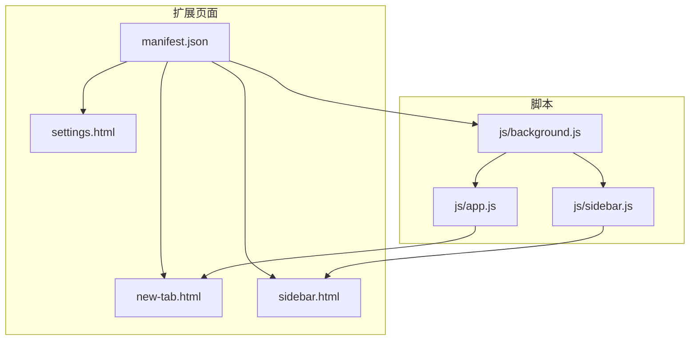
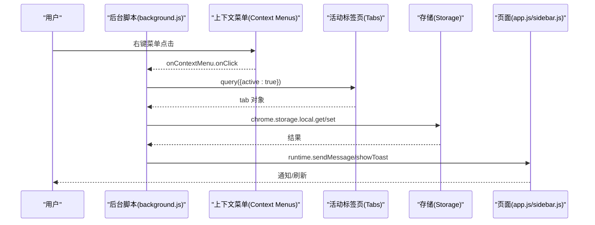
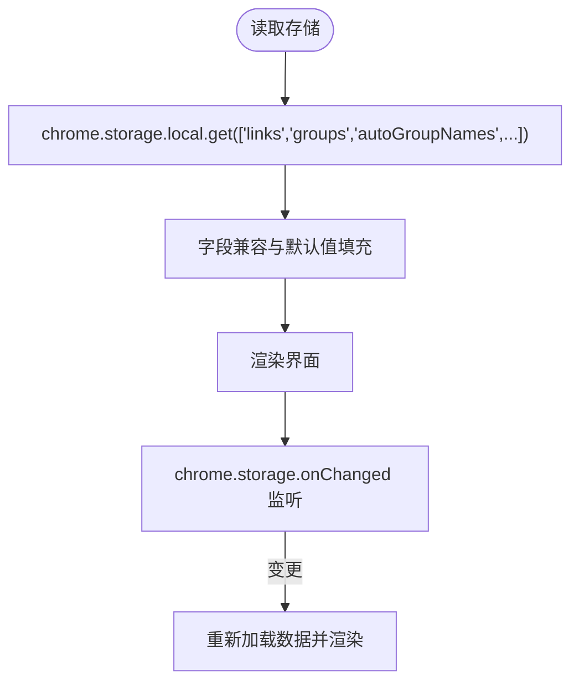
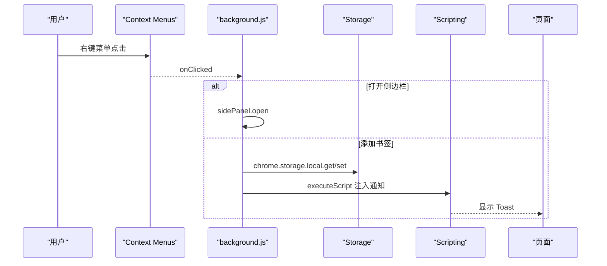
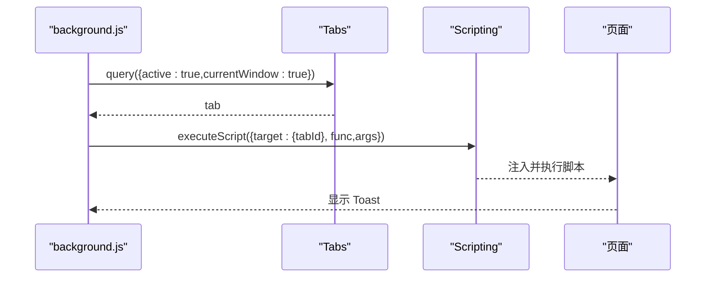
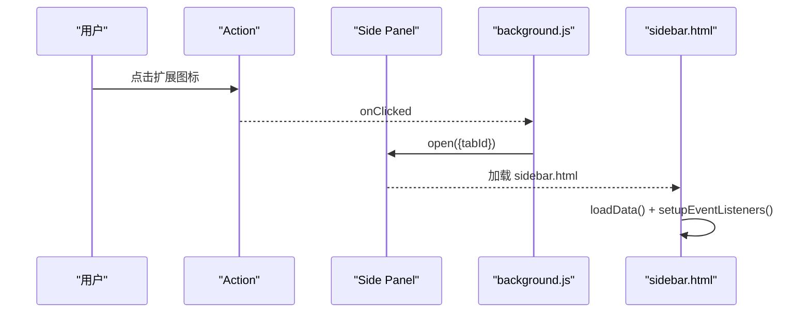
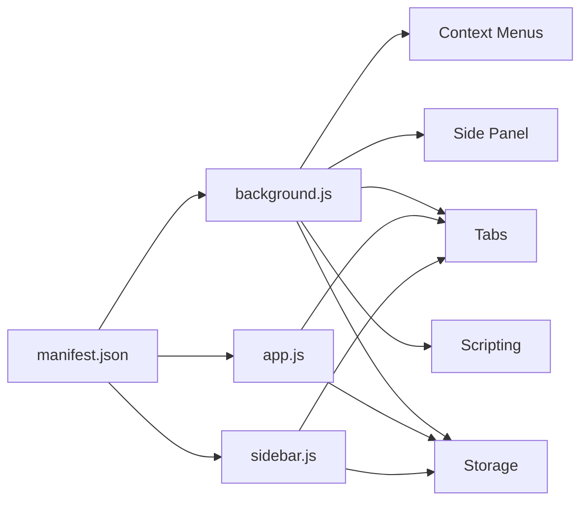

# Chrome Extension API 集成

<cite>
**本文引用的文件**
- [manifest.json](file://manifest.json)
- [background.js](file://js/background.js)
- [app.js](file://js/app.js)
- [sidebar.js](file://js/sidebar.js)
- [new-tab.html](file://new-tab.html)
- [sidebar.html](file://sidebar.html)
- [settings.html](file://settings.html)
- [README.md](file://README.md)
- [GUIDE.md](file://GUIDE.md)
</cite>

## 目录
1. [简介](#简介)
2. [项目结构](#项目结构)
3. [核心组件](#核心组件)
4. [架构总览](#架构总览)
5. [详细组件分析](#详细组件分析)
6. [依赖关系分析](#依赖关系分析)
7. [性能考量](#性能考量)
8. [故障排查指南](#故障排查指南)
9. [结论](#结论)
10. [附录](#附录)

## 简介
本指南面向希望在书签白板项目中集成 Chrome Extension API 的开发者，围绕以下目标展开：
- 使用 Chrome Storage API 进行数据持久化，包括数据模型设计、存储策略与迁移方案
- 集成 Context Menus API，创建右键菜单、处理事件与权限配置
- 使用 Tabs API 与 Scripting API 实现标签页管理、页面脚本注入与状态监控
- 集成 Side Panel API，实现侧边栏功能与控制
- 提供具体代码示例路径、错误处理与性能优化建议
- 说明 manifest.json 权限配置与安全注意事项

## 项目结构
该项目采用 Manifest V3 架构，主要文件组织如下：
- manifest.json：扩展元数据、权限声明、背景页与侧边栏配置
- new-tab.html：新标签页主界面，承载书签白板主逻辑
- sidebar.html：侧边栏界面，独立运行于侧边栏面板
- settings.html：设置页面，用于高级管理与数据导入导出
- js/background.js：后台脚本，负责右键菜单、消息通信与侧边栏控制
- js/app.js：新标签页主逻辑，负责数据加载、渲染与交互
- js/sidebar.js：侧边栏逻辑，负责书签列表、搜索与拖拽添加
- README.md 与 GUIDE.md：功能说明与使用文档

图表来源
- [manifest.json](file://manifest.json)
- [new-tab.html](file://new-tab.html)
- [sidebar.html](file://sidebar.html)
- [settings.html](file://settings.html)
- [background.js](file://js/background.js)
- [app.js](file://js/app.js)
- [sidebar.js](file://js/sidebar.js)

章节来源
- [manifest.json](file://manifest.json)
- [new-tab.html](file://new-tab.html)
- [sidebar.html](file://sidebar.html)
- [settings.html](file://settings.html)

## 核心组件
- Chrome Storage API：用于本地数据持久化，存储书签、分组、主题与设置
- Context Menus API：在页面与链接上创建右键菜单，触发添加书签与打开侧边栏
- Tabs API 与 Scripting API：查询活动标签页、注入脚本以显示 Toast 通知
- Side Panel API：启用与控制侧边栏的打开、关闭与选项

章节来源
- [background.js](file://js/background.js)
- [app.js](file://js/app.js)
- [sidebar.js](file://js/sidebar.js)
- [manifest.json](file://manifest.json)

## 架构总览
扩展由 manifest.json 声明权限与入口，后台脚本负责右键菜单与消息通信，主页面与侧边栏分别通过 Storage API 读写数据，并通过 onChanged 监听实现跨页面同步。

图表来源
- [background.js](file://js/background.js)
- [app.js](file://js/app.js)
- [sidebar.js](file://js/sidebar.js)

## 详细组件分析

### Chrome Storage API 集成
- 数据模型设计
  - links：书签数组，包含 url、title、icon、groups、createdAt 等字段
  - groups：分组数组，包含 id、name、color、icon、createdAt 等字段
  - autoGroupNames：自动分组自定义名称映射
  - darkMode、tipHidden、sortBy 等设置
- 存储策略
  - 使用 chrome.storage.local 进行本地持久化
  - 主页面与侧边栏均通过 chrome.storage.local.get 读取，通过 chrome.storage.local.set 写入
  - 通过 chrome.storage.onChanged 监听本地存储变化，实现跨页面自动刷新
- 数据迁移
  - 在加载时对旧字段进行兼容处理（如 groups、pinned、clickCount、lastAccessed）
  - 导入时对 links、groups、autoGroupNames 与 settings 进行合并与覆盖

图表来源
- [app.js](file://js/app.js)
- [sidebar.js](file://js/sidebar.js)

章节来源
- [app.js](file://js/app.js)
- [sidebar.js](file://js/sidebar.js)
- [README.md](file://README.md)

### Context Menus API 集成
- 菜单创建
  - addToBookmarkBoard：在页面右键添加当前页面
  - addLinkToBookmarkBoard：在链接右键添加该链接
  - openSidebar：在任意位置右键打开侧边栏
- 事件处理
  - onInstalled：扩展安装时创建菜单并启用侧边栏
  - onClicked：根据 menuItemId 分支处理，调用 addBookmark 并通过 scripting 注入脚本显示 Toast
- 权限配置
  - manifest.json 中声明 permissions: ["contextMenus", "storage", "tabs", "scripting"]

图表来源
- [background.js](file://js/background.js)
- [manifest.json](file://manifest.json)

章节来源
- [background.js](file://js/background.js)
- [manifest.json](file://manifest.json)

### Tabs API 与 Scripting API 使用
- 标签页管理
  - 通过 chrome.tabs.query 查询活动标签页，获取标题与 favicon
  - 通过 chrome.tabs.create 在新标签页打开书签
- 页面脚本注入
  - 通过 chrome.scripting.executeScript 在当前页面注入脚本，创建 Toast 通知
  - 注入脚本在页面上下文中执行，避免跨域限制
- 状态监控
  - 通过 chrome.storage.onChanged 监听本地存储变化，实现主页面与侧边栏的实时同步

图表来源
- [background.js](file://js/background.js)
- [sidebar.js](file://js/sidebar.js)

章节来源
- [background.js](file://js/background.js)
- [sidebar.js](file://js/sidebar.js)

### Side Panel API 集成
- 启用与控制
  - onInstalled 时通过 chrome.sidePanel.setOptions 启用侧边栏并设置默认路径
  - 右键菜单 openSidebar 触发 chrome.sidePanel.open
  - 扩展图标点击事件 chrome.action.onClicked 也打开侧边栏
- 侧边栏页面
  - sidebar.html 作为独立页面，通过 chrome.storage.local.get 读取数据
  - 通过 chrome.storage.onChanged 实时刷新
  - 支持搜索、手动添加、拖拽添加与编辑删除

图表来源
- [background.js](file://js/background.js)
- [sidebar.html](file://sidebar.html)
- [manifest.json](file://manifest.json)

章节来源
- [background.js](file://js/background.js)
- [sidebar.html](file://sidebar.html)
- [manifest.json](file://manifest.json)

## 依赖关系分析
- manifest.json 声明权限与入口，决定后台脚本、侧边栏与新标签页行为
- background.js 依赖 Context Menus、Side Panel、Tabs、Scripting、Storage API
- app.js 与 sidebar.js 依赖 Storage API 与 Tabs API（用于查询标签页信息）

图表来源
- [manifest.json](file://manifest.json)
- [background.js](file://js/background.js)
- [app.js](file://js/app.js)
- [sidebar.js](file://js/sidebar.js)

章节来源
- [manifest.json](file://manifest.json)
- [background.js](file://js/background.js)
- [app.js](file://js/app.js)
- [sidebar.js](file://js/sidebar.js)

## 性能考量
- DOM 渲染优化
  - 主页面与侧边栏均采用分批渲染（requestAnimationFrame + 批量节点片段）减少主线程阻塞
  - 侧边栏限制显示数量（默认 50），超出部分提示用户使用搜索筛选
- 数据访问优化
  - 主页面使用域名缓存 Map 减少 URL 解析开销
  - 通过 chrome.storage.onChanged 监听局部变化，避免全量重载
- 脚本注入优化
  - 仅在必要时注入脚本（如添加书签成功后），并捕获异常避免影响页面
- 事件绑定与内存
  - 侧边栏关闭时通过 window.close 释放页面资源；主页面移除事件监听时注意避免内存泄漏

章节来源
- [app.js](file://js/app.js)
- [sidebar.js](file://js/sidebar.js)
- [background.js](file://js/background.js)

## 故障排查指南
- 右键菜单不显示
  - 重新安装扩展（移除后重新加载），确保 Context Menus 权限生效
- 侧边栏不自动刷新
  - 确认使用最新版本（v3.2.0+），检查 chrome.storage.onChanged 是否触发
- 书签丢失
  - 数据存储在 chrome.storage.local，清除浏览器数据会导致丢失；建议定期导出备份
- 无法注入脚本显示通知
  - 检查 Scripting 权限与目标页面是否允许脚本注入；捕获异常并降级提示

章节来源
- [README.md](file://README.md)
- [GUIDE.md](file://GUIDE.md)
- [background.js](file://js/background.js)

## 结论
书签白板项目通过合理的 API 分层与数据模型设计，实现了本地化的书签管理体验。Storage API 提供稳定的数据持久化，Context Menus 与 Side Panel API 提升了用户交互效率，Tabs 与 Scripting API 则增强了页面脚本注入与标签页管理能力。遵循本文的权限配置、错误处理与性能优化建议，可进一步提升扩展的稳定性与用户体验。

## 附录
- manifest.json 权限与入口
  - permissions: ["storage","contextMenus","tabs","scripting","sidePanel"]
  - host_permissions: ["http://*/*","https://*/*"]
  - background.service_worker: "js/background.js"
  - side_panel.default_path: "sidebar.html"
  - action.default_title: "书签白板"
- 数据模型参考
  - links: 包含 url、title、icon、groups、createdAt 等字段
  - groups: 包含 id、name、color、icon、createdAt 等字段
  - autoGroupNames: 自动分组自定义名称映射
- 使用文档与功能说明
  - README.md 与 GUIDE.md 提供详细的使用指南与技术说明

章节来源
- [manifest.json](file://manifest.json)
- [README.md](file://README.md)
- [GUIDE.md](file://GUIDE.md)