# 主题定制与样式扩展

<cite>
**本文档引用的文件**
- [main.css](file://css/main.css)
- [settings.css](file://css/settings.css)
- [sidebar.css](file://css/sidebar.css)
- [font-awesome.min.css](file://css/font-awesome.min.css)
- [manifest.json](file://manifest.json)
- [new-tab.html](file://new-tab.html)
- [sidebar.html](file://sidebar.html)
- [settings.html](file://settings.html)
- [app.js](file://js/app.js)
- [sidebar.js](file://js/sidebar.js)
- [README.md](file://README.md)
</cite>

## 目录
1. [简介](#简介)
2. [项目结构](#项目结构)
3. [核心组件](#核心组件)
4. [架构概览](#架构概览)
5. [详细组件分析](#详细组件分析)
6. [依赖关系分析](#依赖关系分析)
7. [性能考虑](#性能考虑)
8. [故障排除指南](#故障排除指南)
9. [结论](#结论)
10. [附录](#附录)

## 简介

书签白板是一个基于 Chrome 扩展的隐私优先本地书签管理工具。该项目采用了现代化的 CSS 变量系统和原生 CSS 技术，实现了灵活的主题定制和样式扩展功能。本文档将深入解析项目的主题系统设计原理，包括浅色模式和深色模式的实现机制，并提供详细的样式定制指南。

## 项目结构

项目采用模块化的文件组织方式，主要包含以下核心文件：

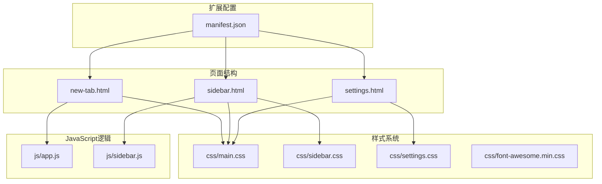

**图表来源**
- [manifest.json:1-38](file://manifest.json#L1-L38)
- [new-tab.html:1-206](file://new-tab.html#L1-L206)
- [sidebar.html:1-51](file://sidebar.html#L1-L51)
- [settings.html:1-281](file://settings.html#L1-L281)

**章节来源**
- [manifest.json:1-38](file://manifest.json#L1-L38)
- [README.md:132-154](file://README.md#L132-L154)

## 核心组件

### CSS 变量系统

项目使用 CSS 变量作为主题系统的核心，实现了统一的颜色管理和主题切换机制：

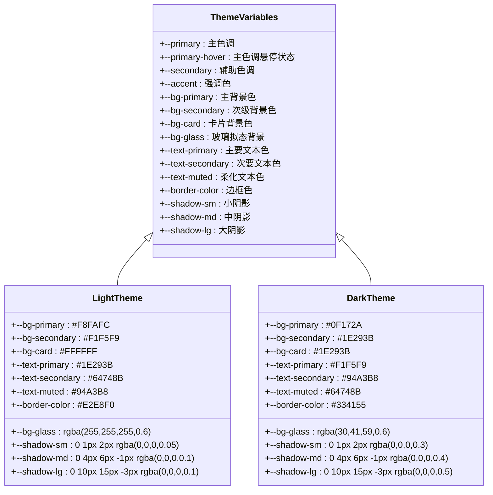

**图表来源**
- [main.css:7-41](file://css/main.css#L7-L41)

### 主题切换机制

项目实现了智能的主题切换系统，支持用户手动切换和系统主题跟随两种模式：

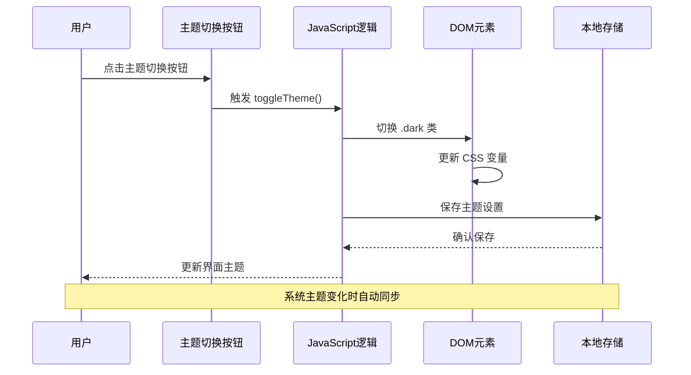

**图表来源**
- [app.js:190-196](file://js/app.js#L190-L196)
- [sidebar.js:70-74](file://js/sidebar.js#L70-L74)

**章节来源**
- [main.css:7-41](file://css/main.css#L7-L41)
- [app.js:64-73](file://js/app.js#L64-L73)
- [sidebar.js:43-68](file://js/sidebar.js#L43-L68)

## 架构概览

### 样式架构设计

项目采用了分层的样式架构，确保主题系统的灵活性和可维护性：

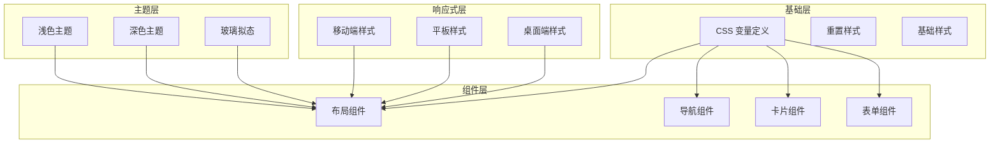

**图表来源**
- [main.css:44-63](file://css/main.css#L44-L63)
- [main.css:704-746](file://css/main.css#L704-L746)

### 主题系统工作原理

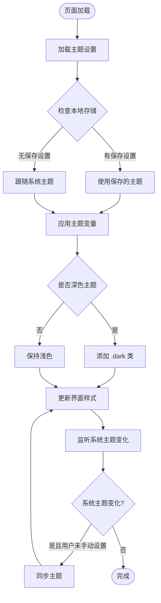

**图表来源**
- [app.js:64-73](file://js/app.js#L64-L73)
- [app.js:123-133](file://js/app.js#L123-L133)

**章节来源**
- [main.css:28-41](file://css/main.css#L28-L41)
- [app.js:123-133](file://js/app.js#L123-L133)

## 详细组件分析

### 书签卡片组件

书签卡片是项目中最复杂的组件之一，采用了多种 CSS 技术来实现丰富的视觉效果：

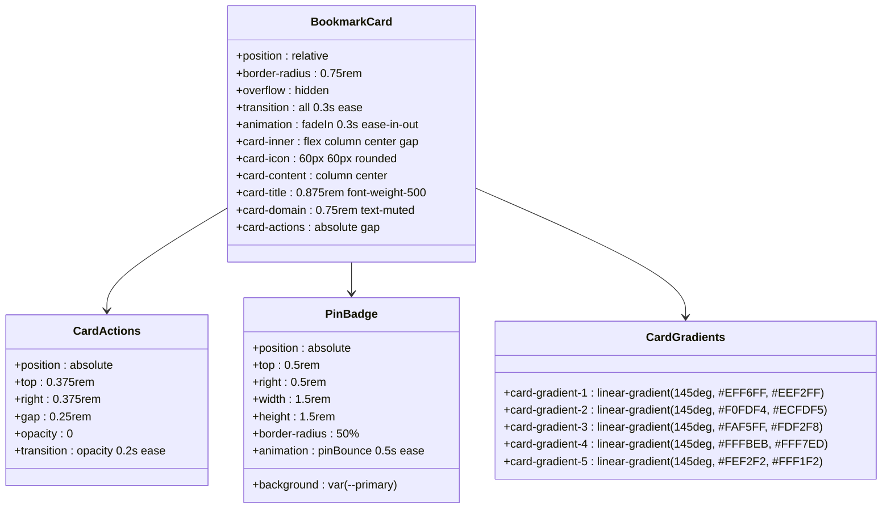

**图表来源**
- [main.css:749-940](file://css/main.css#L749-L940)
- [main.css:840-851](file://css/main.css#L840-L851)

#### 卡片布局与响应式设计

书签卡片采用了灵活的布局系统，支持多种屏幕尺寸的自适应：

```mermaid
flowchart TD
Container[卡片容器] --> Inner[内部布局]
Inner --> Icon[图标区域<br/>60px × 60px]
Inner --> Content[内容区域<br/>居中对齐]
Content --> Title[标题<br/>0.875rem 字体]
Content --> Domain[域名<br/>0.75rem 字体]
Content --> Stats[统计信息<br/>0.625rem 字体]
Icon --> HoverEffect[悬停效果<br/>translateY(-2px)]
Stats --> Tags[分组标签<br/>圆角徽章]
HoverEffect --> Actions[操作按钮<br/>绝对定位]
Actions --> Opacity[透明度过渡]
```

**图表来源**
- [main.css:854-938](file://css/main.css#L854-L938)

**章节来源**
- [main.css:749-940](file://css/main.css#L749-L940)

### 导航组件系统

项目实现了多层次的导航系统，包括顶部导航栏、侧边栏导航和设置页面导航：

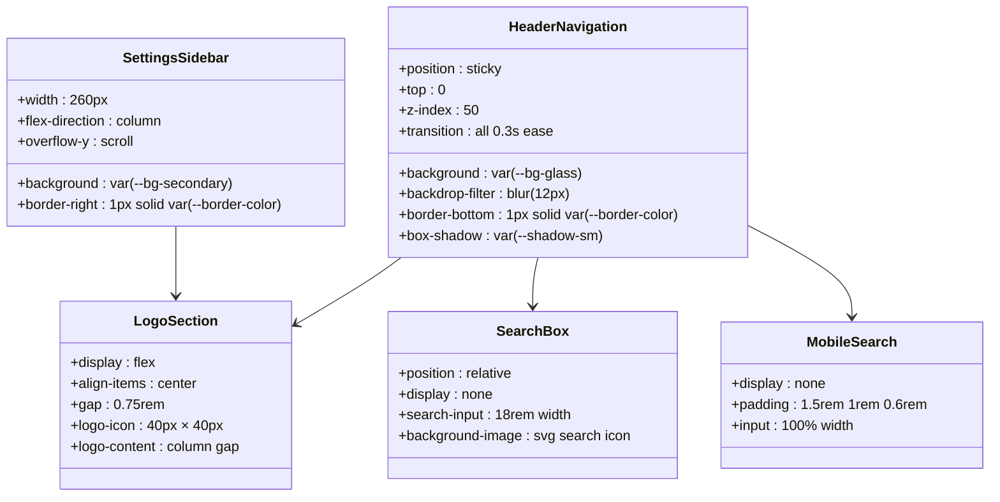

**图表来源**
- [main.css:73-226](file://css/main.css#L73-L226)
- [settings.css:42-111](file://css/settings.css#L42-L111)

**章节来源**
- [main.css:73-226](file://css/main.css#L73-L226)
- [settings.css:42-111](file://css/settings.css#L42-L111)

### 按钮与交互组件

项目提供了丰富的按钮样式和交互效果，支持多种状态和变体：

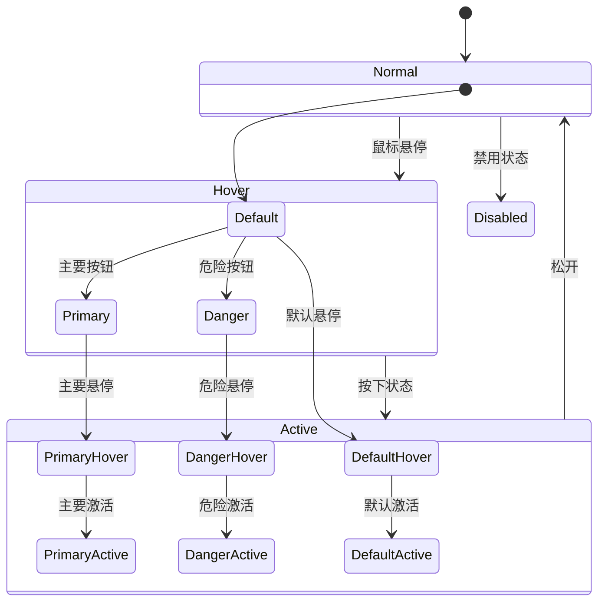

**图表来源**
- [main.css:646-701](file://css/main.css#L646-L701)
- [settings.css:211-250](file://css/settings.css#L211-L250)

**章节来源**
- [main.css:646-701](file://css/main.css#L646-L701)
- [settings.css:211-250](file://css/settings.css#L211-L250)

### 响应式设计系统

项目实现了全面的响应式设计，支持从移动端到桌面端的各种屏幕尺寸：

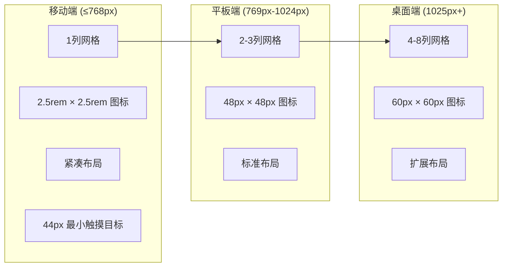

**图表来源**
- [main.css:1327-1537](file://css/main.css#L1327-L1537)

**章节来源**
- [main.css:1327-1537](file://css/main.css#L1327-L1537)

## 依赖关系分析

### 样式文件依赖关系

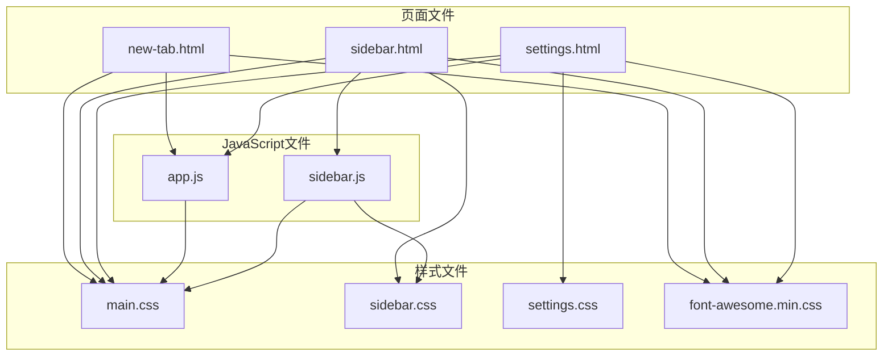

**图表来源**
- [new-tab.html:21-22](file://new-tab.html#L21-L22)
- [sidebar.html:6-8](file://sidebar.html#L6-L8)
- [settings.html:7-9](file://settings.html#L7-L9)

### 主题系统依赖链

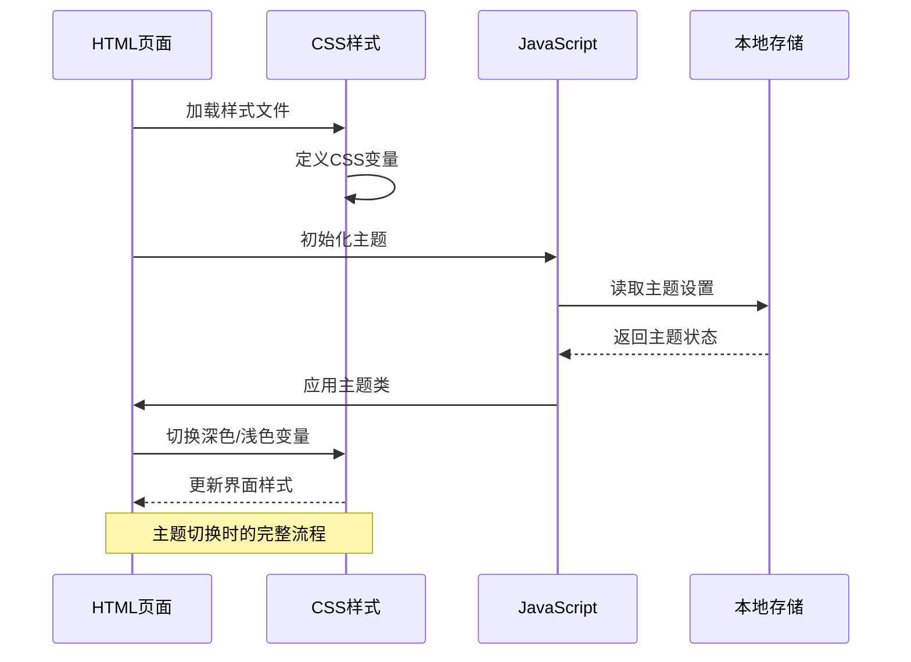

**图表来源**
- [app.js:64-73](file://js/app.js#L64-L73)
- [main.css:28-41](file://css/main.css#L28-L41)

**章节来源**
- [new-tab.html:21-22](file://new-tab.html#L21-L22)
- [sidebar.html:6-8](file://sidebar.html#L6-L8)
- [settings.html:7-9](file://settings.html#L7-L9)

## 性能考虑

### CSS 变量性能优势

项目使用 CSS 变量而非预处理器，带来了显著的性能优势：

1. **运行时计算**：CSS 变量在运行时计算，避免了编译时的构建开销
2. **内存效率**：单个变量定义可以被多个组件共享使用
3. **动态更新**：无需重新编译即可动态切换主题

### 响应式性能优化

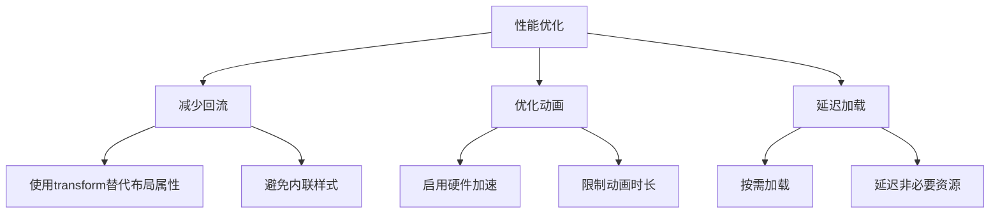

**图表来源**
- [main.css:1510-1530](file://css/main.css#L1510-L1530)

## 故障排除指南

### 常见主题问题

#### 主题切换无效

**问题症状**：点击主题按钮后界面没有变化

**可能原因**：
1. JavaScript 未正确加载
2. 本地存储权限问题
3. CSS 变量未正确应用

**解决方案**：
1. 检查浏览器控制台是否有错误
2. 确认 `localStorage` 权限正常
3. 验证 `.dark` 类是否正确添加到 `html` 元素

#### 系统主题跟随失效

**问题症状**：系统主题变化时界面不更新

**可能原因**：
1. `matchMedia` 监听器未正确设置
2. 事件监听器被意外移除
3. 浏览器兼容性问题

**解决方案**：
1. 检查 `window.matchMedia('(prefers-color-scheme: dark)')` 是否正常工作
2. 确认事件监听器的生命周期管理
3. 测试不同浏览器的兼容性

#### 样式冲突问题

**问题症状**：自定义样式与主题样式产生冲突

**解决策略**：
1. 使用更具体的选择器优先级
2. 避免使用 `!important`
3. 在自定义样式中明确覆盖主题变量

**章节来源**
- [app.js:123-133](file://js/app.js#L123-L133)
- [sidebar.js:62-67](file://js/sidebar.js#L62-L67)

## 结论

书签白板项目展现了现代前端开发中主题系统设计的最佳实践。通过精心设计的 CSS 变量系统、智能的主题切换机制和全面的响应式设计，项目实现了高度可定制的视觉体验。

### 主要优势

1. **灵活性**：基于 CSS 变量的主题系统允许轻松定制任何颜色和样式
2. **性能**：原生 CSS 技术减少了构建复杂性和运行时开销
3. **可维护性**：清晰的文件组织和模块化设计便于长期维护
4. **用户体验**：流畅的主题切换和响应式布局提升了整体体验

### 扩展建议

对于需要进一步定制的用户，建议：

1. **渐进式增强**：从简单的颜色替换开始，逐步增加复杂度
2. **测试驱动**：在不同设备和浏览器上充分测试主题效果
3. **性能监控**：关注自定义样式的性能影响，避免过度复杂化

## 附录

### 主题定制实用指南

#### 颜色方案定制

要创建自定义主题，建议按照以下步骤进行：

1. **定义主色调**：选择符合品牌或个人喜好的主色调
2. **创建辅助色系**：基于主色调生成互补色和渐变色
3. **设置对比度**：确保文本与背景有足够的对比度
4. **测试可访问性**：验证颜色组合在不同设备上的可读性

#### 字体样式定制

```css
/* 示例：自定义字体栈 */
:root {
  --font-primary: -apple-system, BlinkMacSystemFont, "Segoe UI", Roboto, "Helvetica Neue", Arial, sans-serif;
  --font-heading: -apple-system, BlinkMacSystemFont, "Segoe UI", Roboto, "Helvetica Neue", Arial, sans-serif;
}

/* 示例：字体大小系统 */
:root {
  --text-xs: 0.75rem;
  --text-sm: 0.875rem;
  --text-base: 1rem;
  --text-lg: 1.125rem;
  --text-xl: 1.25rem;
  --text-2xl: 1.5rem;
  --text-3xl: 1.875rem;
  --text-4xl: 2.25rem;
}
```

#### 布局设计定制

```css
/* 示例：自定义网格系统 */
.board {
  display: grid;
  grid-template-columns: repeat(var(--grid-columns, 4), 1fr);
  gap: var(--grid-gap, 1rem);
}

/* 示例：自定义间距系统 */
:root {
  --space-xxs: 0.125rem;
  --space-xs: 0.25rem;
  --space-sm: 0.5rem;
  --space-md: 1rem;
  --space-lg: 1.5rem;
  --space-xl: 2rem;
}
```

#### 响应式断点定制

```css
/* 示例：自定义断点 */
@media (max-width: 480px) {
  .container {
    --grid-columns: 1;
    --card-padding: 0.5rem;
  }
}

@media (max-width: 768px) {
  .container {
    --grid-columns: 2;
    --card-padding: 0.75rem;
  }
}

@media (max-width: 1024px) {
  .container {
    --grid-columns: 3;
    --card-padding: 1rem;
  }
}

@media (min-width: 1025px) {
  .container {
    --grid-columns: 4;
    --card-padding: 1.25rem;
  }
}
```

### 调试技巧

#### 开发者工具使用

1. **CSS 变量检查**：在 Elements 面板中查看 `:root` 元素的 CSS 变量值
2. **主题切换测试**：使用浏览器的暗色模式测试主题效果
3. **响应式调试**：使用设备模拟器测试不同屏幕尺寸

#### 性能监控

1. **样式重绘检测**：使用 Performance 面板监控样式重绘和回流
2. **动画性能**：检查 GPU 加速的使用情况
3. **内存泄漏**：监控事件监听器和定时器的清理

#### 常用调试命令

```javascript
// 检查当前主题状态
console.log(document.documentElement.classList.contains('dark'));

// 查看所有 CSS 变量
console.log(getComputedStyle(document.documentElement).getPropertyValue('--primary'));

// 切换主题进行测试
document.documentElement.classList.toggle('dark');
```