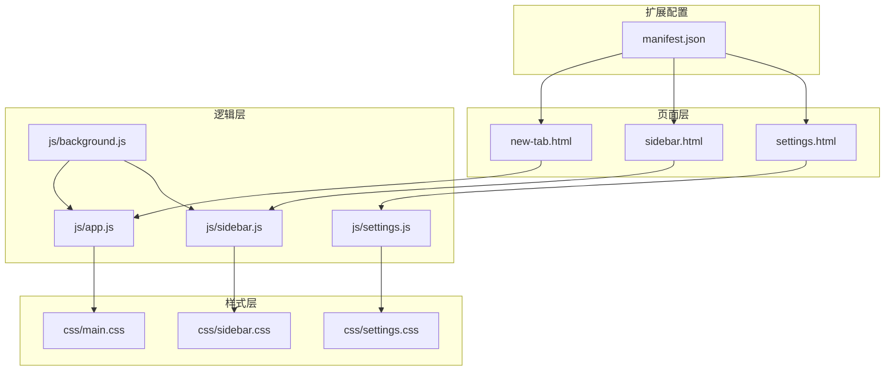
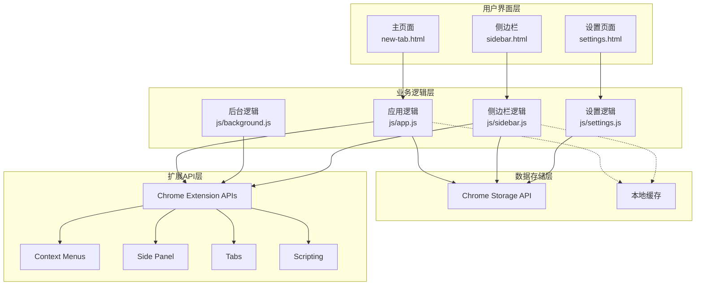
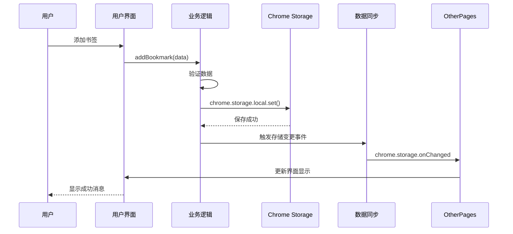
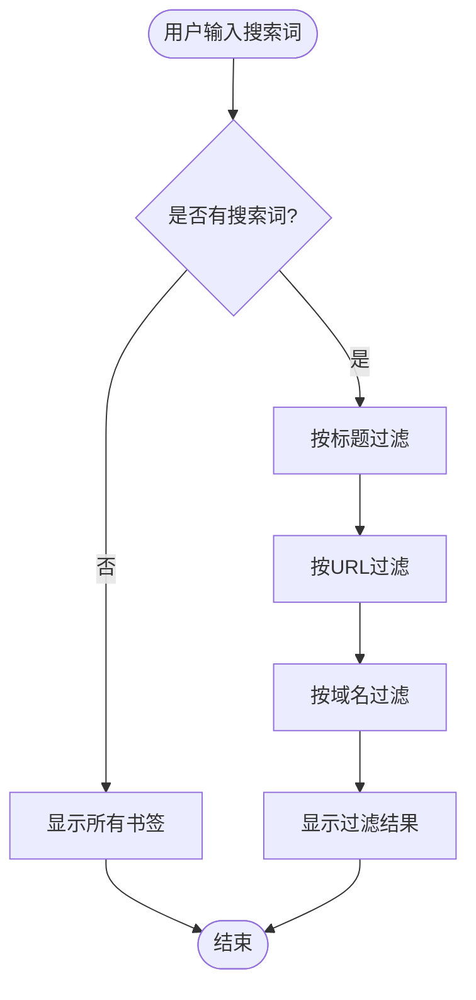
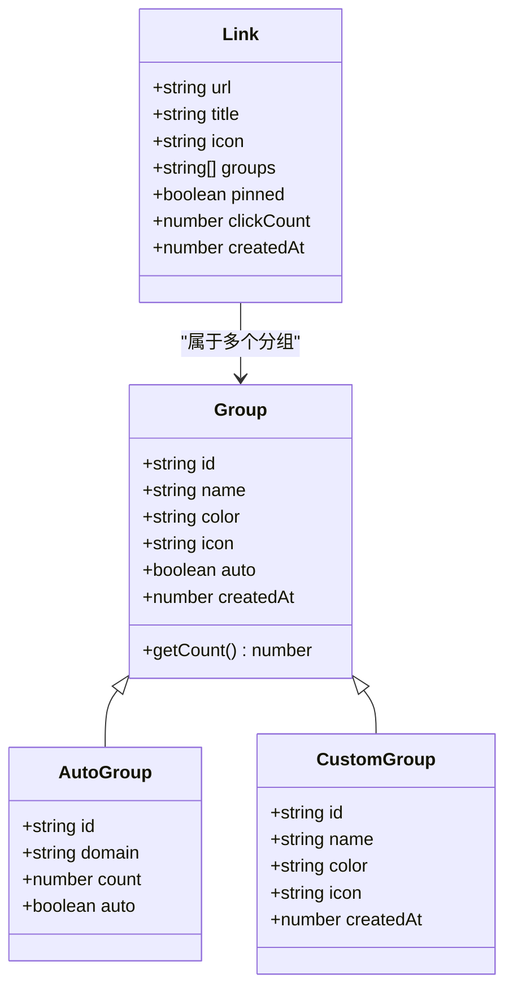
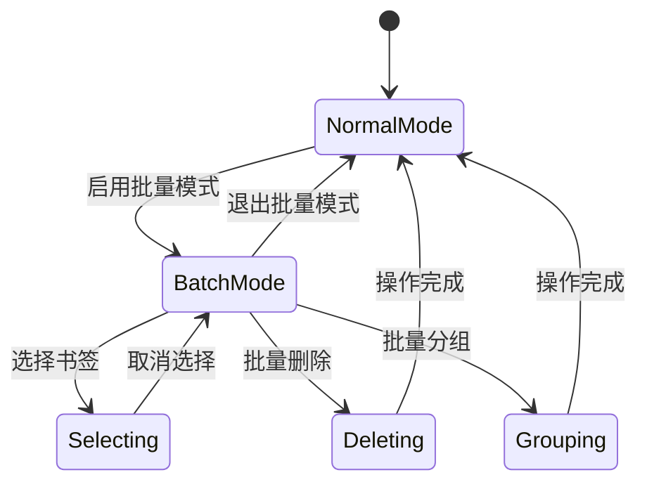
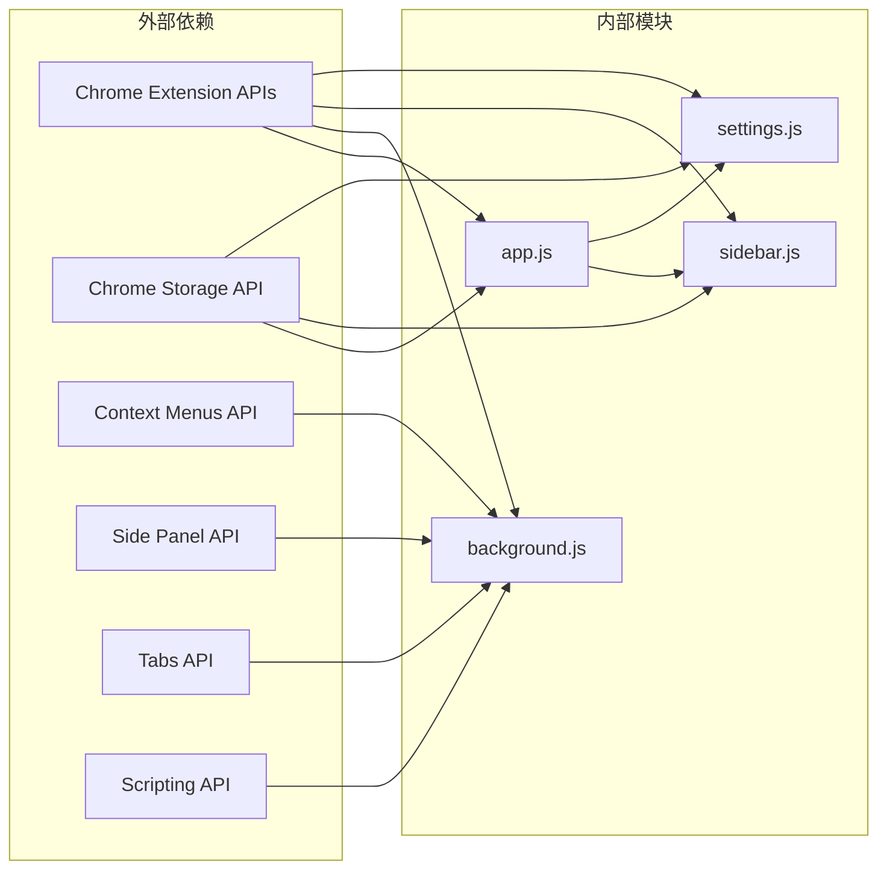

# 功能开发指南

<cite>
**本文档引用的文件**
- [js/app.js](file://js/app.js)
- [js/background.js](file://js/background.js)
- [js/sidebar.js](file://js/sidebar.js)
- [js/settings.js](file://js/settings.js)
- [manifest.json](file://manifest.json)
- [new-tab.html](file://new-tab.html)
- [sidebar.html](file://sidebar.html)
- [settings.html](file://settings.html)
- [README.md](file://README.md)
- [css/main.css](file://css/main.css)
</cite>

## 目录
1. [简介](#简介)
2. [项目结构](#项目结构)
3. [核心组件](#核心组件)
4. [架构概览](#架构概览)
5. [详细组件分析](#详细组件分析)
6. [依赖关系分析](#依赖关系分析)
7. [性能考虑](#性能考虑)
8. [故障排除指南](#故障排除指南)
9. [结论](#结论)

## 简介

书签白板是一个基于 Chrome Extension Manifest V3 的隐私优先本地书签管理工具。该项目采用现代化的技术栈，包括原生 CSS、JavaScript ES6+ 和 Chrome Extension APIs，提供了完整的书签管理解决方案。

项目的核心特性包括：
- 多场景添加书签（拖拽、右键菜单、手动添加、一键添加）
- 高效管理体验（卡片式布局、实时搜索、批量操作、快速编辑）
- 侧边栏功能（快速访问、移动端样式、实时同步）
- 现代化界面（深色/浅色主题、响应式设计、流畅动画）
- 隐私保护（完全本地存储、无需服务器）

## 项目结构

书签白板项目采用模块化的文件组织结构，每个主要功能模块都有独立的 JavaScript 文件和对应的 HTML 页面。



**图表来源**
- [manifest.json:1-38](file://manifest.json#L1-L38)
- [new-tab.html:1-206](file://new-tab.html#L1-L206)
- [sidebar.html:1-51](file://sidebar.html#L1-L51)
- [settings.html:1-281](file://settings.html#L1-L281)

**章节来源**
- [README.md:132-154](file://README.md#L132-L154)
- [manifest.json:1-38](file://manifest.json#L1-L38)

## 核心组件

### 主应用模块 (js/app.js)

主应用模块是书签白板的核心逻辑，负责管理书签数据、处理用户交互和维护应用状态。

**主要功能特性：**
- 数据持久化管理（Chrome Storage API）
- 用户界面渲染和事件处理
- 书签搜索和过滤功能
- 分组管理和自动分组系统
- 批量操作和置顶功能
- 主题切换和响应式设计

**数据结构：**
```javascript
// 应用状态管理
let links = [];           // 书签数组
let groups = [];          // 分组数组
let filterText = '';      // 搜索过滤文本
let activeGroupFilter = 'all'; // 当前激活的分组
let sortBy = 'createdAt-desc'; // 排序方式
let currentView = 'all';  // 当前视图模式
let domainCache = new Map(); // 域名缓存
```

**章节来源**
- [js/app.js:25-34](file://js/app.js#L25-L34)
- [js/app.js:75-106](file://js/app.js#L75-L106)
- [js/app.js:108-373](file://js/app.js#L108-L373)

### 后台脚本模块 (js/background.js)

后台脚本模块处理扩展的后台逻辑，特别是右键菜单功能和跨页面通信。

**核心功能：**
- 右键菜单创建和事件处理
- 书签添加的统一入口点
- 页面通知和 Toast 消息
- 侧边栏控制和打开

**右键菜单配置：**
```javascript
chrome.contextMenus.create({
    id: 'addToBookmarkBoard',
    title: '添加到书签白板',
    contexts: ['page'],
    documentUrlPatterns: ['http://*/*', 'https://*/*']
});
```

**章节来源**
- [js/background.js:6-37](file://js/background.js#L6-L37)
- [js/background.js:39-69](file://js/background.js#L39-L69)
- [js/background.js:71-109](file://js/background.js#L71-L109)

### 侧边栏模块 (js/sidebar.js)

侧边栏模块提供独立的书签管理界面，具有完整的书签操作功能。

**主要特性：**
- 独立的侧边栏界面
- 实时数据同步（chrome.storage.onChanged）
- 拖拽添加书签
- 主题切换功能
- 性能优化（分批渲染）

**性能优化策略：**
- 侧边栏显示限制（最多50个书签）
- 分批渲染机制（requestAnimationFrame）
- 搜索过滤优化

**章节来源**
- [js/sidebar.js:5-8](file://js/sidebar.js#L5-L8)
- [js/sidebar.js:30-41](file://js/sidebar.js#L30-L41)
- [js/sidebar.js:151-202](file://js/sidebar.js#L151-L202)

### 设置模块 (js/settings.js)

设置模块提供完整的书签管理界面，支持批量操作、分组管理和数据导出。

**功能模块：**
- 书签管理界面
- 分组管理系统
- 批量操作功能
- 数据导入导出
- 主题设置

**导航系统：**
```javascript
// 导航切换逻辑
navItems.forEach(item => {
    item.addEventListener('click', (e) => {
        // 切换活动导航项
        navItems.forEach(nav => nav.classList.remove('active'));
        sections.forEach(section => section.classList.remove('active'));
        
        item.classList.add('active');
        
        const sectionId = item.getAttribute('data-section');
        const targetSection = document.getElementById(sectionId);
        if (targetSection) {
            targetSection.classList.add('active');
        }
    });
});
```

**章节来源**
- [js/settings.js:26-65](file://js/settings.js#L26-L65)
- [js/settings.js:112-139](file://js/settings.js#L112-L139)
- [js/settings.js:232-270](file://js/settings.js#L232-L270)

## 架构概览

书签白板采用模块化的架构设计，各个组件之间通过清晰的接口进行通信。



**图表来源**
- [manifest.json:9-25](file://manifest.json#L9-L25)
- [js/app.js:81-106](file://js/app.js#L81-L106)
- [js/sidebar.js:143-149](file://js/sidebar.js#L143-L149)
- [js/settings.js:176-182](file://js/settings.js#L176-L182)

## 详细组件分析

### 数据管理架构

书签白板使用 Chrome Storage API 进行数据持久化，实现了完整的数据生命周期管理。



**图表来源**
- [js/app.js:469-473](file://js/app.js#L469-L473)
- [js/sidebar.js:311-313](file://js/sidebar.js#L311-L313)
- [js/background.js:92-108](file://js/background.js#L92-L108)

### 搜索和过滤系统

搜索功能支持多种过滤条件，包括标题、URL 和域名搜索。



**图表来源**
- [js/app.js:240-250](file://js/app.js#L240-L250)
- [js/settings.js:240-250](file://js/settings.js#L240-L250)
- [js/sidebar.js:204-215](file://js/sidebar.js#L204-L215)

### 分组管理系统

分组系统支持自定义分组和自动分组两种类型。



**图表来源**
- [js/app.js:475-542](file://js/app.js#L475-L542)
- [js/settings.js:712-733](file://js/settings.js#L712-L733)
- [js/settings.js:592-658](file://js/settings.js#L592-L658)

**章节来源**
- [js/app.js:475-542](file://js/app.js#L475-L542)
- [js/settings.js:712-733](file://js/settings.js#L712-L733)
- [js/settings.js:592-658](file://js/settings.js#L592-L658)

### 批量操作功能

批量操作功能允许用户同时对多个书签进行管理。



**图表来源**
- [js/settings.js:416-531](file://js/settings.js#L416-L531)
- [js/settings.js:426-440](file://js/settings.js#L426-L440)

**章节来源**
- [js/settings.js:416-531](file://js/settings.js#L416-L531)

## 依赖关系分析

书签白板的依赖关系相对简单，主要依赖于 Chrome Extension APIs 和本地存储。



**图表来源**
- [manifest.json:9-19](file://manifest.json#L9-L19)
- [js/app.js:81-106](file://js/app.js#L81-L106)
- [js/sidebar.js:143-149](file://js/sidebar.js#L143-L149)

**章节来源**
- [manifest.json:9-19](file://manifest.json#L9-L19)
- [README.md:158-169](file://README.md#L158-L169)

## 性能考虑

书签白板在多个方面都考虑了性能优化：

### 内存管理
- 域名缓存机制减少重复计算
- 数据结构优化避免内存泄漏
- 及时清理事件监听器

### 渲染性能
- 分批渲染大量书签
- requestAnimationFrame 优化动画
- 防抖处理高频事件

### 存储优化
- 增量更新减少存储压力
- 数据压缩和去重
- 智能缓存策略

**章节来源**
- [js/app.js:35-49](file://js/app.js#L35-L49)
- [js/sidebar.js:174-201](file://js/sidebar.js#L174-L201)

## 故障排除指南

### 常见问题诊断

**问题：右键菜单不显示**
- 检查扩展权限配置
- 重新安装扩展以重建菜单
- 验证 manifest.json 配置

**问题：书签不显示或丢失**
- 检查 Chrome Storage 中的数据
- 验证数据格式和完整性
- 清除浏览器缓存后重试

**问题：侧边栏不自动刷新**
- 确认 chrome.storage.onChanged 监听器
- 检查存储权限
- 验证消息传递机制

### 调试技巧

**开发环境调试：**
- 使用 Chrome DevTools 检查控制台错误
- 监控 Chrome Extension 页面
- 使用 Storage 面板检查数据状态

**生产环境监控：**
- 实现错误边界和异常处理
- 添加日志记录机制
- 监控性能指标

**章节来源**
- [README.md:248-258](file://README.md#L248-L258)
- [js/app.js:116-121](file://js/app.js#L116-L121)
- [js/sidebar.js:143-149](file://js/sidebar.js#L143-L149)

## 结论

书签白板项目展现了现代 Chrome Extension 开发的最佳实践，包括：

**架构优势：**
- 模块化设计便于维护和扩展
- 清晰的职责分离
- 良好的错误处理机制

**技术亮点：**
- 原生 CSS 实现响应式设计
- Chrome Extension APIs 的充分利用
- 性能优化策略的有效实施

**扩展性考虑：**
- 现有的架构为新功能开发提供了良好的基础
- 模块化结构便于添加新的功能模块
- 清晰的接口设计支持功能组合

对于开发者来说，理解现有架构和设计模式是成功扩展项目的关键。建议在添加新功能时遵循现有的代码风格和架构原则，确保系统的整体一致性和可维护性。