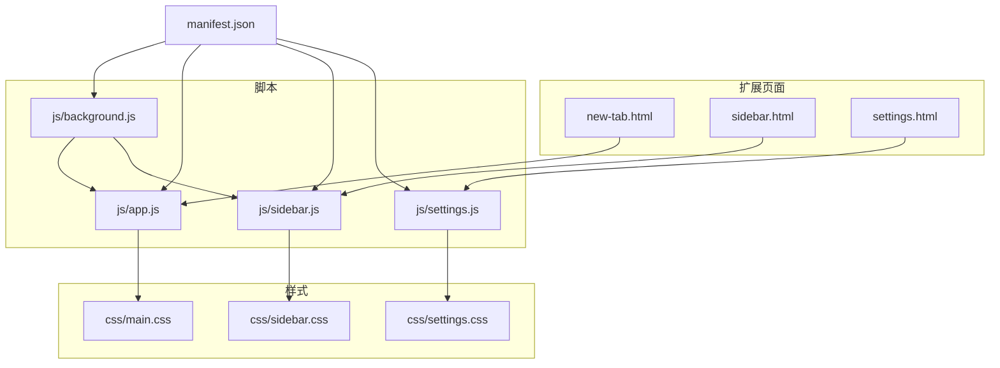
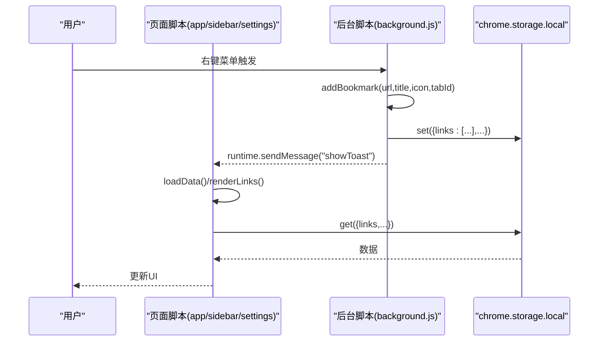
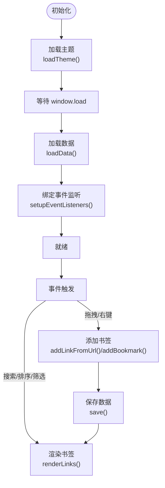
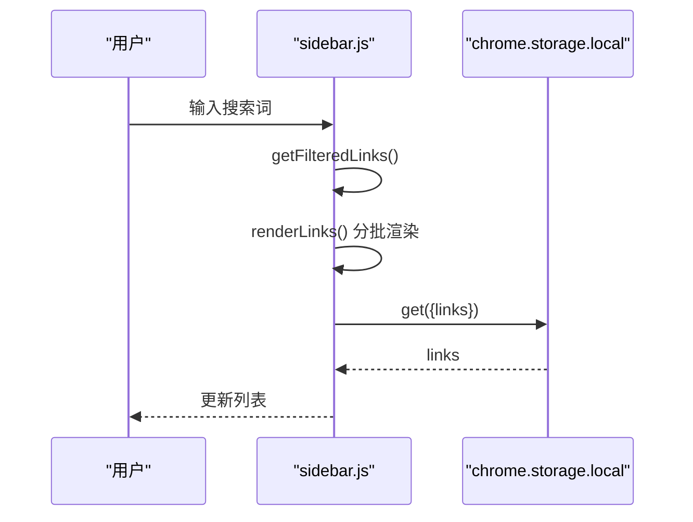
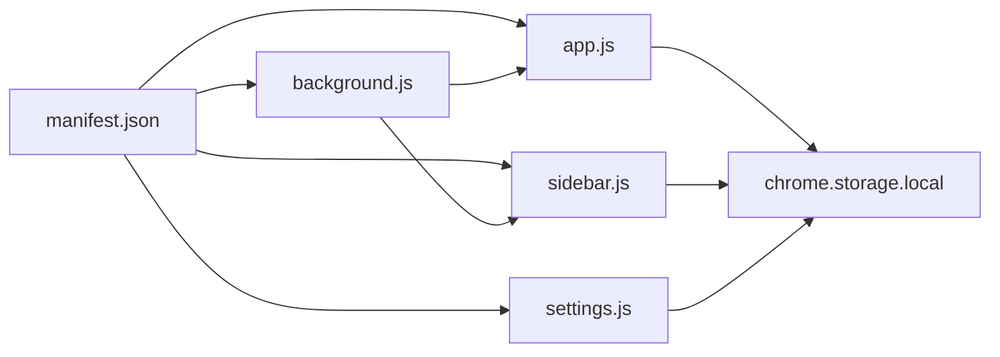

# 性能优化与最佳实践

<cite>
**本文引用的文件**
- [manifest.json](file://manifest.json)
- [new-tab.html](file://new-tab.html)
- [sidebar.html](file://sidebar.html)
- [settings.html](file://settings.html)
- [js/app.js](file://js/app.js)
- [js/sidebar.js](file://js/sidebar.js)
- [js/background.js](file://js/background.js)
- [js/settings.js](file://js/settings.js)
- [css/main.css](file://css/main.css)
- [css/sidebar.css](file://css/sidebar.css)
- [css/settings.css](file://css/settings.css)
- [README.md](file://README.md)
- [GUIDE.md](file://GUIDE.md)
</cite>

## 目录
1. [简介](#简介)
2. [项目结构](#项目结构)
3. [核心组件](#核心组件)
4. [架构总览](#架构总览)
5. [详细组件分析](#详细组件分析)
6. [依赖关系分析](#依赖关系分析)
7. [性能考量](#性能考量)
8. [故障排查指南](#故障排查指南)
9. [结论](#结论)
10. [附录](#附录)

## 简介
本指南面向书签白板项目的性能优化与开发最佳实践，围绕事件委托、DOM 操作优化、内存管理、数据加载与渲染优化（含虚拟滚动与懒加载）、Chrome Extension 性能监控与调试、启动与运行时性能优化、代码分割与模块化、依赖管理、性能测试与基准测试、安全与隐私保护、以及跨浏览器兼容性等方面进行系统阐述。文档结合实际源码路径定位，既适合开发者深入理解实现细节，也便于非技术读者掌握关键优化点。

## 项目结构
项目采用 Manifest V3 的 Chrome 扩展结构，前端页面由 HTML + 原生 CSS + 原生 JS 构成，无第三方框架依赖，强调轻量与本地化存储。主要页面与脚本如下：
- 页面：new-tab.html（新标签页主界面）、sidebar.html（侧边栏）、settings.html（设置页面）
- 脚本：js/app.js（主界面逻辑）、js/sidebar.js（侧边栏逻辑）、js/background.js（后台脚本，右键菜单与消息通信）、js/settings.js（设置页面逻辑）
- 样式：css/main.css（主界面样式）、css/sidebar.css（侧边栏样式）、css/settings.css（设置页面样式）

图表来源
- [manifest.json](file://manifest.json)
- [new-tab.html](file://new-tab.html)
- [sidebar.html](file://sidebar.html)
- [settings.html](file://settings.html)
- [js/app.js](file://js/app.js)
- [js/sidebar.js](file://js/sidebar.js)
- [js/background.js](file://js/background.js)
- [js/settings.js](file://js/settings.js)
- [css/main.css](file://css/main.css)
- [css/sidebar.css](file://css/sidebar.css)
- [css/settings.css](file://css/settings.css)

章节来源
- [README.md](file://README.md)
- [manifest.json](file://manifest.json)

## 核心组件
- 主界面（new-tab.html + js/app.js）：负责书签卡片展示、搜索、排序、分组筛选、拖拽添加、主题切换、提示栏控制、空状态处理、导入导出等。
- 侧边栏（sidebar.html + js/sidebar.js）：负责快速浏览、搜索、拖拽添加、主题切换、手动添加对话框、分批渲染等。
- 设置页面（settings.html + js/settings.js）：负责书签列表管理、批量操作、分组管理、数据导入导出、统计信息等。
- 后台脚本（js/background.js）：负责右键菜单、向页面注入通知、与页面通信等。

章节来源
- [new-tab.html](file://new-tab.html)
- [sidebar.html](file://sidebar.html)
- [settings.html](file://settings.html)
- [js/app.js](file://js/app.js)
- [js/sidebar.js](file://js/sidebar.js)
- [js/settings.js](file://js/settings.js)
- [js/background.js](file://js/background.js)

## 架构总览
扩展采用“页面脚本 + 后台脚本 + 本地存储”的典型 MV3 架构：
- 页面脚本：负责 UI 交互与渲染（app.js、sidebar.js、settings.js）
- 后台脚本：负责右键菜单、消息通信、页面注入通知（background.js）
- 本地存储：chrome.storage.local 用于持久化数据
- 消息通信：runtime.onMessage、storage.onChanged 实现跨页面同步

图表来源
- [js/background.js](file://js/background.js)
- [js/app.js](file://js/app.js)
- [js/sidebar.js](file://js/sidebar.js)
- [js/settings.js](file://js/settings.js)

## 详细组件分析

### 主界面组件（new-tab.html + js/app.js）
- 事件委托与集中绑定：通过事件委托减少重复监听器注册，降低内存占用；例如分组标签点击、视图切换等均采用委托。
- DOM 操作优化：使用 documentFragment 或批量插入减少重排；空状态与加载状态分离，避免不必要的 DOM 更新。
- 缓存策略：域名解析结果缓存（Map），避免重复计算；主题切换与提示栏状态持久化。
- 数据加载与渲染：先加载主题与样式，再异步加载数据，防止 FOUC；搜索与排序实时触发渲染，但通过节流/防抖可进一步优化。
- 拖拽与右键菜单：拖拽区域高亮、离开恢复；右键菜单回调中直接调用 addBookmark 并通过消息通知刷新。

图表来源
- [js/app.js](file://js/app.js)
- [new-tab.html](file://new-tab.html)

章节来源
- [js/app.js](file://js/app.js)
- [new-tab.html](file://new-tab.html)

### 侧边栏组件（sidebar.html + js/sidebar.js）
- 分批渲染：使用 requestAnimationFrame 分批插入节点，避免长任务阻塞主线程。
- 限制显示：SIDEBAR_DISPLAY_LIMIT 限制一次性渲染数量，配合搜索过滤提升性能。
- 拖拽与手动添加：与主界面一致的拖拽处理与 URL 校验，增强可用性。
- 主题与存储监听：独立主题切换与存储变化监听，保证实时同步。

图表来源
- [js/sidebar.js](file://js/sidebar.js)
- [sidebar.html](file://sidebar.html)

章节来源
- [js/sidebar.js](file://js/sidebar.js)
- [sidebar.html](file://sidebar.html)

### 设置页面组件（settings.html + js/settings.js）
- 导航与分节：左侧导航切换右侧内容区，保持首屏渲染轻量。
- 批量操作：全选/取消全选、批量删除、批量分组，使用 Set 维护选中集合，减少 DOM 选择成本。
- 数据管理：导出/导入采用加密 JSON，避免明文泄露；统计信息按需渲染。
- 列表渲染：列表项采用最小化 DOM 结构，hover 与选中状态切换通过类名控制。

章节来源
- [js/settings.js](file://js/settings.js)
- [settings.html](file://settings.html)

### 后台脚本（js/background.js）
- 右键菜单：创建“添加到书签白板”、“添加链接到书签白板”、“打开侧边栏”等菜单项。
- 页面注入通知：通过 scripting.executeScript 注入 Toast，避免额外权限。
- 消息通信：向页面发送 showNotification/showToast 消息，驱动 UI 刷新。

章节来源
- [js/background.js](file://js/background.js)

## 依赖关系分析
- manifest.json 声明权限与后台脚本、侧边栏、图标等；页面通过 script 标签引入对应脚本。
- 页面与后台脚本通过 runtime.onMessage 通信；页面与本地存储通过 chrome.storage API 交互。
- 样式文件按页面引入，主界面样式包含大量 CSS 变量与动画，注意在低端设备上的渲染压力。

图表来源
- [manifest.json](file://manifest.json)
- [js/app.js](file://js/app.js)
- [js/sidebar.js](file://js/sidebar.js)
- [js/background.js](file://js/background.js)
- [js/settings.js](file://js/settings.js)

章节来源
- [manifest.json](file://manifest.json)

## 性能考量

### 事件委托与 DOM 操作优化
- 事件委托：主界面与设置页面广泛使用事件委托，减少重复监听器注册，降低内存占用。
- 批量 DOM 插入：主界面与侧边栏均采用分批插入或片段插入，避免频繁重排。
- 空状态与加载状态：先显示占位，再异步填充真实内容，改善感知性能。
- 避免强制同步布局：尽量减少读写交错，使用 requestAnimationFrame 合并布局。

章节来源
- [js/app.js](file://js/app.js)
- [js/sidebar.js](file://js/sidebar.js)
- [js/settings.js](file://js/settings.js)

### 内存管理
- 缓存策略：域名解析缓存 Map，数据变更后主动清理缓存，避免脏数据。
- 事件监听：移除旧监听（如空状态按钮）时克隆节点替换，防止内存泄漏。
- 对象与集合：批量操作使用 Set 维护选中项，减少数组遍历成本。
- 主题与提示栏状态：通过本地存储持久化，避免重复计算。

章节来源
- [js/app.js](file://js/app.js)
- [js/settings.js](file://js/settings.js)

### 数据加载与渲染优化
- 首屏优化：new-tab.html 通过防 FOUC 样式与 window.load 时机控制，先显示主题再加载数据。
- 搜索与排序：实时触发渲染，建议在输入端增加防抖（debounce）以减少重绘。
- 分组与筛选：分组标签点击采用事件委托，减少重复绑定。
- 侧边栏渲染：SIDEBAR_DISPLAY_LIMIT 限制渲染数量，配合搜索过滤显著提升性能。

章节来源
- [new-tab.html](file://new-tab.html)
- [js/app.js](file://js/app.js)
- [js/sidebar.js](file://js/sidebar.js)

### 虚拟滚动与懒加载
- 当前实现：主界面与设置页面采用“分批渲染 + 限制显示数量”的策略，有效缓解长列表渲染压力。
- 建议：对于超大数据集，可考虑虚拟滚动（仅渲染可视区域）与懒加载（滚动触底再拉取）以进一步降低内存与 CPU 占用。

章节来源
- [js/sidebar.js](file://js/sidebar.js)
- [js/settings.js](file://js/settings.js)

### Chrome Extension 性能监控与调试
- 控制台与性能面板：使用 Performance 面板录制交互，观察主线程耗时、布局与绘制热点。
- 网络与存储：Network 面板检查 favicon 请求与存储读写频率；Storage 面板查看存储大小与增长趋势。
- 消息与事件：通过 Console 输出关键事件（如渲染开始/结束、存储变更），辅助定位性能瓶颈。
- 资源与内存：Memory 面板监控内存峰值与泄漏迹象；Network 面板关注图片与字体加载。

章节来源
- [README.md](file://README.md)

### 启动与运行时性能优化
- 启动优化：manifest.json 中声明后台脚本与侧边栏路径，避免不必要的预加载；页面脚本按需引入。
- 运行时优化：使用 requestAnimationFrame 合并渲染；减少不必要的 DOM 查询与样式计算；利用 CSS 变量与硬件加速属性（如 transform/opacity）。

章节来源
- [manifest.json](file://manifest.json)
- [css/main.css](file://css/main.css)

### 代码分割与模块化
- 模块化：各页面脚本职责清晰，app.js、sidebar.js、settings.js、background.js 各自独立，便于维护与测试。
- 代码分割：当前未使用动态 import，可在大型页面（如设置页）按功能模块拆分，按需加载。
- 依赖管理：无第三方依赖，减少打包体积与运行时开销。

章节来源
- [js/app.js](file://js/app.js)
- [js/sidebar.js](file://js/sidebar.js)
- [js/settings.js](file://js/settings.js)
- [js/background.js](file://js/background.js)

### 性能测试与基准测试
- 基准测试建议：
  - 书签数量：100、500、1000、5000 条
  - 场景：渲染时间、搜索延迟、排序耗时、拖拽添加耗时、侧边栏加载耗时
  - 工具：Performance 面板录制 + 自定义计时（Date.now 或 performance.now）
- 指标收集：平均帧时间（avg FPS）、最长帧时间（p95/p99）、首次内容绘制（FCP）、最大内容绘制（LCP）
- 回归测试：每次重大改动后回归上述指标，确保性能不退化

章节来源
- [README.md](file://README.md)

### 安全编码规范与隐私保护
- 数据加密：设置页面导出采用四层加密（UTF-8 → Base64 → XOR → Base64），保护用户隐私。
- 权限最小化：manifest.json 仅声明必要权限（storage、contextMenus、tabs、scripting、sidePanel）。
- CSP：页面 CSP 限制脚本来源，降低 XSS 风险。
- 输入校验：URL 校验与标题截断，避免异常输入导致渲染异常或资源浪费。

章节来源
- [GUIDE.md](file://GUIDE.md)
- [manifest.json](file://manifest.json)
- [css/main.css](file://css/main.css)

### 兼容性与跨浏览器优化
- 浏览器支持：基于 Manifest V3，Chrome 88+；注意不同浏览器对 MV3 的支持差异。
- 样式兼容：CSS 变量与现代布局（grid/flex）在较新浏览器表现良好；低端设备注意动画与滤镜的性能影响。
- API 兼容：chrome.storage.local、chrome.contextMenus、chrome.sidePanel 等 API 在 MV3 下行为稳定；注意权限与生命周期差异。

章节来源
- [README.md](file://README.md)
- [manifest.json](file://manifest.json)

## 故障排查指南
- 右键菜单不显示：完全卸载后重新加载扩展，确保后台脚本已注册菜单。
- 侧边栏不刷新：确认使用最新版本（v3.2.0+），或关闭后重新打开侧边栏。
- 书签丢失：chrome.storage.local 本地存储，清除浏览器数据会丢失；建议定期导出备份。
- 拖拽添加失败：检查 URL 格式与 favicon 获取，确保网络可达。
- 性能问题：使用 Performance 面板定位重排/重绘热点；检查是否有过多监听器或重复渲染。

章节来源
- [GUIDE.md](file://GUIDE.md)
- [README.md](file://README.md)

## 结论
书签白板项目在 MV3 架构下实现了良好的本地化与隐私保护，通过事件委托、分批渲染、缓存与主题持久化等手段，在中小规模数据下具备较好的性能表现。为进一步提升性能，建议引入防抖/节流、虚拟滚动、模块化拆分与更完善的基准测试体系，并持续关注浏览器兼容性与安全合规。

## 附录
- 术语
  - FOUC：无样式内容闪烁（Flash of Unstyled Content）
  - MV3：Manifest V3（Chrome 扩展新标准）
  - CSP：内容安全策略（Content Security Policy）
- 参考文档
  - [README.md](file://README.md)
  - [GUIDE.md](file://GUIDE.md)