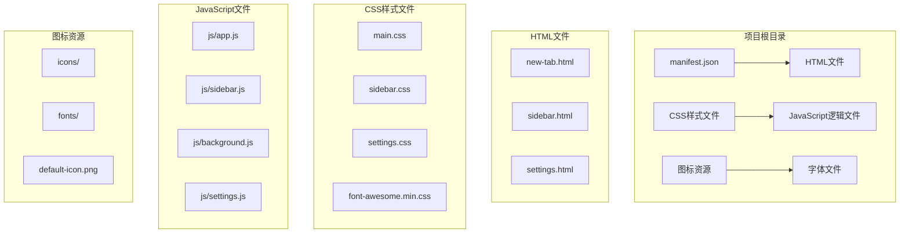
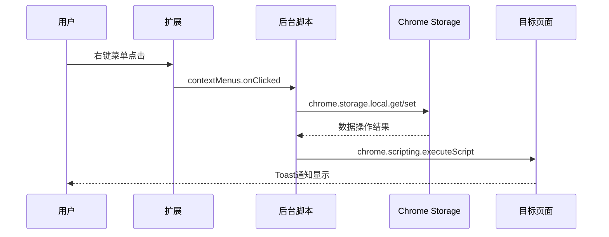
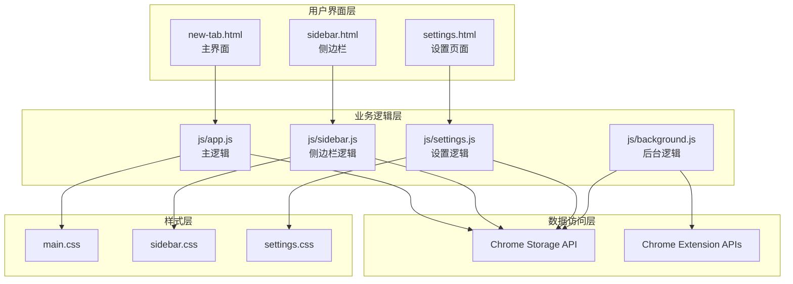
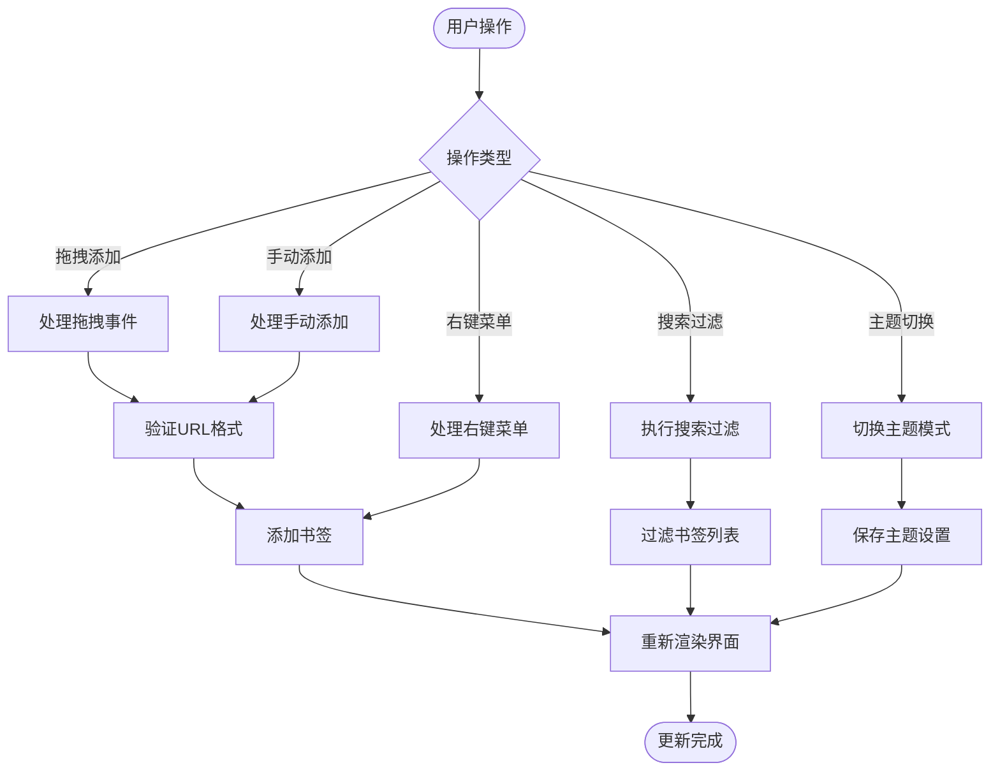
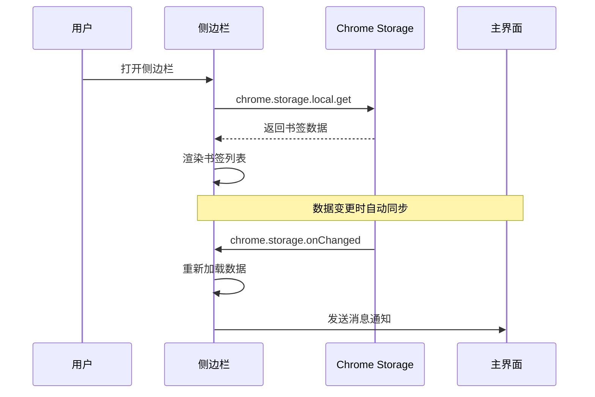
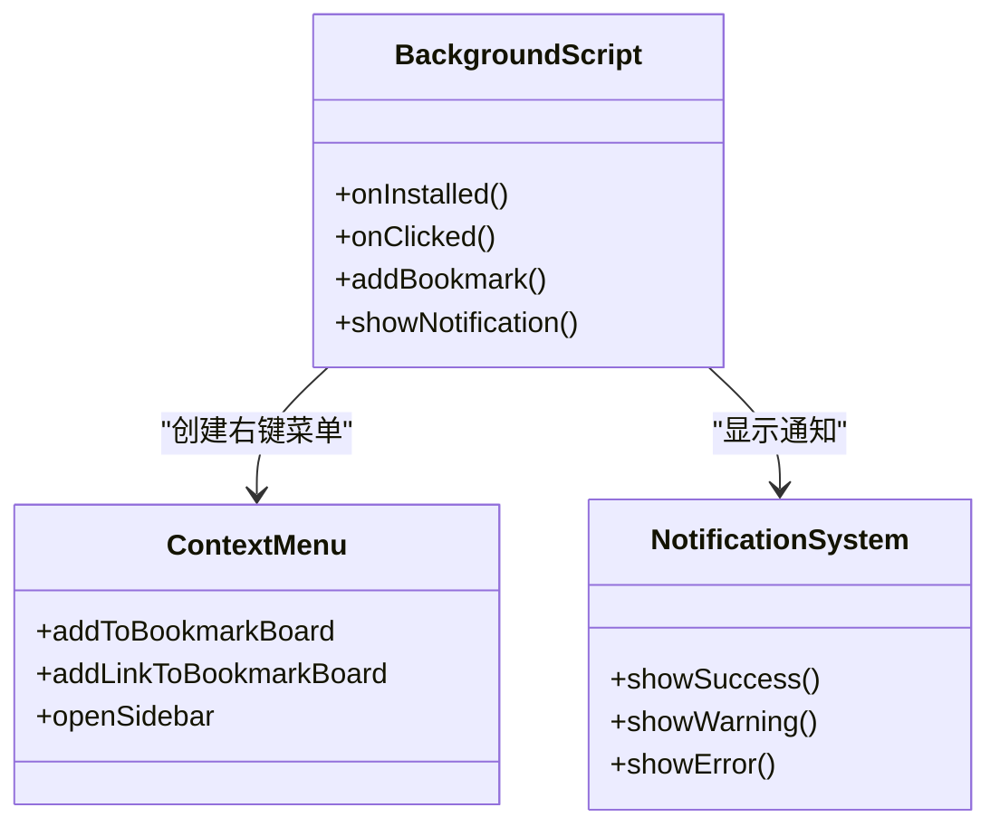
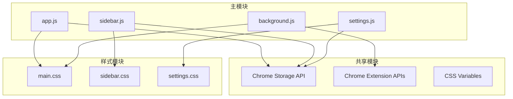
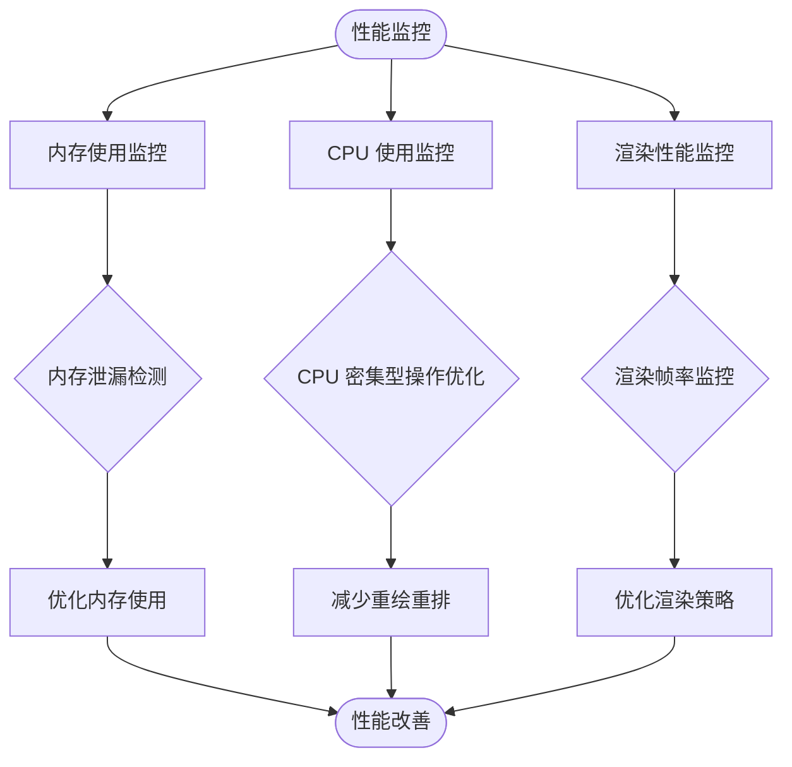

# 扩展开发指南

<cite>
**本文档引用的文件**
- [manifest.json](file://manifest.json)
- [README.md](file://README.md)
- [GUIDE.md](file://GUIDE.md)
- [UPDATE_LOG.md](file://UPDATE_LOG.md)
- [new-tab.html](file://new-tab.html)
- [sidebar.html](file://sidebar.html)
- [settings.html](file://settings.html)
- [app.js](file://js/app.js)
- [sidebar.js](file://js/sidebar.js)
- [background.js](file://js/background.js)
- [settings.js](file://js/settings.js)
- [main.css](file://css/main.css)
- [sidebar.css](file://css/sidebar.css)
- [settings.css](file://css/settings.css)
</cite>

## 目录
1. [简介](#简介)
2. [项目结构](#项目结构)
3. [核心组件](#核心组件)
4. [架构概览](#架构概览)
5. [详细组件分析](#详细组件分析)
6. [依赖关系分析](#依赖关系分析)
7. [性能考虑](#性能考虑)
8. [故障排除指南](#故障排除指南)
9. [结论](#结论)
10. [附录](#附录)

## 简介

书签白板是一个基于 Chrome Extension Manifest V3 的隐私优先本地书签管理工具。该项目提供了现代化的界面设计、丰富的功能特性和良好的用户体验。本文档旨在为新功能开发提供完整的开发指南，涵盖需求分析、设计规划、代码实现和测试验证的全流程。

## 项目结构

书签白板项目采用模块化的文件组织结构，主要包含以下核心目录：



**图表来源**
- [manifest.json:1-38](file://manifest.json#L1-L38)
- [new-tab.html:1-206](file://new-tab.html#L1-L206)
- [sidebar.html:1-51](file://sidebar.html#L1-L51)
- [settings.html:1-281](file://settings.html#L1-L281)

**章节来源**
- [manifest.json:1-38](file://manifest.json#L1-L38)
- [README.md:132-154](file://README.md#L132-L154)

## 核心组件

### Chrome Extension API 集成

项目充分利用了 Chrome Extension 的核心 API 来实现丰富的功能：

#### 权限配置
项目声明了以下关键权限：
- `storage`: 本地数据存储
- `contextMenus`: 右键菜单功能
- `tabs`: 标签页管理
- `scripting`: 页面脚本注入
- `sidePanel`: 侧边栏功能

#### 主要 API 使用



**图表来源**
- [background.js:39-69](file://js/background.js#L39-L69)
- [background.js:112-167](file://js/background.js#L112-L167)

### 数据存储架构

项目采用 Chrome Storage API 进行数据持久化，支持以下数据类型：

| 数据类型 | 存储位置 | 描述 |
|---------|----------|------|
| 书签数据 | `chrome.storage.local.links` | 包含URL、标题、图标、分组等信息 |
| 分组数据 | `chrome.storage.local.groups` | 自定义分组配置 |
| 主题设置 | `chrome.storage.local.darkMode` | 用户主题偏好 |
| 自动分组名称 | `chrome.storage.local.autoGroupNames` | 自定义域名分组名称映射 |

**章节来源**
- [README.md:171-187](file://README.md#L171-L187)
- [UPDATE_LOG.md:214-222](file://UPDATE_LOG.md#L214-L222)

## 架构概览

书签白板采用分层架构设计，各组件职责明确：



**图表来源**
- [manifest.json:20-28](file://manifest.json#L20-L28)
- [new-tab.html:203](file://new-tab.html#L203)
- [sidebar.html:48](file://sidebar.html#L48)
- [settings.html:278](file://settings.html#L278)

## 详细组件分析

### 主界面组件 (app.js)

主界面是用户的主要交互区域，实现了以下核心功能：

#### 数据管理功能
- **书签 CRUD 操作**: 添加、编辑、删除书签
- **分组管理**: 创建、编辑、删除分组
- **置顶功能**: 书签置顶和取消置顶
- **搜索过滤**: 实时搜索和高级搜索语法

#### 用户交互功能
- **拖拽添加**: 支持从浏览器拖拽链接到页面
- **主题切换**: 深色/浅色主题自动切换
- **批量操作**: 支持批量选择和操作
- **响应式设计**: 适配不同屏幕尺寸



**图表来源**
- [app.js:108-373](file://js/app.js#L108-L373)
- [app.js:760-800](file://js/app.js#L760-L800)

**章节来源**
- [app.js:1-800](file://js/app.js#L1-L800)
- [new-tab.html:1-206](file://new-tab.html#L1-L206)

### 侧边栏组件 (sidebar.js)

侧边栏提供了便捷的书签管理入口：

#### 核心功能
- **快速访问**: 侧边栏独立主题设置
- **实时同步**: 与主界面数据实时同步
- **拖拽支持**: 支持拖拽添加书签
- **搜索功能**: 实时搜索书签

#### 性能优化
- **分批渲染**: 大量书签时分批渲染提高性能
- **显示限制**: 限制侧边栏显示数量
- **内存管理**: 及时清理DOM元素



**图表来源**
- [sidebar.js:9-68](file://js/sidebar.js#L9-L68)
- [sidebar.js:142-149](file://js/sidebar.js#L142-L149)

**章节来源**
- [sidebar.js:1-602](file://js/sidebar.js#L1-L602)
- [sidebar.html:1-51](file://sidebar.html#L1-L51)

### 后台脚本组件 (background.js)

后台脚本负责处理扩展的核心逻辑：

#### 右键菜单功能
- **页面右键菜单**: 添加当前页面到书签
- **链接右键菜单**: 添加链接到书签
- **侧边栏控制**: 打开书签白板侧边栏

#### 通知系统
- **Toast通知**: 在目标页面显示添加结果
- **错误处理**: 处理重复添加等异常情况



**图表来源**
- [background.js:6-37](file://js/background.js#L6-L37)
- [background.js:39-69](file://js/background.js#L39-L69)

**章节来源**
- [background.js:1-174](file://js/background.js#L1-L174)

### 设置页面组件 (settings.js)

设置页面提供了完整的配置管理功能：

#### 功能模块
- **书签管理**: 列表式管理书签
- **分组管理**: 创建和管理分组
- **数据管理**: 导入导出功能
- **批量操作**: 支持批量删除和分组操作

#### 用户体验
- **分步导航**: 左侧导航栏提供清晰的导航
- **实时预览**: 修改设置后实时生效
- **确认对话框**: 重要操作提供确认机制

**章节来源**
- [settings.js:1-800](file://js/settings.js#L1-L800)
- [settings.html:1-281](file://settings.html#L1-L281)

## 依赖关系分析

### 外部依赖

项目采用最小化依赖策略，主要依赖包括：

```mermaid
graph LR
subgraph "核心依赖"
A[Chrome Extension APIs]
B[原生 JavaScript ES6+]
C[原生 CSS + CSS Variables]
end
subgraph "第三方库"
D[Font Awesome 4.7]
E[Tailwind CSS (备用)]
end
subgraph "浏览器支持"
F[Chrome 88+]
G[Manifest V3]
end
A --> D
A --> E
B --> F
C --> G
```

**图表来源**
- [README.md:43-51](file://README.md#L43-L51)
- [manifest.json:2-5](file://manifest.json#L2-L5)

### 内部模块依赖



**图表来源**
- [app.js:81-106](file://js/app.js#L81-L106)
- [sidebar.js:37-41](file://js/sidebar.js#L37-L41)
- [settings.js:96-110](file://js/settings.js#L96-L110)

**章节来源**
- [manifest.json:9-15](file://manifest.json#L9-L15)
- [README.md:158-169](file://README.md#L158-L169)

## 性能考虑

### 优化策略

#### 内存管理
- **DOM 元素复用**: 避免频繁创建和销毁 DOM 元素
- **事件委托**: 使用事件委托减少事件处理器数量
- **懒加载**: 对于大量数据采用懒加载策略

#### 渲染优化
- **requestAnimationFrame**: 使用浏览器渲染优化 API
- **虚拟滚动**: 对于大量书签采用虚拟滚动技术
- **CSS 动画**: 优先使用 CSS 动画而非 JavaScript 动画

#### 数据处理
- **缓存机制**: 实现域名解析缓存减少重复计算
- **批量更新**: 合并多次数据更新操作
- **防抖节流**: 对频繁触发的操作进行防抖处理

### 性能监控



## 故障排除指南

### 常见问题及解决方案

#### 右键菜单问题
**问题**: 右键菜单不显示
**解决方案**: 完全重新安装扩展（移除后重新加载）

#### 数据丢失问题
**问题**: 书签数据丢失
**解决方案**: 书签数据存储在浏览器本地，清除浏览器数据会导致丢失。建议定期导出备份。

#### 侧边栏同步问题
**问题**: 侧边栏不自动刷新
**解决方案**: 确保使用最新版本（v3.2.5+），如果仍有问题，关闭并重新打开侧边栏。

#### 性能问题
**问题**: 页面加载缓慢
**解决方案**: 检查是否有大量书签，考虑删除不必要的书签；使用搜索功能过滤书签。

### 调试技巧

#### 开发者工具使用
- **Chrome 扩展面板**: 检查扩展状态和权限
- **Console 面板**: 查看 JavaScript 错误和警告
- **Network 面板**: 监控 API 请求和响应
- **Application 面板**: 检查存储的数据

#### 日志记录
```javascript
// 开发环境启用详细日志
if (process.env.NODE_ENV === 'development') {
    console.log('[DEBUG]', '功能调用:', functionName);
    console.log('[DEBUG]', '参数:', params);
    console.log('[DEBUG]', '返回值:', result);
}
```

**章节来源**
- [README.md:248-258](file://README.md#L248-L258)
- [GUIDE.md:380-410](file://GUIDE.md#L380-L410)

## 结论

书签白板项目展现了现代 Chrome 扩展开发的最佳实践。通过合理的架构设计、完善的 API 集成和优秀的用户体验，该项目为扩展开发提供了宝贵的参考。

### 项目优势
- **架构清晰**: 分层设计便于维护和扩展
- **性能优秀**: 多种优化策略确保流畅体验
- **功能丰富**: 涵盖书签管理的各个方面
- **易于扩展**: 模块化设计支持新功能开发

### 发展方向
- **功能增强**: 继续完善分组系统和搜索功能
- **性能优化**: 进一步优化大数据量场景的性能
- **用户体验**: 持续改进界面设计和交互体验
- **兼容性**: 扩展到更多浏览器平台

## 附录

### 开发环境搭建

#### 环境要求
- Chrome 88+
- Node.js (可选，用于构建工具)
- Git 版本控制

#### 开发步骤
1. 克隆项目到本地
2. 在 Chrome 中启用开发者模式
3. 加载已解压的扩展程序
4. 修改代码并重新加载扩展
5. 使用开发者工具调试

### 贡献指南

#### 代码规范
- 使用 ES6+ 语法
- 遵循一致的命名约定
- 添加必要的注释和文档
- 编写单元测试

#### 提交流程
1. Fork 项目到个人仓库
2. 创建功能分支
3. 提交代码变更
4. 推送到远程分支
5. 创建 Pull Request
6. 等待代码审查和合并

### API 参考

#### Chrome Extension API
- `chrome.storage`: 数据存储 API
- `chrome.contextMenus`: 右键菜单 API
- `chrome.tabs`: 标签页管理 API
- `chrome.scripting`: 脚本注入 API
- `chrome.sidePanel`: 侧边栏 API

#### 自定义 API
- `showToast()`: 显示 Toast 通知
- `showModal()`: 显示模态框
- `saveData()`: 保存数据到存储
- `loadData()`: 从存储加载数据

**章节来源**
- [README.md:194-204](file://README.md#L194-L204)
- [GUIDE.md:413-431](file://GUIDE.md#L413-L431)