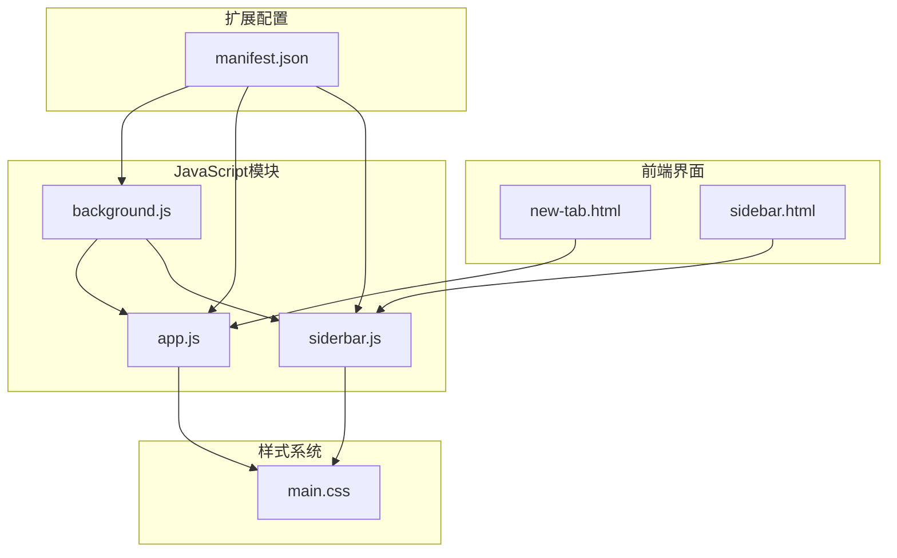
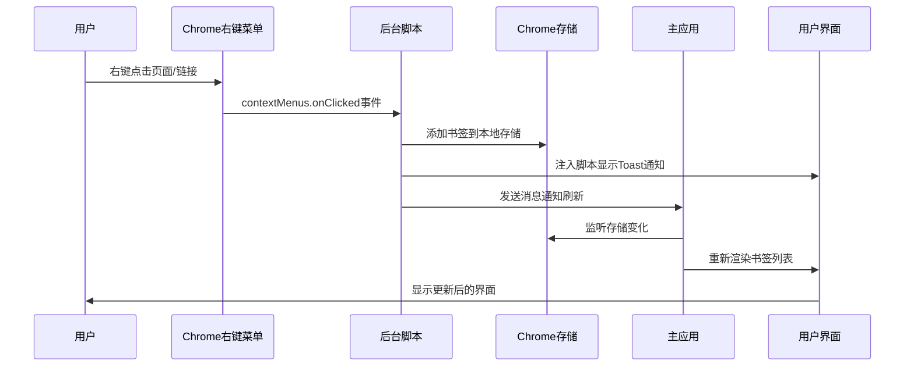
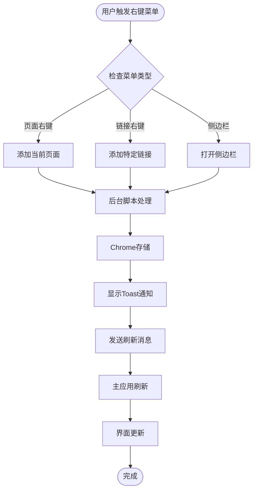
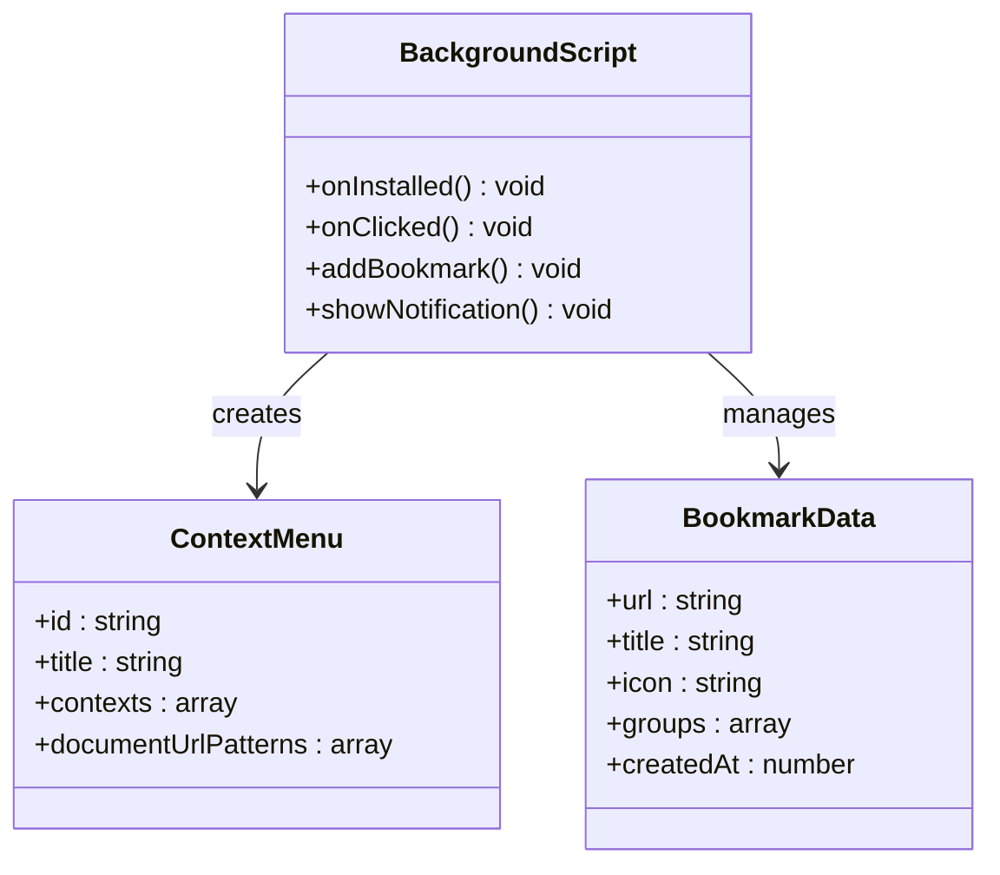
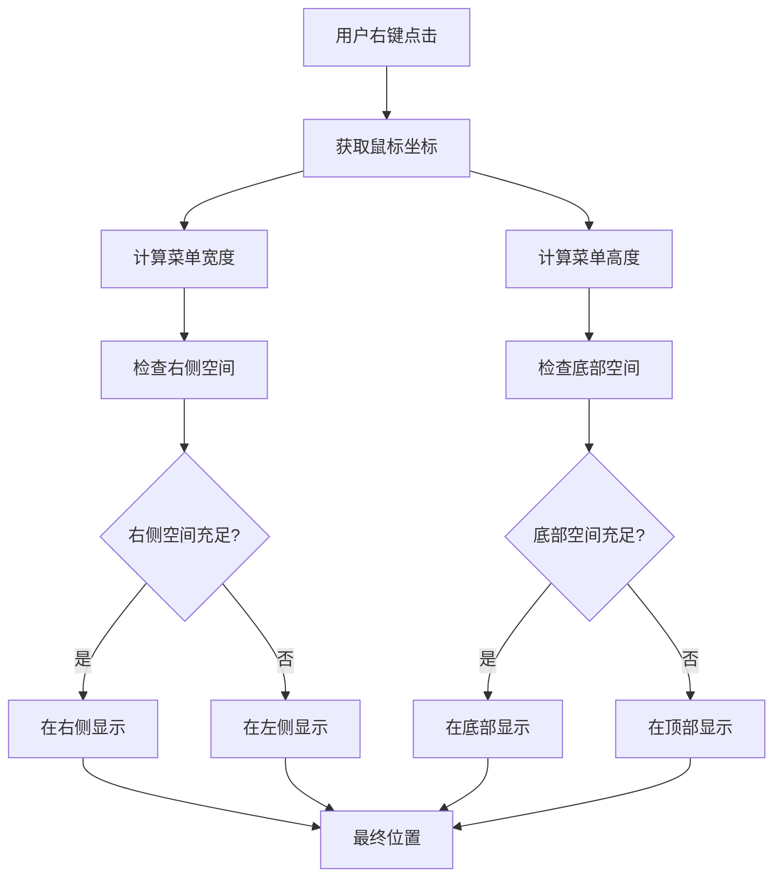
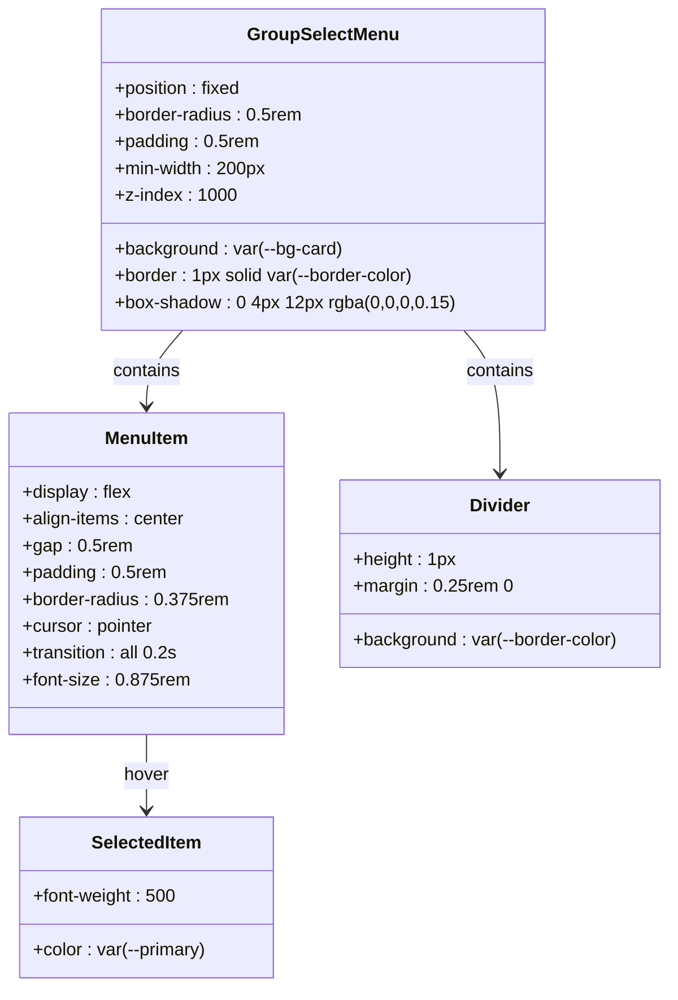
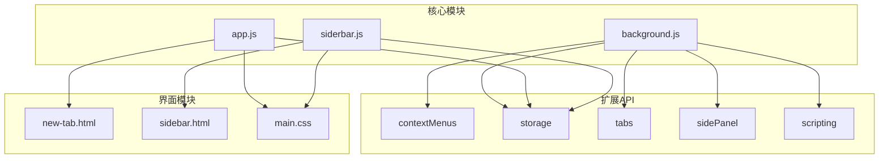
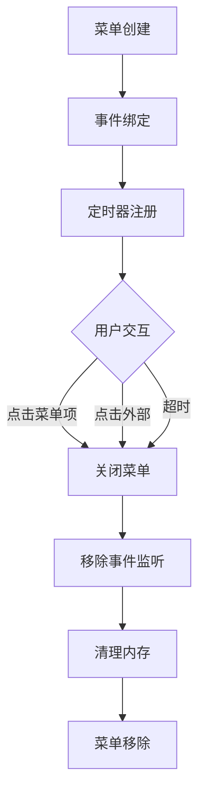

# 上下文菜单与快捷操作

<cite>
**本文档引用的文件**
- [js/app.js](file://js/app.js)
- [js/background.js](file://js/background.js)
- [js/sidebar.js](file://js/sidebar.js)
- [manifest.json](file://manifest.json)
- [new-tab.html](file://new-tab.html)
- [sidebar.html](file://sidebar.html)
- [css/main.css](file://css/main.css)
</cite>

## 目录
1. [简介](#简介)
2. [项目结构](#项目结构)
3. [核心组件](#核心组件)
4. [架构概览](#架构概览)
5. [详细组件分析](#详细组件分析)
6. [依赖关系分析](#依赖关系分析)
7. [性能考虑](#性能考虑)
8. [故障排除指南](#故障排除指南)
9. [结论](#结论)

## 简介

书签白板项目是一个基于 Chrome Extension Manifest V3 的隐私优先本地书签管理工具。本文档专注于项目的上下文菜单与快捷操作模块，深入解析主应用模块的右键菜单实现，包括书签上下文菜单（置顶、编辑、删除、分组选择）和分组上下文菜单（编辑、删除）的功能设计。

该模块实现了完整的右键菜单生态系统，支持页面右键菜单添加当前页面、链接右键菜单添加特定链接，以及侧边栏的完整操作功能。所有数据都存储在 Chrome 本地存储中，确保用户隐私安全。

## 项目结构

书签白板项目采用模块化架构，主要包含以下关键文件：

**图表来源**
- [manifest.json:1-36](file://manifest.json#L1-L36)
- [new-tab.html:1-206](file://new-tab.html#L1-L206)
- [sidebar.html:1-51](file://sidebar.html#L1-L51)

**章节来源**
- [manifest.json:1-36](file://manifest.json#L1-L36)
- [new-tab.html:1-206](file://new-tab.html#L1-L206)
- [sidebar.html:1-51](file://sidebar.html#L1-L51)

## 核心组件

### 右键菜单系统

项目实现了三层右键菜单系统：

1. **页面右键菜单** - 添加当前页面到书签白板
2. **链接右键菜单** - 添加特定链接到书签白板  
3. **侧边栏右键菜单** - 打开书签白板侧边栏

### 上下文菜单模块

系统包含两个主要的上下文菜单模块：

1. **书签上下文菜单** - 针对单个书签卡片的操作
2. **分组上下文菜单** - 针对书签分组的操作

每个菜单都支持动态生成、位置计算、事件绑定和样式控制。

**章节来源**
- [js/background.js:8-37](file://js/background.js#L8-L37)
- [js/app.js:544-616](file://js/app.js#L544-L616)
- [js/app.js:618-758](file://js/app.js#L618-L758)

## 架构概览

书签白板的上下文菜单与快捷操作模块采用分层架构设计：

**图表来源**
- [js/background.js:39-69](file://js/background.js#L39-L69)
- [js/background.js:111-167](file://js/background.js#L111-L167)
- [js/app.js:116-121](file://js/app.js#L116-L121)

### 数据流架构

**图表来源**
- [js/background.js:40-68](file://js/background.js#L40-L68)
- [js/background.js:112-167](file://js/background.js#L112-L167)

## 详细组件分析

### 右键菜单创建与管理

#### 后台脚本中的菜单定义

后台脚本负责创建和管理所有右键菜单项：

**图表来源**
- [js/background.js:6-37](file://js/background.js#L6-L37)
- [js/background.js:72-109](file://js/background.js#L72-L109)

#### 菜单权限配置

扩展清单文件中配置了必要的权限：

**章节来源**
- [manifest.json:9-16](file://manifest.json#L9-L16)
- [js/background.js:8-37](file://js/background.js#L8-L37)

### 书签上下文菜单实现

#### 动态菜单生成

书签上下文菜单支持以下功能：

1. **置顶/取消置顶** - 切换书签的置顶状态
2. **编辑名称** - 修改书签标题
3. **删除书签** - 从列表中移除书签
4. **分组选择** - 为书签分配或移除分组

#### 菜单定位算法

菜单的位置计算采用了智能定位算法：

**图表来源**
- [js/app.js:618-758](file://js/app.js#L618-L758)

#### 事件绑定机制

菜单的事件绑定采用了委托模式：

**章节来源**
- [js/app.js:618-758](file://js/app.js#L618-L758)

### 分组上下文菜单实现

#### 分组菜单功能

分组上下文菜单提供以下操作：

1. **编辑分组名称** - 修改分组显示名称
2. **删除分组** - 删除分组（仅限自定义分组）

#### 自动分组处理

系统支持自动分组功能，自动分组具有特殊标识：

**章节来源**
- [js/app.js:544-616](file://js/app.js#L544-L616)

### 样式控制系统

#### 菜单样式定义

上下文菜单使用统一的样式系统：

**图表来源**
- [css/main.css:974-1027](file://css/main.css#L974-L1027)

#### 主题适配

菜单系统完全适配深色/浅色主题：

**章节来源**
- [css/main.css:974-1027](file://css/main.css#L974-L1027)

### 菜单关闭机制

#### 自动关闭逻辑

菜单提供了多种关闭机制：

1. **点击外部区域** - 点击菜单外的任何地方自动关闭
2. **点击菜单项** - 点击菜单项后自动关闭
3. **超时机制** - 防止内存泄漏的清理机制

#### 内存管理

系统实现了完善的内存管理：

**章节来源**
- [js/app.js:618-758](file://js/app.js#L618-L758)

## 依赖关系分析

### 模块间依赖

**图表来源**
- [manifest.json:9-16](file://manifest.json#L9-L16)
- [js/background.js:39-69](file://js/background.js#L39-L69)

### 权限依赖

扩展需要以下权限才能正常工作：

**章节来源**
- [manifest.json:9-16](file://manifest.json#L9-L16)

## 性能考虑

### 渲染优化

系统采用了多项性能优化措施：

1. **虚拟滚动** - 侧边栏使用分批渲染减少DOM节点
2. **请求动画帧** - 使用 `requestAnimationFrame` 优化渲染性能
3. **防抖处理** - 搜索和过滤操作使用防抖机制
4. **缓存机制** - 域名解析结果缓存避免重复计算

### 内存管理

**图表来源**
- [js/app.js:618-758](file://js/app.js#L618-L758)

## 故障排除指南

### 常见问题诊断

#### 右键菜单不显示

**症状**：右键菜单没有出现在页面上

**可能原因**：
1. 扩展未正确安装
2. 权限未授予
3. 菜单创建失败

**解决方案**：
1. 重新安装扩展
2. 检查扩展权限设置
3. 查看浏览器控制台错误

#### 菜单位置异常

**症状**：菜单显示在屏幕外或重叠

**可能原因**：
1. 屏幕尺寸检测错误
2. CSS样式冲突
3. 窗口大小变化

**解决方案**：
1. 检查浏览器窗口尺寸
2. 确认CSS变量正确加载
3. 刷新页面重新计算位置

#### 菜单无法关闭

**症状**：菜单点击后仍然显示

**可能原因**：
1. 事件监听器未正确移除
2. 内存泄漏
3. 异常终止

**解决方案**：
1. 检查控制台是否有错误
2. 重启浏览器
3. 清除扩展缓存

**章节来源**
- [README.md:248-258](file://README.md#L248-L258)

### 调试技巧

#### 开发者工具使用

1. **扩展页面调试**：在 `chrome://extensions` 中启用"开发者模式"
2. **控制台监控**：观察右键菜单事件和存储变化
3. **网络面板**：检查Google Favicon API的调用情况

#### 日志记录

系统提供了完善的日志记录机制，可以通过浏览器控制台查看详细的操作日志。

## 结论

书签白板项目的上下文菜单与快捷操作模块展现了现代Chrome扩展的最佳实践。通过精心设计的架构和实现，系统提供了流畅、直观的用户体验。

### 主要成就

1. **完整的右键菜单生态** - 支持页面、链接和侧边栏三种场景
2. **智能位置计算** - 自适应屏幕边界，确保菜单始终可见
3. **优雅的样式系统** - 完美适配深色/浅色主题
4. **高性能实现** - 优化的渲染和内存管理
5. **隐私优先** - 所有数据本地存储，保护用户隐私

### 技术亮点

- **模块化设计**：清晰的职责分离和依赖管理
- **事件驱动**：基于Chrome扩展API的事件通信
- **响应式布局**：适配不同设备和屏幕尺寸
- **无障碍支持**：键盘导航和屏幕阅读器友好

该模块为用户提供了高效、便捷的书签管理体验，是Chrome扩展开发的优秀范例。