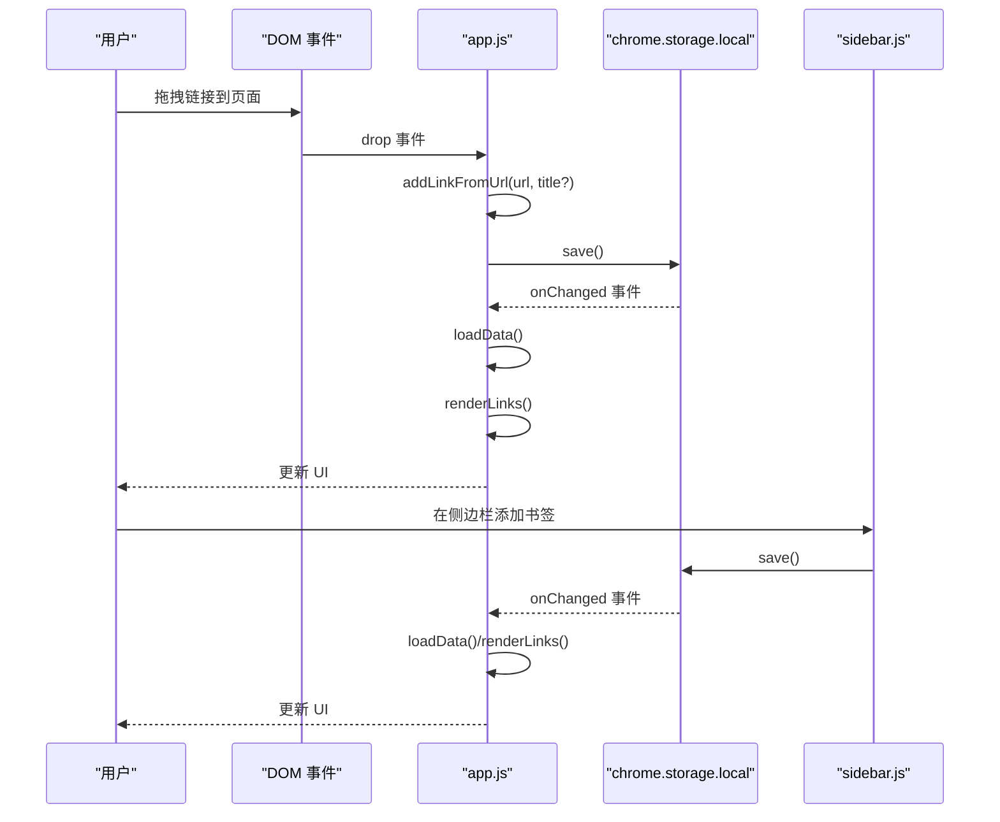
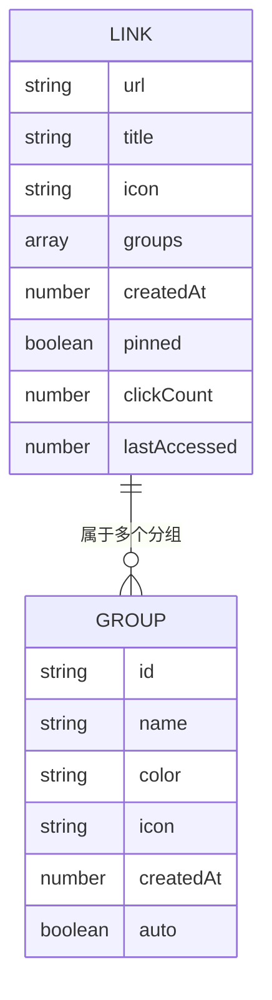
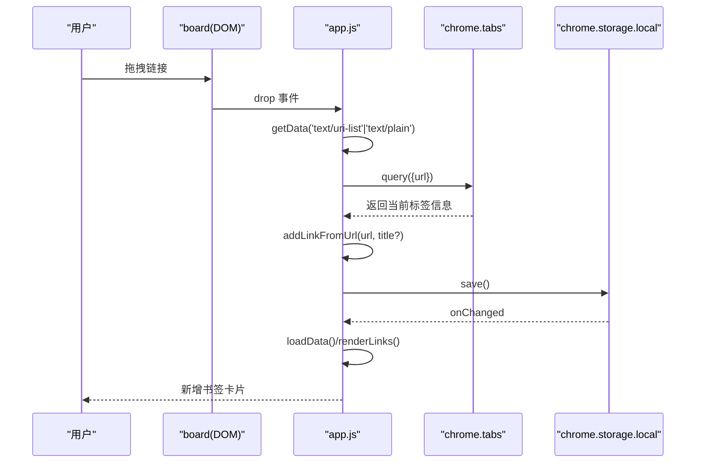
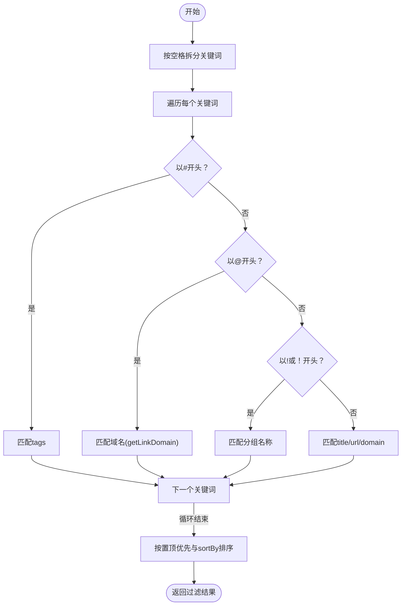
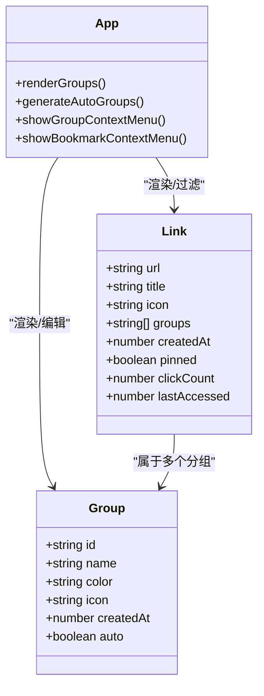
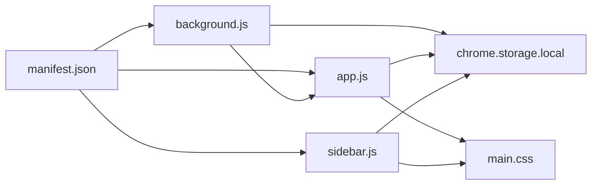

# 主应用模块 (app.js)

<cite>
**本文档引用的文件**
- [app.js](file://js/app.js)
- [manifest.json](file://manifest.json)
- [README.md](file://README.md)
- [new-tab.html](file://new-tab.html)
- [sidebar.html](file://sidebar.html)
- [main.css](file://css/main.css)
- [background.js](file://js/background.js)
- [sidebar.js](file://js/sidebar.js)
</cite>

## 目录
1. [简介](#简介)
2. [项目结构](#项目结构)
3. [核心组件](#核心组件)
4. [架构总览](#架构总览)
5. [详细组件分析](#详细组件分析)
6. [依赖关系分析](#依赖关系分析)
7. [性能考量](#性能考量)
8. [故障排查指南](#故障排查指南)
9. [结论](#结论)
10. [附录](#附录)

## 简介
本文件为书签白板项目的主应用模块（app.js）的详细技术文档，聚焦于主页面（新标签页）的完整实现。内容涵盖数据持久化与状态管理、DOM 元素管理与事件监听、拖拽添加书签、搜索与过滤算法、分组管理与 UI 渲染、主题切换与存储监听、性能优化策略（域名缓存、分批渲染、防抖处理等），并提供 API 调用说明与最佳实践指导。

## 项目结构
主应用模块位于 js/app.js，负责新标签页（new-tab.html）的交互逻辑与渲染；同时与后台脚本（background.js）配合实现右键菜单添加书签；与侧边栏（sidebar.html）共享数据并通过 Chrome Storage 实现实时同步。

```mermaid
graph TB
subgraph "扩展页面"
NT["new-tab.html<br/>主页面"]
SB["sidebar.html<br/>侧边栏"]
end
subgraph "脚本层"
APP["js/app.js<br/>主应用模块"]
BG["js/background.js<br/>后台脚本"]
SBJ["js/sidebar.js<br/>侧边栏逻辑"]
end
subgraph "存储层"
CS["chrome.storage.local<br/>本地存储"]
end
NT --> APP
SB --> SBJ
APP <- --> CS
SBJ --> CS
BG --> APP
BG --> CS
```

图表来源
- [new-tab.html:1-206](file://new-tab.html#L1-L206)
- [sidebar.html:1-51](file://sidebar.html#L1-L51)
- [app.js:1-1514](file://js/app.js#L1-L1514)
- [background.js:1-174](file://js/background.js#L1-L174)
- [sidebar.js:1-200](file://js/sidebar.js#L1-L200)

章节来源
- [manifest.json:1-38](file://manifest.json#L1-L38)
- [README.md:132-154](file://README.md#L132-L154)

## 核心组件
- 状态管理：links、groups、filterText、activeGroupFilter、sortBy、currentView、domainCache、autoGroupNames
- DOM 元素：board、emptyState、searchInput、mobileSearchInput、mobileSearchBtn、mobileSearch、themeToggle、hideTipBtn、tipBar、footer、addManualBtn、modal 等
- 事件监听：拖拽、输入、主题切换、存储变化、右键菜单、Tab 切换、分组筛选、导入导出等
- 数据操作：save、editGroup、deleteGroup、showGroupContextMenu、showBookmarkContextMenu、addLinkFromUrl、editCard、deleteCard
- UI 渲染：getFilteredLinks、renderGroups、generateAutoGroups、addCardToBoard、renderSections、renderLinks、addAddCard
- 工具函数：formatTimeAgo、showToast、decryptImportData、showModal、closeModal、updateThemeIcon

章节来源
- [app.js:25-34](file://js/app.js#L25-L34)
- [app.js:6-24](file://js/app.js#L6-L24)
- [app.js:75-106](file://js/app.js#L75-L106)
- [app.js:108-373](file://js/app.js#L108-L373)
- [app.js:468-542](file://js/app.js#L468-L542)
- [app.js:804-884](file://js/app.js#L804-L884)
- [app.js:886-986](file://js/app.js#L886-L986)
- [app.js:988-1184](file://js/app.js#L988-L1184)
- [app.js:1376-1514](file://js/app.js#L1376-L1514)

## 架构总览
主应用模块采用“状态驱动 + 事件驱动”的架构：
- 状态驱动：集中维护 links、groups、filterText、sortBy、currentView 等状态，通过 renderLinks/renderSections 统一触发 UI 更新
- 事件驱动：注册各类 DOM 事件与 Chrome Storage/Theme 变更事件，回调中更新状态并触发渲染
- 数据持久化：通过 chrome.storage.local 的 set/get 实现本地存储，支持导入/导出与自动分组自定义名称
- 实时同步：chrome.storage.onChanged 监听本地存储变化，自动刷新页面；后台脚本通过 runtime.onMessage 通知页面刷新



图表来源
- [app.js:140-160](file://js/app.js#L140-L160)
- [app.js:116-121](file://js/app.js#L116-L121)
- [app.js:75-106](file://js/app.js#L75-L106)
- [sidebar.js:143-149](file://js/sidebar.js#L143-L149)

## 详细组件分析

### 状态管理与生命周期
- links：书签数组，包含 url、title、icon、groups、createdAt、pinned、clickCount、lastAccessed 等字段
- groups：自定义分组数组，包含 id、name、color、icon、createdAt 等字段
- filterText：搜索关键词（支持多词空格分隔）
- activeGroupFilter：当前选中的分组标识（含自动分组 auto_domain）
- sortBy：排序规则，如 createdAt-desc、title-asc、clickCount-desc 等
- currentView：当前视图 all/pinned/recent
- domainCache：域名解析缓存（Map），避免重复解析 URL
- autoGroupNames：自动分组自定义显示名称映射

状态更新路径：
- 用户交互（输入、点击、右键菜单）→ 更新状态 → save() → chrome.storage.local.set → onChanged 事件 → loadData() → renderLinks()

章节来源
- [app.js:25-34](file://js/app.js#L25-L34)
- [app.js:88-101](file://js/app.js#L88-L101)
- [app.js:116-121](file://js/app.js#L116-L121)
- [app.js:469-473](file://js/app.js#L469-L473)

### 数据模型设计
- 书签对象（link）：url、title、icon、groups（数组）、createdAt、pinned、clickCount、lastAccessed
- 分组对象（group）：id、name、color、icon、createdAt、auto（标记自动分组）



图表来源
- [app.js:88-95](file://js/app.js#L88-L95)
- [app.js:357-363](file://js/app.js#L357-L363)
- [app.js:954-986](file://js/app.js#L954-L986)

章节来源
- [app.js:88-101](file://js/app.js#L88-L101)
- [app.js:357-363](file://js/app.js#L357-L363)
- [app.js:954-986](file://js/app.js#L954-L986)

### DOM 元素管理与事件监听
- DOM 元素初始化：board、emptyState、searchInput、mobileSearchInput、mobileSearchBtn、mobileSearch、themeToggle、hideTipBtn、tipBar、footer、addManualBtn、modal 等
- 事件监听器：
  - 拖拽：dragover/dragleave/drop，支持从浏览器拖拽链接到页面
  - 输入：searchInput/mobileSearchInput 的 input 事件，实时过滤
  - 主题：themeToggle 点击切换深色/浅色模式
  - 存储：chrome.storage.onChanged 监听 links 变化，自动刷新
  - 系统主题：matchMedia 监听系统深色模式变化
  - 右键菜单：runtime.onMessage 监听后台脚本通知
  - 分组筛选：groups 容器的点击事件委托
  - Tab 切换：view-tabs 的点击事件
  - 导入：文件选择事件，异步读取与解密导入数据

章节来源
- [app.js:6-24](file://js/app.js#L6-L24)
- [app.js:108-373](file://js/app.js#L108-L373)

### 拖拽添加书签（完整实现）
- dragover：高亮画布
- drop：获取 dataTransfer 中的 URL，清理并校验
- 查询当前标签页标题（chrome.tabs.query），用于优先使用拖拽带来的标题
- addLinkFromUrl：去重检查、提取标题与图标、构造新书签、插入到数组首部、保存并渲染



图表来源
- [app.js:140-160](file://js/app.js#L140-L160)
- [app.js:152-158](file://js/app.js#L152-L158)
- [app.js:760-801](file://js/app.js#L760-L801)
- [app.js:469-473](file://js/app.js#L469-L473)

章节来源
- [app.js:140-160](file://js/app.js#L140-L160)
- [app.js:760-801](file://js/app.js#L760-L801)

### 搜索与过滤系统（算法设计）
- 多词空格分隔：按空格拆分，过滤空词
- 智能搜索语法：
  - #标签：匹配 link.tags（需兼容旧数据）
  - @域名：匹配 getLinkDomain(link)
  - !分组：匹配分组名称（兼容全角字符）
  - 默认：匹配 title、url、domain
- 域名缓存：getLinkDomain 使用 domainCache 避免重复解析
- 排序：优先置顶项，再按 sortBy 规则排序（createdAt/title/clickCount）



图表来源
- [app.js:804-884](file://js/app.js#L804-L884)
- [app.js:35-49](file://js/app.js#L35-L49)

章节来源
- [app.js:804-884](file://js/app.js#L804-L884)
- [app.js:35-49](file://js/app.js#L35-L49)

### 分组管理与 UI 渲染
- 自动生成分组：基于域名聚合，仅显示出现≥2次的域名，支持自定义显示名称
- 合并渲染：将自动生成的分组与自定义分组合并，统一显示分组标签与计数
- 右键菜单：分组标签支持上下文菜单（编辑/删除，仅自定义分组可删除）
- 书签卡片：支持置顶标记、分组角标、点击统计与最后访问时间、右键菜单（置顶/编辑/删除/分组选择）



图表来源
- [app.js:886-986](file://js/app.js#L886-L986)
- [app.js:475-542](file://js/app.js#L475-L542)
- [app.js:544-758](file://js/app.js#L544-L758)

章节来源
- [app.js:886-986](file://js/app.js#L886-L986)
- [app.js:475-542](file://js/app.js#L475-L542)
- [app.js:544-758](file://js/app.js#L544-L758)

### 事件处理机制
- 拖拽事件：dragover/dragleave/drop，高亮画布并处理 URL
- 键盘事件：Esc 关闭模态框
- 存储变化监听：chrome.storage.onChanged 监听 links，自动刷新
- 系统主题监听：matchMedia 监听系统深色模式变化，尊重用户设置
- 右键菜单：runtime.onMessage 监听后台脚本通知，刷新页面
- Tab 切换：view-tabs 切换 all/pinned/recent 视图
- 分组筛选：groups 容器事件委托，切换 activeGroupFilter 并重新渲染

章节来源
- [app.js:108-373](file://js/app.js#L108-L373)
- [app.js:310-318](file://js/app.js#L310-L318)

### 性能优化技巧
- 域名缓存：domainCache 避免重复解析 URL，提升搜索与分组渲染性能
- 分批渲染：在侧边栏渲染中使用 requestAnimationFrame 分批渲染，避免卡顿
- 防抖处理：搜索输入使用 input 事件，结合节流/防抖可进一步优化（当前实现为即时过滤）
- 本地存储：批量 set，减少多次写入；删除后清空 domainCache
- 空状态管理：根据视图动态显示/隐藏空状态，避免不必要的 DOM 操作

章节来源
- [app.js:35-49](file://js/app.js#L35-L49)
- [app.js:116-121](file://js/app.js#L116-L121)
- [app.js:469-473](file://js/app.js#L469-L473)
- [sidebar.js:177-199](file://js/sidebar.js#L177-L199)

## 依赖关系分析
- 与 Manifest 的依赖：chrome_url_overrides、permissions、host_permissions、background、side_panel
- 与后台脚本的协作：右键菜单添加书签后，通过 runtime.onMessage 通知页面刷新
- 与侧边栏的协作：通过 chrome.storage.onChanged 实时同步，确保多页面一致
- 与 CSS 的耦合：依赖 main.css 的主题变量与布局样式



图表来源
- [manifest.json:1-38](file://manifest.json#L1-L38)
- [background.js:1-174](file://js/background.js#L1-L174)
- [app.js:1-1514](file://js/app.js#L1-L1514)
- [sidebar.js:1-200](file://js/sidebar.js#L1-L200)
- [main.css:1-200](file://css/main.css#L1-L200)

章节来源
- [manifest.json:1-38](file://manifest.json#L1-L38)
- [background.js:1-174](file://js/background.js#L1-L174)
- [app.js:1-1514](file://js/app.js#L1-L1514)
- [sidebar.js:1-200](file://js/sidebar.js#L1-L200)

## 性能考量
- 域名解析缓存：getLinkDomain 使用 Map 缓存，避免重复 new URL()
- 搜索过滤：多关键词 AND 条件，先按分组筛选再按关键词过滤，减少比较次数
- 排序：先置顶优先，再按字段排序，避免复杂比较
- 渲染优化：按视图过滤后再渲染，空状态按需显示，避免冗余 DOM
- 存储优化：批量 set，删除后清空缓存，保证一致性

章节来源
- [app.js:35-49](file://js/app.js#L35-L49)
- [app.js:804-884](file://js/app.js#L804-L884)
- [app.js:1186-1189](file://js/app.js#L1186-L1189)

## 故障排查指南
- 右键菜单未显示：需完全重新安装扩展（移除后重新加载）
- 书签丢失：数据存储在浏览器本地，清除浏览器数据会导致丢失
- 侧边栏不自动刷新：确保使用最新版本（v3.2.3+）
- 导入失败：检查文件格式与解密密钥，错误信息会通过 Toast 提示

章节来源
- [README.md:248-258](file://README.md#L248-L258)

## 结论
主应用模块（app.js）通过清晰的状态管理、完善的事件处理与高效的 UI 渲染，实现了拖拽添加、智能搜索、分组管理与主题切换等核心功能。借助 Chrome Storage 的实时同步与后台脚本的右键菜单支持，形成完整的书签管理闭环。性能方面通过域名缓存、分批渲染与本地存储优化，确保在大数据量下仍保持流畅体验。

## 附录
- 数据导入/导出：支持 JSON 文件导入，包含 links、groups、autoGroupNames 与 settings（darkMode、sortBy）
- 右键菜单：支持“添加到书签白板”和“添加链接到书签白板”，并可打开侧边栏
- 侧边栏：独立主题切换、搜索、手动添加、拖拽添加，与主页面实时同步

章节来源
- [app.js:230-297](file://js/app.js#L230-L297)
- [background.js:39-69](file://js/background.js#L39-L69)
- [sidebar.js:87-133](file://js/sidebar.js#L87-L133)