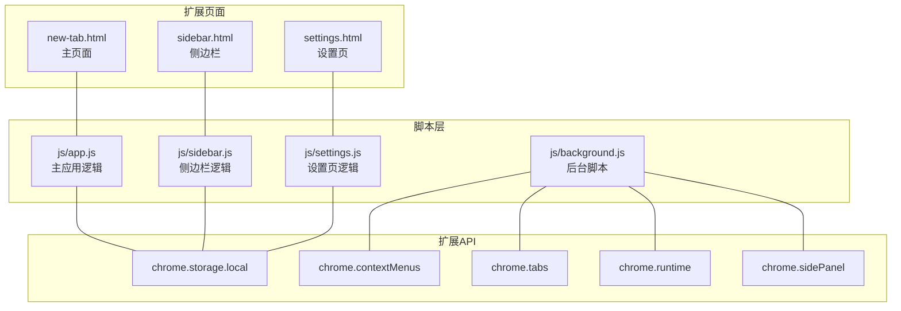
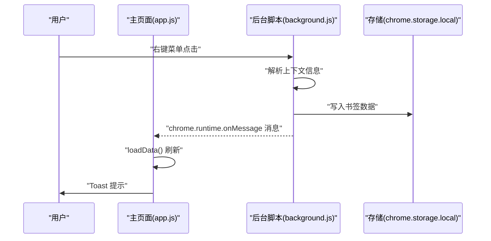
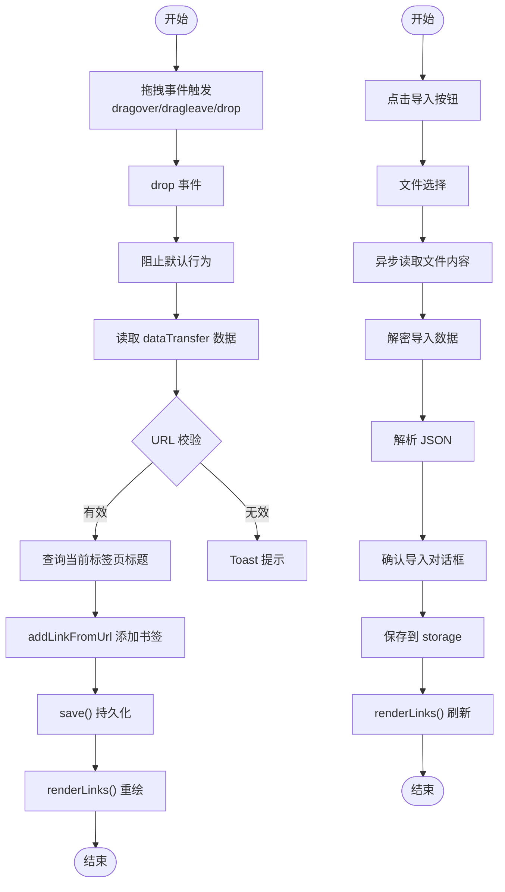
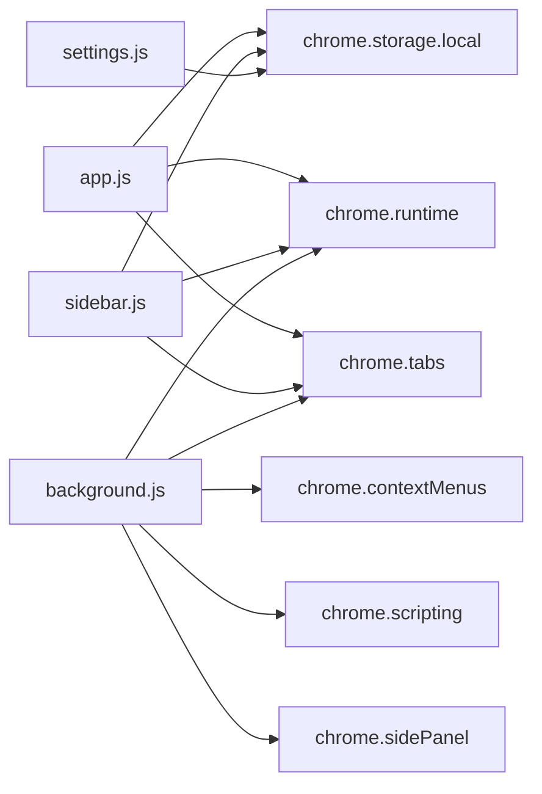

# 事件处理与交互逻辑

<cite>
**本文引用的文件**
- [js/app.js](file://js/app.js)
- [js/sidebar.js](file://js/sidebar.js)
- [js/settings.js](file://js/settings.js)
- [js/background.js](file://js/background.js)
- [manifest.json](file://manifest.json)
- [README.md](file://README.md)
</cite>

## 目录
1. [简介](#简介)
2. [项目结构](#项目结构)
3. [核心组件](#核心组件)
4. [架构总览](#架构总览)
5. [详细组件分析](#详细组件分析)
6. [依赖关系分析](#依赖关系分析)
7. [性能考量](#性能考量)
8. [故障排查指南](#故障排查指南)
9. [结论](#结论)
10. [附录](#附录)

## 简介
本章节聚焦于书签白板项目的事件处理与交互逻辑模块，系统梳理主应用模块（app.js）中的事件监听器设置与处理机制，涵盖拖拽事件（dragover、drop）、键盘事件监听、鼠标点击事件、触摸事件支持、右键菜单操作、模态框交互、分组筛选、书签置顶等关键交互路径，并结合侧边栏（sidebar.js）与设置页（settings.js）中的事件模式进行对比分析，最后给出跨浏览器兼容性与异步事件处理的最佳实践建议。

## 项目结构
项目采用 Manifest V3 的 Chrome 扩展架构，主要页面与脚本如下：
- 主页面：new-tab.html + js/app.js
- 侧边栏：sidebar.html + js/sidebar.js
- 设置页：settings.html + js/settings.js
- 后台脚本：js/background.js（右键菜单、消息通信）
- 权限与清单：manifest.json

图表来源
- [manifest.json:18-31](file://manifest.json#L18-L31)
- [js/app.js:108-373](file://js/app.js#L108-L373)
- [js/sidebar.js:87-133](file://js/sidebar.js#L87-L133)
- [js/settings.js:26-65](file://js/settings.js#L26-L65)
- [js/background.js:6-37](file://js/background.js#L6-L37)

章节来源
- [manifest.json:1-36](file://manifest.json#L1-L36)
- [README.md:132-154](file://README.md#L132-L154)

## 核心组件
- 主应用事件中枢：负责拖拽、搜索、排序、主题切换、模态框、分组筛选、视图切换、右键菜单、键盘事件等。
- 侧边栏事件中枢：负责拖拽、搜索、主题切换、手动添加对话框、点击打开链接、编辑/删除等。
- 设置页事件中枢：负责导航切换、搜索、排序、批量模式、分组管理、数据导入导出等。
- 后台脚本事件中枢：负责右键菜单注册与点击处理、向页面注入通知、打开侧边栏等。

章节来源
- [js/app.js:108-373](file://js/app.js#L108-L373)
- [js/sidebar.js:87-133](file://js/sidebar.js#L87-L133)
- [js/settings.js:112-191](file://js/settings.js#L112-L191)
- [js/background.js:39-69](file://js/background.js#L39-L69)

## 架构总览
事件流与交互关系如下：
- 用户在主页面触发拖拽、点击、右键、键盘等事件，由 app.js 统一处理。
- 右键菜单由 background.js 注册并在点击时调用 addBookmark，随后通过 runtime 发送消息到页面，触发页面刷新。
- 侧边栏通过 storage 监听与 runtime 监听实现数据变更的自动刷新。
- 设置页通过 storage 监听与导航切换实现动态渲染。

图表来源
- [js/background.js:39-69](file://js/background.js#L39-L69)
- [js/background.js:111-167](file://js/background.js#L111-L167)
- [js/app.js:310-317](file://js/app.js#L310-L317)

## 详细组件分析

### 主应用事件处理（app.js）
- 拖拽事件
  - dragover：阻止默认行为并高亮目标容器。
  - dragleave：移除高亮。
  - drop：读取 dataTransfer 数据，校验 URL，查询当前标签页标题，调用 addLinkFromUrl 并保存。
- 键盘事件
  - document keydown：监听 Escape 关闭模态框。
- 搜索与排序
  - 输入事件：实时更新 filterText 并重绘。
  - 下拉选择 change：更新 sortBy 并重绘。
- 主题切换
  - 点击主题切换按钮：切换 html 根节点 dark 类，持久化到 storage。
- 提示栏隐藏
  - 点击隐藏按钮：隐藏提示栏并持久化。
- 手动添加
  - 点击按钮：弹出模态框，输入 URL 后校验并添加。
- 空状态导入
  - 点击导入按钮：触发文件选择，异步读取文件、解密、解析、确认导入、保存并刷新。
- 模态框
  - 取消/确认按钮事件；输入框回车确认；Esc 关闭。
- 分组筛选
  - 事件委托到 .groups-container，点击 .group-tab 切换 activeGroupFilter 并重绘。
- 视图切换
  - 点击 .view-tab：切换 currentView，重绘分区。
- 右键菜单
  - 分组标签右键：显示分组上下文菜单（编辑/删除）。
  - 书签卡片右键：显示书签上下文菜单（置顶/取消置顶、编辑、删除、分组选择）。
- 存储监听
  - 监听 storage 变化：当 links 变更时自动刷新。
- 系统主题监听
  - 监听 prefers-color-scheme：当用户未手动设置时跟随系统。

章节来源
- [js/app.js:108-160](file://js/app.js#L108-L160)
- [js/app.js:306-308](file://js/app.js#L306-L308)
- [js/app.js:162-180](file://js/app.js#L162-L180)
- [js/app.js:190-202](file://js/app.js#L190-L202)
- [js/app.js:204-219](file://js/app.js#L204-L219)
- [js/app.js:221-297](file://js/app.js#L221-L297)
- [js/app.js:299-308](file://js/app.js#L299-L308)
- [js/app.js:319-330](file://js/app.js#L319-L330)
- [js/app.js:332-345](file://js/app.js#L332-L345)
- [js/app.js:347-372](file://js/app.js#L347-L372)
- [js/app.js:544-616](file://js/app.js#L544-L616)
- [js/app.js:618-758](file://js/app.js#L618-L758)
- [js/app.js:116-121](file://js/app.js#L116-L121)
- [js/app.js:123-133](file://js/app.js#L123-L133)

#### 事件委托与异步处理流程（拖拽与导入）

图表来源
- [js/app.js:108-160](file://js/app.js#L108-L160)
- [js/app.js:230-297](file://js/app.js#L230-L297)
- [js/app.js:760-801](file://js/app.js#L760-L801)

### 侧边栏事件处理（sidebar.js）
- 拖拽事件
  - dragover/dragleave：高亮与移除高亮。
  - drop：读取 URL，校验格式，查询标签页标题与 favicon，去重后添加。
- 搜索
  - input 事件：更新 filterText 并重绘。
- 主题切换
  - 点击切换按钮：切换 dark 类并持久化。
- 手动添加
  - 显示自定义对话框，输入 URL/标题，回车提交，异步获取网站信息后添加。
- 点击卡片
  - 若非按钮点击，则打开链接。
- 存储监听与主题监听
  - 监听 storage 变化自动刷新；监听系统主题变化。

章节来源
- [js/sidebar.js:131-133](file://js/sidebar.js#L131-L133)
- [js/sidebar.js:508-603](file://js/sidebar.js#L508-L603)
- [js/sidebar.js:116-123](file://js/sidebar.js#L116-L123)
- [js/sidebar.js:96-100](file://js/sidebar.js#L96-L100)
- [js/sidebar.js:367-488](file://js/sidebar.js#L367-L488)
- [js/sidebar.js:284-289](file://js/sidebar.js#L284-L289)
- [js/sidebar.js:142-149](file://js/sidebar.js#L142-L149)
- [js/sidebar.js:43-68](file://js/sidebar.js#L43-L68)

### 设置页事件处理（settings.js）
- 导航切换
  - 点击 .nav-item：切换 active 类与目标 section，并刷新对应数据。
- 搜索与排序
  - input 事件：更新 filterText 并重绘。
  - 监听 storage 变化：当 links 变更时自动刷新。
- 批量模式
  - 切换批量模式：显示/隐藏复选框与批量操作区。
  - 全选/取消全选：批量更新 selectedLinks 并同步 UI。
  - 批量删除：弹窗确认后删除并保存。
  - 批量分组：弹窗选择分组后批量添加。
- 分组管理
  - 新建分组：弹窗输入名称，保存到 storage 并刷新。
  - 编辑/删除分组：区分自定义与自动分组，自动分组仅支持编辑显示名称。
- 数据管理
  - 导入/导出：与主应用一致的导入流程与导出策略。

章节来源
- [js/settings.js:112-139](file://js/settings.js#L112-L139)
- [js/settings.js:175-191](file://js/settings.js#L175-L191)
- [js/settings.js:416-531](file://js/settings.js#L416-L531)
- [js/settings.js:533-561](file://js/settings.js#L533-L561)
- [js/settings.js:563-590](file://js/settings.js#L563-L590)
- [js/settings.js:660-705](file://js/settings.js#L660-L705)

### 右键菜单与消息通信（background.js）
- 右键菜单注册
  - 页面右键菜单：添加当前页面。
  - 链接右键菜单：添加链接。
  - 打开侧边栏菜单：打开侧边栏。
- 右键菜单点击处理
  - 根据菜单项调用 addBookmark，必要时获取 favicon。
- 页面通知
  - 通过 scripting.executeScript 在当前页面注入 Toast 通知。
- 扩展图标点击
  - 打开侧边栏。

章节来源
- [js/background.js:6-37](file://js/background.js#L6-L37)
- [js/background.js:39-69](file://js/background.js#L39-L69)
- [js/background.js:111-167](file://js/background.js#L111-L167)
- [js/background.js:169-174](file://js/background.js#L169-L174)

## 依赖关系分析
- app.js 依赖
  - DOM 元素：board、emptyState、searchInput、mobileSearchInput、themeToggle、modal 等。
  - Chrome API：chrome.storage.local、chrome.runtime、chrome.tabs。
  - 内部函数：loadData、renderLinks、showModal、showToast、save 等。
- sidebar.js 依赖
  - DOM 元素：linkList、sidebarBoard、sidebarSearch、sidebarThemeToggle 等。
  - Chrome API：chrome.storage.local、chrome.tabs、chrome.runtime。
  - 内部函数：loadData、renderLinks、setupDragAndDrop、showSidebarToast 等。
- settings.js 依赖
  - DOM 元素：settingsBookmarkBoard、settingsSearchInput、groupsList 等。
  - Chrome API：chrome.storage.local。
  - 内部函数：loadData、renderLinks、setupBatchMode、setupGroupManagement 等。
- background.js 依赖
  - Chrome API：chrome.contextMenus、chrome.tabs、chrome.runtime、chrome.scripting、chrome.sidePanel。

图表来源
- [js/app.js:108-160](file://js/app.js#L108-L160)
- [js/sidebar.js:87-133](file://js/sidebar.js#L87-L133)
- [js/settings.js:112-191](file://js/settings.js#L112-L191)
- [js/background.js:39-69](file://js/background.js#L39-L69)

## 性能考量
- 事件委托
  - app.js 对分组标签使用事件委托，减少重复绑定，降低内存占用。
- 异步处理
  - 导入文件读取与解密采用 async/await，避免阻塞主线程。
- 渲染优化
  - 侧边栏使用 requestAnimationFrame 分批渲染，限制显示数量，提升滚动性能。
- 存储监听
  - 通过 chrome.storage.onChanged 监听变化，避免轮询造成的性能损耗。
- DOM 操作最小化
  - 通过克隆节点移除旧事件监听，避免重复绑定导致的性能问题（如空状态按钮）。

章节来源
- [js/app.js:319-330](file://js/app.js#L319-L330)
- [js/app.js:230-297](file://js/app.js#L230-L297)
- [js/sidebar.js:177-202](file://js/sidebar.js#L177-L202)
- [js/sidebar.js:142-149](file://js/sidebar.js#L142-L149)
- [js/app.js:375-466](file://js/app.js#L375-L466)

## 故障排查指南
- 右键菜单未显示
  - 需要完全卸载后重新加载扩展以重建右键菜单。
- 书签未同步
  - 确认 storage 监听是否生效；检查 chrome.storage.local 是否正常读写。
- 拖拽无效
  - 确认 dataTransfer 数据是否包含 text/uri-list 或 text/plain；URL 格式是否正确。
- 主题切换异常
  - 检查 prefers-color-scheme 监听与本地存储 darkMode 的冲突。
- 侧边栏不刷新
  - 确认 runtime 监听与 storage 监听是否同时启用；检查消息发送与接收。

章节来源
- [README.md:250-258](file://README.md#L250-L258)
- [js/app.js:116-121](file://js/app.js#L116-L121)
- [js/sidebar.js:135-140](file://js/sidebar.js#L135-L140)
- [js/background.js:39-69](file://js/background.js#L39-L69)

## 结论
本项目在事件处理与交互逻辑方面采用了清晰的职责分离与良好的工程实践：
- 主应用通过事件委托与异步处理实现了高性能的交互体验；
- 侧边栏与设置页分别针对各自场景优化了渲染与交互；
- 后台脚本承担了右键菜单与消息通信的关键角色，保证了跨页面的一致性；
- 通过存储监听与主题监听，实现了数据与外观的自动同步。

建议在后续迭代中进一步增强键盘快捷键支持与跨浏览器兼容性测试，以提升可用性与稳定性。

## 附录
- 事件委托模式
  - app.js 中对分组标签使用事件委托，减少重复绑定。
- 异步事件处理
  - 导入文件读取、解密与解析均采用异步流程，避免阻塞。
- 事件冒泡控制
  - 在卡片编辑/删除按钮与侧边栏按钮中使用 stopPropagation，防止误触打开链接。
- 跨浏览器兼容性
  - 使用 Chrome Extension API（Manifest V3），确保在 Chrome 生态中稳定运行；如需兼容其他浏览器，需评估 API 差异与 polyfill。

章节来源
- [js/app.js:319-330](file://js/app.js#L319-L330)
- [js/app.js:230-297](file://js/app.js#L230-L297)
- [js/sidebar.js:262-274](file://js/sidebar.js#L262-L274)
- [js/sidebar.js:284-289](file://js/sidebar.js#L284-L289)
- [manifest.json:1-36](file://manifest.json#L1-L36)