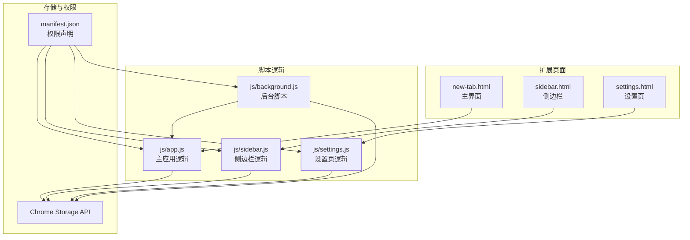
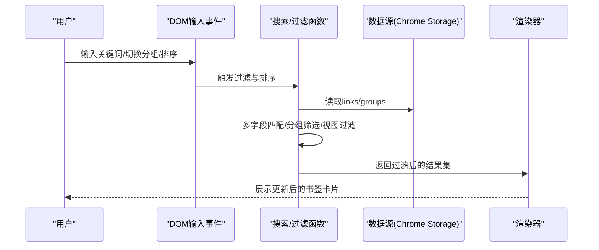
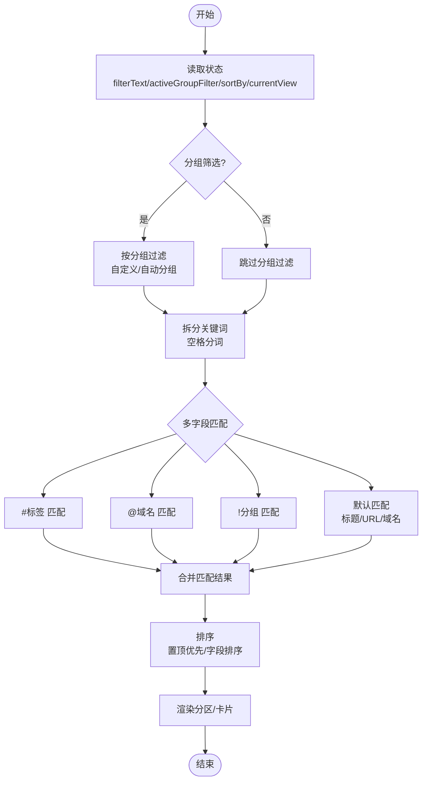
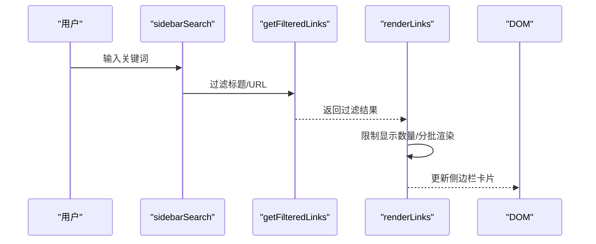
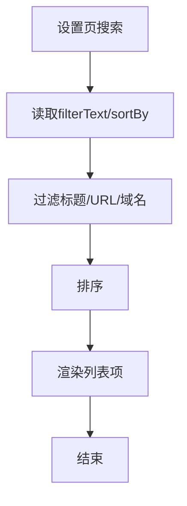
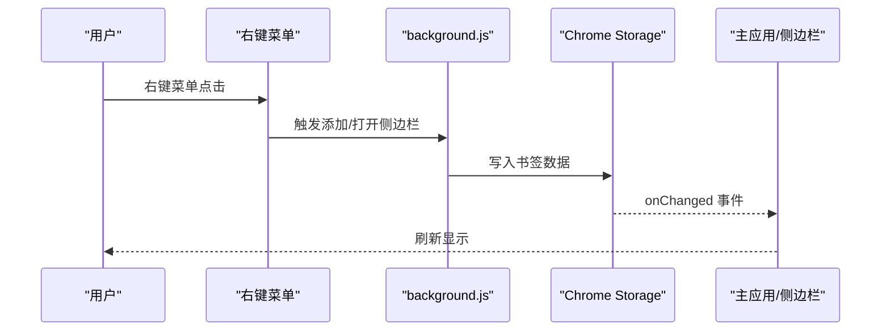
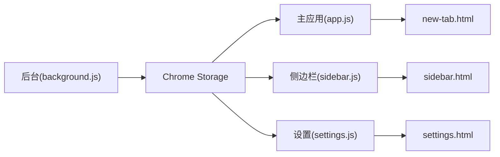

# 搜索与过滤系统

<cite>
**本文引用的文件**
- [app.js](file://js/app.js)
- [sidebar.js](file://js/sidebar.js)
- [settings.js](file://js/settings.js)
- [background.js](file://js/background.js)
- [new-tab.html](file://new-tab.html)
- [sidebar.html](file://sidebar.html)
- [manifest.json](file://manifest.json)
- [README.md](file://README.md)
</cite>

## 目录
1. [简介](#简介)
2. [项目结构](#项目结构)
3. [核心组件](#核心组件)
4. [架构总览](#架构总览)
5. [详细组件分析](#详细组件分析)
6. [依赖关系分析](#依赖关系分析)
7. [性能考量](#性能考量)
8. [故障排查指南](#故障排查指南)
9. [结论](#结论)
10. [附录](#附录)

## 简介
本文件针对书签白板项目的搜索与过滤系统进行深入技术解析，涵盖主应用模块的搜索算法实现、关键词匹配策略、实时过滤逻辑、多字段搜索（标题、URL、分组、标签、域名）、搜索结果高亮显示、过滤条件组合、排序规则（按创建时间、标题字母顺序、使用频率等）、搜索性能优化（防抖处理、索引建立）、用户体验优化，以及搜索历史管理的实现思路与最佳实践。文档同时提供代码路径定位与可视化图示，帮助读者快速理解与落地优化方案。

## 项目结构
书签白板采用 Manifest V3 扩展架构，主要页面与脚本如下：
- 主页面：new-tab.html + js/app.js
- 侧边栏：sidebar.html + js/sidebar.js
- 设置页：settings.html + js/settings.js
- 后台脚本：js/background.js
- 权限与清单：manifest.json
- 说明文档：README.md

图表来源
- [new-tab.html:1-206](file://new-tab.html#L1-L206)
- [sidebar.html:1-51](file://sidebar.html#L1-L51)
- [manifest.json:1-36](file://manifest.json#L1-L36)

章节来源
- [new-tab.html:1-206](file://new-tab.html#L1-L206)
- [sidebar.html:1-51](file://sidebar.html#L1-L51)
- [manifest.json:1-36](file://manifest.json#L1-L36)

## 核心组件
- 主应用搜索与过滤：js/app.js
- 侧边栏搜索与过滤：js/sidebar.js
- 设置页搜索与过滤：js/settings.js
- 右键菜单与通知：js/background.js
- 页面入口与DOM结构：new-tab.html、sidebar.html

章节来源
- [app.js:1-1519](file://js/app.js#L1-L1519)
- [sidebar.js:1-604](file://js/sidebar.js#L1-L604)
- [settings.js:1-1216](file://js/settings.js#L1-L1216)
- [background.js:1-174](file://js/background.js#L1-L174)
- [new-tab.html:1-206](file://new-tab.html#L1-L206)
- [sidebar.html:1-51](file://sidebar.html#L1-L51)

## 架构总览
搜索与过滤系统围绕“输入事件 -> 实时过滤 -> 排序 -> 渲染”的主流程展开，同时支持分组筛选、视图切换（全部/置顶/最近）与多字段匹配。主应用负责完整的搜索与过滤逻辑，侧边栏与设置页分别提供轻量搜索与更丰富的搜索能力。

图表来源
- [app.js:162-180](file://js/app.js#L162-L180)
- [app.js:809-889](file://js/app.js#L809-L889)
- [sidebar.js:116-123](file://js/sidebar.js#L116-L123)
- [settings.js:175-191](file://js/settings.js#L175-L191)

## 详细组件分析

### 主应用搜索与过滤（js/app.js）
- 实时搜索：监听桌面端与移动端搜索输入，触发过滤与渲染。
- 多字段搜索：
  - 标题：link.title
  - URL：link.url
  - 域名：通过 getLinkDomain(link) 提取并缓存
  - 标签：支持 #标签 语法（需 link.tags 字段）
  - 分组：支持 !分组 语法（兼容中文全角字符）
  - 域名搜索：支持 @域名 语法
- 过滤条件组合：分组筛选（activeGroupFilter）与关键词搜索（filterText）叠加；关键词按空格拆分，逐词匹配（AND 语义）。
- 排序规则：支持 createdAt（升/降）、title（升/降）、clickCount（降），置顶书签始终排在最前。
- 性能优化：
  - 域名缓存：domainCache Map，避免重复解析URL。
  - 视图分区：renderSections 按 all/pinned/recent 三个分区渲染，减少DOM压力。
  - 渲染节流：renderLinks 调用 renderSections，内部按视图裁剪与空状态控制。
- 用户体验：
  - 空状态提示：根据视图切换显示不同空状态。
  - 右键菜单：支持置顶、编辑、删除、分组选择。
  - Toast通知：添加/删除/编辑等操作反馈。

图表来源
- [app.js:809-889](file://js/app.js#L809-L889)
- [app.js:891-956](file://js/app.js#L891-L956)
- [app.js:1098-1189](file://js/app.js#L1098-L1189)

章节来源
- [app.js:809-889](file://js/app.js#L809-L889)
- [app.js:891-956](file://js/app.js#L891-L956)
- [app.js:1098-1189](file://js/app.js#L1098-L1189)

### 侧边栏搜索与过滤（js/sidebar.js）
- 实时搜索：监听 sidebarSearch 输入，触发 getFilteredLinks 与分批渲染。
- 多字段搜索：标题与URL双字段匹配。
- 性能优化：
  - 限制显示数量：SIDEBAR_DISPLAY_LIMIT 控制最大展示数。
  - 分批渲染：requestAnimationFrame 分批追加节点，避免主线程阻塞。
  - 空状态提示：当结果超过限制时提示“请使用搜索筛选”。

图表来源
- [sidebar.js:116-123](file://js/sidebar.js#L116-L123)
- [sidebar.js:204-215](file://js/sidebar.js#L204-L215)
- [sidebar.js:151-202](file://js/sidebar.js#L151-L202)

章节来源
- [sidebar.js:116-123](file://js/sidebar.js#L116-L123)
- [sidebar.js:204-215](file://js/sidebar.js#L204-L215)
- [sidebar.js:151-202](file://js/sidebar.js#L151-L202)

### 设置页搜索与过滤（js/settings.js）
- 实时搜索：监听 settingsSearchInput 输入，触发 renderLinks。
- 多字段搜索：标题、URL、域名（通过 getLinkDomain）。
- 排序规则：sortBy 字段与顺序，支持 createdAt/title/clickCount 三种字段，升/降序。
- 批量操作：配合搜索结果进行多选、全选、批量删除、批量分组。

图表来源
- [settings.js:175-191](file://js/settings.js#L175-L191)
- [settings.js:232-270](file://js/settings.js#L232-L270)
- [settings.js:209-230](file://js/settings.js#L209-L230)

章节来源
- [settings.js:175-191](file://js/settings.js#L175-L191)
- [settings.js:232-270](file://js/settings.js#L232-L270)
- [settings.js:209-230](file://js/settings.js#L209-L230)

### 右键菜单与通知（js/background.js）
- 右键菜单：支持“添加当前页面”、“添加链接到书签白板”、“打开侧边栏”。
- 通知：通过 scripting.executeScript 注入页面脚本，显示 Toast 通知，增强用户反馈。
- 数据写入：调用 chrome.storage.local 写入书签数据，触发主应用与侧边栏自动刷新。

图表来源
- [background.js:39-69](file://js/background.js#L39-L69)
- [background.js:71-109](file://js/background.js#L71-L109)
- [background.js:111-167](file://js/background.js#L111-L167)

章节来源
- [background.js:39-69](file://js/background.js#L39-L69)
- [background.js:71-109](file://js/background.js#L71-L109)
- [background.js:111-167](file://js/background.js#L111-L167)

## 依赖关系分析
- 数据依赖：所有页面均通过 chrome.storage.local 读取/写入 links、groups、autoGroupNames 等数据。
- 事件依赖：主应用监听 chrome.storage.onChanged，实现跨页面实时同步；侧边栏与设置页同样监听存储变化。
- DOM依赖：主应用与侧边栏分别维护独立的DOM结构与事件绑定，设置页提供更丰富的交互与搜索能力。

图表来源
- [app.js:116-121](file://js/app.js#L116-L121)
- [sidebar.js:143-149](file://js/sidebar.js#L143-L149)
- [settings.js:176-182](file://js/settings.js#L176-L182)
- [background.js:92-108](file://js/background.js#L92-L108)

章节来源
- [app.js:116-121](file://js/app.js#L116-L121)
- [sidebar.js:143-149](file://js/sidebar.js#L143-L149)
- [settings.js:176-182](file://js/settings.js#L176-L182)
- [background.js:92-108](file://js/background.js#L92-L108)

## 性能考量
- 防抖处理：当前实现为实时输入即触发过滤。若需进一步优化，可在输入事件上增加防抖（如 150-250ms），以减少频繁重渲染。
- 索引建立：主应用已内置域名缓存（domainCache），建议在大规模数据场景下扩展更多字段索引（如 tags、groups），并在数据变更时重建索引。
- 渲染优化：
  - 主应用：renderSections 按视图分区渲染，避免全量重绘。
  - 侧边栏：SIDEBAR_DISPLAY_LIMIT 限制显示数量，requestAnimationFrame 分批渲染。
- 存储优化：通过 chrome.storage.local 批量写入（save 函数），减少多次写入开销。

章节来源
- [app.js:32-33](file://js/app.js#L32-L33)
- [app.js:469-473](file://js/app.js#L469-L473)
- [sidebar.js:7-8](file://js/sidebar.js#L7-L8)
- [sidebar.js:174-199](file://js/sidebar.js#L174-L199)

## 故障排查指南
- 搜索无结果：
  - 检查 filterText 是否为空，确认 activeGroupFilter 是否导致范围过窄。
  - 确认关键词语法是否正确（#标签、@域名、!分组）。
- 排序异常：
  - 确认 sortBy 格式为 field-order（如 createdAt-desc）。
  - 检查字段类型（createdAt、title、clickCount）是否符合预期。
- 侧边栏不刷新：
  - 确认 chrome.storage.onChanged 监听是否生效。
  - 检查 SIDEBAR_DISPLAY_LIMIT 限制与分批渲染逻辑。
- 右键菜单无效：
  - 确认 manifest.json 中 permissions 与 contextMenus 配置。
  - 重新安装扩展以重建菜单。

章节来源
- [app.js:174-180](file://js/app.js#L174-L180)
- [sidebar.js:143-149](file://js/sidebar.js#L143-L149)
- [background.js:6-37](file://js/background.js#L6-L37)
- [manifest.json:9-16](file://manifest.json#L9-L16)

## 结论
书签白板的搜索与过滤系统在主应用、侧边栏与设置页实现了统一的多字段匹配与排序机制，结合域名缓存、视图分区与分批渲染等优化手段，在保证实时性的前提下兼顾了性能与用户体验。未来可在防抖处理、索引建立与搜索历史管理方面进一步完善，以应对更大规模数据与更复杂的检索需求。

## 附录

### 搜索算法实现要点（代码路径）
- 主应用搜索与过滤：[getFilteredLinks:809-889](file://js/app.js#L809-L889)
- 域名提取与缓存：[getLinkDomain:35-49](file://js/app.js#L35-L49)
- 视图分区渲染：[renderSections:1098-1189](file://js/app.js#L1098-L1189)
- 侧边栏搜索与过滤：[getFilteredLinks:204-215](file://js/sidebar.js#L204-L215)
- 设置页搜索与过滤：[renderLinks:232-270](file://js/settings.js#L232-L270)
- 排序规则：[sortLinks:209-230](file://js/settings.js#L209-L230)

### 过滤函数设计（代码路径）
- 主应用分组与关键词过滤：[getFilteredLinks:809-889](file://js/app.js#L809-L889)
- 侧边栏标题/URL过滤：[getFilteredLinks:204-215](file://js/sidebar.js#L204-L215)
- 设置页标题/URL/域名过滤：[renderLinks:232-270](file://js/settings.js#L232-L270)

### 搜索历史管理（实现思路）
- 当前实现未提供搜索历史持久化。建议在 chrome.storage.local 中维护一个 history 数组，每次搜索将关键词与时间戳写入，支持去重与上限控制（如最多10条）。在UI中提供历史下拉或快捷按钮，便于快速复用常用查询。

### 用户体验优化建议
- 高亮显示：在匹配字段中对关键词进行高亮（例如包裹 span 并设置样式），提升视觉反馈。
- 搜索提示：在输入框旁显示快捷语法提示（#标签、@域名、!分组）。
- 键盘快捷键：支持 Enter 确认、Esc 清空、方向键导航等，提升效率。
- 搜索建议：基于历史与热门关键词提供下拉建议，降低输入成本。