# 数据管理与状态控制

<cite>
**本文档引用的文件**
- [js/app.js](file://js/app.js)
- [js/background.js](file://js/background.js)
- [js/sidebar.js](file://js/sidebar.js)
- [js/settings.js](file://js/settings.js)
- [manifest.json](file://manifest.json)
- [README.md](file://README.md)
</cite>

## 目录
1. [简介](#简介)
2. [项目结构](#项目结构)
3. [核心组件](#核心组件)
4. [架构概览](#架构概览)
5. [详细组件分析](#详细组件分析)
6. [依赖关系分析](#依赖关系分析)
7. [性能考虑](#性能考虑)
8. [故障排除指南](#故障排除指南)
9. [结论](#结论)

## 简介

书签白板项目是一个基于 Chrome Extension Manifest V3 的隐私优先型书签管理工具。该项目实现了完整的数据管理与状态控制机制，包括 Chrome Storage API 的使用、数据模型设计、状态变量管理以及数据缓存策略。

本项目的核心特点包括：
- 完全本地存储，数据保存在 Chrome storage.local
- 多页面实时同步，支持新标签页、侧边栏和设置页面
- 智能域名分组和自动分组功能
- 实时搜索和排序功能
- 数据导入导出和备份机制

## 项目结构

项目采用模块化设计，主要包含以下核心文件：

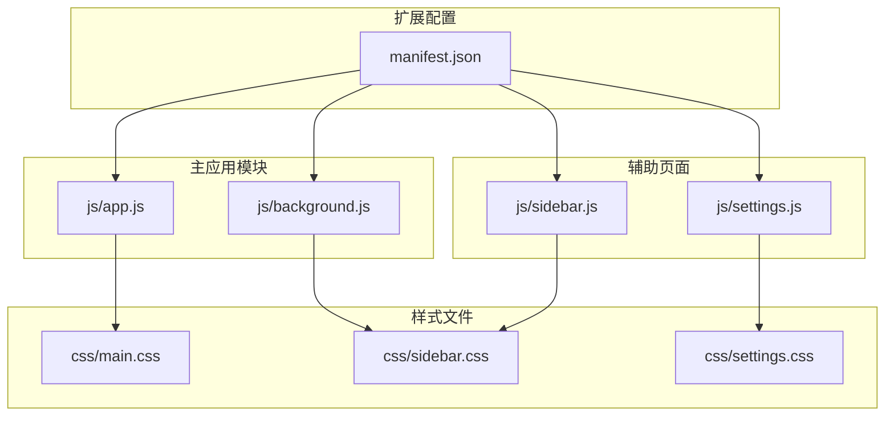

**图表来源**
- [manifest.json:1-38](file://manifest.json#L1-L38)
- [js/app.js:1-50](file://js/app.js#L1-L50)
- [js/background.js:1-50](file://js/background.js#L1-L50)

**章节来源**
- [manifest.json:1-38](file://manifest.json#L1-L38)
- [README.md:132-154](file://README.md#L132-L154)

## 核心组件

### 数据存储架构

项目使用 Chrome Storage API 实现数据持久化，主要包含以下数据结构：

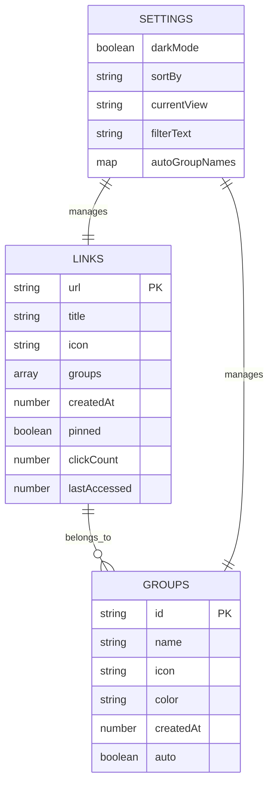

**图表来源**
- [js/app.js:25-34](file://js/app.js#L25-L34)
- [js/settings.js:16-25](file://js/settings.js#L16-L25)

### 状态管理机制

项目实现了多层次的状态管理：

1. **全局状态变量**：存储在 app.js 中的全局变量
2. **本地存储状态**：通过 Chrome Storage API 持久化
3. **缓存状态**：域名缓存优化性能
4. **页面状态**：不同页面独立的状态管理

**章节来源**
- [js/app.js:25-34](file://js/app.js#L25-L34)
- [js/settings.js:16-25](file://js/settings.js#L16-L25)

## 架构概览

项目采用分层架构设计，实现了清晰的职责分离：

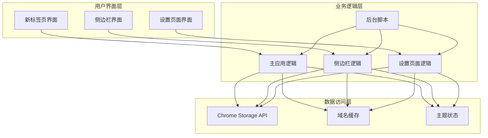

**图表来源**
- [js/app.js:75-106](file://js/app.js#L75-L106)
- [js/sidebar.js:30-41](file://js/sidebar.js#L30-L41)
- [js/settings.js:95-110](file://js/settings.js#L95-L110)

## 详细组件分析

### 数据加载流程

数据加载流程采用异步模式，确保用户体验流畅：

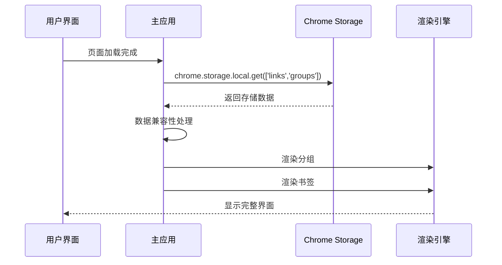

**图表来源**
- [js/app.js:75-106](file://js/app.js#L75-L106)
- [js/sidebar.js:30-41](file://js/sidebar.js#L30-L41)
- [js/settings.js:95-110](file://js/settings.js#L95-L110)

### 数据保存机制

数据保存采用增量更新策略，最小化存储操作：

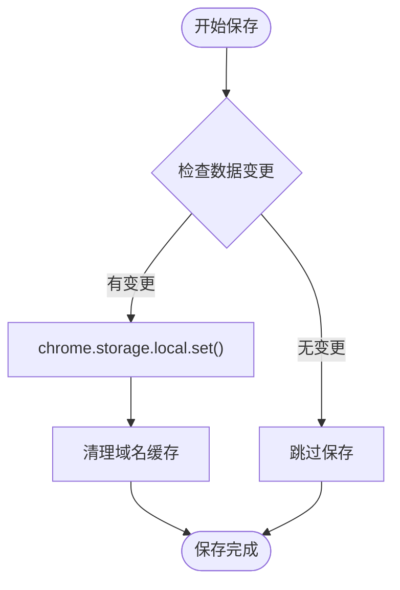

**图表来源**
- [js/app.js:469-473](file://js/app.js#L469-L473)
- [js/sidebar.js:311-313](file://js/sidebar.js#L311-L313)
- [js/settings.js:411-414](file://js/settings.js#L411-L414)

### 数据模型设计

#### Links 数组结构

每个书签对象包含以下字段：

| 字段名 | 类型 | 描述 | 默认值 |
|--------|------|------|--------|
| url | string | 书签链接地址 | 必需 |
| title | string | 书签标题 | 必需 |
| icon | string | 网站图标URL | 默认图标 |
| groups | array | 所属分组ID数组 | [] |
| createdAt | number | 创建时间戳 | 当前时间 |
| pinned | boolean | 是否置顶 | false |
| clickCount | number | 点击次数 | 0 |
| lastAccessed | number | 最后访问时间 | null |

#### Groups 数组结构

每个分组对象包含以下字段：

| 字段名 | 类型 | 描述 | 默认值 |
|--------|------|------|--------|
| id | string | 分组唯一标识 | 自动生成 |
| name | string | 分组名称 | 必需 |
| icon | string | 分组图标 | 'fa-folder' |
| color | string | 分组颜色 | '#4F46E5' |
| createdAt | number | 创建时间戳 | 当前时间 |
| auto | boolean | 是否为自动分组 | false |

**章节来源**
- [js/app.js:89-95](file://js/app.js#L89-L95)
- [js/app.js:357-363](file://js/app.js#L357-L363)

### 状态变量管理

项目实现了全面的状态变量管理系统：

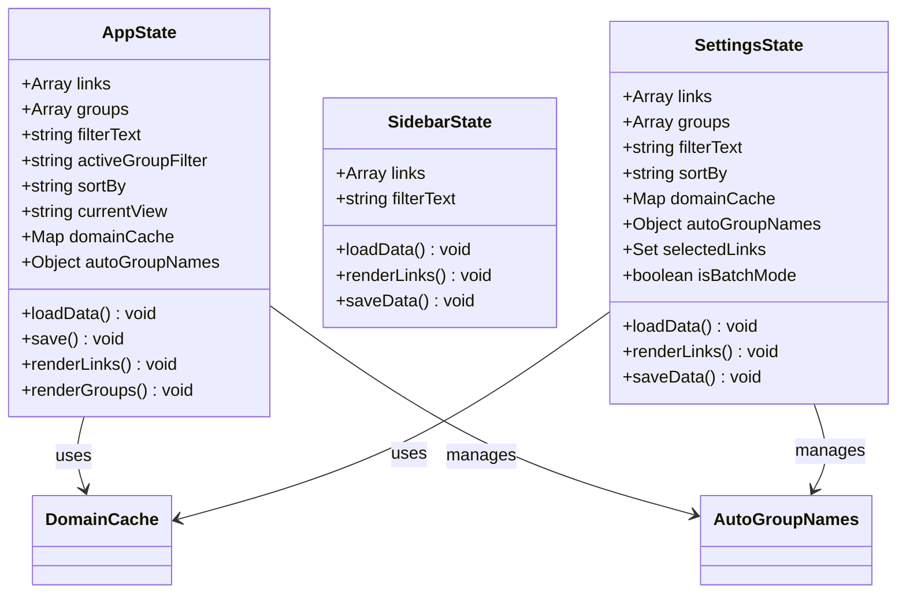

**图表来源**
- [js/app.js:25-34](file://js/app.js#L25-L34)
- [js/sidebar.js:5-7](file://js/sidebar.js#L5-L7)
- [js/settings.js:16-25](file://js/settings.js#L16-L25)

### 数据缓存策略

项目实现了多层次的缓存策略以优化性能：

#### 域名缓存 (domainCache)

域名缓存是项目最重要的性能优化机制：

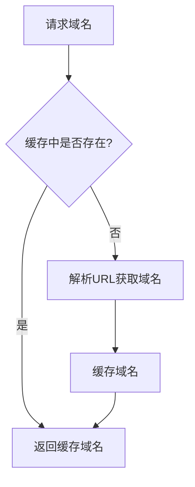

**图表来源**
- [js/app.js:35-49](file://js/app.js#L35-L49)
- [js/settings.js:194-207](file://js/settings.js#L194-L207)

#### 自动分组缓存

自动分组的生成和缓存机制：

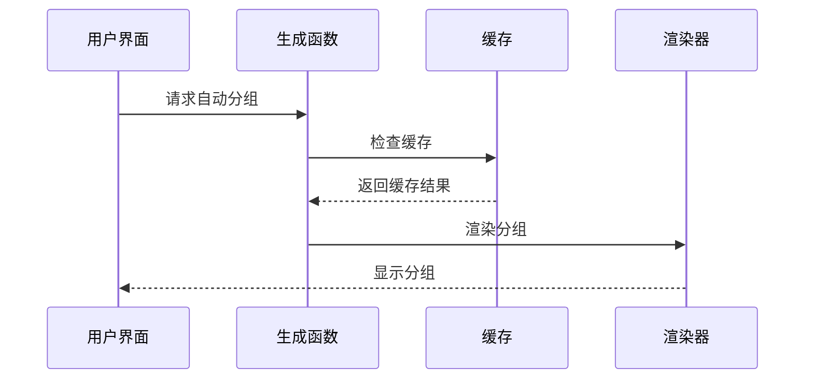

**图表来源**
- [js/app.js:954-986](file://js/app.js#L954-L986)
- [js/settings.js:712-733](file://js/settings.js#L712-L733)

### 数据更新策略

项目实现了多种数据更新策略：

#### 实时同步机制

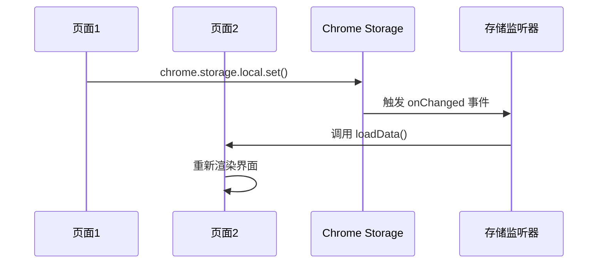

**图表来源**
- [js/app.js:116-121](file://js/app.js#L116-L121)
- [js/sidebar.js:142-149](file://js/sidebar.js#L142-L149)
- [js/settings.js:176-182](file://js/settings.js#L176-L182)

#### 批量更新优化

项目实现了批量更新优化，减少存储操作次数：

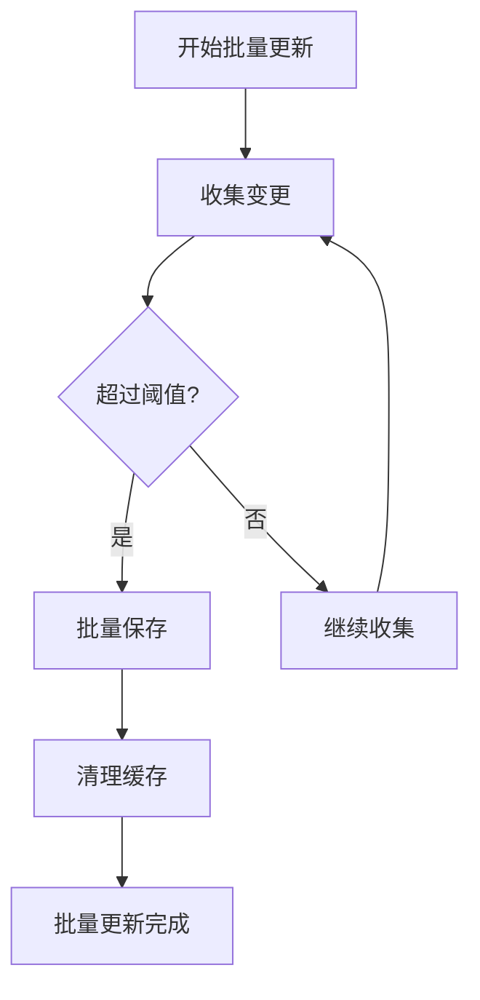

**图表来源**
- [js/app.js:469-473](file://js/app.js#L469-L473)
- [js/settings.js:508-528](file://js/settings.js#L508-L528)

### 数据一致性保证

项目通过多种机制确保数据一致性：

#### 事务性操作

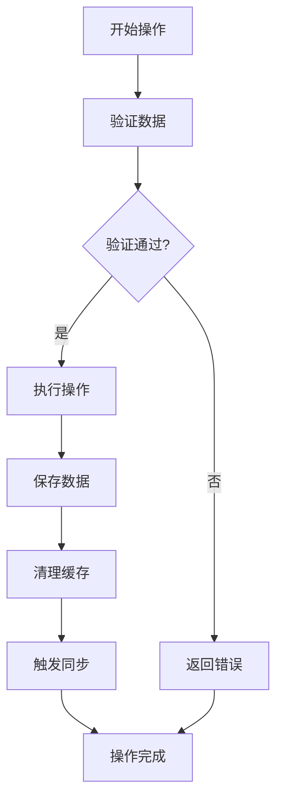

**图表来源**
- [js/app.js:1364-1373](file://js/app.js#L1364-L1373)
- [js/settings.js:769-781](file://js/settings.js#L769-L781)

#### 错误恢复机制

项目实现了完善的错误恢复机制：

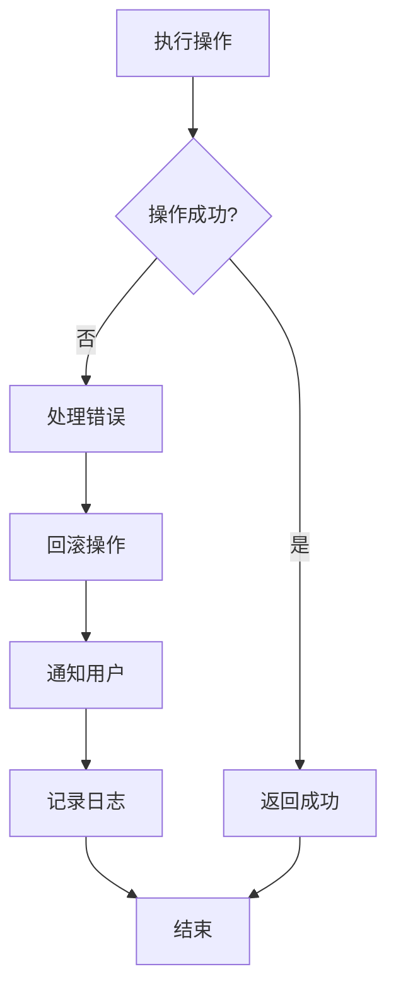

**图表来源**
- [js/app.js:1420-1457](file://js/app.js#L1420-L1457)
- [js/sidebar.js:337-365](file://js/sidebar.js#L337-L365)

### 数据迁移兼容性

项目实现了向后兼容的数据迁移机制：

#### 数据结构演进

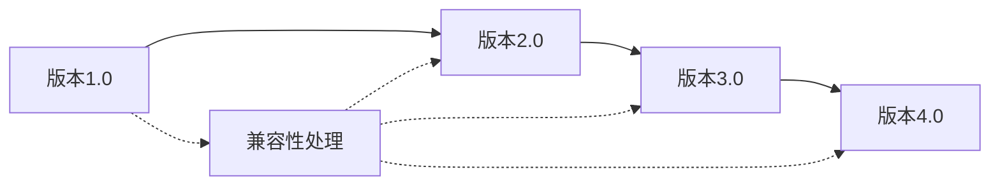

#### 兼容性处理策略

项目通过以下方式处理数据迁移：

1. **字段默认值**：为新字段提供合理默认值
2. **类型转换**：自动转换数据类型
3. **结构升级**：逐步升级数据结构
4. **回退机制**：支持降级到旧版本

**章节来源**
- [js/app.js:88-95](file://js/app.js#L88-L95)
- [js/settings.js:96-103](file://js/settings.js#L96-L103)

## 依赖关系分析

项目各模块之间的依赖关系如下：

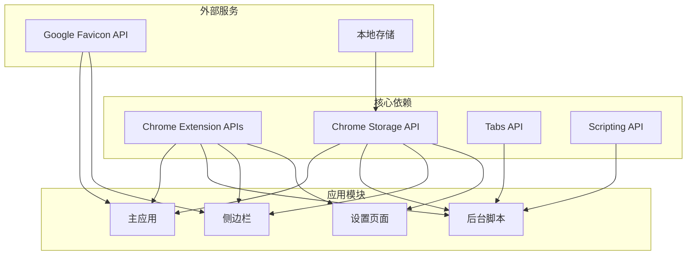

**图表来源**
- [manifest.json:9-19](file://manifest.json#L9-L19)
- [js/background.js:72-109](file://js/background.js#L72-L109)

**章节来源**
- [manifest.json:9-19](file://manifest.json#L9-L19)
- [README.md:158-169](file://README.md#L158-L169)

## 性能考虑

### 缓存策略优化

项目实现了多层次的缓存策略：

1. **域名缓存**：避免重复解析URL
2. **分组缓存**：缓存自动分组结果
3. **渲染缓存**：避免重复DOM操作

### 异步操作优化

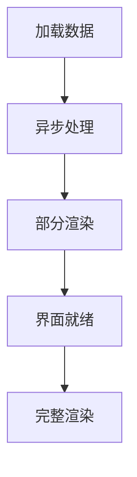

### 存储优化

项目通过以下方式优化存储性能：

1. **批量保存**：合并多个保存操作
2. **增量更新**：只保存变更的数据
3. **延迟加载**：按需加载数据

## 故障排除指南

### 常见问题及解决方案

#### 数据丢失问题

**问题描述**：用户反映书签数据丢失

**可能原因**：
1. 浏览器数据清理
2. 扩展卸载
3. 存储空间不足

**解决方案**：
1. 建议用户定期备份数据
2. 检查浏览器存储空间
3. 重新安装扩展

#### 同步问题

**问题描述**：页面间数据不同步

**可能原因**：
1. 存储监听器失效
2. 异步操作竞争
3. 缓存不一致

**解决方案**：
1. 重启浏览器
2. 检查扩展权限
3. 清理浏览器缓存

#### 性能问题

**问题描述**：界面响应缓慢

**可能原因**：
1. 大量书签数据
2. 频繁的DOM操作
3. 缓存失效

**解决方案**：
1. 优化搜索算法
2. 减少DOM操作
3. 清理缓存

**章节来源**
- [README.md:248-258](file://README.md#L248-L258)

## 结论

书签白板项目展现了优秀的数据管理与状态控制设计。通过合理的架构设计、完善的缓存策略和健壮的错误处理机制，项目实现了高性能、高可靠性的书签管理功能。

### 主要优势

1. **架构清晰**：模块化设计，职责分离明确
2. **性能优秀**：多层次缓存，异步处理优化
3. **用户体验好**：实时同步，响应迅速
4. **数据安全**：完全本地存储，隐私保护

### 技术亮点

1. **智能域名分组**：自动识别和分组书签
2. **实时搜索**：支持多种搜索条件
3. **批量操作**：高效管理大量书签
4. **数据导入导出**：支持数据迁移和备份

### 改进建议

1. **增加数据压缩**：对于大量数据的存储优化
2. **增强错误恢复**：提供更完善的错误恢复机制
3. **性能监控**：添加性能指标监控
4. **数据验证**：增强数据完整性验证

该项目为 Chrome Extension 开发提供了优秀的参考范例，特别是在数据管理、状态控制和用户体验方面的最佳实践值得学习和借鉴。