# 模态框与对话框系统

<cite>
**本文档引用的文件**
- [js/app.js](file://js/app.js)
- [js/settings.js](file://js/settings.js)
- [js/sidebar.js](file://js/sidebar.js)
- [new-tab.html](file://new-tab.html)
- [settings.html](file://settings.html)
- [sidebar.html](file://sidebar.html)
- [manifest.json](file://manifest.json)
- [README.md](file://README.md)
</cite>

## 目录
1. [简介](#简介)
2. [项目结构](#项目结构)
3. [核心组件](#核心组件)
4. [架构概览](#架构概览)
5. [详细组件分析](#详细组件分析)
6. [依赖关系分析](#依赖关系分析)
7. [性能考虑](#性能考虑)
8. [故障排除指南](#故障排除指南)
9. [结论](#结论)

## 简介

书签白板项目实现了完整的模态框与对话框系统，为用户提供一致的交互体验。该系统包含三种主要类型的模态框：通用对话框、确认对话框和页面内弹窗，每种都有特定的设计目标和使用场景。

系统的核心设计理念是提供简洁、直观且可访问的用户界面，支持多种交互模式，包括键盘导航、表单验证和回调处理。模态框系统经过精心设计，确保在不同页面和上下文中的一致性体验。

## 项目结构

项目采用模块化架构，将模态框功能分布在不同的JavaScript文件中：

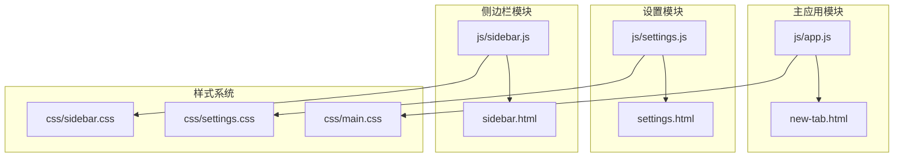

**图表来源**
- [js/app.js:1-50](file://js/app.js#L1-L50)
- [js/settings.js:1-50](file://js/settings.js#L1-L50)
- [js/sidebar.js:1-50](file://js/sidebar.js#L1-L50)

**章节来源**
- [manifest.json:1-36](file://manifest.json#L1-L36)
- [README.md:132-154](file://README.md#L132-L154)

## 核心组件

### 通用对话框组件

系统提供了统一的 `showModal` API，支持文本输入和简单确认操作：

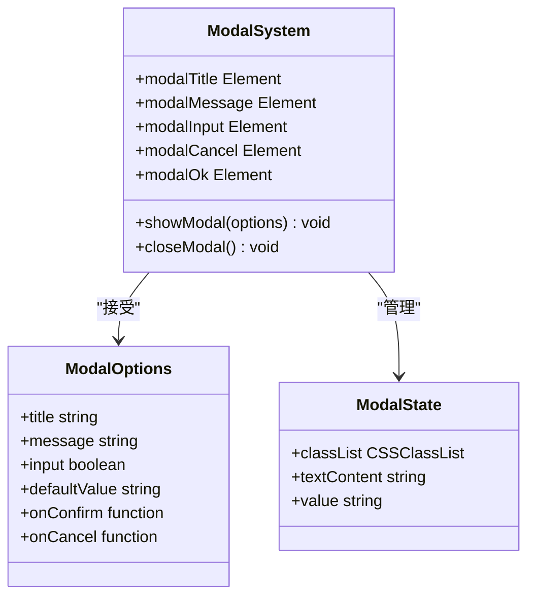

**图表来源**
- [js/app.js:1464-1505](file://js/app.js#L1464-L1505)

### 确认对话框组件

设置模块实现了专门的确认对话框，用于危险操作的二次确认：

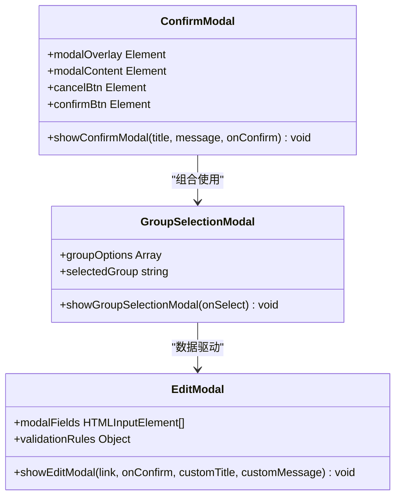

**图表来源**
- [js/settings.js:866-909](file://js/settings.js#L866-L909)
- [js/settings.js:911-983](file://js/settings.js#L911-L983)
- [js/settings.js:785-864](file://js/settings.js#L785-L864)

### 页面内弹窗组件

侧边栏模块实现了独立的弹窗系统，具有完整的表单验证和交互逻辑：

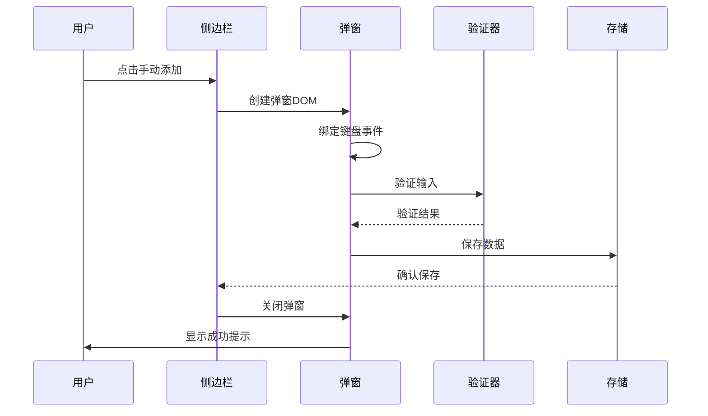

**图表来源**
- [js/sidebar.js:367-488](file://js/sidebar.js#L367-L488)

**章节来源**
- [js/app.js:1464-1505](file://js/app.js#L1464-L1505)
- [js/settings.js:785-983](file://js/settings.js#L785-L983)
- [js/sidebar.js:367-488](file://js/sidebar.js#L367-L488)

## 架构概览

系统采用分层架构设计，确保模态框功能的可维护性和可扩展性：

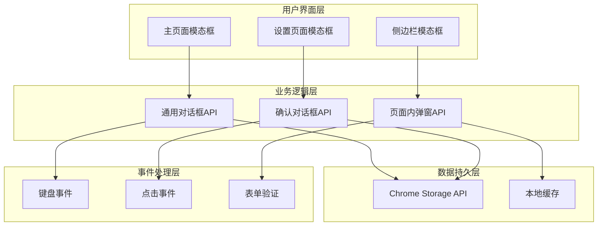

**图表来源**
- [js/app.js:108-373](file://js/app.js#L108-L373)
- [js/settings.js:176-191](file://js/settings.js#L176-L191)
- [js/sidebar.js:87-133](file://js/sidebar.js#L87-L133)

### 模态框生命周期管理

系统实现了完整的模态框生命周期管理，包括创建、显示、交互和销毁：

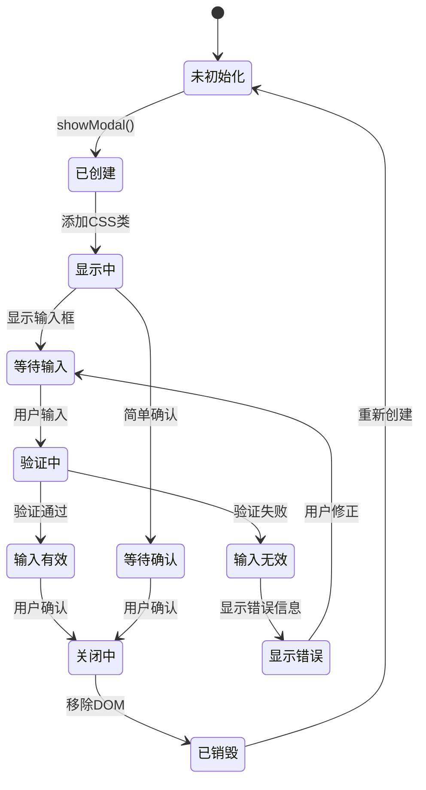

**图表来源**
- [js/app.js:1464-1505](file://js/app.js#L1464-L1505)
- [js/settings.js:866-909](file://js/settings.js#L866-L909)

## 详细组件分析

### 主应用模态框系统

主应用模块实现了最通用的模态框系统，支持文本输入和回调处理：

#### API设计规范

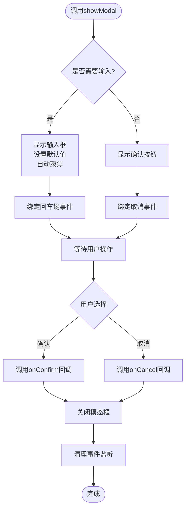

**图表来源**
- [js/app.js:1464-1499](file://js/app.js#L1464-L1499)

#### 表单输入验证机制

系统实现了多层次的输入验证：

| 验证类型 | 触发时机 | 验证规则 | 错误处理 |
|---------|---------|---------|---------|
| 格式验证 | 用户输入时 | 正则表达式匹配 | 实时错误提示 |
| 必填验证 | 确认提交时 | 非空检查 | 聚焦到输入框 |
| 业务验证 | 提交处理时 | 业务规则检查 | 业务错误提示 |
| 样式验证 | 验证状态变化 | CSS类状态切换 | 视觉反馈 |

**章节来源**
- [js/app.js:1464-1505](file://js/app.js#L1464-L1505)

### 设置页面模态框系统

设置模块提供了更复杂的模态框功能，支持表单编辑和分组选择：

#### 编辑模态框实现

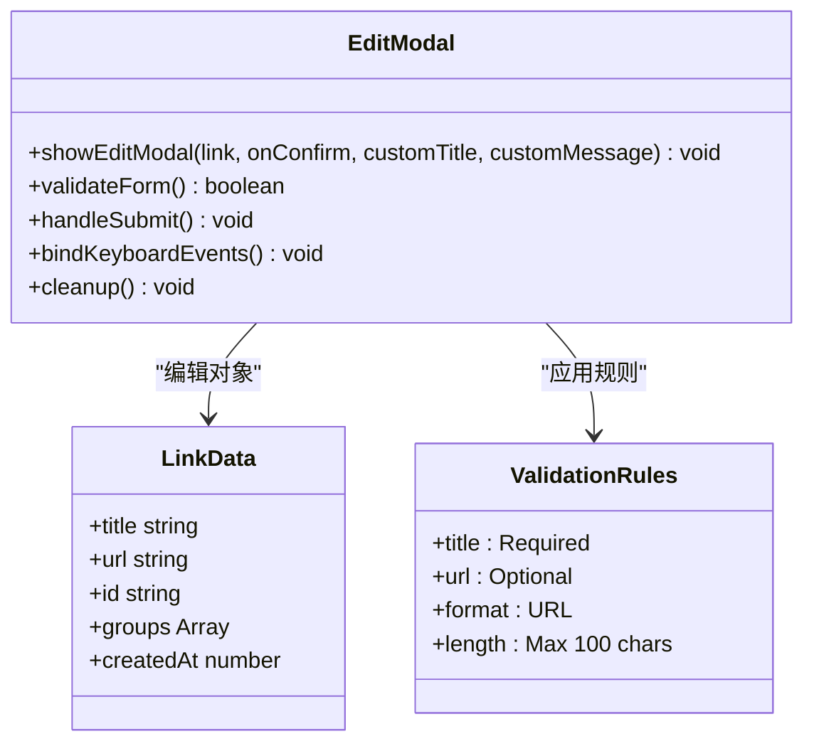

**图表来源**
- [js/settings.js:785-864](file://js/settings.js#L785-L864)

#### 分组选择模态框

系统实现了专门的分组选择功能：

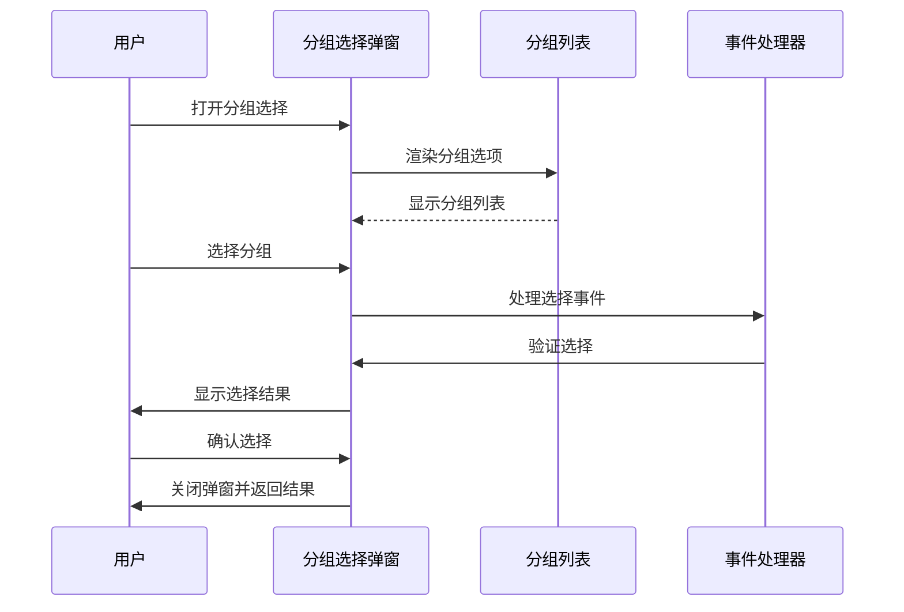

**图表来源**
- [js/settings.js:911-983](file://js/settings.js#L911-L983)

**章节来源**
- [js/settings.js:785-983](file://js/settings.js#L785-L983)

### 侧边栏模态框系统

侧边栏模块实现了独立的弹窗系统，具有完整的表单验证和交互逻辑：

#### 手动添加对话框

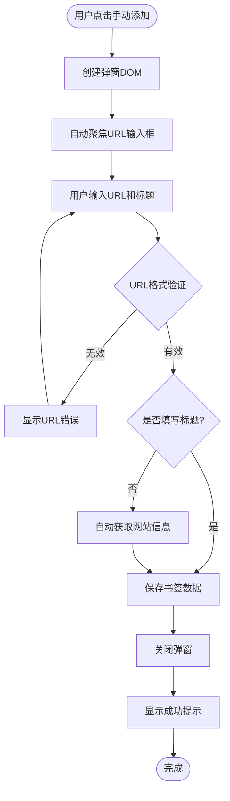

**图表来源**
- [js/sidebar.js:367-488](file://js/sidebar.js#L367-L488)

#### 键盘交互支持

侧边栏弹窗实现了完整的键盘导航支持：

| 键盘快捷键 | 功能描述 | 触发条件 |
|-----------|----------|----------|
| Enter | 确认提交 | 输入框获得焦点 |
| Escape | 取消操作 | 任意时刻 |
| Tab | 在输入框间切换 | 多个输入框 |
| Shift+Tab | 反向切换 | 多个输入框 |

**章节来源**
- [js/sidebar.js:367-488](file://js/sidebar.js#L367-L488)

## 依赖关系分析

### 模块间依赖关系

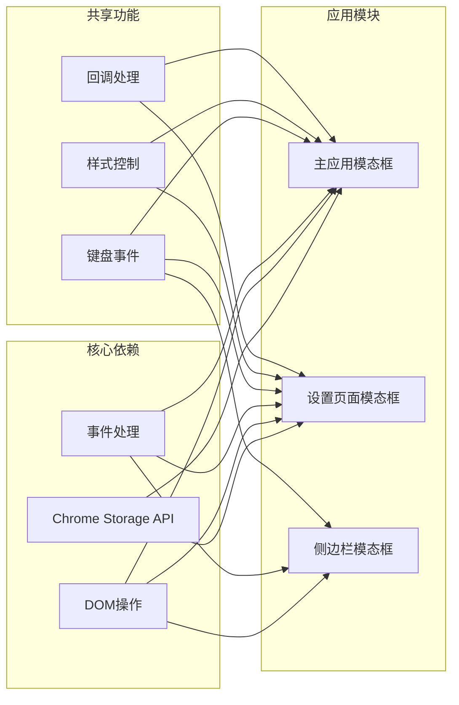

**图表来源**
- [js/app.js:108-373](file://js/app.js#L108-L373)
- [js/settings.js:176-191](file://js/settings.js#L176-L191)
- [js/sidebar.js:87-133](file://js/sidebar.js#L87-L133)

### 样式依赖分析

系统采用CSS变量和条件样式来实现主题切换：

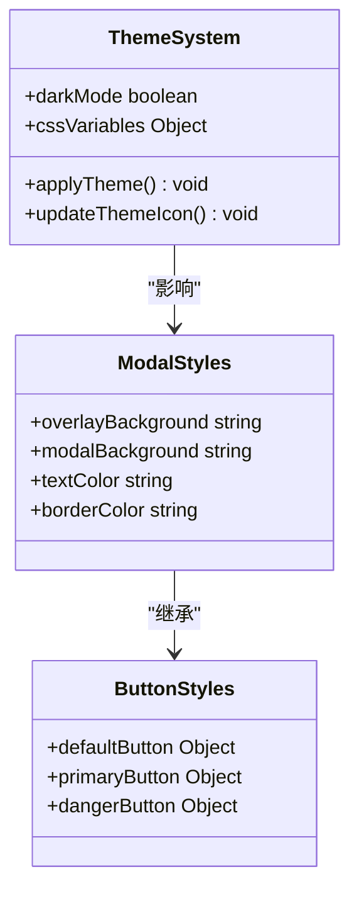

**图表来源**
- [js/app.js:64-73](file://js/app.js#L64-L73)
- [js/settings.js:85-92](file://js/settings.js#L85-L92)

**章节来源**
- [js/app.js:64-73](file://js/app.js#L64-L73)
- [js/settings.js:85-92](file://js/settings.js#L85-L92)

## 性能考虑

### 内存管理

系统实现了完善的内存管理机制，防止内存泄漏：

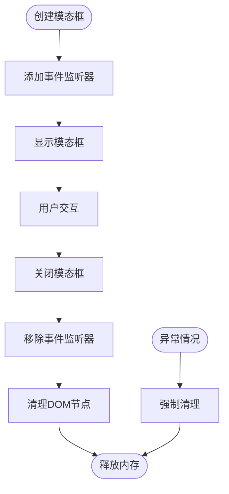

### 渲染优化

系统采用了多种渲染优化技术：

| 优化技术 | 实现方式 | 性能收益 |
|---------|---------|---------|
| 请求动画帧 | `requestAnimationFrame` | 减少重绘次数 |
| 批量DOM操作 | 文档片段 | 提高DOM操作效率 |
| 条件渲染 | 动态样式切换 | 减少不必要的渲染 |
| 事件委托 | 统一事件处理 | 降低事件监听器数量 |

## 故障排除指南

### 常见问题及解决方案

#### 模态框无法关闭

**问题症状**：模态框显示但无法通过点击或键盘关闭

**可能原因**：
1. 事件监听器未正确绑定
2. CSS类状态冲突
3. JavaScript执行错误

**解决步骤**：
1. 检查控制台是否有JavaScript错误
2. 验证CSS类是否正确应用
3. 确认事件监听器是否绑定成功
4. 检查是否有其他元素阻止事件传播

#### 输入验证失效

**问题症状**：表单验证不工作或验证结果不正确

**可能原因**：
1. 验证规则配置错误
2. 事件处理函数异常
3. DOM元素未正确获取

**解决步骤**：
1. 检查验证规则的正则表达式
2. 验证事件处理函数的参数传递
3. 确认DOM元素的选择器正确性
4. 测试验证函数的独立运行

#### 样式显示异常

**问题症状**：模态框样式错乱或主题不匹配

**可能原因**：
1. CSS变量未正确设置
2. 主题切换逻辑错误
3. 样式优先级冲突

**解决步骤**：
1. 检查CSS变量的定义和赋值
2. 验证主题切换的逻辑流程
3. 检查样式文件的加载顺序
4. 使用浏览器开发者工具调试样式

**章节来源**
- [js/app.js:1501-1505](file://js/app.js#L1501-L1505)
- [js/settings.js:897-901](file://js/settings.js#L897-L901)
- [js/sidebar.js:476-487](file://js/sidebar.js#L476-L487)

## 结论

书签白板项目的模态框与对话框系统展现了现代Web应用的最佳实践。系统通过模块化设计、统一的API接口和完善的错误处理机制，为用户提供了稳定可靠的交互体验。

### 主要优势

1. **一致性**：三种模态框类型在API设计和用户体验上保持高度一致
2. **可维护性**：清晰的模块划分和职责分离便于代码维护
3. **可扩展性**：灵活的架构设计支持未来功能扩展
4. **用户体验**：完整的键盘导航和无障碍支持

### 技术亮点

- 统一的模态框生命周期管理
- 多层次的输入验证机制
- 完善的错误处理和恢复机制
- 优化的性能表现和内存管理

该系统为类似项目的模态框实现提供了优秀的参考模板，展示了如何在保持代码简洁的同时实现复杂的功能需求。