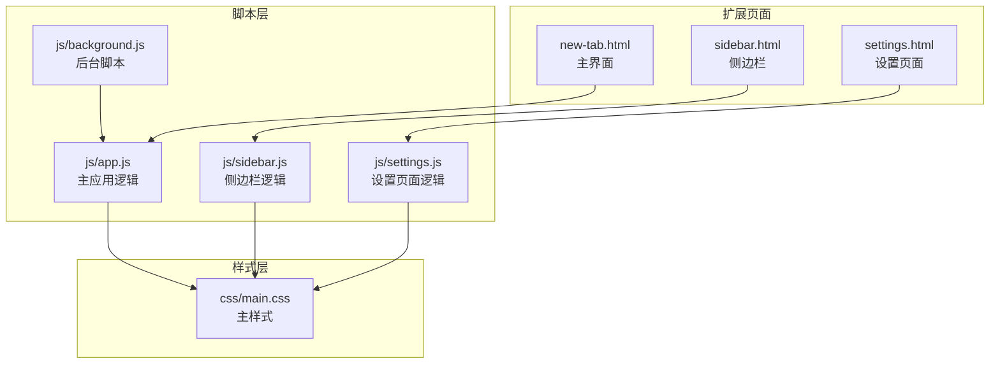
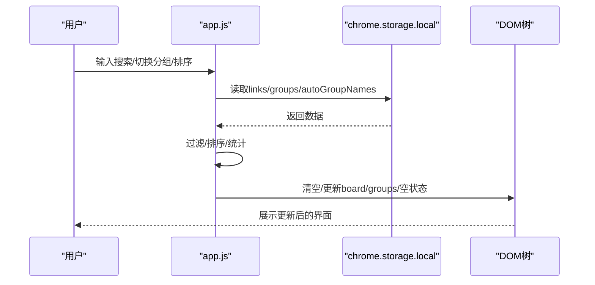
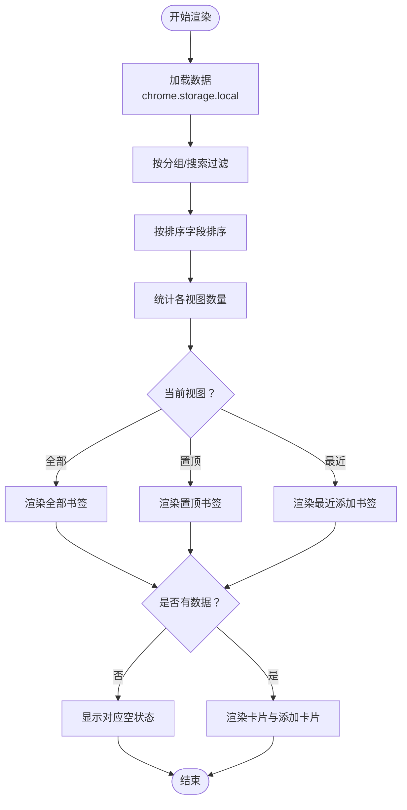
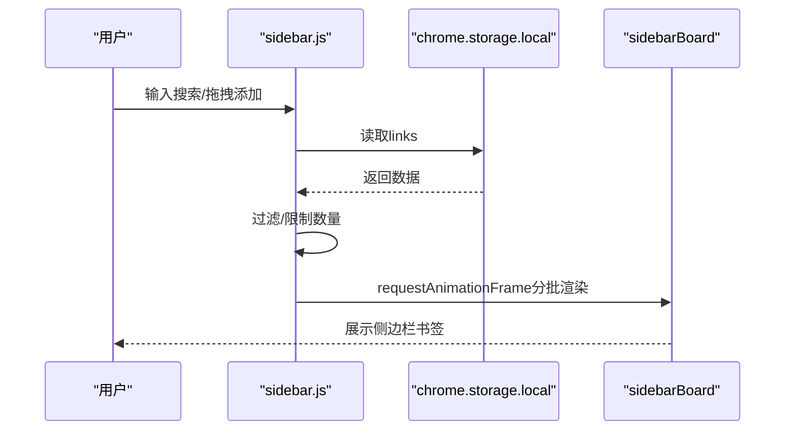
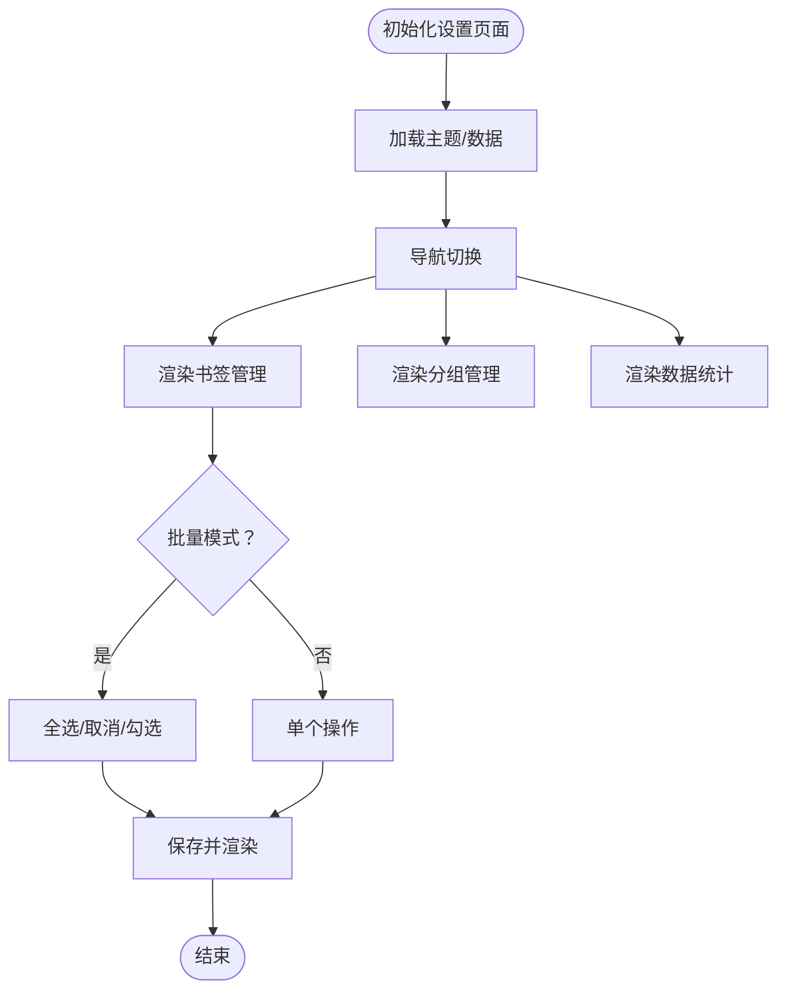
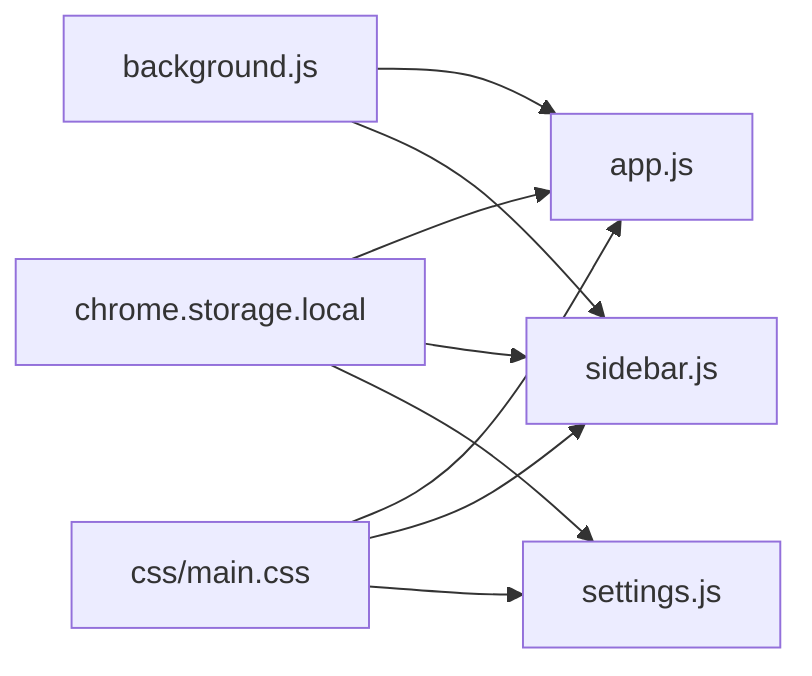

# 界面渲染与DOM管理

<cite>
**本文引用的文件**
- [new-tab.html](file://new-tab.html)
- [sidebar.html](file://sidebar.html)
- [settings.html](file://settings.html)
- [manifest.json](file://manifest.json)
- [js/app.js](file://js/app.js)
- [js/sidebar.js](file://js/sidebar.js)
- [js/settings.js](file://js/settings.js)
- [js/background.js](file://js/background.js)
- [css/main.css](file://css/main.css)
</cite>

## 目录
1. [简介](#简介)
2. [项目结构](#项目结构)
3. [核心组件](#核心组件)
4. [架构总览](#架构总览)
5. [详细组件分析](#详细组件分析)
6. [依赖关系分析](#依赖关系分析)
7. [性能考量](#性能考量)
8. [故障排查指南](#故障排查指南)
9. [结论](#结论)
10. [附录](#附录)

## 简介
本文件面向“书签白板”项目，聚焦界面渲染与DOM管理模块，系统阐述主应用模块的UI渲染机制，包括书签卡片渲染逻辑、分组标签渲染、搜索结果过滤、视图切换（全部、置顶、最近）等功能实现；同时详解DOM元素管理策略、模板生成方法、动态内容更新机制以及响应式布局处理。文档还提供渲染性能优化技巧（批量更新、虚拟滚动思路）与内存管理策略，帮助开发者在保持良好用户体验的同时，提升渲染效率与稳定性。

## 项目结构
项目采用Chrome扩展Manifest V3架构，页面由三个主要入口组成：
- 新标签页主界面：负责书签卡片展示、分组筛选、搜索与排序、视图切换等核心功能
- 侧边栏界面：提供快速访问、搜索、编辑/删除、主题切换等便捷功能
- 设置页面：集中管理书签、分组、外观、显示与排序、数据管理、隐私与安全、快捷操作、关于等

图表来源
- [new-tab.html](file://new-tab.html)
- [sidebar.html](file://sidebar.html)
- [settings.html](file://settings.html)
- [js/app.js](file://js/app.js)
- [js/sidebar.js](file://js/sidebar.js)
- [js/settings.js](file://js/settings.js)
- [js/background.js](file://js/background.js)
- [css/main.css](file://css/main.css)

章节来源
- [manifest.json](file://manifest.json)
- [new-tab.html](file://new-tab.html)
- [sidebar.html](file://sidebar.html)
- [settings.html](file://settings.html)

## 核心组件
- 主应用模块（app.js）：负责书签卡片渲染、分组标签渲染、搜索过滤、视图切换、上下文菜单、主题切换、导入导出、拖拽添加等
- 侧边栏模块（sidebar.js）：负责侧边栏书签列表渲染、搜索、拖拽添加、主题切换、Toast通知等
- 设置模块（settings.js）：负责设置页面的导航、书签列表渲染、分组管理、批量操作、数据导入导出等
- 后台脚本（background.js）：负责右键菜单、通知、侧边栏打开等扩展级功能

章节来源
- [js/app.js](file://js/app.js)
- [js/sidebar.js](file://js/sidebar.js)
- [js/settings.js](file://js/settings.js)
- [js/background.js](file://js/background.js)

## 架构总览
渲染架构围绕“数据驱动DOM”的模式展开，核心流程如下：
- 数据加载：通过chrome.storage.local异步加载书签与分组数据
- 状态管理：维护links、groups、filterText、activeGroupFilter、sortBy、currentView等状态
- 渲染触发：输入事件、存储变化、主题变化等触发渲染
- DOM更新：按需更新board、groups容器、空状态、计数等元素
- 事件委托：利用事件冒泡与委托减少事件绑定数量，提升性能

图表来源
- [js/app.js](file://js/app.js)
- [manifest.json](file://manifest.json)

## 详细组件分析

### 主应用模块（UI渲染与DOM管理）
- DOM元素管理
  - 通过全局常量集中管理关键DOM节点，如board、emptyState、searchInput、mobileSearchInput、themeToggle、modal等
  - 对空状态容器进行条件性显示/隐藏，避免重复渲染
  - 使用事件委托减少事件绑定数量，例如分组标签点击、视图切换Tab点击
- 模板生成与动态内容更新
  - 书签卡片采用createElement链式构建，包含图标、标题、域名、统计、操作按钮等
  - 分组标签动态生成，支持自动分组与自定义分组，显示计数与右键菜单
  - 空状态根据不同视图（全部、置顶、最近）进行差异化展示
- 搜索与过滤
  - 支持智能搜索语法：#标签、@域名、!分组（中英文兼容）
  - 过滤过程先按分组筛选，再按搜索词逐词过滤
- 视图切换
  - “全部/置顶/最近”三种视图，分别统计并渲染不同集合
  - 计数器实时更新，空状态随视图切换而切换
- 上下文菜单
  - 书签卡片右键菜单：置顶/取消置顶、编辑、删除、分组选择
  - 分组标签右键菜单：编辑名称、删除（自定义分组）
- 主题与提示
  - 主题切换通过切换根元素类名实现，图标随主题切换
  - 提示栏可隐藏，状态持久化至storage

图表来源
- [js/app.js](file://js/app.js)
- [new-tab.html](file://new-tab.html)

章节来源
- [js/app.js](file://js/app.js)
- [new-tab.html](file://new-tab.html)

### 侧边栏模块（UI渲染与DOM管理）
- DOM元素管理
  - 侧边栏独立容器sidebarBoard，内部通过requestAnimationFrame分批渲染，避免主线程阻塞
  - 限制显示数量（默认50），超出时提示用户使用搜索
- 模板生成与动态内容更新
  - 书签卡片采用createElement构建，包含图标、标题、域名、操作按钮
  - 支持点击打开链接、编辑、删除等操作
- 性能优化
  - requestAnimationFrame分批渲染，每批固定数量，避免长任务阻塞
  - 通过display: none隐藏容器，减少不必要的重排
- 交互与拖拽
  - 支持拖拽添加书签，自动获取标题与favicon
  - 主题切换、手动添加对话框等

图表来源
- [js/sidebar.js](file://js/sidebar.js)
- [sidebar.html](file://sidebar.html)

章节来源
- [js/sidebar.js](file://js/sidebar.js)
- [sidebar.html](file://sidebar.html)

### 设置模块（UI渲染与DOM管理）
- DOM元素管理
  - 采用导航切换与section激活的方式组织页面内容
  - bookmark-list、groups-list等容器按需渲染
- 模板生成与动态内容更新
  - 书签列表项包含图标、标题、URL、统计、操作按钮
  - 分组列表项区分自动分组与自定义分组，显示计数与操作按钮
- 批量操作
  - 批量模式下支持全选、取消全选、批量删除、批量添加分组
  - 通过Set维护选中状态，实时更新UI与计数
- 数据管理
  - 支持导出/导入数据，导入时进行解密与校验

图表来源
- [js/settings.js](file://js/settings.js)
- [settings.html](file://settings.html)

章节来源
- [js/settings.js](file://js/settings.js)
- [settings.html](file://settings.html)

### 后台脚本（消息与通知）
- 右键菜单：支持“添加页面到书签白板”、“添加链接到书签白板”、“打开书签白板侧边栏”
- 通知：通过scripting.executeScript在目标页面注入Toast通知
- 侧边栏：通过chrome.sidePanel.open打开侧边栏

章节来源
- [js/background.js](file://js/background.js)

## 依赖关系分析
- 数据依赖：所有页面均依赖chrome.storage.local存储的links、groups、autoGroupNames等数据
- 事件依赖：主应用监听storage变化与系统主题变化；侧边栏与设置页面监听storage变化以实现自动刷新
- 样式依赖：统一使用css/main.css的CSS变量，实现深色/浅色主题切换
- 权限依赖：扩展具备storage、contextMenus、tabs、scripting、sidePanel等权限

图表来源
- [js/app.js](file://js/app.js)
- [js/sidebar.js](file://js/sidebar.js)
- [js/settings.js](file://js/settings.js)
- [js/background.js](file://js/background.js)
- [css/main.css](file://css/main.css)
- [manifest.json](file://manifest.json)

章节来源
- [manifest.json](file://manifest.json)
- [js/app.js](file://js/app.js)
- [js/sidebar.js](file://js/sidebar.js)
- [js/settings.js](file://js/settings.js)
- [js/background.js](file://js/background.js)
- [css/main.css](file://css/main.css)

## 性能考量
- 批量更新与分批渲染
  - 侧边栏采用requestAnimationFrame分批渲染，每批固定数量，避免主线程长时间占用
  - 主应用在渲染卡片时，优先更新board子节点，保留空状态容器，减少DOM重建
- 虚拟滚动思路
  - 当书签数量增长时，可考虑虚拟滚动：仅渲染可视区域内的卡片，根据滚动位置动态计算可见范围，显著降低DOM节点数量与重排成本
- 域名缓存与去重
  - 使用Map缓存域名解析结果，避免重复解析URL
  - 删除书签后清理域名缓存，保证后续解析一致性
- 事件委托与最小化重绘
  - 使用事件委托减少事件监听器数量，降低内存占用
  - 通过类名切换控制空状态显示，避免频繁innerHTML替换
- 主题切换与防闪烁
  - 首屏通过CSS类控制透明度，避免FOUC
  - 主题切换时仅切换根元素类名，减少样式重计算

## 故障排查指南
- 书签未显示或为空
  - 检查chrome.storage.local中links是否存在且非空
  - 确认filterText与activeGroupFilter是否导致过滤为空
  - 检查emptyState是否被意外隐藏
- 拖拽添加失败
  - 确认URL格式有效，且未重复添加
  - 检查favicon获取是否异常，必要时降级使用默认图标
- 主题切换异常
  - 检查根元素类名切换逻辑，确认localStorage与系统主题偏好设置
- 侧边栏不自动刷新
  - 确认chrome.storage.onChanged监听是否生效
  - 检查SIDEBAR_DISPLAY_LIMIT与分批渲染逻辑
- 设置页面批量操作无效
  - 检查isBatchMode状态与selectedLinks集合
  - 确认批量按钮事件绑定与UI状态切换

章节来源
- [js/app.js](file://js/app.js)
- [js/sidebar.js](file://js/sidebar.js)
- [js/settings.js](file://js/settings.js)

## 结论
书签白板项目在界面渲染与DOM管理方面采用了“数据驱动+事件委托+分批渲染”的策略，既保证了良好的用户体验，又兼顾了性能与可维护性。通过统一的CSS变量体系与模块化的脚本结构，项目实现了跨页面的一致性与扩展性。未来可在大数据量场景引入虚拟滚动、进一步优化缓存策略与内存释放，以持续提升渲染性能与稳定性。

## 附录
- 关键API与事件
  - chrome.storage.local：数据持久化
  - chrome.storage.onChanged：数据变更监听
  - chrome.contextMenus：右键菜单
  - chrome.sidePanel：侧边栏
  - chrome.scripting.executeScript：页面脚本注入
- 响应式布局要点
  - 使用CSS媒体查询适配桌面与移动端
  - 通过容器宽度与网格布局实现自适应
- 主题系统
  - 通过CSS变量与根元素类名切换实现深色/浅色主题