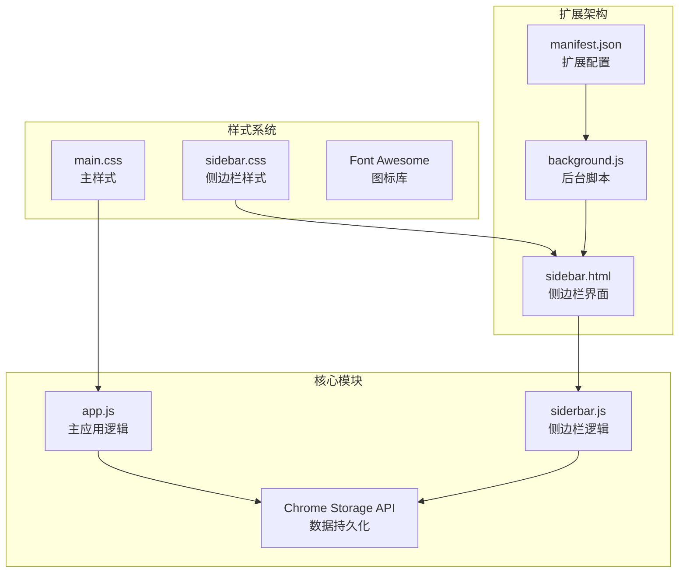
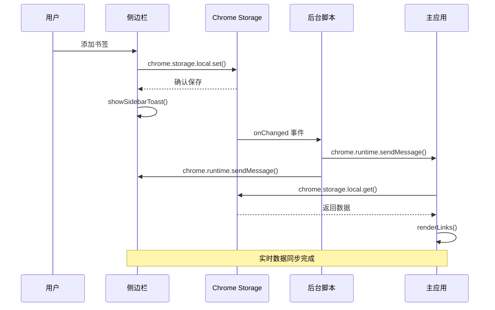
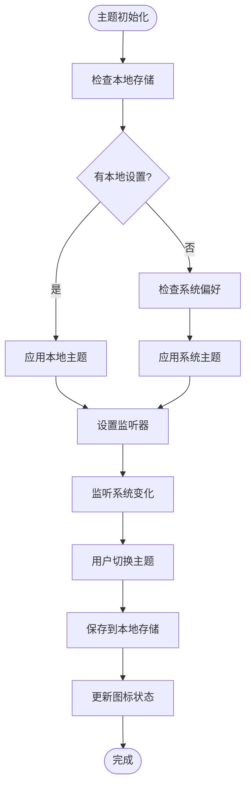
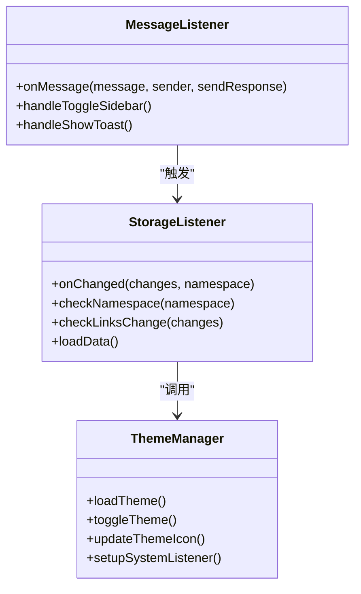
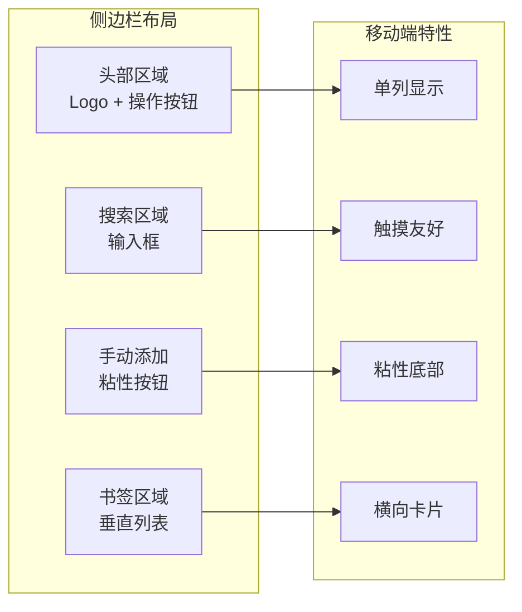
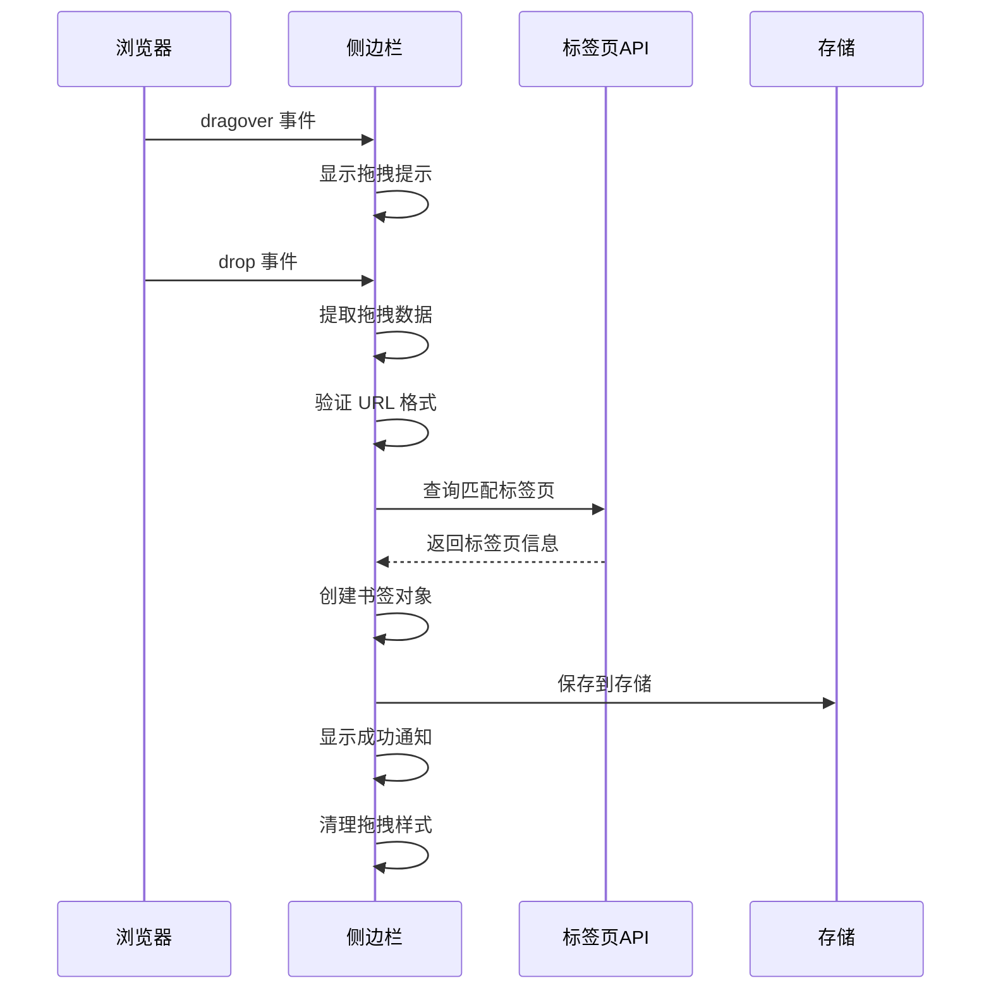
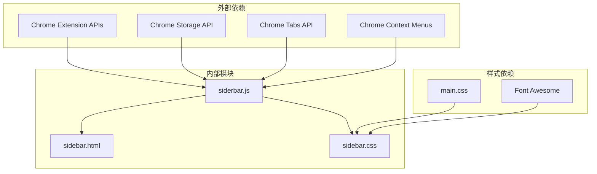

# 侧边栏模块 (sidebar.js) 技术实现文档

<cite>
**本文档引用的文件**
- [sidebar.js](file://js/sidebar.js)
- [sidebar.css](file://css/sidebar.css)
- [sidebar.html](file://sidebar.html)
- [manifest.json](file://manifest.json)
- [background.js](file://js/background.js)
- [app.js](file://js/app.js)
- [main.css](file://css/main.css)
- [README.md](file://README.md)
</cite>

## 目录
1. [简介](#简介)
2. [项目结构](#项目结构)
3. [核心组件](#核心组件)
4. [架构概览](#架构概览)
5. [详细组件分析](#详细组件分析)
6. [依赖关系分析](#依赖关系分析)
7. [性能考虑](#性能考虑)
8. [故障排除指南](#故障排除指南)
9. [结论](#结论)
10. [附录](#附录)

## 简介

书签白板侧边栏模块是一个专为 Chrome 扩展设计的移动端友好书签管理界面。该模块实现了完整的书签管理功能，包括实时数据同步、主题切换、拖拽操作、搜索过滤等核心特性。侧边栏采用强制移动端设计，确保在各种设备上都能提供优秀的用户体验。

## 项目结构

书签白板项目采用模块化架构，侧边栏模块位于独立的文件中，与其他核心模块保持松耦合关系：

**图表来源**
- [manifest.json:1-38](file://manifest.json#L1-L38)
- [sidebar.html:1-51](file://sidebar.html#L1-L51)
- [background.js:1-174](file://js/background.js#L1-L174)

**章节来源**
- [sidebar.html:1-51](file://sidebar.html#L1-L51)
- [manifest.json:1-38](file://manifest.json#L1-L38)

## 核心组件

侧边栏模块包含以下关键组件：

### 数据管理组件
- **链接存储系统**：使用 Chrome Storage API 持久化存储书签数据
- **实时同步机制**：通过 storage.onChanged 事件监听数据变化
- **数据缓存策略**：限制显示数量和分批渲染优化性能

### 用户界面组件
- **响应式布局**：强制移动端样式设计，一行一个卡片
- **主题切换系统**：独立的深色/浅色主题切换
- **交互控件**：搜索框、添加按钮、编辑删除按钮

### 功能组件
- **拖拽支持**：支持从浏览器拖拽链接到侧边栏
- **手动添加**：模态框形式的手动添加书签功能
- **通知系统**：Toast 通知提供即时反馈

**章节来源**
- [sidebar.js:1-602](file://js/sidebar.js#L1-L602)
- [sidebar.css:1-287](file://css/sidebar.css#L1-L287)

## 架构概览

侧边栏模块采用事件驱动的架构模式，通过多种通信机制实现与主应用和其他扩展组件的协作：

**图表来源**
- [sidebar.js:142-149](file://js/sidebar.js#L142-L149)
- [background.js:111-167](file://js/background.js#L111-L167)
- [app.js:116-121](file://js/app.js#L116-L121)

## 详细组件分析

### 主题切换系统

侧边栏实现了独立的主题管理系统，具有以下特点：

#### 主题检测机制
- **本地存储优先**：优先使用用户手动设置的主题
- **系统跟随**：未设置时自动跟随系统深色模式偏好
- **实时监听**：监听系统主题变化自动更新

#### 主题切换实现
- **CSS 类控制**：通过添加/移除 `dark` 类实现主题切换
- **图标更新**：动态更新主题切换按钮的图标
- **状态持久化**：使用 localStorage 保存用户偏好

**图表来源**
- [sidebar.js:43-85](file://js/sidebar.js#L43-L85)

**章节来源**
- [sidebar.js:43-85](file://js/sidebar.js#L43-L85)

### 数据同步机制

侧边栏采用多层次的数据同步策略确保数据一致性：

#### 存储监听机制
- **实时监听**：使用 `chrome.storage.onChanged` 监听数据变化
- **条件触发**：仅在 `links` 数据变化时触发刷新
- **去重处理**：避免重复渲染导致的性能问题

#### 消息通信系统
- **双向通信**：支持从后台脚本到侧边栏的消息传递
- **关闭指令**：接收 `toggleSidebar` 消息关闭侧边栏
- **通知同步**：接收 `showToast` 消息进行数据刷新

**图表来源**
- [sidebar.js:142-149](file://js/sidebar.js#L142-L149)
- [sidebar.js:135-140](file://js/sidebar.js#L135-L140)

**章节来源**
- [sidebar.js:135-149](file://js/sidebar.js#L135-L149)

### 响应式设计实现

侧边栏采用强制移动端设计，确保在各种设备上的最佳体验：

#### 布局设计
- **单列布局**：每行显示一个书签卡片，适合触摸操作
- **横向卡片**：卡片采用横向布局，包含图标、标题和操作按钮
- **粘性定位**：手动添加区域使用粘性定位固定在底部

#### 触摸交互优化
- **按钮尺寸**：所有交互元素都经过触摸友好的尺寸设计
- **点击区域**：确保足够的点击目标大小
- **视觉反馈**：提供清晰的悬停和激活状态

**图表来源**
- [sidebar.css:122-132](file://css/sidebar.css#L122-L132)
- [sidebar.css:138-157](file://css/sidebar.css#L138-L157)

**章节来源**
- [sidebar.css:122-157](file://css/sidebar.css#L122-L157)

### 拖拽操作实现

侧边栏支持从浏览器环境拖拽链接到书签区域：

#### 拖拽事件处理
- **拖拽悬停**：显示虚线轮廓指示有效拖放区域
- **数据提取**：从拖拽数据中提取 URL 信息
- **格式验证**：验证 URL 格式的有效性
- **重复检查**：防止添加重复的书签

#### 标签页集成
- **标题获取**：尝试从匹配的标签页获取标题
- **图标下载**：优先使用标签页的 favicon
- **域名回退**：无法获取标签页信息时使用域名

**图表来源**
- [sidebar.js:508-601](file://js/sidebar.js#L508-L601)

**章节来源**
- [sidebar.js:508-601](file://js/sidebar.js#L508-L601)

### 性能优化策略

侧边栏实现了多项性能优化措施：

#### 渲染优化
- **分批渲染**：使用 `requestAnimationFrame` 分批渲染书签卡片
- **显示限制**：限制最大显示数量避免性能问题
- **虚拟滚动**：通过分批渲染模拟虚拟滚动效果

#### 内存管理
- **DOM 复用**：重用 DOM 元素而非频繁创建销毁
- **事件委托**：使用事件委托减少事件监听器数量
- **垃圾回收**：及时清理不再使用的元素和事件监听器

#### 数据优化
- **懒加载**：按需加载书签图标
- **缓存策略**：缓存域名解析结果
- **增量更新**：仅更新发生变化的部分

**章节来源**
- [sidebar.js:174-202](file://js/sidebar.js#L174-L202)
- [sidebar.js:311-313](file://js/sidebar.js#L311-L313)

## 依赖关系分析

侧边栏模块的依赖关系相对简单，主要依赖于 Chrome 扩展 API 和本地存储：

**图表来源**
- [manifest.json:9-15](file://manifest.json#L9-L15)
- [sidebar.js:1-20](file://js/sidebar.js#L1-L20)

**章节来源**
- [manifest.json:9-15](file://manifest.json#L9-L15)

## 性能考虑

### 渲染性能优化

侧边栏采用了多项渲染性能优化策略：

#### 分批渲染算法
- **批次大小**：每次渲染 10 个书签卡片
- **帧调度**：使用 `requestAnimationFrame` 确保流畅度
- **进度提示**：超过限制数量时显示筛选提示

#### 内存使用优化
- **DOM 片段**：使用 `DocumentFragment` 减少 DOM 操作
- **事件监听**：合理管理事件监听器的生命周期
- **图片缓存**：避免重复请求相同的图标资源

### 网络性能优化

#### 图标加载策略
- **错误处理**：图标加载失败时使用默认图标
- **缓存机制**：利用浏览器缓存减少网络请求
- **懒加载**：延迟加载非可见区域的图标

#### 数据传输优化
- **增量同步**：仅传输必要的数据变更
- **压缩存储**：存储数据时避免冗余信息

## 故障排除指南

### 常见问题诊断

#### 主题切换失效
**症状**：主题切换按钮点击无效
**排查步骤**：
1. 检查 `localStorage` 中是否存在 `darkMode` 键
2. 验证 `matchMedia` 监听器是否正常工作
3. 确认 CSS 变量是否正确应用

#### 数据不同步
**症状**：添加书签后侧边栏不显示更新
**排查步骤**：
1. 检查 `chrome.storage.onChanged` 事件监听器
2. 验证 `links` 数据结构是否正确
3. 确认 `renderLinks()` 函数是否被调用

#### 拖拽功能异常
**症状**：无法从浏览器拖拽链接
**排查步骤**：
1. 检查 `dragover` 和 `drop` 事件绑定
2. 验证 URL 格式验证逻辑
3. 确认标签页查询 API 权限

### 调试技巧

#### 开发者工具使用
- **存储检查**：在 Application 面板检查 `chrome.storage.local`
- **事件监控**：使用 Console 监控事件触发情况
- **网络分析**：检查图标加载和 API 调用

#### 日志记录
- **关键路径**：在数据操作的关键节点添加日志
- **错误捕获**：使用 try-catch 包装异步操作
- **性能监控**：记录渲染时间和内存使用

**章节来源**
- [sidebar.js:135-149](file://js/sidebar.js#L135-L149)

## 结论

书签白板侧边栏模块展现了优秀的前端工程实践，通过合理的架构设计和性能优化，在保证功能完整性的同时提供了出色的用户体验。模块的主要优势包括：

1. **独立性**：实现了独立的主题管理和数据存储系统
2. **响应性**：针对移动端进行了专门的界面优化
3. **实时性**：通过多种机制确保数据的实时同步
4. **可维护性**：清晰的代码结构和模块化设计

该模块为 Chrome 扩展开发提供了良好的参考实现，特别是在侧边栏功能、主题系统和实时同步方面的技术方案值得借鉴。

## 附录

### 开发指南

#### 功能扩展建议
1. **手势支持**：可以考虑添加滑动手势支持
2. **键盘导航**：为无障碍访问添加键盘快捷键
3. **搜索增强**：实现高级搜索过滤功能
4. **导入导出**：添加书签数据的导入导出功能

#### 性能优化建议
1. **虚拟滚动**：对于大量书签数据实现真正的虚拟滚动
2. **Web Workers**：将复杂的计算任务转移到 Web Worker
3. **缓存策略**：实现更精细的缓存控制机制
4. **懒加载**：对非关键资源实现懒加载

#### 移动端优化
1. **触摸反馈**：增强触摸交互的视觉和触觉反馈
2. **手势识别**：添加双击、长按等手势支持
3. **屏幕适配**：针对不同屏幕尺寸优化布局
4. **电池优化**：减少不必要的后台活动