# 后台脚本模块 (background.js) 技术分析文档

<cite>
**本文档引用的文件**
- [manifest.json](file://manifest.json)
- [background.js](file://js/background.js)
- [app.js](file://js/app.js)
- [sidebar.js](file://js/sidebar.js)
- [new-tab.html](file://new-tab.html)
- [sidebar.html](file://sidebar.html)
- [README.md](file://README.md)
- [GUIDE.md](file://GUIDE.md)
</cite>

## 目录
1. [项目概述](#项目概述)
2. [项目结构](#项目结构)
3. [核心组件分析](#核心组件分析)
4. [架构概览](#架构概览)
5. [详细组件分析](#详细组件分析)
6. [依赖关系分析](#依赖关系分析)
7. [性能考虑](#性能考虑)
8. [故障排除指南](#故障排除指南)
9. [结论](#结论)

## 项目概述

书签白板是一个基于 Chrome Extension Manifest V3 的隐私优先本地书签管理工具。该项目提供了多种书签添加方式，包括右键菜单、拖拽添加、手动添加等，并通过侧边栏提供便捷的书签管理功能。

该项目的核心特点是完全本地存储，所有数据都保存在 Chrome storage.local 中，不涉及任何服务器通信，确保用户隐私安全。

## 项目结构

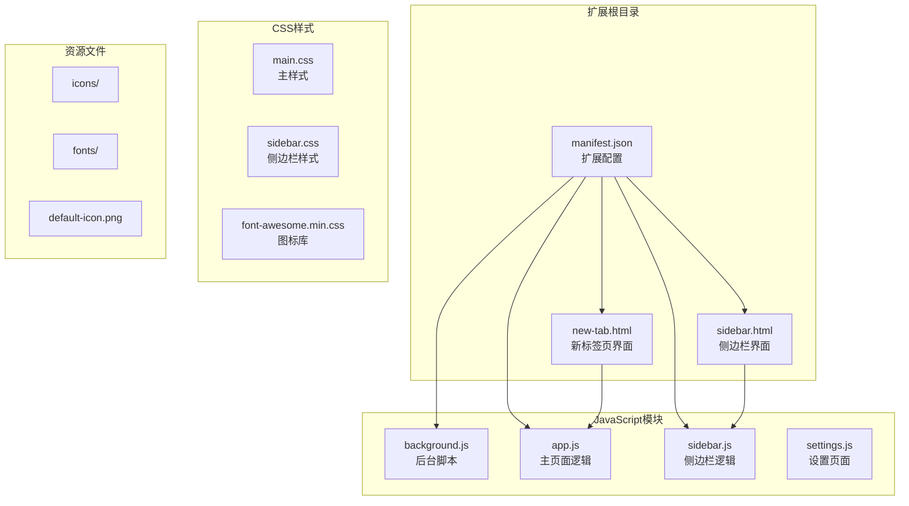

**图表来源**
- [manifest.json:1-38](file://manifest.json#L1-L38)
- [background.js:1-174](file://js/background.js#L1-L174)
- [new-tab.html:1-206](file://new-tab.html#L1-L206)
- [sidebar.html:1-51](file://sidebar.html#L1-L51)

**章节来源**
- [manifest.json:1-38](file://manifest.json#L1-L38)
- [README.md:132-154](file://README.md#L132-L154)

## 核心组件分析

### Chrome Extension API 权限配置

后台脚本模块使用了以下关键的 Chrome Extension API：

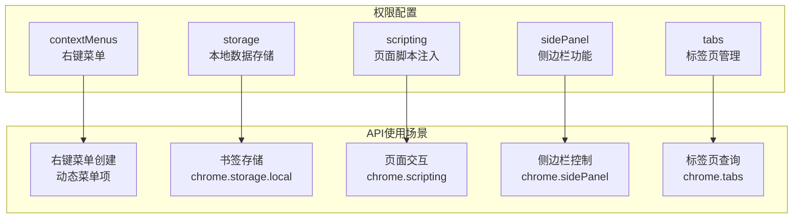

**图表来源**
- [manifest.json:9-15](file://manifest.json#L9-L15)
- [background.js:7-37](file://js/background.js#L7-L37)

### 右键菜单系统

后台脚本实现了三个主要的右键菜单功能：

1. **添加到书签白板** - 添加当前页面
2. **添加链接到书签白板** - 添加特定链接
3. **打开书签白板侧边栏** - 打开侧边栏界面

**章节来源**
- [background.js:8-31](file://js/background.js#L8-L31)

## 架构概览

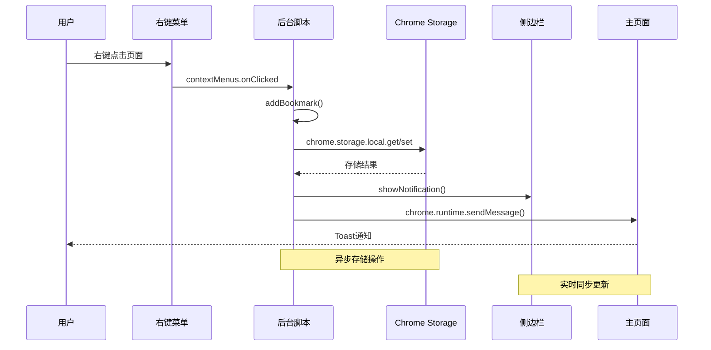

**图表来源**
- [background.js:40-109](file://js/background.js#L40-L109)
- [app.js:311-317](file://js/app.js#L311-L317)

## 详细组件分析

### 右键菜单创建与处理

后台脚本在扩展安装时创建右键菜单：

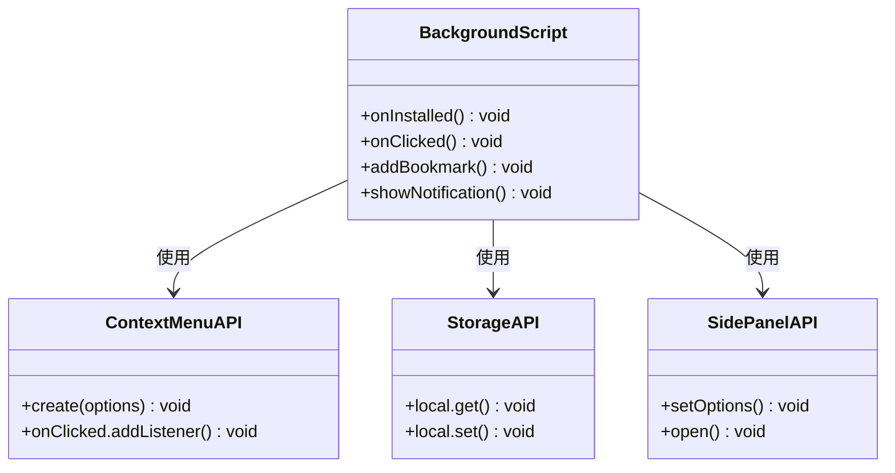

**图表来源**
- [background.js:7-37](file://js/background.js#L7-L37)
- [background.js:40-69](file://js/background.js#L40-L69)

#### 菜单创建逻辑

右键菜单的创建遵循以下模式：

1. **页面右键菜单** - 添加当前页面到书签白板
2. **链接右键菜单** - 添加特定链接到书签白板  
3. **页面右键菜单** - 打开书签白板侧边栏

每个菜单项都有特定的配置参数，包括：
- `id`: 菜单项唯一标识符
- `title`: 菜单项显示文本
- `contexts`: 触发上下文（page/link）
- `documentUrlPatterns`: URL模式匹配

**章节来源**
- [background.js:8-31](file://js/background.js#L8-L31)

#### 菜单点击处理

菜单点击事件处理器根据菜单项 ID 分派到不同的处理逻辑：

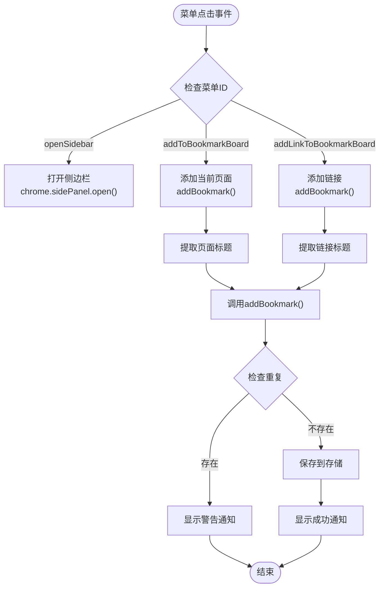

**图表来源**
- [background.js:40-69](file://js/background.js#L40-L69)
- [background.js:72-109](file://js/background.js#L72-L109)

**章节来源**
- [background.js:40-109](file://js/background.js#L40-L109)

### 书签添加系统

书签添加系统实现了智能的标题提取和去重检查：

#### 标题提取策略

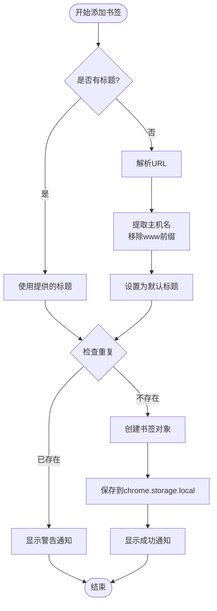

**图表来源**
- [background.js:72-109](file://js/background.js#L72-L109)

#### 去重检查机制

系统通过比较现有书签的 URL 来防止重复添加：

1. **获取现有书签** - 从 `chrome.storage.local` 读取
2. **遍历检查** - 对比每个书签的 URL
3. **重复处理** - 显示警告通知并终止操作
4. **新书签处理** - 添加到数组开头并保存

**章节来源**
- [background.js:92-108](file://js/background.js#L92-L108)

### 通知系统

后台脚本实现了基于 `chrome.scripting` API 的页面通知系统：

#### 通知显示机制

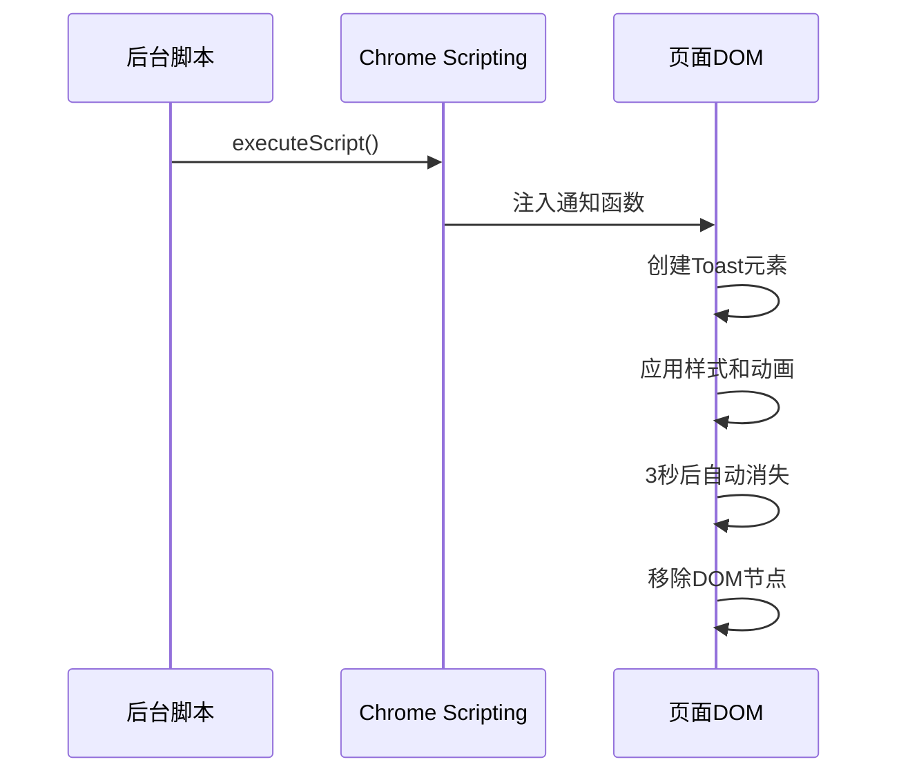

**图表来源**
- [background.js:112-167](file://js/background.js#L112-L167)

#### 通知类型

系统支持两种通知类型：
- **成功通知** - 绿色背景，对勾图标
- **警告通知** - 黄色背景，感叹号图标

通知具有以下特性：
- 居中显示在页面顶部
- 淡入淡出动画效果
- 3秒自动消失
- 300毫秒渐隐动画

**章节来源**
- [background.js:112-167](file://js/background.js#L112-L167)

### 侧边栏控制功能

后台脚本负责侧边栏的启用和控制：

#### 侧边栏启用

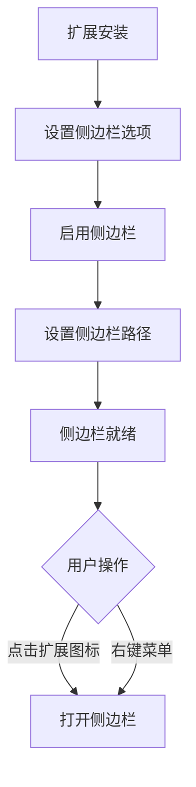

**图表来源**
- [background.js:32-37](file://js/background.js#L32-L37)
- [background.js:169-173](file://js/background.js#L169-L173)

#### 侧边栏打开逻辑

侧边栏通过两种方式打开：
1. **扩展图标点击** - `chrome.action.onClicked`
2. **右键菜单选择** - `chrome.contextMenus.onClicked`

两种方式都调用 `chrome.sidePanel.open()` 方法，Chrome 会自动处理重复打开的情况。

**章节来源**
- [background.js:32-37](file://js/background.js#L32-L37)
- [background.js:169-173](file://js/background.js#L169-L173)

## 依赖关系分析

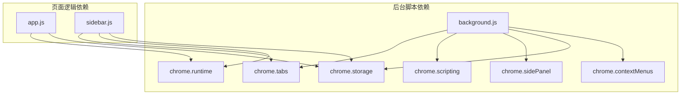

**图表来源**
- [background.js:1-174](file://js/background.js#L1-L174)
- [app.js:117-121](file://js/app.js#L117-L121)
- [sidebar.js:136-140](file://js/sidebar.js#L136-L140)

### 数据流分析

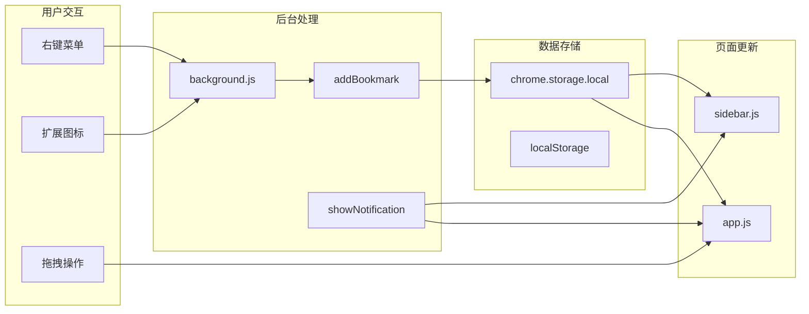

**图表来源**
- [background.js:40-109](file://js/background.js#L40-L109)
- [app.js:117-121](file://js/app.js#L117-L121)
- [sidebar.js:144-149](file://js/sidebar.js#L144-L149)

**章节来源**
- [background.js:40-109](file://js/background.js#L40-L109)
- [app.js:117-121](file://js/app.js#L117-L121)
- [sidebar.js:144-149](file://js/sidebar.js#L144-L149)

## 性能考虑

### 异步操作优化

后台脚本采用了多种异步操作优化策略：

1. **Promise 链式调用** - 避免回调地狱
2. **批量存储操作** - 减少存储 API 调用次数
3. **延迟初始化** - 页面加载时的延迟渲染

### 内存管理

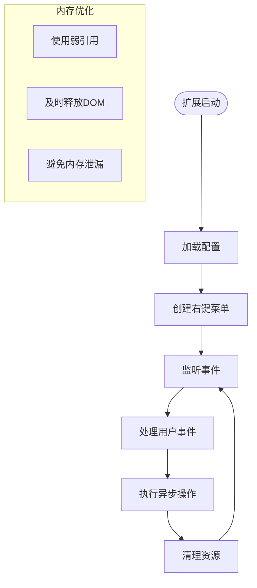

### 错误处理策略

后台脚本实现了多层次的错误处理：

1. **URL 解析异常** - 使用 try-catch 包装
2. **存储操作失败** - 捕获并记录错误
3. **页面脚本注入失败** - 使用 `.catch()` 处理 Promise 拒绝

**章节来源**
- [background.js:60-66](file://js/background.js#L60-L66)
- [background.js:164-166](file://js/background.js#L164-L166)

## 故障排除指南

### 常见问题诊断

#### 右键菜单不显示

**可能原因**：
1. 扩展未正确安装
2. 权限不足
3. Chrome 版本兼容性问题

**解决方案**：
1. 完全卸载后重新安装扩展
2. 检查 `manifest.json` 中的权限配置
3. 确认 Chrome 版本支持 Manifest V3

#### 书签添加失败

**可能原因**：
1. URL 格式不正确
2. 存储空间不足
3. 权限被拒绝

**解决方案**：
1. 验证 URL 格式（必须包含协议）
2. 检查 Chrome 存储配额
3. 重新授予存储权限

#### 通知不显示

**可能原因**：
1. 页面脚本注入失败
2. DOM 加载时机问题
3. 权限不足

**解决方案**：
1. 检查 `chrome.scripting` 权限
2. 确保页面 DOM 已加载
3. 验证 `manifest.json` 配置

### 调试技巧

#### 开发者工具使用

1. **扩展页面** - 访问 `chrome://extensions/` 查看后台脚本
2. **控制台日志** - 使用 `console.log()` 输出调试信息
3. **存储检查** - 在 `chrome://extensions/` 的存储面板查看数据

#### 日志记录

后台脚本包含了完善的错误处理和日志记录：

```javascript
try {
  // 可能失败的操作
} catch (e) {
  console.error('操作失败:', e);
}
```

**章节来源**
- [README.md:248-258](file://README.md#L248-L258)
- [GUIDE.md:393-398](file://GUIDE.md#L393-L398)

## 结论

书签白板的后台脚本模块展现了现代 Chrome Extension 开发的最佳实践。通过合理使用 Chrome Extension API，实现了功能丰富且用户体验良好的书签管理工具。

### 主要优势

1. **权限最小化** - 仅使用必要的权限，保护用户隐私
2. **异步处理** - 采用异步编程模式，避免阻塞主线程
3. **错误处理** - 完善的错误捕获和处理机制
4. **实时同步** - 通过存储监听实现实时数据同步

### 技术亮点

1. **右键菜单系统** - 动态创建和灵活处理
2. **通知系统** - 基于页面脚本注入的通知显示
3. **侧边栏集成** - 与 Chrome 侧边栏 API 的无缝集成
4. **数据持久化** - 基于 Chrome Storage 的可靠存储

### 改进建议

1. **性能监控** - 添加性能指标收集
2. **错误报告** - 实现自动错误上报机制
3. **国际化支持** - 添加多语言支持
4. **配置管理** - 实现用户配置的持久化

该后台脚本模块为 Chrome Extension 开发提供了优秀的参考实现，展示了如何在受限的扩展环境中实现复杂的功能需求。