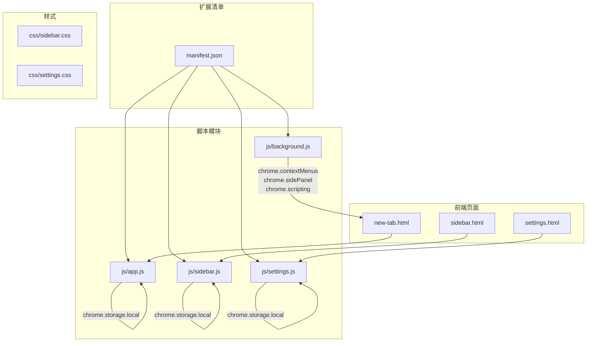
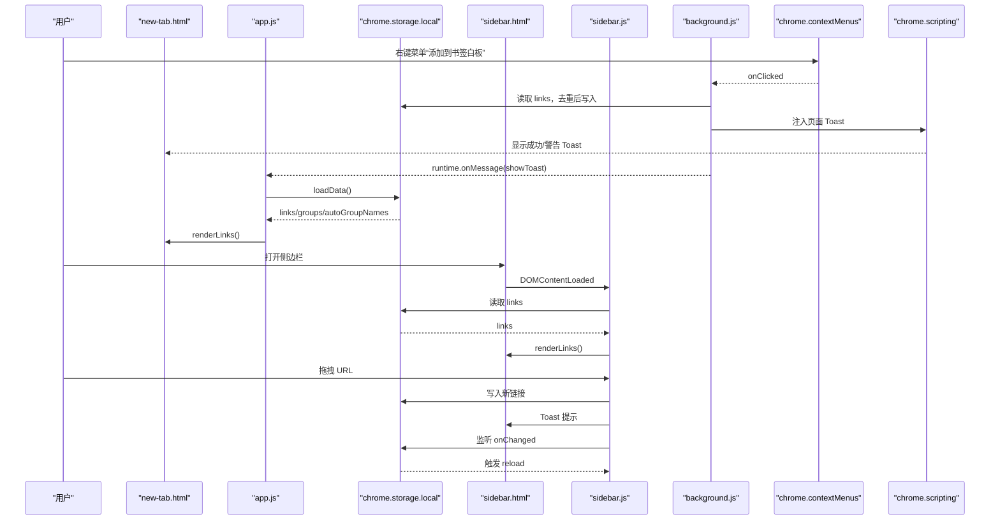
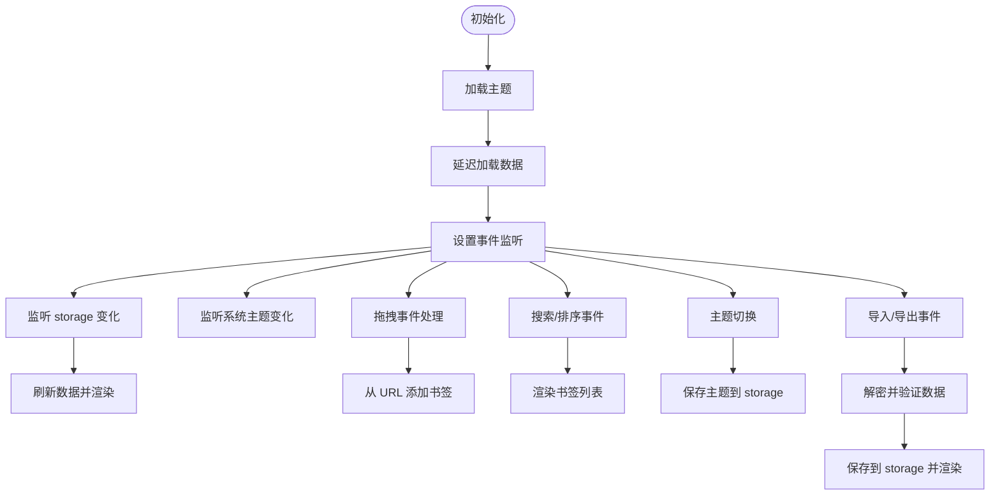
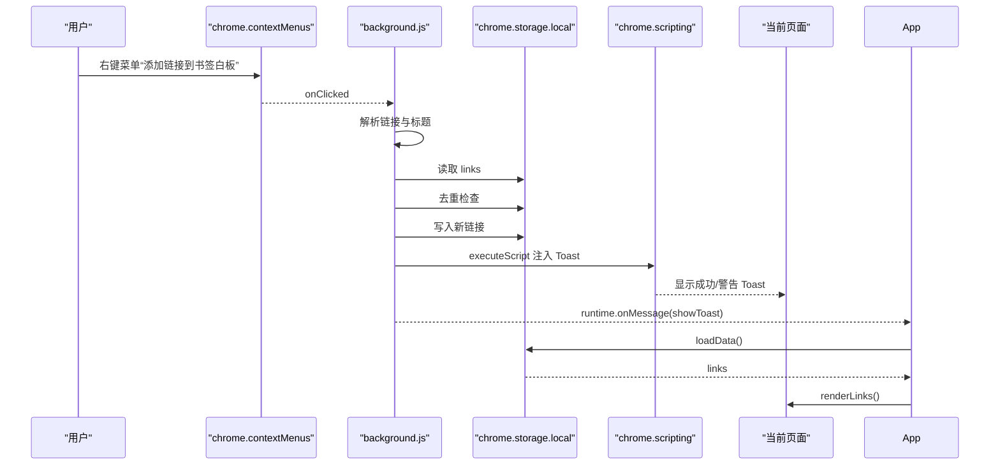
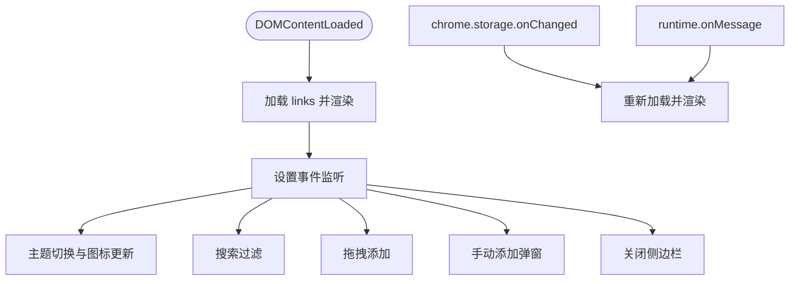
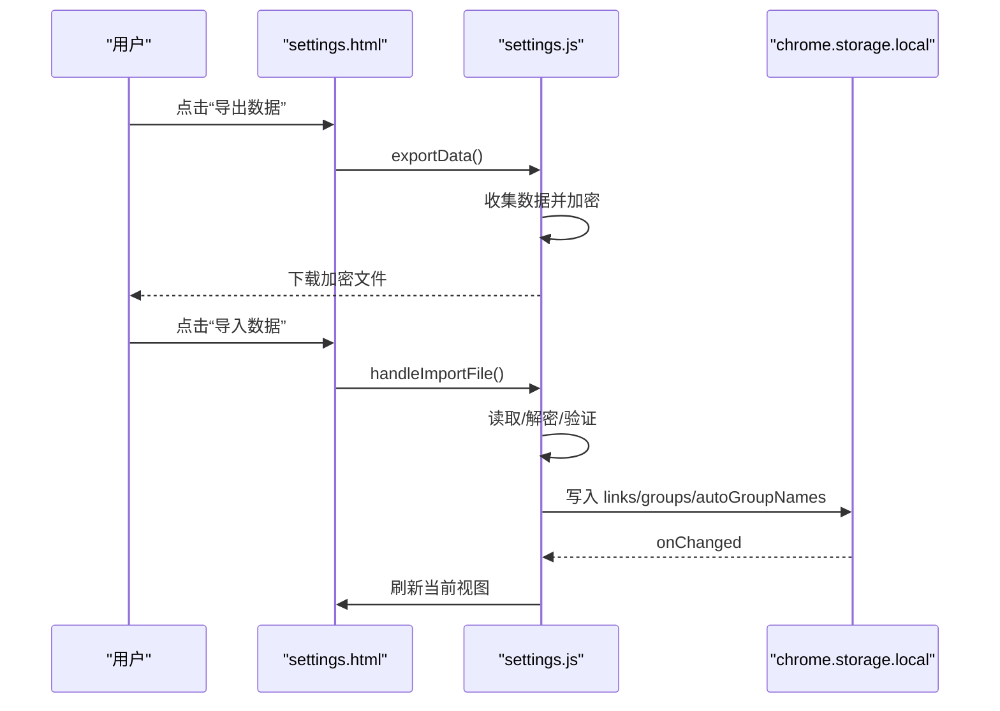
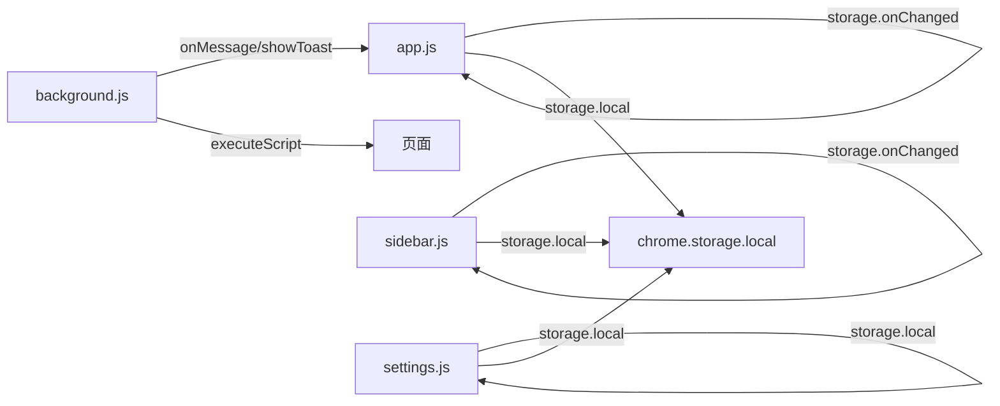

# 核心模块详解

<cite>
**本文引用的文件**
- [manifest.json](file://manifest.json)
- [new-tab.html](file://new-tab.html)
- [sidebar.html](file://sidebar.html)
- [settings.html](file://settings.html)
- [js/app.js](file://js/app.js)
- [js/background.js](file://js/background.js)
- [js/sidebar.js](file://js/sidebar.js)
- [js/settings.js](file://js/settings.js)
- [css/sidebar.css](file://css/sidebar.css)
- [css/settings.css](file://css/settings.css)
</cite>

## 目录
1. [简介](#简介)
2. [项目结构](#项目结构)
3. [核心组件](#核心组件)
4. [架构总览](#架构总览)
5. [详细组件分析](#详细组件分析)
6. [依赖关系分析](#依赖关系分析)
7. [性能考量](#性能考量)
8. [故障排查指南](#故障排查指南)
9. [结论](#结论)
10. [附录](#附录)

## 简介
本文件对书签白板项目的四大核心模块进行深度技术分析，涵盖主应用模块（app.js）、后台脚本（background.js）、侧边栏模块（sidebar.js）与设置模块（settings.js）。重点解析：
- 数据管理与持久化策略（Chrome Storage）
- UI 渲染机制与移动端适配
- 事件处理与消息通信（Runtime、Storage、ContextMenus、SidePanel）
- 右键菜单与通知系统
- 实时数据同步与主题切换
- 配置管理、数据导入导出与用户偏好存储
- 模块间协作与最佳实践

## 项目结构
项目采用 Manifest V3 架构，以 HTML + 原生 CSS + 原生 JS 的轻量实现，强调本地存储与隐私优先。关键入口与职责如下：
- manifest.json：声明权限、服务工作线程、侧边栏路径、图标与 CSP
- new-tab.html：主界面入口，承载书签展示、搜索、排序、分组与空状态
- sidebar.html：侧边栏入口，支持拖拽添加、主题切换、搜索与手动添加
- settings.html：设置页面入口，提供书签管理、分组管理、数据导入导出等
- js/app.js：主应用逻辑，负责数据加载、渲染、事件绑定、主题与导入导出
- js/background.js：后台脚本，负责右键菜单、通知注入与侧边栏控制
- js/sidebar.js：侧边栏逻辑，负责主题、拖拽、存储监听与 Toast
- js/settings.js：设置页面逻辑，负责导航、批量操作、分组管理、数据导入导出与加密

图表来源
- [manifest.json:1-38](file://manifest.json#L1-L38)
- [new-tab.html:1-206](file://new-tab.html#L1-L206)
- [sidebar.html:1-51](file://sidebar.html#L1-L51)
- [settings.html:1-281](file://settings.html#L1-L281)
- [js/app.js:1-1514](file://js/app.js#L1-L1514)
- [js/background.js:1-174](file://js/background.js#L1-L174)
- [js/sidebar.js:1-602](file://js/sidebar.js#L1-L602)
- [js/settings.js:1-1216](file://js/settings.js#L1-L1216)

章节来源
- [manifest.json:1-38](file://manifest.json#L1-L38)
- [new-tab.html:1-206](file://new-tab.html#L1-L206)
- [sidebar.html:1-51](file://sidebar.html#L1-L51)
- [settings.html:1-281](file://settings.html#L1-L281)

## 核心组件
- 主应用模块（app.js）
  - 数据管理：链接与分组数组、域名缓存、自动分组自定义名称
  - UI 渲染：分组标签、视图切换（全部/置顶/最近）、排序、空状态
  - 事件处理：拖拽添加、搜索、排序、主题切换、提示栏隐藏、手动添加、导入导出
  - 实时同步：监听 storage 变化自动刷新；监听后台消息显示 Toast 并刷新
  - 主题：快速加载与系统跟随
- 后台脚本（background.js）
  - 右键菜单：页面/链接添加、打开侧边栏
  - 通知系统：通过 scripting 注入页面 Toast，区分成功/警告
  - 侧边栏控制：启用侧边栏、点击图标打开侧边栏
- 侧边栏模块（sidebar.js）
  - 主题：独立 localStorage 控制，跟随系统主题
  - 拖拽：支持拖拽 URL 到侧边栏添加
  - 存储监听：监听 storage 变化自动刷新
  - Toast：独立的 Toast 实现
  - 手动添加：弹窗获取 URL/标题/图标
- 设置模块（settings.js）
  - 导航：左侧菜单与右侧内容区切换
  - 批量操作：批量选择、全选/取消全选、批量删除、批量添加分组
  - 分组管理：自动生成自动分组、编辑/删除分组
  - 数据管理：导出（含加密）、导入（含解密）、统计
  - 页面内弹窗：编辑书签/分组、确认对话框、分组选择弹窗

章节来源
- [js/app.js:1-1514](file://js/app.js#L1-L1514)
- [js/background.js:1-174](file://js/background.js#L1-L174)
- [js/sidebar.js:1-602](file://js/sidebar.js#L1-L602)
- [js/settings.js:1-1216](file://js/settings.js#L1-L1216)

## 架构总览
整体采用“页面 + 模块 + 本地存储”的架构，模块间通过 Chrome 扩展 API 进行松耦合通信，保证数据一致性与用户体验。

图表来源
- [js/background.js:1-174](file://js/background.js#L1-L174)
- [js/app.js:1-1514](file://js/app.js#L1-L1514)
- [js/sidebar.js:1-602](file://js/sidebar.js#L1-L602)
- [manifest.json:1-38](file://manifest.json#L1-L38)

## 详细组件分析

### 主应用模块（app.js）深度解析
- 数据管理与持久化
  - links：书签数组，包含 groups、pinned、clickCount、lastAccessed 等字段
  - groups：分组数组，支持自定义分组与自动分组
  - autoGroupNames：自动分组的自定义显示名称映射
  - domainCache：域名解析缓存，提升渲染性能
  - 保存策略：统一通过 chrome.storage.local.set 批量保存，变更后清理缓存
- UI 渲染机制
  - 分组标签：动态生成“全部分组”与自定义/自动分组标签，支持点击切换
  - 视图切换：全部/置顶/最近三个 Tab，分别渲染不同子集
  - 排序：支持按创建时间、标题、点击次数排序
  - 空状态：根据视图与数据状态显示不同空状态与引导按钮
  - 防 FOUC：页面加载完成后添加 loaded 类，延迟加载数据
- 事件处理流程
  - 拖拽添加：dragover/dragleave/drop，解析 URL，查询标签页标题，调用 addLinkFromUrl
  - 搜索与排序：输入事件与选择框变更触发 renderLinks
  - 主题切换：切换根元素 dark 类，保存到 local storage
  - 提示栏隐藏：保存 tipHidden 到 storage，下次不再显示
  - 手动添加：弹窗输入 URL，校验后添加
  - 导入导出：支持文件选择、解密、验证、确认覆盖、保存并刷新
- 实时同步与消息通信
  - 监听 chrome.storage.onChanged，本地数据变化时自动 loadData
  - 监听 runtime.onMessage，接收后台脚本的 showToast 并刷新
  - 监听系统主题变化，仅在未手动设置时跟随系统
- 设计模式与复杂度
  - 策略模式：排序策略由 sortBy 字段驱动
  - 观察者模式：chrome.storage.onChanged 作为事件源
  - 命令模式：addLinkFromUrl、editGroup、deleteGroup 等封装具体操作
  - 时间复杂度：渲染 O(n)，搜索 O(n*m)，排序 O(n log n)，域名解析 O(1) 均摊

图表来源
- [js/app.js:1-1514](file://js/app.js#L1-L1514)

章节来源
- [js/app.js:1-1514](file://js/app.js#L1-L1514)

### 后台脚本（background.js）深度解析
- 右键菜单创建与处理
  - 页面右键菜单：添加当前页面到书签白板
  - 链接右键菜单：添加链接到书签白板，优先使用选中文本或链接文本
  - 打开侧边栏：上下文菜单项，直接打开侧边栏
- 通知系统实现
  - 通过 chrome.scripting.executeScript 在目标页面注入 Toast
  - 成功/警告两类样式，自动消失
  - 失败时捕获异常并记录日志
- 侧边栏控制
  - setOptions 启用侧边栏并指定默认路径
  - action.onClicked 点击扩展图标打开侧边栏
- 数据处理
  - addBookmark：去重检查、标题提取、图标生成、写入 storage
  - showNotification：注入页面 Toast

图表来源
- [js/background.js:1-174](file://js/background.js#L1-L174)
- [manifest.json:1-38](file://manifest.json#L1-L38)

章节来源
- [js/background.js:1-174](file://js/background.js#L1-L174)
- [manifest.json:1-38](file://manifest.json#L1-L38)

### 侧边栏模块（sidebar.js）深度解析
- 主题与独立存储
  - 优先使用 localStorage 中的 darkMode，否则跟随系统主题
  - 独立的 toggleTheme 与 updateThemeIcon，不依赖主应用主题
- 拖拽与添加
  - dragover/dragleave/drop 处理 URL 拖拽
  - 标题优先来自匹配标签页，否则使用域名，限制长度
  - 图标优先来自 favIconUrl，否则生成默认 favicon URL
- 实时同步
  - 监听 storage.onChanged，自动刷新列表
  - 监听 runtime.onMessage，接收 showToast 并刷新
- 性能优化
  - SIDEBAR_DISPLAY_LIMIT 限制渲染数量
  - requestAnimationFrame 分批渲染，避免卡顿
  - getFilteredLinks 支持搜索过滤
- UI 交互
  - 手动添加弹窗：输入 URL/标题，自动获取网站信息
  - Toast：固定位置，滑入动画，自动消失
  - 关闭侧边栏：window.close，支持 runtime.onMessage 接收外部关闭指令

图表来源
- [js/sidebar.js:1-602](file://js/sidebar.js#L1-L602)

章节来源
- [js/sidebar.js:1-602](file://js/sidebar.js#L1-L602)
- [css/sidebar.css:1-287](file://css/sidebar.css#L1-L287)

### 设置模块（settings.js）深度解析
- 导航与菜单状态
  - 左侧导航项与右侧内容区切换
  - 本地存储记录上次打开的菜单项，重启后恢复
- 批量操作
  - 批量模式：复选框、全选/取消全选、批量删除、批量添加分组
  - 选中集合：Set 结构维护选中项
- 分组管理
  - 自动生成自动分组（基于域名，出现次数≥2）
  - 编辑/删除分组（自动分组不可删除）
  - 自定义分组名称缓存到 autoGroupNames
- 数据管理
  - 导出：收集 links、groups、autoGroupNames、settings，加密后下载
  - 导入：读取文件、解密、验证、确认覆盖、保存并刷新
  - 统计：书签总数、分组总数、总访问次数
- 页面内弹窗
  - 编辑书签/分组弹窗
  - 确认对话框
  - 分组选择弹窗（单选）

图表来源
- [js/settings.js:1-1216](file://js/settings.js#L1-L1216)
- [settings.html:1-281](file://settings.html#L1-L281)

章节来源
- [js/settings.js:1-1216](file://js/settings.js#L1-L1216)
- [settings.html:1-281](file://settings.html#L1-L281)
- [css/settings.css:1-1037](file://css/settings.css#L1-L1037)

## 依赖关系分析
- 权限与能力
  - storage：本地数据持久化
  - contextMenus：右键菜单
  - tabs：获取当前标签页信息
  - scripting：向页面注入脚本（通知）
  - sidePanel：侧边栏启用与打开
- 模块间通信
  - app ↔ background：runtime.onMessage（showToast）
  - app/side ← storage：chrome.storage.onChanged（自动刷新）
  - background → page：chrome.scripting.executeScript（注入 Toast）
  - app/side → storage：chrome.storage.local.set/get
  - settings → storage：批量导出/导入
- 外部依赖
  - manifest.json 声明权限与 side_panel
  - CSS 通过变量与暗色主题类实现主题切换

图表来源
- [js/background.js:1-174](file://js/background.js#L1-L174)
- [js/app.js:1-1514](file://js/app.js#L1-L1514)
- [js/sidebar.js:1-602](file://js/sidebar.js#L1-L602)
- [js/settings.js:1-1216](file://js/settings.js#L1-L1216)
- [manifest.json:1-38](file://manifest.json#L1-L38)

章节来源
- [manifest.json:1-38](file://manifest.json#L1-L38)

## 性能考量
- 渲染优化
  - app.js：防 FOUC，延迟加载数据；分组/视图/排序均触发局部渲染
  - sidebar.js：SIDEBAR_DISPLAY_LIMIT 限制渲染数量；requestAnimationFrame 分批渲染
- 数据访问优化
  - app.js：domainCache 缓存域名解析结果，减少 URL 解析成本
  - settings.js：批量操作使用 Set 维护选中项，O(1) 查找
- 事件处理优化
  - app.js：事件委托用于分组标签与视图切换，减少监听器数量
  - sidebar.js：拖拽事件仅在 board 上注册，避免全局监听
- 存储与 IO
  - 统一使用 chrome.storage.local，避免频繁写入；批量保存
  - settings.js 导出/导入采用异步文件读取与解密，避免阻塞主线程

## 故障排查指南
- 右键菜单无效
  - 检查 manifest.json permissions 是否包含 contextMenus
  - 确认 background.js 是否正确创建菜单项
- 通知不显示
  - 检查 scripting 权限与 executeScript 调用是否抛错
  - 确认页面是否允许注入脚本（CSP）
- 侧边栏无法打开
  - 检查 side_panel.default_path 与 action.default_popup 配置
  - 确认 chrome.sidePanel.setOptions 与 open 调用
- 数据不同步
  - 确认 chrome.storage.onChanged 监听是否生效
  - 检查 storage 写入是否成功，是否存在并发写入冲突
- 导入失败
  - 检查文件格式与加密版本，确认解密流程
  - 确认 JSON 结构包含 links 与 groups 字段

章节来源
- [js/background.js:1-174](file://js/background.js#L1-L174)
- [js/app.js:1-1514](file://js/app.js#L1-L1514)
- [js/sidebar.js:1-602](file://js/sidebar.js#L1-L602)
- [js/settings.js:1-1216](file://js/settings.js#L1-L1216)
- [manifest.json:1-38](file://manifest.json#L1-L38)

## 结论
书签白板项目以 Manifest V3 为基础，通过清晰的模块划分与扩展 API 的合理运用，实现了：
- 高可用的本地数据管理与实时同步
- 丰富的交互体验（拖拽、右键菜单、通知、主题切换）
- 良好的移动端适配与性能优化
- 完整的配置管理与数据导入导出能力

建议后续增强方向：
- 设置页面更多功能（外观、排序、搜索、隐私与快捷操作）
- 批量操作的撤销与历史记录
- 更细粒度的错误边界与用户提示
- 数据迁移与版本兼容性策略

## 附录
- 代码注释解读
  - app.js：大量注释解释了主题加载、FOUC 防护、拖拽处理、导入导出流程
  - background.js：右键菜单创建、通知注入、侧边栏控制
  - sidebar.js：主题独立存储、拖拽添加、Toast 实现、手动添加弹窗
  - settings.js：导航状态恢复、批量操作、分组自动生成、数据导入导出与加密
- 设计模式应用
  - 观察者模式：chrome.storage.onChanged
  - 命令模式：addLinkFromUrl、editGroup、deleteGroup、saveData
  - 策略模式：sortBy 驱动的排序策略
- 性能优化技巧
  - 域名缓存、分批渲染、限制渲染数量、事件委托、异步文件处理