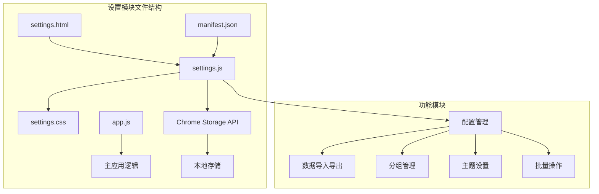
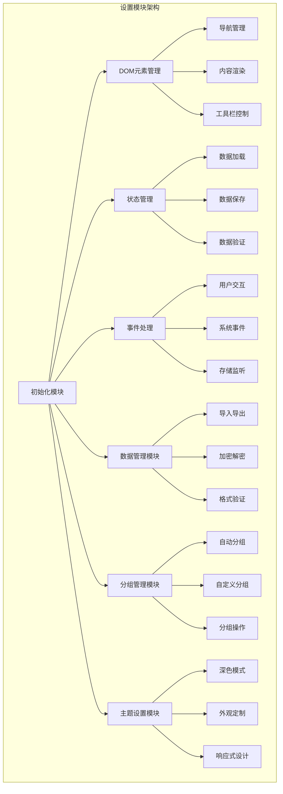
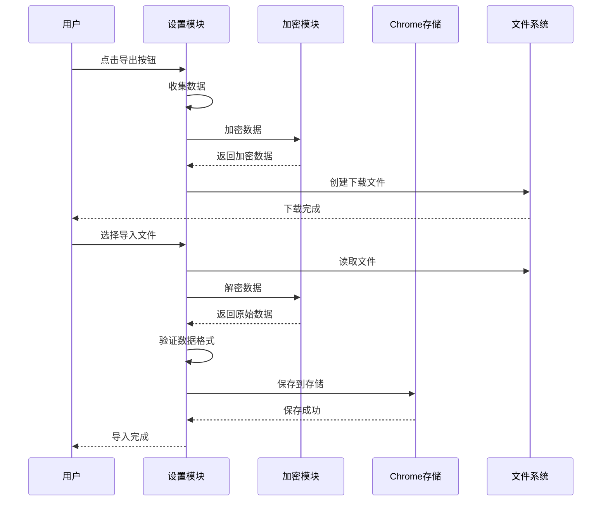
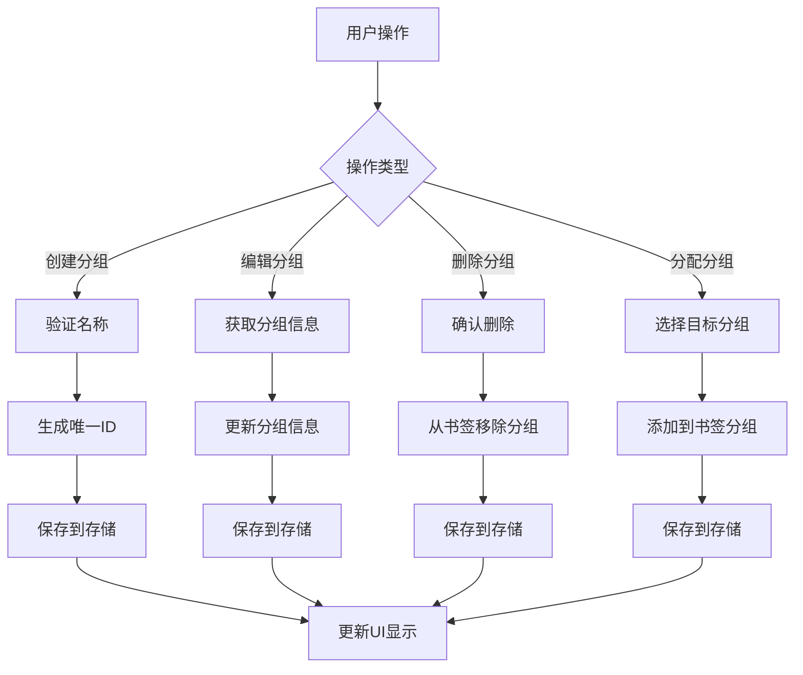
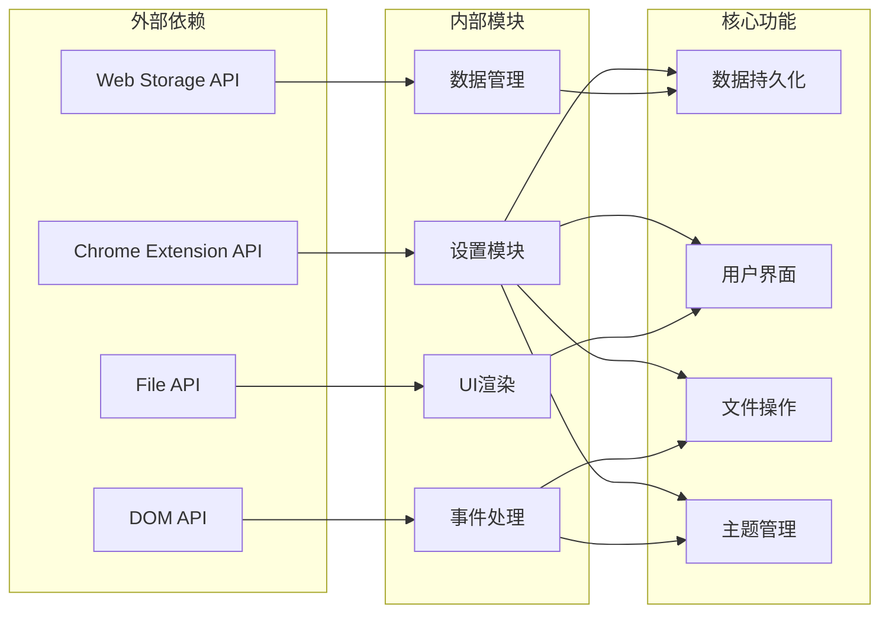

# 设置模块 (settings.js) 技术文档

<cite>
**本文档引用的文件**
- [settings.js](file://js/settings.js)
- [settings.html](file://settings.html)
- [settings.css](file://css/settings.css)
- [app.js](file://js/app.js)
- [manifest.json](file://manifest.json)
</cite>

## 目录
1. [简介](#简介)
2. [项目结构](#项目结构)
3. [核心组件](#核心组件)
4. [架构概览](#架构概览)
5. [详细组件分析](#详细组件分析)
6. [依赖关系分析](#依赖关系分析)
7. [性能考虑](#性能考虑)
8. [故障排除指南](#故障排除指南)
9. [结论](#结论)
10. [附录](#附录)

## 简介

书签白板项目的设置模块是一个功能完整的配置管理界面，提供了用户偏好设置的存储和读取机制、数据导入导出功能、分组管理界面、主题和外观设置等功能。该模块采用现代化的前端架构，结合Chrome扩展API实现本地数据持久化，并通过自定义加密算法确保数据安全。

## 项目结构

设置模块位于项目根目录的js子目录中，主要包含以下文件：
- `settings.js`: 设置页面的主要JavaScript逻辑
- `settings.html`: 设置页面的HTML结构
- `settings.css`: 设置页面的样式表
- 相关的辅助文件：`app.js`、`manifest.json`等

**图表来源**
- [settings.html:1-281](file://settings.html#L1-L281)
- [settings.js:1-65](file://settings.js#L1-L65)

**章节来源**
- [settings.html:1-281](file://settings.html#L1-L281)
- [manifest.json:1-38](file://manifest.json#L1-L38)

## 核心组件

设置模块由多个核心组件构成，每个组件都有明确的职责和功能边界：

### DOM元素管理器
负责管理设置页面的所有DOM元素，包括导航栏、内容区域、工具栏等。通过集中管理DOM元素，实现了清晰的组件分离和更好的代码维护性。

### 状态管理系统
维护着应用的核心状态，包括书签数据、分组信息、搜索过滤条件、排序规则等。使用Map和Set数据结构优化了性能表现。

### 事件监听器系统
实现了完整的事件处理机制，包括键盘事件、鼠标事件、存储变化监听等，确保用户交互的流畅性和响应性。

### 数据持久化层
基于Chrome扩展的存储API，实现了可靠的数据持久化机制，支持本地存储和同步存储两种模式。

**章节来源**
- [settings.js:16-65](file://settings.js#L16-L65)
- [settings.js:95-110](file://settings.js#L95-L110)

## 架构概览

设置模块采用了模块化的架构设计，将不同的功能域分离到独立的函数和模块中：

**图表来源**
- [settings.js:27-65](file://settings.js#L27-L65)
- [settings.js:112-155](file://settings.js#L112-L155)

## 详细组件分析

### 数据导入导出模块

数据导入导出功能是设置模块的核心特性之一，实现了完整的数据备份和恢复机制：

#### 导出流程
1. **数据收集**: 收集所有书签、分组和配置信息
2. **数据序列化**: 将对象转换为JSON格式
3. **数据加密**: 应用多层加密算法保护数据
4. **文件生成**: 创建可下载的加密文件

#### 导入流程
1. **文件读取**: 读取用户选择的备份文件
2. **数据解密**: 解密加密的数据内容
3. **数据验证**: 验证数据格式和完整性
4. **数据恢复**: 将数据恢复到应用中

**图表来源**
- [settings.js:1037-1076](file://settings.js#L1037-L1076)
- [settings.js:1078-1150](file://settings.js#L1078-L1150)

#### 加密算法实现
设置模块实现了自定义的多层加密算法，确保数据的安全性：

1. **UTF-8编码**: 将字符串转换为字节数组
2. **Base64编码**: 将二进制数据转换为ASCII字符
3. **XOR混淆**: 使用固定密钥进行异或运算
4. **二次Base64编码**: 确保输出为可打印字符

**章节来源**
- [settings.js:1037-1076](file://settings.js#L1037-L1076)
- [settings.js:1152-1215](file://settings.js#L1152-L1215)

### 分组管理模块

分组管理功能提供了灵活的书签组织能力，支持自动分组和自定义分组：

#### 自动分组机制
系统会根据书签的域名自动生成分组，当同一域名的书签数量达到阈值时自动创建分组。

#### 分组操作
- **创建分组**: 支持用户创建新的自定义分组
- **编辑分组**: 允许修改分组名称
- **删除分组**: 支持删除自定义分组
- **分组分配**: 将书签分配到指定分组

**图表来源**
- [settings.js:534-710](file://settings.js#L534-L710)
- [settings.js:712-733](file://settings.js#L712-L733)

**章节来源**
- [settings.js:534-710](file://settings.js#L534-L710)
- [settings.js:712-733](file://settings.js#L712-L733)

### 批量操作模块

批量操作功能提供了高效的书签管理能力：

#### 批量管理模式
- **选择模式**: 用户可以选择多个书签进行批量操作
- **操作模式**: 支持批量删除、批量分组等操作
- **状态管理**: 维护选择状态和操作进度

#### 批量操作类型
- **全选/取消全选**: 快速选择所有书签
- **批量删除**: 删除选中的书签
- **批量分组**: 将选中的书签添加到指定分组

**章节来源**
- [settings.js:417-531](file://settings.js#L417-L531)

### 主题和外观设置

设置模块提供了完整的主题和外观定制功能：

#### 深色模式支持
- **系统检测**: 自动检测用户的系统主题偏好
- **手动切换**: 允许用户手动切换主题模式
- **状态持久化**: 保存用户的主题选择

#### 响应式设计
- **移动端适配**: 支持移动设备的触摸操作
- **自适应布局**: 根据屏幕尺寸调整界面布局
- **触控优化**: 优化触摸设备的用户体验

**章节来源**
- [settings.js:84-92](file://settings.js#L84-L92)
- [settings.css:1002-1036](file://settings.css#L1002-L1036)

## 依赖关系分析

设置模块的依赖关系相对简单且清晰，主要依赖于Chrome扩展API和标准Web技术：

**图表来源**
- [manifest.json:9-15](file://manifest.json#L9-L15)
- [settings.js:176-182](file://settings.js#L176-L182)

### 权限管理
设置模块需要以下Chrome扩展权限：
- `storage`: 访问Chrome本地存储
- `contextMenus`: 访问上下文菜单
- `tabs`: 访问浏览器标签页
- `scripting`: 注入脚本
- `sidePanel`: 访问侧边面板

**章节来源**
- [manifest.json:9-15](file://manifest.json#L9-L15)
- [settings.js:176-182](file://settings.js#L176-L182)

## 性能考虑

设置模块在设计时充分考虑了性能优化，采用了多种技术和策略：

### 缓存机制
- **域名缓存**: 使用Map缓存解析的域名，避免重复计算
- **DOM缓存**: 缓存常用的DOM元素引用
- **数据缓存**: 缓存渲染结果，减少重复计算

### 异步处理
- **异步加载**: 数据加载采用异步方式，避免阻塞UI
- **延迟渲染**: 非关键内容采用延迟渲染策略
- **防抖处理**: 输入事件采用防抖机制，提高响应性能

### 内存管理
- **垃圾回收**: 及时清理不再使用的DOM节点
- **事件解绑**: 在适当时候解绑事件监听器
- **数据清理**: 定期清理过期的数据和缓存

**章节来源**
- [settings.js:193-207](file://settings.js#L193-L207)
- [settings.js:176-191](file://settings.js#L176-L191)

## 故障排除指南

### 常见问题及解决方案

#### 数据导入失败
**问题症状**: 导入备份文件时出现错误提示
**可能原因**:
- 文件格式不正确
- 文件已损坏
- 加密密钥不匹配
- 数据格式不符合要求

**解决步骤**:
1. 检查文件扩展名是否为.json
2. 验证文件完整性
3. 确认使用正确的备份文件
4. 检查文件是否被第三方软件修改

#### 数据导出异常
**问题症状**: 导出过程中出现错误或文件无法下载
**可能原因**:
- 浏览器阻止下载
- 存储空间不足
- 网络连接问题
- 文件名冲突

**解决步骤**:
1. 检查浏览器下载设置
2. 确认有足够的磁盘空间
3. 重新尝试导出操作
4. 更改文件保存位置

#### 主题切换问题
**问题症状**: 主题切换后样式未更新
**可能原因**:
- 缓存问题
- CSS文件加载失败
- JavaScript执行错误
- 浏览器兼容性问题

**解决步骤**:
1. 清除浏览器缓存
2. 重新加载页面
3. 检查CSS文件路径
4. 查看浏览器控制台错误

#### 批量操作失效
**问题症状**: 批量选择或操作按钮无响应
**可能原因**:
- JavaScript执行错误
- DOM元素未正确加载
- 事件监听器冲突
- 浏览器兼容性问题

**解决步骤**:
1. 检查浏览器控制台错误
2. 刷新页面重试
3. 禁用其他扩展程序
4. 更新到最新版本

**章节来源**
- [settings.js:1078-1150](file://settings.js#L1078-L1150)
- [settings.js:866-909](file://settings.js#L866-L909)

## 结论

书签白板项目的设置模块展现了现代Web应用开发的最佳实践。通过模块化的架构设计、完善的错误处理机制、高效的性能优化策略，实现了功能丰富且用户体验优秀的配置管理界面。

该模块的主要优势包括：
- **功能完整性**: 涵盖了用户配置管理的所有核心需求
- **安全性保障**: 通过自定义加密算法确保数据安全
- **性能优化**: 采用多种技术手段提升运行效率
- **用户体验**: 提供直观易用的界面和流畅的操作体验
- **可扩展性**: 良好的架构设计便于后续功能扩展

未来可以在以下方面进一步改进：
- 增强主题系统的灵活性
- 优化大数据量场景下的性能表现
- 扩展更多配置选项和自定义功能
- 改进错误处理和用户提示机制

## 附录

### 开发指南

#### 扩展设置项
要为设置模块添加新的配置项，需要遵循以下步骤：
1. 在HTML中添加相应的UI元素
2. 在JavaScript中添加对应的处理逻辑
3. 更新数据持久化机制
4. 添加必要的样式和动画效果

#### 数据迁移最佳实践
当需要进行数据结构变更时，建议：
1. 保持向后兼容性
2. 提供数据迁移脚本
3. 进行充分的测试验证
4. 提供回滚机制

#### 性能优化技巧
- 使用虚拟滚动处理大量数据
- 实现智能缓存策略
- 优化DOM操作频率
- 减少不必要的重绘和回流