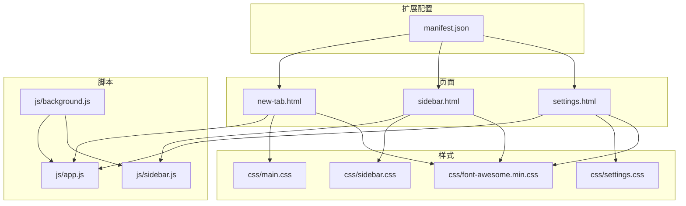
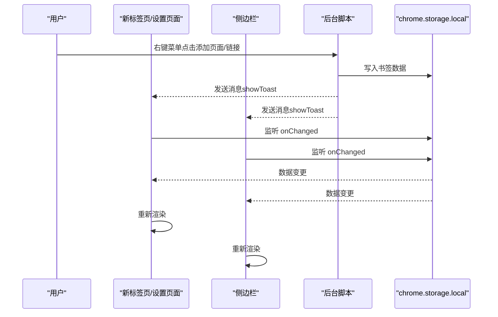
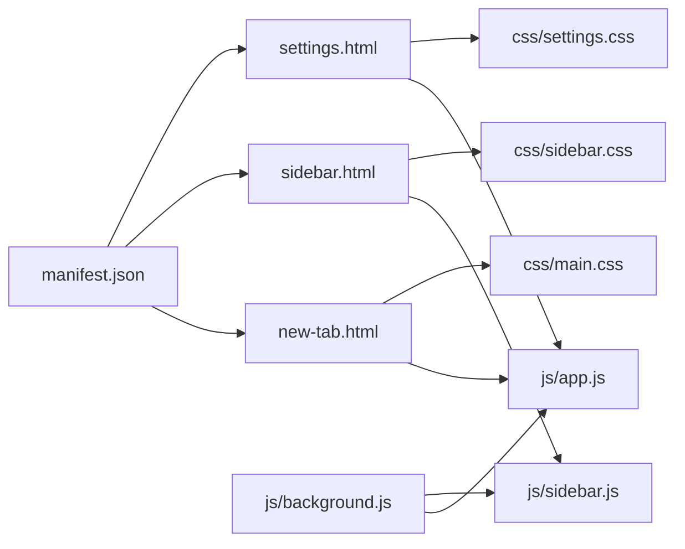

# 快速开始

<cite>
**本文引用的文件**
- [README.md](file://README.md)
- [GUIDE.md](file://GUIDE.md)
- [manifest.json](file://manifest.json)
- [new-tab.html](file://new-tab.html)
- [sidebar.html](file://sidebar.html)
- [settings.html](file://settings.html)
- [js/app.js](file://js/app.js)
- [js/sidebar.js](file://js/sidebar.js)
- [js/background.js](file://js/background.js)
- [css/main.css](file://css/main.css)
- [UPDATE_LOG.md](file://UPDATE_LOG.md)
</cite>

## 目录
1. [简介](#简介)
2. [项目结构](#项目结构)
3. [核心组件](#核心组件)
4. [架构总览](#架构总览)
5. [详细组件分析](#详细组件分析)
6. [依赖关系分析](#依赖关系分析)
7. [性能与体验](#性能与体验)
8. [故障排除指南](#故障排除指南)
9. [结语](#结语)

## 简介
书签白板是一个基于 Chrome 扩展（Manifest V3）的本地书签管理工具，强调隐私与效率。它提供三种使用入口：新标签页主界面、侧边栏、右键菜单；支持拖拽、右键菜单、一键添加、手动添加等多种添加方式；具备卡片式布局、实时搜索、批量操作、置顶与最近添加分区、深/浅色主题切换等能力。所有数据保存在浏览器本地存储中，无需网络连接，保护你的隐私。

## 项目结构
- 扩展配置：manifest.json
- 页面文件：new-tab.html（新标签页主界面）、sidebar.html（侧边栏）、settings.html（设置页面）
- 样式文件：css/main.css（主样式）、css/sidebar.css（侧边栏样式）、css/settings.css（设置样式）、css/font-awesome.min.css（图标库）
- 脚本文件：js/app.js（主页面逻辑）、js/sidebar.js（侧边栏逻辑）、js/background.js（后台脚本，右键菜单与消息通信）

图表来源
- [manifest.json](file://manifest.json)
- [new-tab.html](file://new-tab.html)
- [sidebar.html](file://sidebar.html)
- [settings.html](file://settings.html)
- [js/app.js](file://js/app.js)
- [js/sidebar.js](file://js/sidebar.js)
- [js/background.js](file://js/background.js)
- [css/main.css](file://css/main.css)
- [css/sidebar.css](file://css/sidebar.css)
- [css/settings.css](file://css/settings.css)
- [css/font-awesome.min.css](file://css/font-awesome.min.css)

章节来源
- [README.md: 132-154:132-154](file://README.md#L132-L154)
- [manifest.json: 1-38:1-38](file://manifest.json#L1-L38)

## 核心组件
- 新标签页主界面：卡片式展示、搜索、排序、分组筛选、分区视图（所有书签、置顶、最近添加）、主题切换、提示栏、空状态与导入入口。
- 侧边栏：移动端风格、搜索、一键添加当前页面、手动添加、拖拽添加、编辑/删除、独立主题切换、实时同步。
- 右键菜单与后台脚本：页面右键添加当前页、链接右键添加链接、打开侧边栏、向页面注入 Toast 通知、跨页面消息同步。
- 设置页面：书签管理（列表、搜索、批量）、分组管理、数据管理（导出/导入）、外观与主题、显示与排序、搜索与筛选、隐私与安全、快捷操作、关于。

章节来源
- [README.md: 9-131:9-131](file://README.md#L9-L131)
- [GUIDE.md: 36-145:36-145](file://GUIDE.md#L36-L145)

## 架构总览
书签白板采用“页面逻辑 + 后台脚本 + 本地存储”的典型 Chrome 扩展架构。页面通过 Chrome Storage API 读写数据，通过 chrome.storage.onChanged 实现实时同步；后台脚本负责右键菜单、侧边栏控制、向页面注入通知；页面之间通过消息传递保持状态一致。

图表来源
- [js/background.js: 6-37:6-37](file://js/background.js#L6-L37)
- [js/background.js: 39-69:39-69](file://js/background.js#L39-L69)
- [js/app.js: 116-121:116-121](file://js/app.js#L116-L121)
- [js/sidebar.js: 142-149:142-149](file://js/sidebar.js#L142-L149)

章节来源
- [README.md: 156-193:156-193](file://README.md#L156-L193)
- [manifest.json: 9-25:9-25](file://manifest.json#L9-L25)

## 详细组件分析

### 安装与首次使用
- Chrome 扩展安装（推荐）
  - 步骤：打开扩展页面 → 开启开发者模式 → 加载已解压的扩展程序 → 选择项目根目录 → 完成。
- 首次使用流程
  - 打开新标签页 → 自动显示书签白板主界面
  - 点击工具栏图标 → 打开侧边栏
  - 右键任意网页 → 添加到书签白板

章节来源
- [README.md: 53-77:53-77](file://README.md#L53-L77)
- [GUIDE.md: 38-52:38-52](file://GUIDE.md#L38-L52)

### 三种主要使用方式
- 新标签页主界面：卡片式布局、搜索、排序、分组筛选、分区视图、主题切换、提示栏、空状态与导入入口。
- 侧边栏：移动端风格、搜索、一键添加当前页面、手动添加、拖拽添加、编辑/删除、独立主题切换、实时同步。
- 右键菜单：页面空白处右键添加当前页、链接右键添加该链接、任意位置右键打开侧边栏。

章节来源
- [README.md: 63-77:63-77](file://README.md#L63-L77)
- [GUIDE.md: 304-336:304-336](file://GUIDE.md#L304-L336)

### 添加书签的五种方式
- 拖拽添加：从地址栏、网页链接、书签栏拖拽到页面或侧边栏，自动提取标题与图标。
- 右键菜单 - 添加页面：在空白处右键 → 添加到书签白板。
- 右键菜单 - 添加链接：在链接上右键 → 添加链接到书签白板。
- 侧边栏一键添加：打开侧边栏 → 点击 ➕ 按钮 → 自动添加当前页面。
- 手动添加：点击“手动添加书签”按钮 → 输入 URL（需包含 http(s)）→ 支持自定义标题。

章节来源
- [README.md: 80-106:80-106](file://README.md#L80-L106)
- [GUIDE.md: 57-86:57-86](file://GUIDE.md#L57-L86)

### 管理书签的基本操作
- 打开链接：点击卡片在新标签页打开。
- 编辑名称：点击卡片上的编辑按钮，支持 Enter 确认、ESC 取消。
- 删除书签：点击卡片上的删除按钮，弹窗确认。
- 置顶书签：右键卡片 → 选择“置顶此书签”，置顶书签在“置顶”分区优先显示。
- 搜索与筛选：搜索框实时过滤标题与 URL；支持分组筛选与分区切换。
- 批量操作：进入设置页面的书签管理，支持全选/取消全选、批量删除、批量移动分组。

章节来源
- [README.md: 107-113:107-113](file://README.md#L107-L113)
- [GUIDE.md: 89-110:89-110](file://GUIDE.md#L89-L110)

### 侧边栏使用方法
- 打开方式：点击工具栏扩展图标或右键菜单选择“打开书签白板侧边栏”。
- 功能：浏览所有书签（移动端样式，一行一个）、搜索、一键添加当前页面、编辑/删除、手动添加、独立主题切换。
- 实时同步：使用 chrome.storage.onChanged 实时同步，无需手动刷新。

章节来源
- [README.md: 114-125:114-125](file://README.md#L114-L125)
- [GUIDE.md: 304-321:304-321](file://GUIDE.md#L304-L321)

### 主题切换功能
- 自动跟随系统：首次使用自动检测系统主题偏好，系统切换时自动同步（若未手动设置）。
- 手动切换：点击顶部“🌙/☀️”图标立即切换深色/浅色主题，设置保存到本地。
- 独立主题：侧边栏拥有独立主题切换，不影响主页面主题。

章节来源
- [README.md: 126-131:126-131](file://README.md#L126-L131)
- [GUIDE.md: 284-301:284-301](file://GUIDE.md#L284-L301)

### 数据存储与导入导出（设置页面）
- 数据存储：所有书签数据存储在 chrome.storage.local，包含 links、groups、autoGroupNames、主题设置等。
- 导出数据：导出完整的 JSON 文件，包含书签、分组、访问次数、配置等，并进行四层加密。
- 导入数据：选择之前导出的 JSON 文件，解密并验证数据，确认后覆盖当前所有数据。

章节来源
- [README.md: 171-187:171-187](file://README.md#L171-L187)
- [GUIDE.md: 256-281:256-281](file://GUIDE.md#L256-L281)

## 依赖关系分析
- manifest.json 声明权限与入口：storage、contextMenus、tabs、scripting、sidePanel；新标签页覆盖、侧边栏默认路径、扩展图标。
- 页面依赖：new-tab.html 依赖 js/app.js；sidebar.html 依赖 js/sidebar.js；settings.html 依赖 js/app.js（设置页面逻辑在 app.js 中实现）。
- 后台脚本：js/background.js 负责右键菜单、侧边栏控制、向页面注入通知、消息通信。
- 样式依赖：各页面引入对应的 CSS 文件，main.css 提供主题变量与基础样式。

图表来源
- [manifest.json: 1-38:1-38](file://manifest.json#L1-L38)
- [new-tab.html](file://new-tab.html)
- [sidebar.html](file://sidebar.html)
- [settings.html](file://settings.html)
- [js/app.js](file://js/app.js)
- [js/sidebar.js](file://js/sidebar.js)
- [js/background.js](file://js/background.js)
- [css/main.css](file://css/main.css)
- [css/sidebar.css](file://css/sidebar.css)
- [css/settings.css](file://css/settings.css)

章节来源
- [manifest.json: 9-25:9-25](file://manifest.json#L9-L25)
- [README.md: 156-169:156-169](file://README.md#L156-L169)

## 性能与体验
- 防止 FOUC：新标签页页面在 CSS 加载完成后显示，避免闪烁。
- DOM 事件优化：拖拽事件使用 dragover/dragleave/drop，避免频繁重绘；侧边栏使用 requestAnimationFrame 分批渲染，限制显示数量（最多 50 个）。
- 主题切换：使用 CSS 变量与类名切换，快速切换深/浅色主题。
- 实时同步：chrome.storage.onChanged 监听数据变化，自动刷新页面，确保一致性。
- 搜索与筛选：支持实时搜索与分组筛选，减少不必要的渲染。

章节来源
- [js/app.js: 56-60:56-60](file://js/app.js#L56-L60)
- [js/sidebar.js: 170-202:170-202](file://js/sidebar.js#L170-L202)
- [css/main.css: 6-42:6-42](file://css/main.css#L6-L42)

## 故障排除指南
- 右键菜单没有显示
  - 原因：扩展未正确注册右键菜单或权限不足。
  - 解决：完全重新安装扩展（移除后重新加载）。
- 书签丢失
  - 原因：清除浏览器数据会删除 chrome.storage.local 中的书签。
  - 解决：使用设置页面的“导出数据”功能定期备份，必要时从备份导入。
- 侧边栏不自动刷新
  - 原因：版本过旧或侧边栏未正确监听存储变化。
  - 解决：确保使用最新版本（v3.2.1+），关闭并重新打开侧边栏。
- 无法拖拽添加
  - 原因：URL 格式不正确或已存在。
  - 解决：确保拖拽的 URL 有效且未重复添加；检查控制台是否有错误提示。
- 主题切换无效
  - 原因：手动设置了主题后系统主题变化不会覆盖。
  - 解决：点击主题图标切换回自动跟随系统，或再次手动切换。

章节来源
- [README.md: 248-258:248-258](file://README.md#L248-L258)
- [GUIDE.md: 379-410:379-410](file://GUIDE.md#L379-L410)

## 结语
书签白板通过简洁直观的界面与强大的本地存储能力，帮助你高效整理与管理书签。无论你是通过新标签页主界面、侧边栏还是右键菜单使用，都能获得一致的体验与实时同步。建议定期导出备份，确保数据安全；根据使用习惯选择合适的主题与排序方式，提升日常效率。