# Chrome 扩展架构

<cite>
**本文档引用的文件**
- [manifest.json](file://manifest.json)
- [README.md](file://README.md)
- [js/background.js](file://js/background.js)
- [js/app.js](file://js/app.js)
- [js/sidebar.js](file://js/sidebar.js)
- [js/settings.js](file://js/settings.js)
- [new-tab.html](file://new-tab.html)
- [sidebar.html](file://sidebar.html)
- [settings.html](file://settings.html)
- [css/main.css](file://css/main.css)
</cite>

## 目录
1. [简介](#简介)
2. [项目结构](#项目结构)
3. [核心组件](#核心组件)
4. [架构概览](#架构概览)
5. [详细组件分析](#详细组件分析)
6. [依赖关系分析](#依赖关系分析)
7. [性能考量](#性能考量)
8. [故障排除指南](#故障排除指南)
9. [结论](#结论)
10. [附录](#附录)

## 简介

书签白板是一个基于 Chrome 扩展架构的隐私优先型本地书签管理工具。该项目实现了完整的 Manifest V3 标准，提供了现代化的书签管理体验，包括新标签页覆盖、侧边栏功能、右键菜单集成以及完整的数据持久化机制。

该扩展的核心价值在于：
- **隐私优先**：所有数据完全存储在本地 Chrome Storage 中
- **多场景访问**：支持新标签页、侧边栏、右键菜单等多种使用方式
- **现代化界面**：采用响应式设计，支持深色/浅色主题切换
- **高性能实现**：优化的渲染机制和内存管理

## 项目结构

项目采用清晰的模块化组织结构，遵循 Chrome 扩展的标准目录规范：

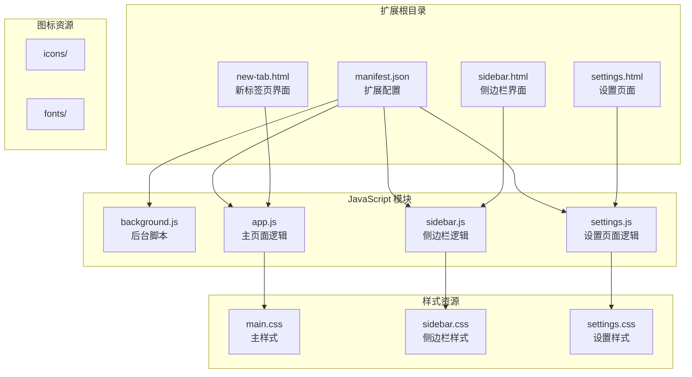

**图表来源**
- [manifest.json:1-38](file://manifest.json#L1-L38)
- [new-tab.html:1-206](file://new-tab.html#L1-L206)
- [sidebar.html:1-51](file://sidebar.html#L1-L51)
- [settings.html:1-281](file://settings.html#L1-L281)

**章节来源**
- [manifest.json:1-38](file://manifest.json#L1-L38)
- [README.md:132-154](file://README.md#L132-L154)

## 核心组件

### Manifest V3 配置详解

扩展的核心配置集中在 manifest.json 文件中，采用 Manifest V3 的现代架构设计：

#### 基础配置参数
- **manifest_version**: 3 - 指定使用 Manifest V3 标准
- **name**: "书签白板" - 扩展显示名称
- **version**: "3.2.1" - 当前版本号
- **description**: 隐私优先的本地书签管理工具 - 功能描述

#### 权限系统设计

扩展实现了最小权限原则，仅请求必要的权限：

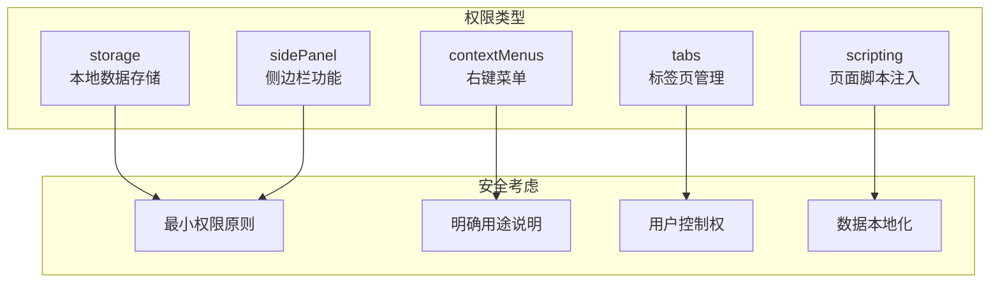

**图表来源**
- [manifest.json:9-15](file://manifest.json#L9-L15)

#### URL 覆盖机制

扩展通过 `chrome_url_overrides` 实现新标签页的完全替换：

- **newtab**: 指向 `new-tab.html`，实现新标签页的自定义界面
- **替代效果**: 用户打开新标签页时直接显示书签白板界面

#### 服务工作线程配置

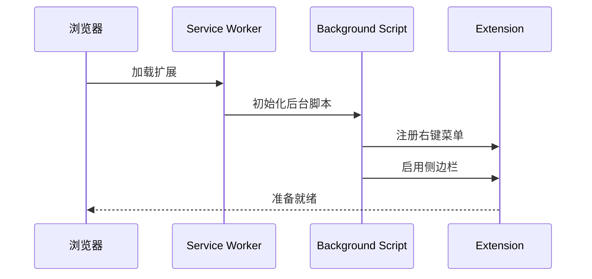

**图表来源**
- [manifest.json:20-22](file://manifest.json#L20-L22)
- [js/background.js:6-37](file://js/background.js#L6-L37)

**章节来源**
- [manifest.json:1-38](file://manifest.json#L1-L38)
- [README.md:158-169](file://README.md#L158-L169)

## 架构概览

书签白板采用分层架构设计，实现了清晰的职责分离：

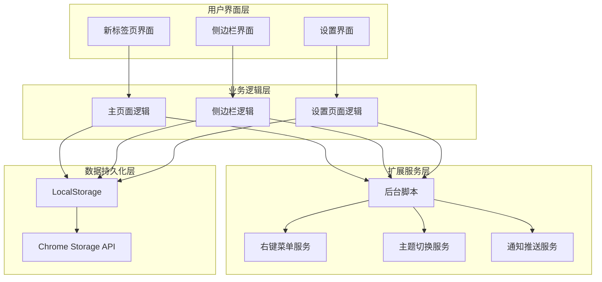

**图表来源**
- [js/app.js:1-800](file://js/app.js#L1-L800)
- [js/sidebar.js:1-602](file://js/sidebar.js#L1-L602)
- [js/background.js:1-174](file://js/background.js#L1-L174)

## 详细组件分析

### 后台脚本 (background.js)

后台脚本是扩展的核心协调者，负责处理跨页面的业务逻辑：

#### 右键菜单系统

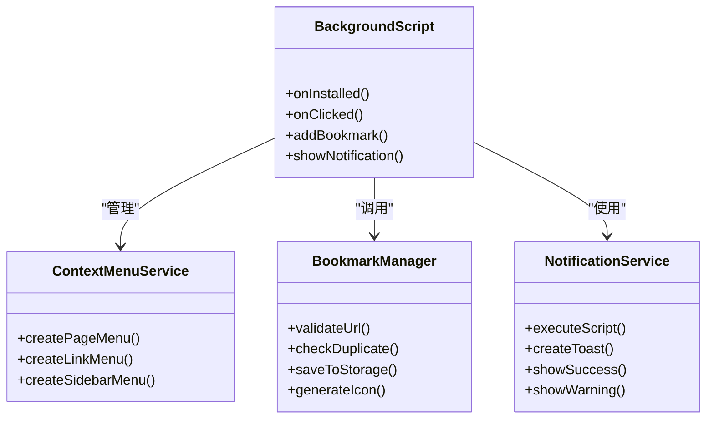

**图表来源**
- [js/background.js:6-37](file://js/background.js#L6-L37)
- [js/background.js:72-109](file://js/background.js#L72-L109)
- [js/background.js:112-167](file://js/background.js#L112-L167)

#### 侧边栏管理

后台脚本负责侧边栏的启用和控制：

- **启用侧边栏**: `chrome.sidePanel.setOptions()` 设置默认路径
- **打开侧边栏**: `chrome.sidePanel.open()` 响应用户操作
- **扩展图标点击**: `chrome.action.onClicked` 监听图标点击事件

**章节来源**
- [js/background.js:1-174](file://js/background.js#L1-L174)

### 主页面逻辑 (app.js)

主页面逻辑处理新标签页的完整功能实现：

#### 数据管理架构

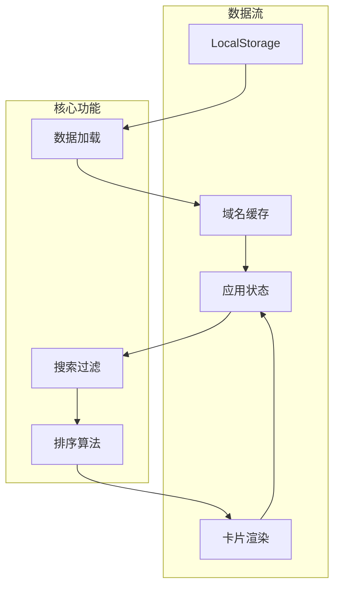

**图表来源**
- [js/app.js:75-106](file://js/app.js#L75-L106)
- [js/app.js:117-121](file://js/app.js#L117-L121)

#### 性能优化策略

应用实现了多项性能优化技术：

- **防 FOUC**: CSS 加载完成后才显示页面内容
- **域名缓存**: 使用 Map 缓存域名解析结果
- **增量渲染**: 大数据集的分批渲染机制
- **内存管理**: 及时清理缓存和事件监听器

**章节来源**
- [js/app.js:1-800](file://js/app.js#L1-L800)

### 侧边栏逻辑 (sidebar.js)

侧边栏提供移动端友好的书签管理界面：

#### 侧边栏特性

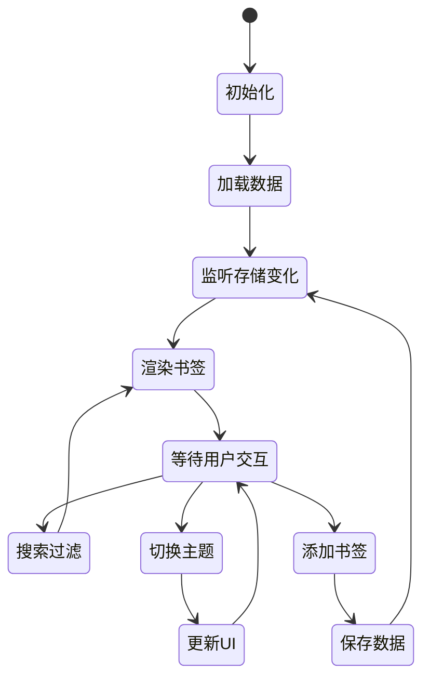

**图表来源**
- [js/sidebar.js:9-16](file://js/sidebar.js#L9-L16)
- [js/sidebar.js:30-41](file://js/sidebar.js#L30-L41)

#### 性能优化实现

侧边栏针对移动端进行了专门优化：

- **显示限制**: 最多显示 50 个书签，提高性能
- **分批渲染**: 使用 requestAnimationFrame 实现分批渲染
- **内存优化**: 及时清理 DOM 节点和事件监听器

**章节来源**
- [js/sidebar.js:1-602](file://js/sidebar.js#L1-L602)

### 设置页面逻辑 (settings.js)

设置页面提供完整的扩展配置管理：

#### 设置模块架构

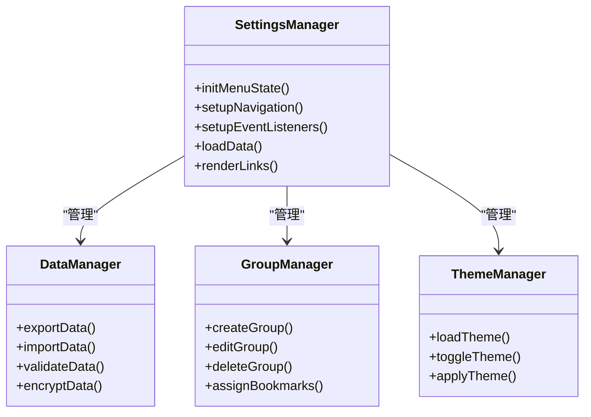

**图表来源**
- [js/settings.js:26-65](file://js/settings.js#L26-L65)
- [js/settings.js:94-110](file://js/settings.js#L94-L110)

**章节来源**
- [js/settings.js:1-200](file://js/settings.js#L1-L200)

## 依赖关系分析

扩展的依赖关系体现了清晰的模块化设计：

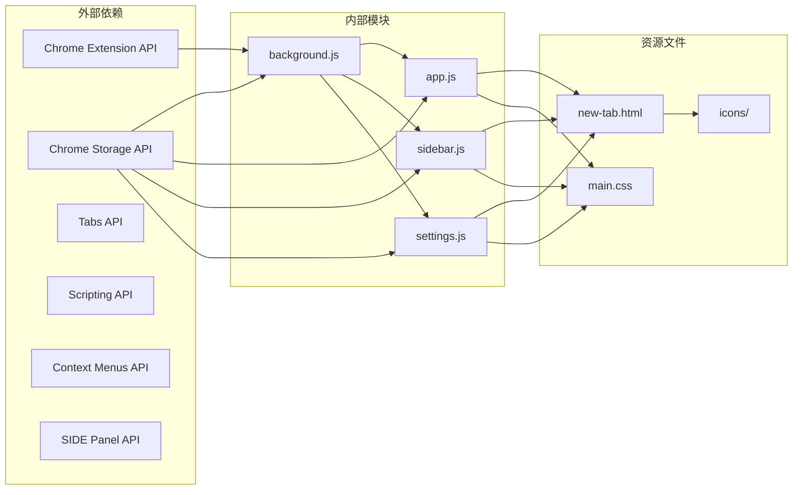

**图表来源**
- [manifest.json:9-19](file://manifest.json#L9-L19)
- [js/background.js:114-116](file://js/background.js#L114-L116)

**章节来源**
- [manifest.json:1-38](file://manifest.json#L1-L38)
- [README.md:41-51](file://README.md#L41-L51)

## 性能考量

### 渲染性能优化

书签白板实现了多项渲染性能优化：

#### 分批渲染机制
- **侧边栏**: 使用 `requestAnimationFrame` 实现分批渲染
- **主页面**: 大数据集的增量渲染，避免界面卡顿
- **域名缓存**: 使用 Map 结构缓存域名解析结果

#### 内存管理策略
- **事件监听器清理**: 及时移除不再使用的事件监听器
- **DOM 节点回收**: 动态创建的节点及时销毁
- **缓存管理**: 定期清理不必要的缓存数据

### 数据存储优化

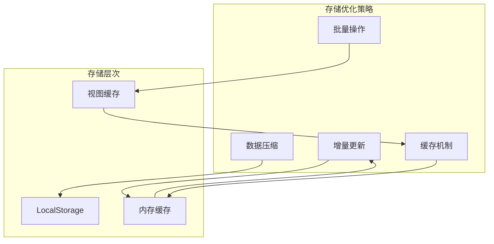

**图表来源**
- [js/app.js:35-49](file://js/app.js#L35-L49)
- [js/sidebar.js:177-202](file://js/sidebar.js#L177-L202)

## 故障排除指南

### 常见问题诊断

#### 右键菜单问题
- **症状**: 右键菜单不显示
- **解决方案**: 完全重新安装扩展（移除后重新加载）

#### 数据丢失问题
- **症状**: 书签数据丢失
- **原因**: 清除浏览器数据导致本地存储清空
- **预防**: 定期备份重要书签数据

#### 侧边栏刷新问题
- **症状**: 侧边栏不自动刷新
- **解决方案**: 确保使用最新版本（v3.2.1+）

### 调试技巧

#### 开发者工具使用
- **扩展页面**: 访问 `chrome://extensions/` 查看扩展状态
- **后台页面**: 检查后台脚本的执行日志
- **存储检查**: 使用 `chrome://extensions/` 的存储查看功能

#### 日志监控
- **后台脚本**: 使用 `console.log()` 输出调试信息
- **页面脚本**: 监控存储变化和事件触发
- **网络请求**: 检查 favicon 获取和数据同步

**章节来源**
- [README.md:248-258](file://README.md#L248-L258)

## 结论

书签白板项目展现了现代 Chrome 扩展开发的最佳实践：

### 技术优势
- **架构清晰**: 分层设计实现了良好的职责分离
- **性能优秀**: 多项优化技术确保了流畅的用户体验
- **安全性强**: 最小权限原则和本地数据存储保护用户隐私
- **可维护性好**: 模块化设计便于功能扩展和 bug 修复

### 设计亮点
- **多场景支持**: 新标签页、侧边栏、右键菜单的无缝集成
- **响应式设计**: 完美适配桌面、平板和移动设备
- **主题系统**: 深色/浅色主题自动切换机制
- **拖拽功能**: 直观的拖拽添加书签体验

### 发展方向
项目为未来的功能扩展奠定了坚实基础，包括：
- 书签分类和分组系统
- 导入/导出功能（JSON格式）
- 键盘快捷键支持
- 数据备份到云端

## 附录

### 安装和使用指南

#### 开发者安装
1. 打开 Chrome 浏览器
2. 访问 `chrome://extensions/`
3. 开启右上角的「开发者模式」
4. 点击「加载已解压的扩展程序」
5. 选择项目根目录
6. 安装完成

#### 使用方式
- **新标签页**: 打开新标签页自动显示书签白板
- **侧边栏**: 点击工具栏扩展图标或右键菜单
- **右键菜单**: 在页面空白处或链接上使用快捷操作

### 权限说明

| 权限 | 用途 | 安全影响 |
|------|------|----------|
| storage | 本地数据存储 | 仅访问扩展自己的数据 |
| contextMenus | 右键菜单功能 | 仅在受支持的上下文中显示 |
| tabs | 标签页管理 | 仅访问当前活动标签页 |
| scripting | 页面脚本注入 | 仅注入扩展自身的脚本 |
| sidePanel | 侧边栏功能 | 仅控制扩展侧边栏 |

### 数据结构

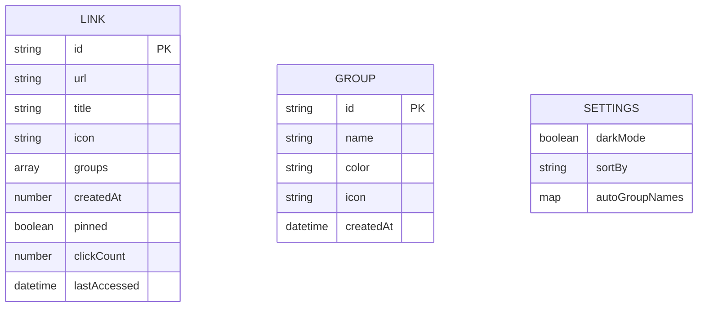

**图表来源**
- [README.md:174-187](file://README.md#L174-L187)