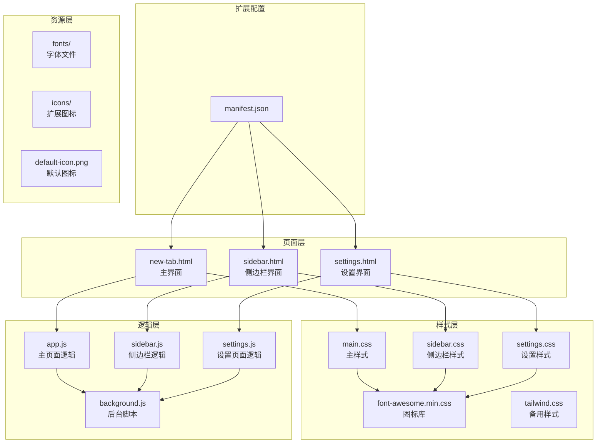
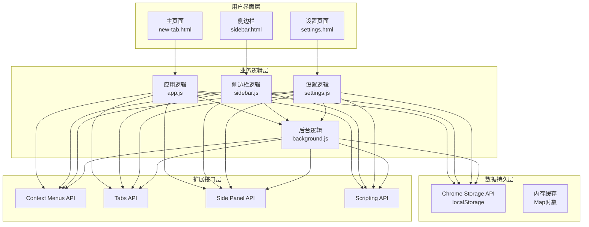
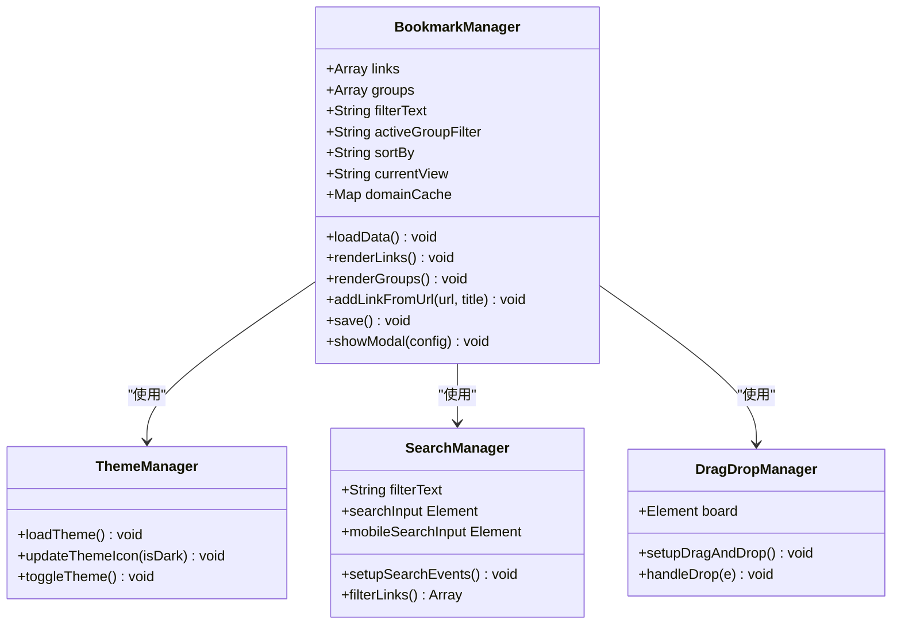
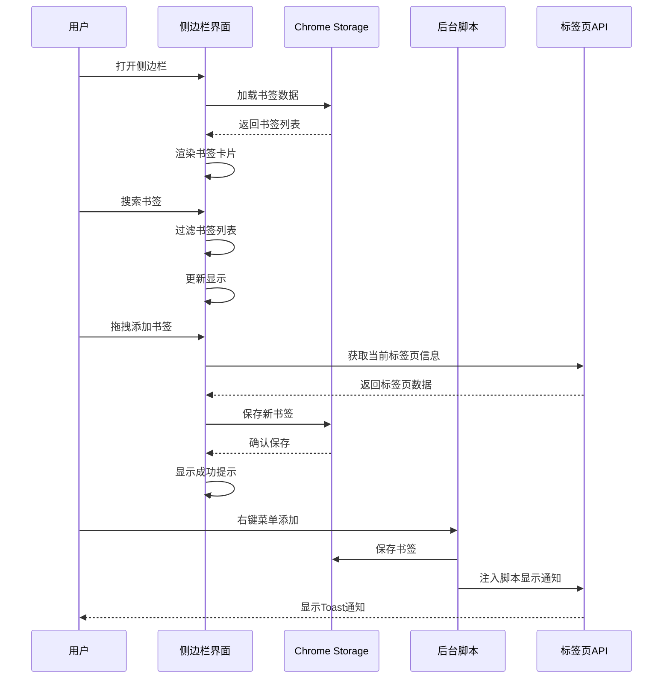
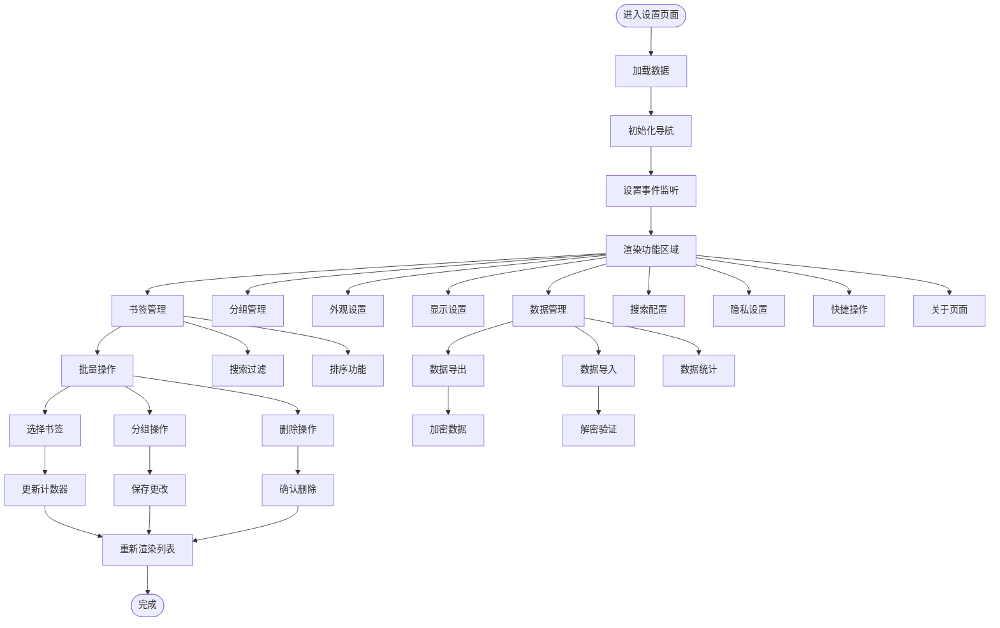
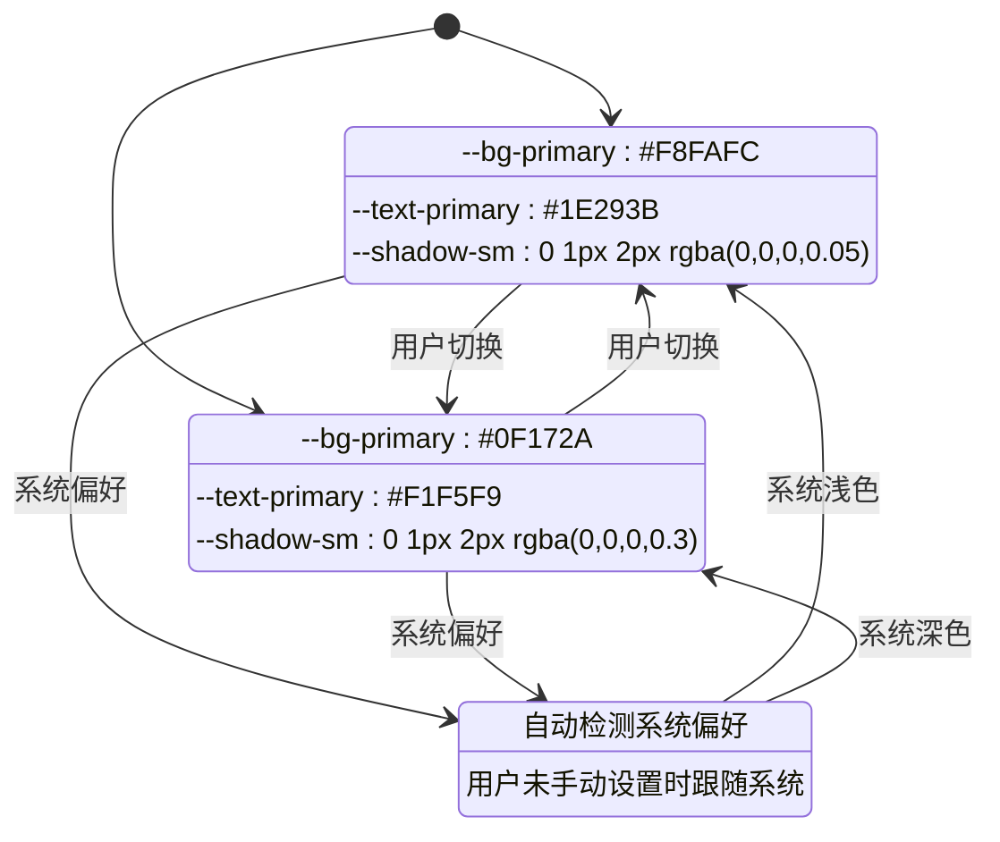
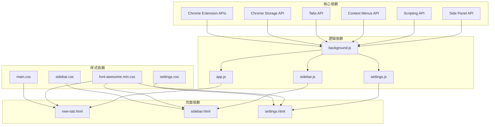

# 前端技术栈

<cite>
**本文档引用的文件**
- [manifest.json](file://manifest.json)
- [README.md](file://README.md)
- [new-tab.html](file://new-tab.html)
- [sidebar.html](file://sidebar.html)
- [settings.html](file://settings.html)
- [main.css](file://css/main.css)
- [sidebar.css](file://css/sidebar.css)
- [settings.css](file://css/settings.css)
- [font-awesome.min.css](file://css/font-awesome.min.css)
- [tailwind.css](file://backup/tailwind.css)
- [app.js](file://js/app.js)
- [sidebar.js](file://js/sidebar.js)
- [settings.js](file://js/settings.js)
- [background.js](file://js/background.js)
</cite>

## 目录
1. [引言](#引言)
2. [项目结构](#项目结构)
3. [核心组件](#核心组件)
4. [架构概览](#架构概览)
5. [详细组件分析](#详细组件分析)
6. [依赖关系分析](#依赖关系分析)
7. [性能考虑](#性能考虑)
8. [故障排除指南](#故障排除指南)
9. [结论](#结论)
10. [附录](#附录)

## 引言

书签白板是一个基于 Chrome 扩展的隐私优先本地书签管理工具。该项目采用原生 HTML5、CSS3 和 JavaScript ES6+ 技术栈，实现了现代化的用户界面和流畅的交互体验。项目的核心设计理念是"无框架依赖"，通过纯原生技术实现完整的功能，同时保持最小的包体积和最佳的性能表现。

## 项目结构

项目采用清晰的模块化组织结构，按照功能和页面类型进行分离：

**图表来源**
- [manifest.json:1-38](file://manifest.json#L1-L38)
- [new-tab.html:1-206](file://new-tab.html#L1-L206)
- [sidebar.html:1-51](file://sidebar.html#L1-L51)
- [settings.html:1-281](file://settings.html#L1-L281)

**章节来源**
- [manifest.json:1-38](file://manifest.json#L1-L38)
- [README.md:132-154](file://README.md#L132-L154)

## 核心组件

### HTML5 结构设计原则

项目严格遵循 HTML5 语义化标签设计原则，每个页面都采用了合理的语义化结构：

**主页面结构特点：**
- 使用 `<header>`、`<main>`、`<footer>` 等语义化标签组织页面结构
- 采用 `<section>` 和 `<article>` 标签区分内容区域
- 使用 `<nav>`、`<aside>` 标签标识导航和辅助内容
- 通过 `lang="zh"` 属性确保正确的语言环境

**可访问性考虑：**
- 所有交互元素都具备适当的 ARIA 属性
- 图标和装饰性元素使用 `alt=""` 属性
- 确保键盘导航的完整性和屏幕阅读器兼容性
- 提供足够的颜色对比度和视觉层次

**章节来源**
- [new-tab.html:25-205](file://new-tab.html#L25-L205)
- [sidebar.html:10-50](file://sidebar.html#L10-L50)
- [settings.html:11-280](file://settings.html#L11-L280)

### CSS3 样式系统

项目采用原生 CSS3 技术，实现了灵活的主题系统和响应式设计：

**CSS 变量系统：**
- 定义了完整的 CSS 变量体系，支持深色/浅色主题切换
- 使用 `:root` 和 `.dark` 类实现主题切换
- 变量涵盖颜色、阴影、间距、字体等多个方面

**响应式设计策略：**
- 采用移动优先的设计理念
- 使用媒体查询实现多断点适配
- 网格布局系统支持从 2 列到 8 列的自适应排列

**动画效果实现：**
- 使用 CSS3 动画和过渡效果提升用户体验
- 实现了淡入、滑动、脉冲等多种动画效果
- 通过 `@keyframes` 定义复杂的动画序列

**章节来源**
- [main.css:6-41](file://css/main.css#L6-L41)
- [main.css:703-771](file://css/main.css#L703-L771)
- [sidebar.css:1-287](file://css/sidebar.css#L1-L287)
- [settings.css:1-800](file://css/settings.css#L1-L800)

### JavaScript ES6+ 应用

项目充分利用现代 JavaScript 语法和 API：

**模块化编程：**
- 每个页面独立的 JavaScript 模块
- 使用 ES6 模块系统进行代码组织
- 通过立即执行函数模式封装作用域

**异步处理：**
- 使用 Promise 和 async/await 处理异步操作
- Chrome 扩展 API 的异步调用处理
- 文件读取和数据导入的异步处理

**现代 API 使用：**
- 使用 `chrome.storage.local` 进行数据持久化
- `chrome.tabs` API 管理浏览器标签页
- `chrome.contextMenus` 实现右键菜单功能
- `chrome.sidePanel` 控制侧边栏显示

**章节来源**
- [app.js:1-800](file://js/app.js#L1-L800)
- [sidebar.js:1-602](file://js/sidebar.js#L1-L602)
- [settings.js:1-800](file://js/settings.js#L1-L800)
- [background.js:1-174](file://js/background.js#L1-L174)

## 架构概览

项目采用 Chrome 扩展的标准架构，结合了多种技术模式：

**图表来源**
- [manifest.json:6-29](file://manifest.json#L6-L29)
- [background.js:7-37](file://background.js#L7-L37)
- [app.js:75-106](file://js/app.js#L75-L106)
- [sidebar.js:30-41](file://js/sidebar.js#L30-L41)

**章节来源**
- [manifest.json:1-38](file://manifest.json#L1-L38)
- [README.md:41-51](file://README.md#L41-L51)

## 详细组件分析

### 主页面组件分析

主页面是书签白板的核心界面，实现了完整的书签管理和展示功能：

**图表来源**
- [app.js:25-34](file://js/app.js#L25-L34)
- [app.js:64-106](file://js/app.js#L64-L106)
- [app.js:108-373](file://js/app.js#L108-L373)

**章节来源**
- [app.js:1-800](file://js/app.js#L1-L800)
- [new-tab.html:25-176](file://new-tab.html#L25-L176)

### 侧边栏组件分析

侧边栏作为移动端优化界面，提供了简洁高效的书签管理体验：

**图表来源**
- [sidebar.js:9-16](file://js/sidebar.js#L9-L16)
- [sidebar.js:151-202](file://js/sidebar.js#L151-L202)
- [background.js:40-69](file://background.js#L40-L69)

**章节来源**
- [sidebar.js:1-602](file://js/sidebar.js#L1-L602)
- [sidebar.html:10-49](file://sidebar.html#L10-L49)

### 设置页面组件分析

设置页面作为管理界面，提供了完整的配置和管理功能：

**图表来源**
- [settings.js:27-65](file://js/settings.js#L27-L65)
- [settings.js:112-155](file://js/settings.js#L112-L155)
- [settings.js:417-531](file://js/settings.js#L417-L531)

**章节来源**
- [settings.js:1-800](file://js/settings.js#L1-L800)
- [settings.html:11-276](file://settings.html#L11-L276)

### 主题切换机制

项目实现了完整的主题切换机制，支持深色/浅色模式的无缝切换：

**图表来源**
- [main.css:28-41](file://css/main.css#L28-L41)
- [app.js:64-73](file://js/app.js#L64-L73)
- [sidebar.js:43-68](file://js/sidebar.js#L43-L68)

**章节来源**
- [main.css:6-41](file://css/main.css#L6-L41)
- [app.js:64-133](file://js/app.js#L64-L133)
- [sidebar.js:43-85](file://js/sidebar.js#L43-L85)

### 字体图标系统

项目集成了 Font Awesome 4.7 图标库，提供了丰富的图标资源：

**图标系统特点：**
- 使用 Font Awesome 4.7 版本，确保向后兼容性
- 通过 CDN 方式引入，减少本地资源占用
- 支持所有 Font Awesome 图标类名
- 与 CSS 变量系统完美集成

**图标使用模式：**
- 使用 `<i>` 标签配合 Font Awesome 类名
- 支持尺寸、旋转、翻转等扩展属性
- 与主题系统结合，自动适配颜色

**章节来源**
- [font-awesome.min.css:1-200](file://css/font-awesome.min.css#L1-L200)
- [new-tab.html:21](file://new-tab.html#L21)
- [sidebar.html:6](file://sidebar.html#L6)
- [settings.html:7](file://settings.html#L7)

## 依赖关系分析

项目的技术依赖关系清晰明确，形成了稳定的依赖层次：

**图表来源**
- [manifest.json:9-29](file://manifest.json#L9-L29)
- [background.js:1-174](file://js/background.js#L1-L174)
- [main.css:21](file://css/main.css#L21)
- [sidebar.css:6](file://css/sidebar.css#L6)
- [settings.css:8](file://css/settings.css#L8)

**章节来源**
- [manifest.json:1-38](file://manifest.json#L1-L38)
- [README.md:41-51](file://README.md#L41-L51)

## 性能考虑

项目在多个层面进行了性能优化：

**加载性能优化：**
- 使用防 FOUC（Flash of Unstyled Content）技术
- CSS 文件采用版本号控制，便于缓存管理
- JavaScript 文件按需加载，避免不必要的资源请求

**渲染性能优化：**
- 采用虚拟滚动和分批渲染技术
- 使用 requestAnimationFrame 优化动画性能
- CSS Grid 替代 JavaScript 动态布局计算

**内存管理优化：**
- 使用 Map 对象进行域名缓存
- 及时清理事件监听器和定时器
- 合理使用垃圾回收机制

**网络性能优化：**
- Chrome Storage API 减少网络请求
- 图标资源本地化存储
- 避免重复的 DOM 查询操作

## 故障排除指南

### 常见问题及解决方案

**右键菜单不显示**
- 重新安装扩展程序
- 检查扩展权限设置
- 确认 Chrome 版本兼容性

**书签数据丢失**
- 检查浏览器本地存储状态
- 避免清理浏览器数据
- 定期备份重要书签数据

**侧边栏不自动刷新**
- 确保使用最新版本
- 检查 Chrome 扩展更新
- 重启浏览器解决缓存问题

**主题切换异常**
- 清除浏览器缓存
- 检查系统主题设置
- 重新加载扩展程序

**章节来源**
- [README.md:248-258](file://README.md#L248-L258)

## 结论

书签白板项目展现了优秀的前端技术实践，通过合理的技术选型和架构设计，实现了功能完整、性能优异、用户体验良好的 Chrome 扩展应用。项目采用的原生技术栈不仅保证了最佳的性能表现，也为后续的功能扩展奠定了坚实的基础。

项目的主要优势包括：
- **技术先进性**：全面采用 HTML5、CSS3、ES6+ 现代技术
- **架构合理性**：清晰的模块化设计和依赖管理
- **用户体验**：流畅的动画效果和响应式设计
- **性能优化**：多层面的性能优化策略
- **可维护性**：规范的代码结构和注释

## 附录

### 技术选型理由

**Chrome Extension 选择**
- 符合项目需求的扩展平台
- 完善的 API 生态系统
- 良好的性能和安全性

**HTML5 语义化标签**
- 提升可访问性和 SEO
- 便于维护和理解
- 符合 Web 标准

**原生 CSS 优势**
- 避免第三方依赖
- 更好的性能表现
- 灵活的主题系统

**JavaScript ES6+**
- 现代化的语法特性
- 更好的代码组织
- 异步处理能力

### 替代方案对比

**框架选择对比**
- Vue.js/React：增加包体积和复杂度
- 原生技术：保持轻量和高性能
- 结论：原生技术更适合 Chrome 扩展

**CSS 框架对比**
- Tailwind CSS：增加依赖和学习成本
- Bootstrap：功能冗余和样式冲突
- 结论：原生 CSS 更适合定制化需求

**构建工具对比**
- Webpack/Vite：增加开发复杂度
- 原生开发：简单直接的开发流程
- 结论：原生开发更适合小型项目

**章节来源**
- [README.md:41-51](file://README.md#L41-L51)
- [tailwind.css:1-50](file://backup/tailwind.css#L1-L50)