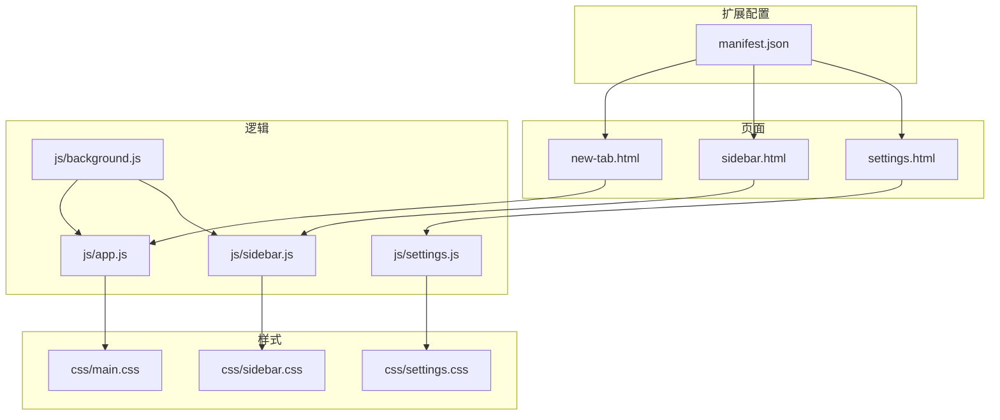
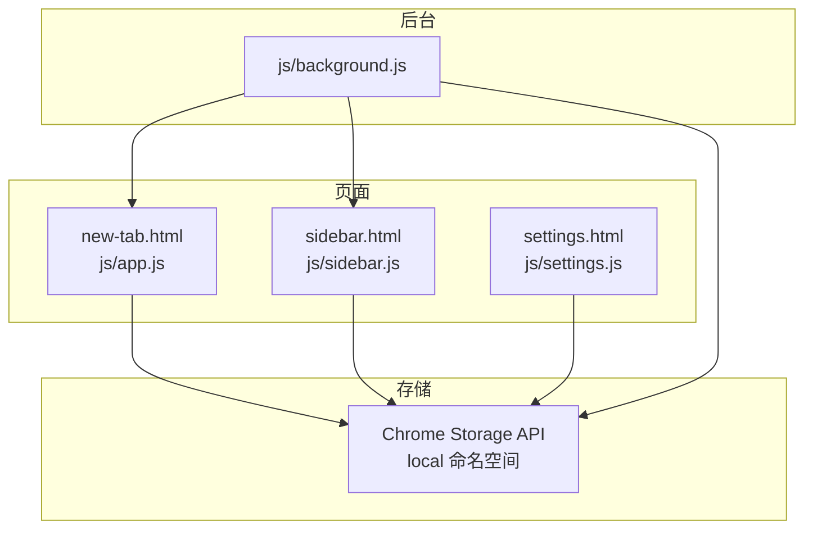
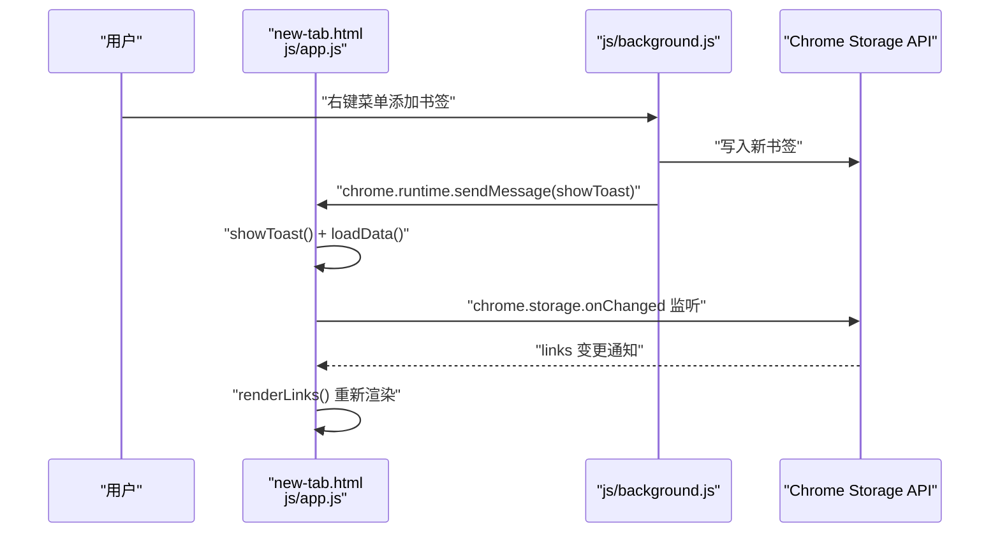
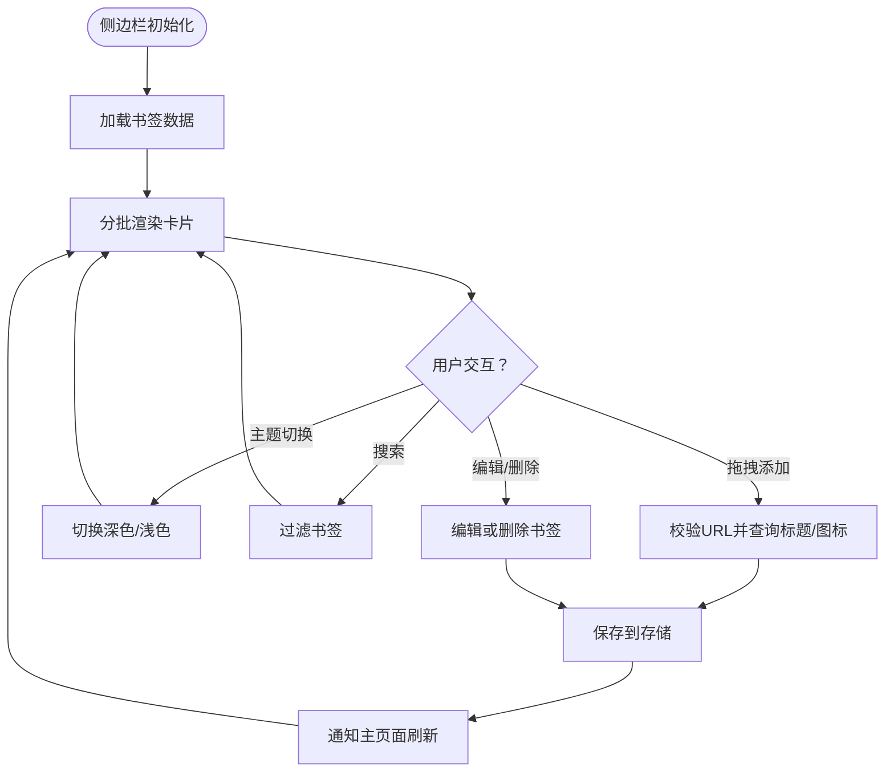
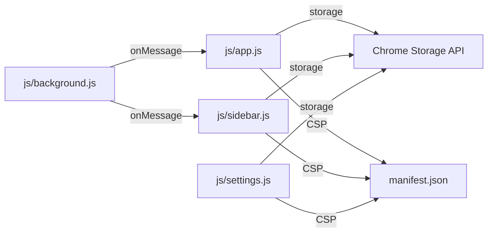

# 技术架构

<cite>
**本文引用的文件**
- [manifest.json](file://manifest.json)
- [README.md](file://README.md)
- [new-tab.html](file://new-tab.html)
- [settings.html](file://settings.html)
- [sidebar.html](file://sidebar.html)
- [js/app.js](file://js/app.js)
- [js/background.js](file://js/background.js)
- [js/sidebar.js](file://js/sidebar.js)
- [js/settings.js](file://js/settings.js)
- [css/main.css](file://css/main.css)
- [css/sidebar.css](file://css/sidebar.css)
- [css/settings.css](file://css/settings.css)
- [backup/app.js](file://backup/app.js)
- [backup/new-tab.html](file://backup/new-tab.html)
- [backup/tailwind.css](file://backup/tailwind.css)
</cite>

## 目录
1. [简介](#简介)
2. [项目结构](#项目结构)
3. [核心组件](#核心组件)
4. [架构总览](#架构总览)
5. [详细组件分析](#详细组件分析)
6. [依赖关系分析](#依赖关系分析)
7. [性能考量](#性能考量)
8. [故障排查指南](#故障排查指南)
9. [结论](#结论)
10. [附录](#附录)

## 简介
本项目为 Chrome 扩展“书签白板”，采用 Manifest V3 标准实现，提供新标签页主界面、侧边栏、设置页面与后台脚本协同工作，实现本地化的书签管理与可视化展示。系统强调隐私优先与离线可用，所有数据均存储于 Chrome Storage API 的 local 命名空间，不依赖外部服务。

## 项目结构
项目采用按页面/模块划分的组织方式，核心文件如下：
- 配置层：manifest.json（声明权限、入口、侧边栏、图标、CSP）
- 页面层：new-tab.html（新标签页主界面）、sidebar.html（侧边栏）、settings.html（设置页面）
- 样式层：css/main.css（主样式）、css/sidebar.css（侧边栏样式）、css/settings.css（设置页面样式）
- 逻辑层：js/app.js（主界面逻辑）、js/sidebar.js（侧边栏逻辑）、js/background.js（后台脚本）、js/settings.js（设置页面逻辑）

图表来源
- [manifest.json:1-38](file://manifest.json#L1-L38)
- [new-tab.html:1-206](file://new-tab.html#L1-L206)
- [sidebar.html](file://sidebar.html)
- [settings.html:1-281](file://settings.html#L1-L281)
- [js/app.js:1-800](file://js/app.js#L1-L800)
- [js/sidebar.js:1-602](file://js/sidebar.js#L1-L602)
- [js/background.js:1-174](file://js/background.js#L1-L174)
- [js/settings.js:1-800](file://js/settings.js#L1-L800)
- [css/main.css:1-800](file://css/main.css#L1-L800)
- [css/sidebar.css:1-287](file://css/sidebar.css#L1-L287)
- [css/settings.css:1-800](file://css/settings.css#L1-L800)

章节来源
- [manifest.json:1-38](file://manifest.json#L1-L38)
- [README.md:132-154](file://README.md#L132-L154)

## 核心组件
- 新标签页主界面（new-tab.html + js/app.js + css/main.css）
  - 负责书签卡片展示、搜索过滤、排序、分组筛选、批量操作、主题切换、拖拽添加、空状态引导、导入导出等。
- 侧边栏（sidebar.html + js/sidebar.js + css/sidebar.css）
  - 负责快速访问、搜索、主题切换、拖拽添加、一键添加当前页、编辑/删除书签、实时同步。
- 设置页面（settings.html + js/settings.js + css/settings.css）
  - 负责书签管理、分组管理、数据导出/导入、统计信息、外观与主题、显示与排序、隐私与安全、快捷操作等。
- 后台脚本（js/background.js）
  - 负责右键菜单创建与点击处理、侧边栏开关、向页面注入 Toast 通知脚本、跨页面消息转发。

章节来源
- [new-tab.html:1-206](file://new-tab.html#L1-L206)
- [sidebar.html](file://sidebar.html)
- [settings.html:1-281](file://settings.html#L1-L281)
- [js/app.js:1-800](file://js/app.js#L1-L800)
- [js/sidebar.js:1-602](file://js/sidebar.js#L1-L602)
- [js/background.js:1-174](file://js/background.js#L1-L174)
- [js/settings.js:1-800](file://js/settings.js#L1-L800)
- [css/main.css:1-800](file://css/main.css#L1-L800)
- [css/sidebar.css:1-287](file://css/sidebar.css#L1-L287)
- [css/settings.css:1-800](file://css/settings.css#L1-L800)

## 架构总览
系统采用“页面-后台脚本-存储”的三层协作模式：
- 页面层：负责用户交互与视图渲染，通过 Chrome Storage API 读写数据，监听存储变更实现跨页面同步。
- 后台脚本：负责扩展生命周期事件（安装、图标点击）、右键菜单、侧边栏控制、跨页面消息与通知注入。
- 存储层：Chrome Storage API（local 命名空间）持久化书签、分组、主题、搜索状态等。

图表来源
- [js/app.js:75-106](file://js/app.js#L75-L106)
- [js/sidebar.js:30-41](file://js/sidebar.js#L30-L41)
- [js/background.js:6-37](file://js/background.js#L6-L37)
- [manifest.json:9-15](file://manifest.json#L9-L15)

## 详细组件分析

### Chrome Extension Manifest V3 权限与生命周期
- 权限配置
  - storage：本地数据存储
  - contextMenus：右键菜单
  - tabs：标签页管理
  - scripting：页面脚本注入（Toast 通知）
  - sidePanel：侧边栏功能
- 生命周期与入口
  - 新标签页覆盖：chrome_url_overrides.newtab
  - 后台服务：background.service_worker
  - 侧边栏默认路径：side_panel.default_path
  - 图标与 CSP：icons、content_security_policy
- 安全考虑
  - CSP 限制脚本源与对象源，减少 XSS 风险
  - 仅使用本地存储，不联网，保护隐私

章节来源
- [manifest.json:1-38](file://manifest.json#L1-L38)
- [README.md:158-169](file://README.md#L158-L169)

### 主应用模块（新标签页）
- 初始化与主题
  - 首先加载主题（避免 FOUC），随后异步加载数据
  - 支持系统主题跟随与手动切换
- 事件与交互
  - 拖拽添加：支持从网页、地址栏、书签栏拖拽链接
  - 搜索与排序：实时过滤、多种排序规则
  - 分组筛选与 Tab 切换：按视图分区展示
  - 手动添加与导入导出：支持 JSON 加密导入
- 数据与存储
  - 通过 chrome.storage.local 读写 links、groups、tipHidden、autoGroupNames 等
  - 监听 storage.onChanged 实现跨页面实时同步
- 通知与消息
  - 监听 runtime.onMessage，接收后台脚本的 Toast 通知与刷新指令

图表来源
- [js/background.js:39-69](file://js/background.js#L39-L69)
- [js/background.js:111-167](file://js/background.js#L111-L167)
- [js/app.js:310-318](file://js/app.js#L310-L318)
- [js/app.js:116-121](file://js/app.js#L116-L121)

章节来源
- [new-tab.html:1-206](file://new-tab.html#L1-L206)
- [js/app.js:1-800](file://js/app.js#L1-L800)
- [css/main.css:1-800](file://css/main.css#L1-L800)

### 侧边栏模块
- 功能要点
  - 快速访问、搜索、主题切换、拖拽添加、一键添加当前页、编辑/删除书签
  - 限制显示数量（50）并分批渲染，提升性能
  - 监听 storage.onChanged 与 runtime.onMessage 实现实时同步
- 交互细节
  - 拖拽悬停高亮、离开恢复、放下校验 URL 并查询标题/图标
  - 手动添加对话框支持回车提交与自动获取网站信息

图表来源
- [js/sidebar.js:9-16](file://js/sidebar.js#L9-L16)
- [js/sidebar.js:30-41](file://js/sidebar.js#L30-L41)
- [js/sidebar.js:151-202](file://js/sidebar.js#L151-L202)
- [js/sidebar.js:508-601](file://js/sidebar.js#L508-L601)

章节来源
- [sidebar.html](file://sidebar.html)
- [js/sidebar.js:1-602](file://js/sidebar.js#L1-L602)
- [css/sidebar.css:1-287](file://css/sidebar.css#L1-L287)

### 设置模块
- 功能范围
  - 书签管理：搜索、批量操作、排序、编辑/删除
  - 分组管理：自定义分组、自动分组、编辑/删除
  - 数据管理：导出（加密）、导入（校验 JSON）、统计
  - 外观与主题、显示与排序、隐私与安全、快捷操作（预留）
- 交互与状态
  - 导航切换与菜单状态持久化（localStorage）
  - 批量模式下的选择与操作
  - 分组列表动态生成与自动分组统计

章节来源
- [settings.html:1-281](file://settings.html#L1-L281)
- [js/settings.js:1-800](file://js/settings.js#L1-L800)
- [css/settings.css:1-800](file://css/settings.css#L1-L800)

### 后台脚本（右键菜单与消息通信）
- 右键菜单
  - 添加当前页面、添加链接、打开侧边栏
  - 优先使用选中文本或链接文本作为标题，自动获取 favicon
- 通知与消息
  - 注入脚本在当前页面显示 Toast 通知
  - 监听扩展图标点击，打开侧边栏
- 与页面通信
  - 通过 runtime.onMessage 与页面交换消息（如 showNotification、showToast）

章节来源
- [js/background.js:1-174](file://js/background.js#L1-L174)
- [manifest.json:23-28](file://manifest.json#L23-L28)

## 依赖关系分析
- 模块耦合
  - 页面层与后台脚本通过消息与存储解耦；页面间通过存储事件实现松耦合同步
  - 设置页面与主界面共享数据模型，但职责分离（界面与业务逻辑）
- 外部依赖
  - Chrome Extension APIs（storage、contextMenus、tabs、scripting、sidePanel、action、runtime）
  - Font Awesome 图标库
  - CSS 变量与原生 CSS（无框架依赖）

图表来源
- [js/background.js:39-69](file://js/background.js#L39-L69)
- [js/app.js:75-106](file://js/app.js#L75-L106)
- [js/sidebar.js:30-41](file://js/sidebar.js#L30-L41)
- [js/settings.js:95-110](file://js/settings.js#L95-L110)
- [manifest.json:34-36](file://manifest.json#L34-L36)

章节来源
- [manifest.json:1-38](file://manifest.json#L1-L38)
- [js/background.js:1-174](file://js/background.js#L1-L174)
- [js/app.js:1-800](file://js/app.js#L1-L800)
- [js/sidebar.js:1-602](file://js/sidebar.js#L1-L602)
- [js/settings.js:1-800](file://js/settings.js#L1-L800)

## 性能考量
- 渲染优化
  - 主界面卡片网格响应式布局，侧边栏限制显示数量并分批渲染
  - DOM 操作最小化，使用 DocumentFragment 与 requestAnimationFrame
- 存储与同步
  - 使用 chrome.storage.onChanged 监听局部变更，避免全量重载
  - 侧边栏显示上限与搜索过滤减少渲染压力
- 交互体验
  - 防 FOUC：CSS 加载完成后显示页面
  - 主题切换即时生效，系统主题变化时自动跟随

章节来源
- [js/app.js:1-800](file://js/app.js#L1-L800)
- [js/sidebar.js:151-202](file://js/sidebar.js#L151-L202)
- [css/main.css:1-800](file://css/main.css#L1-L800)
- [css/sidebar.css:1-287](file://css/sidebar.css#L1-L287)

## 故障排查指南
- 右键菜单未显示
  - 需要完全重新安装扩展（移除后重新加载）
- 书签丢失
  - 数据保存在浏览器本地，清除浏览器数据会导致丢失
- 侧边栏不自动刷新
  - 确保使用最新版本（v3.2.0+）
- 拖拽添加失败
  - 检查 URL 格式与目标页面是否允许拖放
- 主题切换异常
  - 若手动设置了主题，系统主题变化不会自动跟随

章节来源
- [README.md:248-258](file://README.md#L248-L258)

## 结论
本项目以 Manifest V3 为基础，构建了清晰的模块化架构：页面层专注交互与渲染，后台脚本负责扩展级能力与消息通信，存储层统一数据持久化。通过 Chrome Storage API 与事件驱动的同步机制，实现了跨页面一致的用户体验。前端技术栈采用原生 CSS 与 ES6+，配合 Chrome 扩展 API，兼顾性能与隐私安全。

## 附录
- 开发与安装
  - 通过 chrome://extensions 开启开发者模式，加载已解压的扩展程序
- 使用方式
  - 新标签页、侧边栏、右键菜单三种入口，满足多场景需求
- 数据模型
  - links：书签数组（id、url、title、icon、groups、createdAt 等）
  - groups：分组数组（id、name、color、icon、createdAt 等）
  - autoGroupNames：自动分组自定义名称映射
  - darkMode、tipHidden 等用户偏好与状态

章节来源
- [README.md:53-188](file://README.md#L53-L188)
- [js/app.js:25-34](file://js/app.js#L25-L34)
- [js/sidebar.js:5-7](file://js/sidebar.js#L5-L7)
- [js/settings.js:16-25](file://js/settings.js#L16-L25)