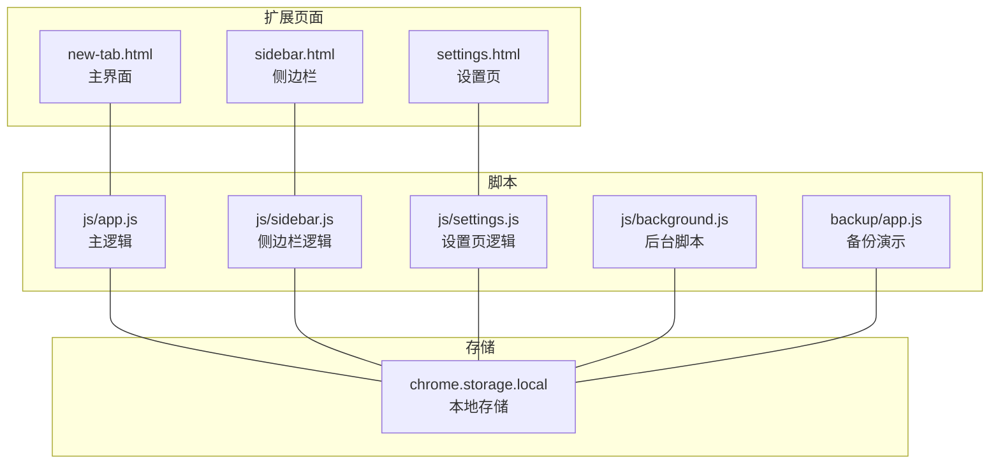
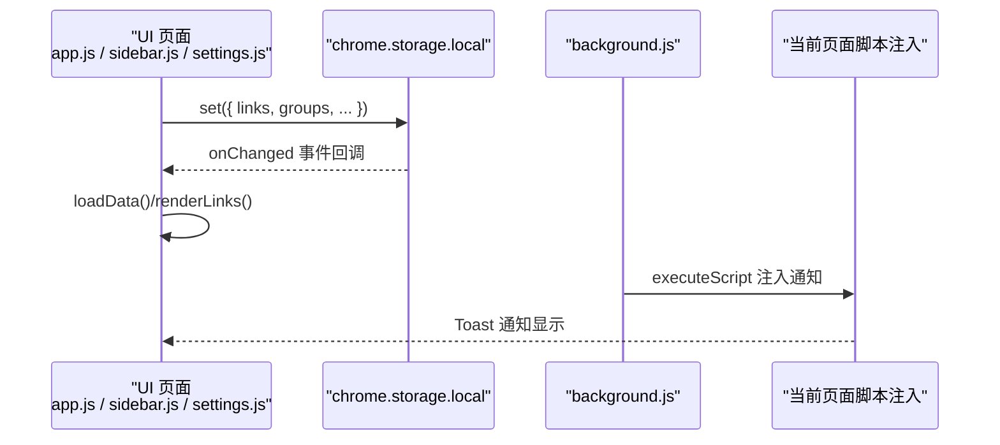
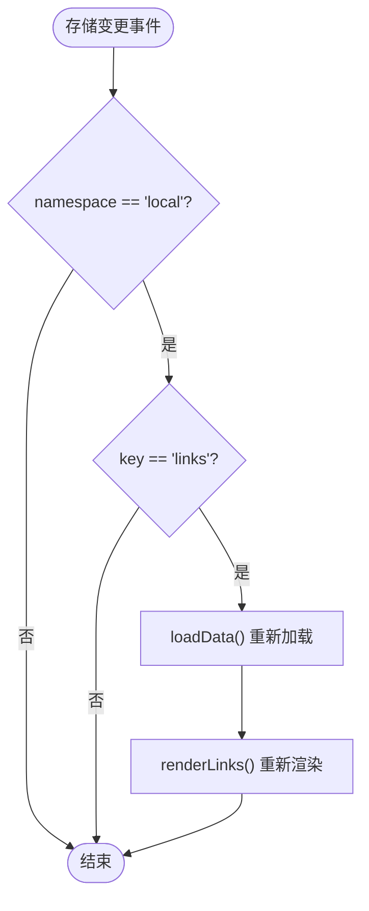
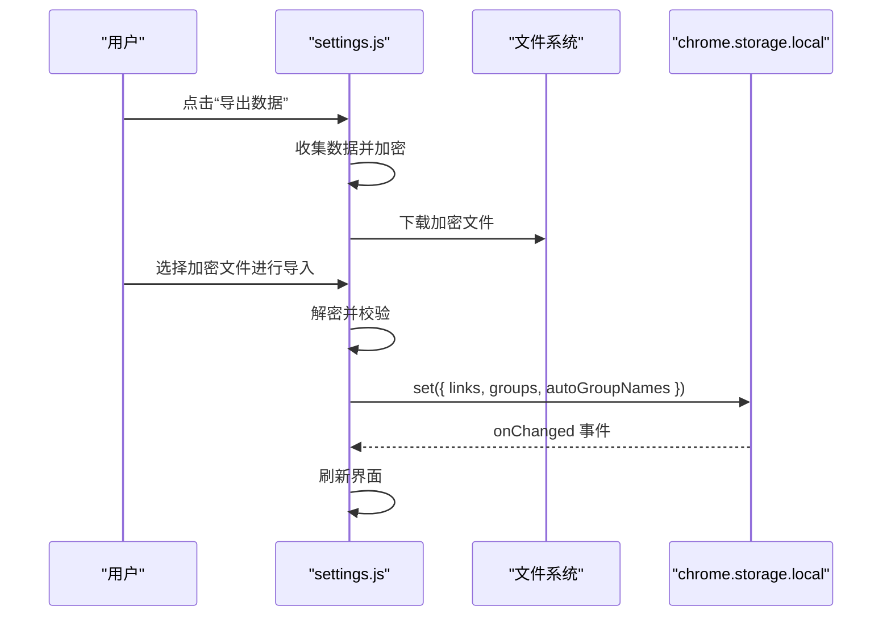
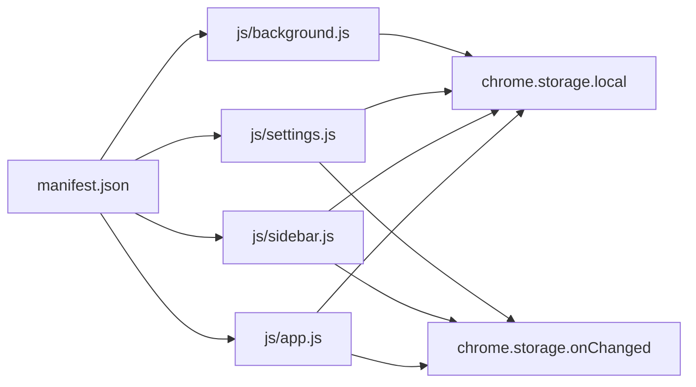

# 数据存储管理

<cite>
**本文引用的文件**
- [manifest.json](file://manifest.json)
- [README.md](file://README.md)
- [GUIDE.md](file://GUIDE.md)
- [js/app.js](file://js/app.js)
- [js/sidebar.js](file://js/sidebar.js)
- [js/background.js](file://js/background.js)
- [js/settings.js](file://js/settings.js)
- [backup/app.js](file://backup/app.js)
- [settings.html](file://settings.html)
</cite>

## 目录
1. [简介](#简介)
2. [项目结构](#项目结构)
3. [核心组件](#核心组件)
4. [架构总览](#架构总览)
5. [详细组件分析](#详细组件分析)
6. [依赖关系分析](#依赖关系分析)
7. [性能考量](#性能考量)
8. [故障排查指南](#故障排查指南)
9. [结论](#结论)
10. [附录](#附录)

## 简介
本文件系统性梳理书签白板扩展的数据存储管理方案，重点覆盖以下方面：
- Chrome Storage API 的使用现状与局限：当前版本仅使用 chrome.storage.local，未使用 chrome.storage.sync。
- 数据模型设计：书签对象与分组对象的结构、字段含义与约束。
- 持久化策略：读取、写入、更新、删除的实现与调用点。
- 同步机制：多页面间的一致性与实时更新。
- 备份与恢复：导入导出流程与加密机制。
- 安全与隐私：本地存储的安全性与用户数据保护。
- 迁移与版本兼容：版本演进与数据兼容策略。

## 项目结构
项目采用 Manifest V3 架构，主要前端页面与脚本如下：
- 新标签页主界面：new-tab.html + js/app.js
- 侧边栏界面：sidebar.html + js/sidebar.js
- 设置页面：settings.html + js/settings.js
- 后台脚本：js/background.js（右键菜单、消息通信、通知）
- 备份演示页面：backup/app.js（对比参考）

图表来源
- [manifest.json](file://manifest.json)
- [js/app.js](file://js/app.js)
- [js/sidebar.js](file://js/sidebar.js)
- [js/background.js](file://js/background.js)
- [js/settings.js](file://js/settings.js)
- [backup/app.js](file://backup/app.js)

章节来源
- [manifest.json](file://manifest.json)
- [README.md](file://README.md)

## 核心组件
- 存储接口：统一使用 chrome.storage.local 进行数据持久化。
- 主界面（app.js）：负责主题、书签与分组的加载、渲染与交互；监听存储变化实现跨页面同步。
- 侧边栏（sidebar.js）：独立页面，同样通过 chrome.storage.local 读写数据，并监听存储变化。
- 设置页（settings.js）：提供数据导入导出、分组管理、主题设置等高级功能。
- 后台脚本（background.js）：处理右键菜单、向当前页面注入通知脚本，以及通过消息驱动界面刷新。
- 备份演示（backup/app.js）：展示另一种轻量数据模型与存储方式，便于对比理解。

章节来源
- [js/app.js](file://js/app.js)
- [js/sidebar.js](file://js/sidebar.js)
- [js/settings.js](file://js/settings.js)
- [js/background.js](file://js/background.js)
- [backup/app.js](file://backup/app.js)

## 架构总览
整体采用“页面-存储-页面”的双向通道，通过 chrome.storage.onChanged 实现跨页面实时同步；通过 chrome.storage.local.set/get 实现数据持久化。

图表来源
- [js/app.js](file://js/app.js)
- [js/sidebar.js](file://js/sidebar.js)
- [js/settings.js](file://js/settings.js)
- [js/background.js](file://js/background.js)

## 详细组件分析

### Chrome Storage API 使用现状与选择策略
- 当前版本仅使用 chrome.storage.local，未使用 chrome.storage.sync。
- 选择策略建议：
  - 本地优先：chrome.storage.local 适合本地数据持久化与跨页面同步。
  - 云端同步：若需跨设备同步，可评估 chrome.storage.sync，但需考虑容量限制与延迟。
  - 权衡点：sync 有配额限制且同步可能延迟，local 更稳定可控。

章节来源
- [README.md](file://README.md)
- [GUIDE.md](file://GUIDE.md)

### 数据模型设计
- 书签对象（links 数组元素）
  - 字段示例：url、title、icon、groups（数组）、createdAt、pinned、clickCount、lastAccessed（兼容字段）
  - 约束：url 唯一性用于去重；groups 为空数组或数组类型；createdAt 为时间戳。
- 分组对象（groups 数组元素）
  - 字段示例：id、name、color、icon、createdAt
  - 约束：id 唯一；name 非空；createdAt 时间戳。
- 自动分组自定义名称映射（autoGroupNames）
  - 键：自动分组标识（如以特定前缀开头的 id）
  - 值：用户自定义显示名称
  - 约束：键空间与生成规则由业务逻辑决定。

章节来源
- [js/app.js](file://js/app.js)
- [js/settings.js](file://js/settings.js)
- [js/sidebar.js](file://js/sidebar.js)

### 持久化策略（读取/写入/更新/删除）
- 读取
  - 主界面：chrome.storage.local.get(['links', 'groups', 'tipHidden', 'autoGroupNames'])
  - 侧边栏：chrome.storage.local.get(['links'])
  - 设置页：chrome.storage.local.get(['links', 'groups', 'autoGroupNames', 'darkMode'])
- 写入
  - 主界面：chrome.storage.local.set({ links, groups })
  - 侧边栏：chrome.storage.local.set({ links })
  - 设置页：chrome.storage.local.set({ links, groups, autoGroupNames })
  - 右键菜单添加：先 get 再 unshift 新书签，再 set
- 更新
  - 修改主题：chrome.storage.local.set({ darkMode })
  - 修改分组名称（含自动分组）：更新 groups 或 autoGroupNames 并 set
  - 置顶/取消置顶：更新单条书签属性后 set
- 删除
  - 删除分组：从 groups 移除并 set；同时从各书签 groups 中移除该 id
  - 删除书签：从 links 过滤并 set

章节来源
- [js/app.js](file://js/app.js)
- [js/sidebar.js](file://js/sidebar.js)
- [js/settings.js](file://js/settings.js)
- [js/background.js](file://js/background.js)

### 同步机制（多页面一致性与实时更新）
- 主界面监听 chrome.storage.onChanged，当 namespace 为 local 且 links 发生变化时，触发 loadData 与渲染。
- 侧边栏同样监听 chrome.storage.onChanged，实现与主界面一致的实时同步。
- 设置页也监听存储变化，确保导入导出后界面即时刷新。
- 右键菜单添加书签后，后台脚本通过消息通知当前页面刷新。

图表来源
- [js/app.js](file://js/app.js)
- [js/sidebar.js](file://js/sidebar.js)
- [js/settings.js](file://js/settings.js)

章节来源
- [js/app.js](file://js/app.js)
- [js/sidebar.js](file://js/sidebar.js)
- [js/settings.js](file://js/settings.js)
- [js/background.js](file://js/background.js)

### 备份与恢复（导入导出与加密）
- 导出流程
  - 收集数据：版本号、导出时间、links、groups、autoGroupNames、settings（darkMode、sortBy）
  - 加密：UTF-8 → Base64 → XOR 混淆 → 再 Base64，输出 JSON 字符串
  - 下载：创建 Blob 并触发下载
- 导入流程
  - 读取文件 → 解密 → 解析 JSON → 校验结构（links/groups）
  - 用户确认后写入 chrome.storage.local，随后刷新界面
- 加密密钥：bookmark-board-2026（硬编码于前端，注意安全边界）

图表来源
- [js/settings.js](file://js/settings.js)
- [GUIDE.md](file://GUIDE.md)

章节来源
- [js/settings.js](file://js/settings.js)
- [GUIDE.md](file://GUIDE.md)

### 安全与隐私保护
- 本地存储：数据保存在 chrome.storage.local，不上传至服务器，符合“零服务器”原则。
- 加密备份：导出文件采用四层加密流程，降低明文泄露风险。
- 隐私提示：README 与 GUIDE 明确“清除浏览器数据会丢失书签”，提醒用户备份。
- 建议增强：
  - 导出文件支持密码保护（前端口令派生密钥）
  - 对敏感字段（如 settings）进行最小化存储
  - 使用 CSP 严格策略，避免内联脚本注入风险

章节来源
- [README.md](file://README.md)
- [GUIDE.md](file://GUIDE.md)
- [js/settings.js](file://js/settings.js)

### 数据迁移与版本兼容
- 版本演进
  - v3.2.5：新增侧边栏、右键菜单链接支持、自动跟随系统主题、拖拽获取标题、实时更新同步
  - v3.0.x：深色/浅色主题、批量操作、响应式设计、拖拽添加书签
  - v2.x：卡片布局、搜索过滤、手动添加
- 兼容策略
  - 读取时对旧字段做默认值填充（如 groups/pinned/clickCount/lastAccessed）
  - 新增字段（如 autoGroupNames）在读取时初始化为空对象
  - 导入时检查 links/groups 字段存在性，避免破坏性覆盖

章节来源
- [README.md](file://README.md)
- [js/app.js](file://js/app.js)
- [js/settings.js](file://js/settings.js)

## 依赖关系分析
- 权限与入口
  - permissions: ["storage", "contextMenus", "tabs", "scripting", "sidePanel"]
  - action、side_panel、chrome_url_overrides 指向具体页面
- 脚本耦合
  - app.js、sidebar.js、settings.js 均依赖 chrome.storage.local 与 chrome.storage.onChanged
  - background.js 依赖 contextMenus、tabs、scripting、sidePanel
- 外部依赖
  - Font Awesome 图标库
  - CSS 变量主题系统

图表来源
- [manifest.json](file://manifest.json)
- [js/app.js](file://js/app.js)
- [js/sidebar.js](file://js/sidebar.js)
- [js/settings.js](file://js/settings.js)
- [js/background.js](file://js/background.js)

章节来源
- [manifest.json](file://manifest.json)

## 性能考量
- DOM 渲染优化
  - 侧边栏采用分批渲染（requestAnimationFrame + 批量节点片段），限制显示数量（默认 50），避免长列表卡顿
- 存储访问优化
  - 主界面维护域名缓存 Map，减少 URL 解析开销
  - 批量写入：save() 统一调用 chrome.storage.local.set，避免多次 IO
- 同步刷新
  - 仅在 links 变更时触发 loadData，减少不必要的重绘
- 建议
  - 大数据量时可引入虚拟滚动
  - 对频繁变更的字段（如 clickCount）考虑节流/防抖

章节来源
- [js/sidebar.js](file://js/sidebar.js)
- [js/app.js](file://js/app.js)

## 故障排查指南
- 右键菜单未显示
  - 重新安装扩展（移除后重新加载）
- 书签丢失
  - 清除浏览器数据会删除 chrome.storage.local 中的书签；建议定期导出备份
- 侧边栏不自动刷新
  - 确保使用最新版本（v3.2.5+），必要时关闭并重新打开侧边栏
- 导入失败
  - 检查文件格式与完整性；确认解密密钥正确；确保文件包含 links 与 groups 字段
- 主题异常
  - 导入文件包含主题设置，会覆盖当前主题；可在设置中重新切换

章节来源
- [GUIDE.md](file://GUIDE.md)
- [README.md](file://README.md)

## 结论
本项目采用“纯本地存储 + 实时同步”的方案，实现了稳定的跨页面一致性与良好的用户体验。当前版本未使用 chrome.storage.sync，若未来需要跨设备同步，可在保持本地存储稳定的基础上，评估引入 sync 并配套加密与冲突解决策略。导入导出功能提供了可靠的备份与迁移手段，配合加密与用户教育，可有效保障数据安全与隐私。

## 附录
- 最佳实践建议
  - 定期导出备份，多地保存
  - 合理分组与置顶重要书签
  - 避免在多设备同时编辑导致的冲突
  - 使用设置页的“数据统计”核对导入结果