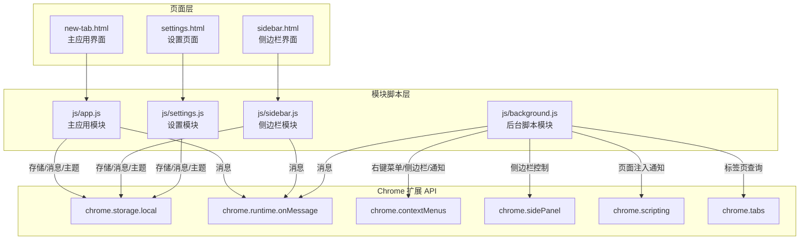
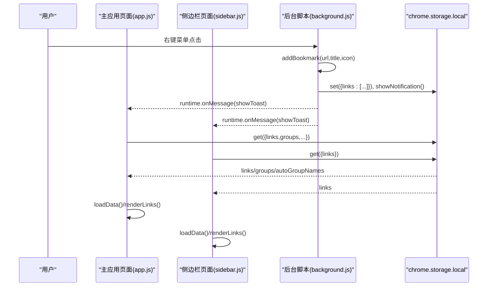
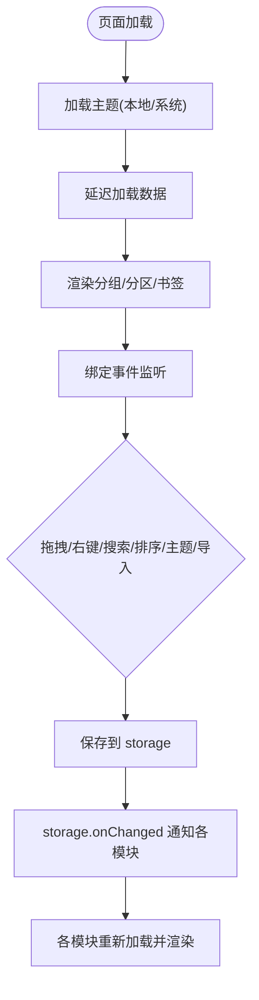
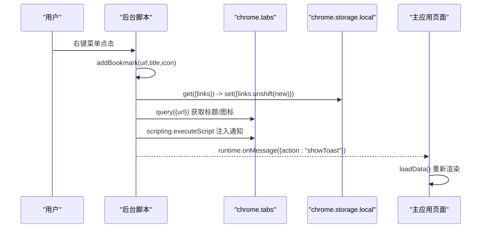
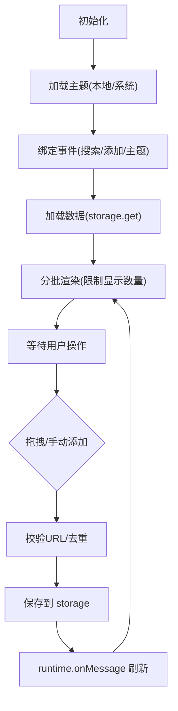
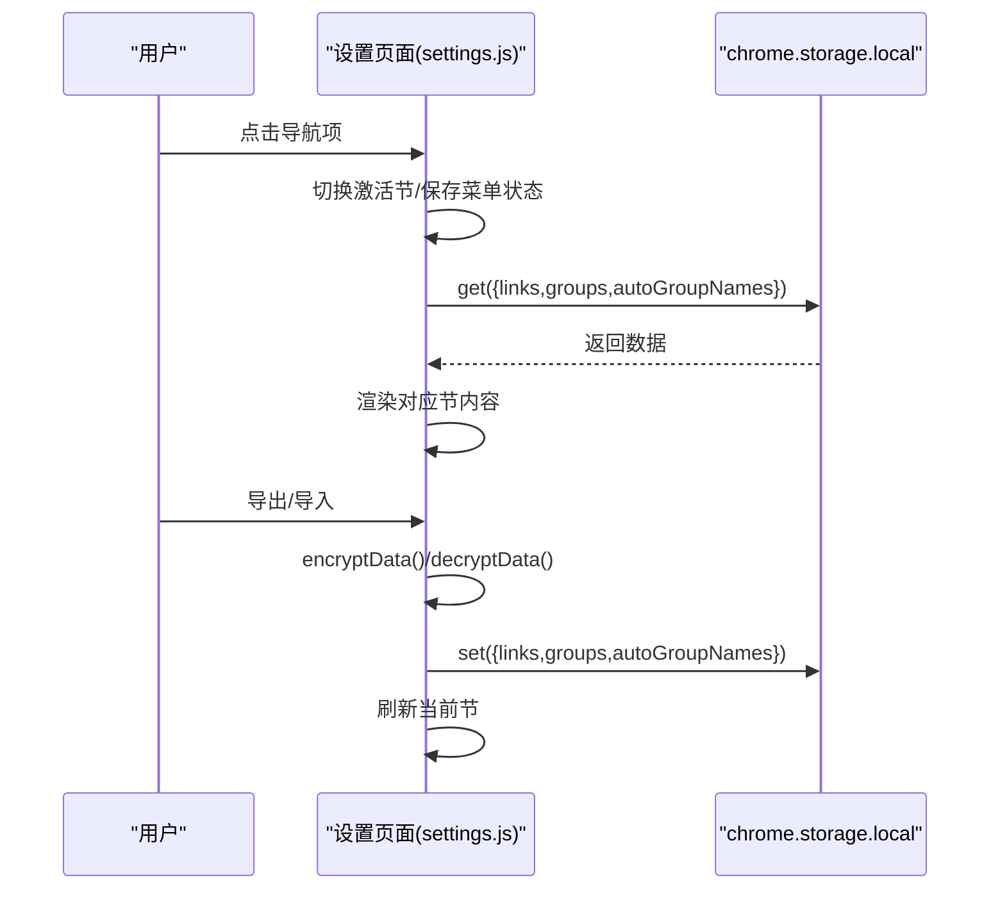
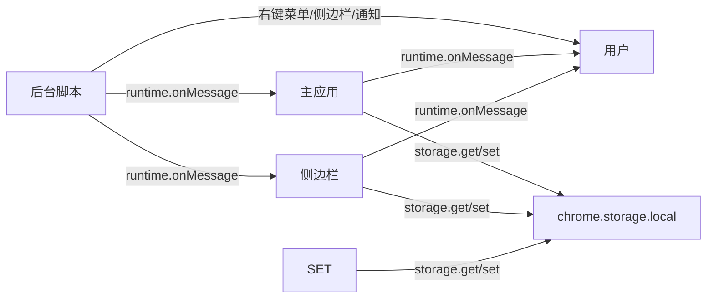

# 模块架构设计

<cite>
**本文引用的文件**
- [manifest.json](file://manifest.json)
- [new-tab.html](file://new-tab.html)
- [sidebar.html](file://sidebar.html)
- [settings.html](file://settings.html)
- [js/app.js](file://js/app.js)
- [js/background.js](file://js/background.js)
- [js/sidebar.js](file://js/sidebar.js)
- [js/settings.js](file://js/settings.js)
- [README.md](file://README.md)
- [GUIDE.md](file://GUIDE.md)
- [UPDATE_LOG.md](file://UPDATE_LOG.md)
</cite>

## 目录
1. [简介](#简介)
2. [项目结构](#项目结构)
3. [核心模块](#核心模块)
4. [架构总览](#架构总览)
5. [详细组件分析](#详细组件分析)
6. [依赖关系分析](#依赖关系分析)
7. [性能考量](#性能考量)
8. [故障排查指南](#故障排查指南)
9. [结论](#结论)
10. [附录](#附录)

## 简介
本项目是一个基于 Chrome Manifest V3 的书签管理扩展，采用模块化设计，围绕四大核心模块协同工作：
- 主应用模块（新标签页界面）：负责书签管理与界面渲染、搜索与筛选、分组与排序、分区展示、置顶与统计等。
- 后台脚本模块：处理右键菜单系统、侧边栏控制、页面通知注入、跨页面消息通信。
- 侧边栏模块：提供移动端优化界面，支持快速添加、搜索、编辑、删除与主题切换。
- 设置模块：实现配置管理、分组管理、数据导入导出与统计展示。

模块间通过 Chrome Extension API（存储、消息、上下文菜单、脚本注入、侧边栏）进行松耦合通信，遵循职责分离与事件驱动模式，确保可维护性与可扩展性。

## 项目结构
项目采用“页面 + 模块脚本”的组织方式，页面负责结构与样式，模块脚本负责业务逻辑与数据流。

图表来源
- [new-tab.html:1-206](file://new-tab.html#L1-L206)
- [sidebar.html:1-51](file://sidebar.html#L1-L51)
- [settings.html:1-281](file://settings.html#L1-L281)
- [js/app.js:1-1514](file://js/app.js#L1-L1514)
- [js/background.js:1-174](file://js/background.js#L1-L174)
- [js/sidebar.js:1-602](file://js/sidebar.js#L1-L602)
- [js/settings.js:1-1216](file://js/settings.js#L1-L1216)

章节来源
- [manifest.json:1-38](file://manifest.json#L1-L38)
- [README.md:132-154](file://README.md#L132-L154)

## 核心模块
- 主应用模块（js/app.js + new-tab.html）
  - 职责：书签数据加载与渲染、搜索与筛选、分组与排序、分区展示、置顶与统计、拖拽添加、主题切换、导入导出、右键菜单消息处理。
  - 关键点：使用 chrome.storage.local 读写数据；监听 storage 变化自动刷新；事件委托与上下文菜单；FOUC 防护与延迟加载。
- 后台脚本模块（js/background.js）
  - 职责：注册右键菜单、处理菜单点击、打开侧边栏、向页面注入通知脚本、跨页面消息通信。
  - 关键点：扩展安装时创建菜单；通过 scripting 注入通知；通过 runtime.onMessage 与页面通信。
- 侧边栏模块（js/sidebar.js + sidebar.html）
  - 职责：独立的书签浏览与管理界面，支持搜索、添加、编辑、删除、主题切换、拖拽添加、实时同步。
  - 关键点：独立主题状态；分批渲染提升性能；限制显示数量；监听 storage 变化自动刷新。
- 设置模块（js/settings.js + settings.html）
  - 职责：书签列表管理、分组管理、数据导入导出、统计展示、批量操作、导航与菜单状态持久化。
  - 关键点：分节导航；批量模式；分组列表；数据加解密；统计计算。

章节来源
- [js/app.js:1-1514](file://js/app.js#L1-L1514)
- [js/background.js:1-174](file://js/background.js#L1-L174)
- [js/sidebar.js:1-602](file://js/sidebar.js#L1-L602)
- [js/settings.js:1-1216](file://js/settings.js#L1-L1216)
- [new-tab.html:1-206](file://new-tab.html#L1-L206)
- [sidebar.html:1-51](file://sidebar.html#L1-L51)
- [settings.html:1-281](file://settings.html#L1-L281)

## 架构总览
模块间通过 Chrome 扩展 API 实现松耦合通信，数据统一存储于 chrome.storage.local，界面通过事件驱动与消息传递实现状态同步。

图表来源
- [js/background.js:40-109](file://js/background.js#L40-L109)
- [js/app.js:81-106](file://js/app.js#L81-L106)
- [js/sidebar.js:37-41](file://js/sidebar.js#L37-L41)
- [js/app.js:310-318](file://js/app.js#L310-L318)
- [js/sidebar.js:136-140](file://js/sidebar.js#L136-L140)

## 详细组件分析

### 主应用模块（new-tab.html + js/app.js）
- 页面结构与职责
  - 顶部导航：搜索、移动端搜索、主题切换、设置入口。
  - 分组筛选区：动态生成分组标签，支持新建分组。
  - 视图分区：所有书签、置顶、最近添加三个分区。
  - 主展示区：书签卡片渲染与空状态提示。
  - 模态框：通用对话框与确认框。
- 核心逻辑
  - 初始化：快速加载主题、防 FOUC、延迟加载数据。
  - 数据加载：从 chrome.storage.local 恢复 links、groups、autoGroupNames、主题与提示状态。
  - 事件监听：拖拽添加、搜索、排序、主题切换、提示隐藏、手动添加、导入导出、右键消息。
  - 渲染：分组标签、分区展示、书签卡片、空状态与统计。
  - 数据操作：保存、编辑分组、删除分组、置顶/取消置顶、右键菜单上下文。
  - 拖拽添加：从标签页查询标题，清理 URL，去重校验，保存并渲染。
- 通信机制
  - 存储监听：chrome.storage.onChanged 自动刷新。
  - 消息监听：runtime.onMessage 处理后台脚本通知。
  - 主题同步：matchMedia 监听系统主题变化，本地存储优先。
- 生命周期
  - DOMContentLoaded -> 加载主题 -> 延迟加载数据 -> 绑定事件 -> 渲染。
  - 数据变更 -> 保存到 storage -> storage.onChanged -> 自动刷新。

图表来源
- [js/app.js:52-122](file://js/app.js#L52-L122)
- [js/app.js:116-121](file://js/app.js#L116-L121)
- [js/app.js:310-318](file://js/app.js#L310-L318)

章节来源
- [new-tab.html:26-176](file://new-tab.html#L26-L176)
- [js/app.js:1-1514](file://js/app.js#L1-L1514)

### 后台脚本模块（js/background.js）
- 职责
  - 扩展安装时创建右键菜单（添加页面、添加链接、打开侧边栏）。
  - 监听右键菜单点击，调用 addBookmark 并注入通知脚本。
  - 打开侧边栏（action 点击与菜单点击）。
- 关键流程
  - 右键菜单点击 -> addBookmark(url,title,icon) -> 检查去重 -> set storage -> showNotification 注入页面通知。
  - 通知注入：通过 scripting.executeScript 注入临时脚本，创建 Toast 并自动消失。
- 通信机制
  - runtime.onMessage：接收页面 showToast 请求，触发页面刷新。
  - action.onClicked：点击扩展图标打开侧边栏。
  - sidePanel.setOptions：启用并设置侧边栏路径。

图表来源
- [js/background.js:6-37](file://js/background.js#L6-L37)
- [js/background.js:40-69](file://js/background.js#L40-L69)
- [js/background.js:72-109](file://js/background.js#L72-L109)
- [js/background.js:112-167](file://js/background.js#L112-L167)
- [js/app.js:310-318](file://js/app.js#L310-L318)

章节来源
- [js/background.js:1-174](file://js/background.js#L1-L174)

### 侧边栏模块（sidebar.html + js/sidebar.js）
- 页面结构与职责
  - 头部：Logo、主题切换、添加当前页面、关闭。
  - 搜索：实时过滤书签。
  - 列表：书签卡片（图标、标题、域名、操作按钮）。
  - 手动添加：弹窗输入 URL/标题。
- 核心逻辑
  - 初始化：加载主题、事件绑定、存储监听、关闭监听。
  - 数据加载：从 storage 获取 links，限制显示数量并分批渲染。
  - 拖拽添加：校验 URL、查询标签页标题/图标、去重、保存。
  - 手动添加：弹窗校验 URL、自动获取网站信息、保存。
  - 主题切换：独立 localStorage，跟随系统主题变化。
- 通信机制
  - storage.onChanged：监听 links 变化自动刷新。
  - runtime.onMessage：接收 showToast 指令，触发刷新。
  - runtime.onMessage：接收 toggleSidebar 指令，关闭窗口。

图表来源
- [js/sidebar.js:9-16](file://js/sidebar.js#L9-L16)
- [js/sidebar.js:30-41](file://js/sidebar.js#L30-L41)
- [js/sidebar.js:87-133](file://js/sidebar.js#L87-L133)
- [js/sidebar.js:142-149](file://js/sidebar.js#L142-L149)
- [js/sidebar.js:508-601](file://js/sidebar.js#L508-L601)

章节来源
- [sidebar.html:10-48](file://sidebar.html#L10-L48)
- [js/sidebar.js:1-602](file://js/sidebar.js#L1-L602)

### 设置模块（settings.html + js/settings.js）
- 页面结构与职责
  - 左侧导航：书签管理、分组管理、外观与主题、显示与排序、数据管理、搜索与筛选、隐私与安全、快捷操作、关于。
  - 右侧内容区：各节内容与工具栏。
- 核心逻辑
  - 初始化：恢复上次菜单状态、加载主题、绑定导航、加载数据、设置事件监听、批量模式、分组管理、数据管理。
  - 书签管理：搜索过滤、排序、列表渲染、编辑/删除、批量操作。
  - 分组管理：新建/编辑/删除（自动分组不可删除）、自动分组生成与名称自定义。
  - 数据管理：导出（加密 JSON）、导入（解密校验）、统计展示。
- 通信机制
  - storage.onChanged：监听 links 变化自动刷新。
  - localStorage：持久化菜单状态。
  - 加密算法：四层加密（UTF-8 → Base64 → XOR → Base64）。

图表来源
- [js/settings.js:26-65](file://js/settings.js#L26-L65)
- [js/settings.js:67-82](file://js/settings.js#L67-L82)
- [js/settings.js:94-110](file://js/settings.js#L94-L110)
- [js/settings.js:1036-1076](file://js/settings.js#L1036-L1076)
- [js/settings.js:1078-1150](file://js/settings.js#L1078-L1150)
- [js/settings.js:1152-1216](file://js/settings.js#L1152-L1216)

章节来源
- [settings.html:11-276](file://settings.html#L11-L276)
- [js/settings.js:1-1216](file://js/settings.js#L1-L1216)

## 依赖关系分析
- 模块耦合与内聚
  - 主应用模块与侧边栏模块共享数据源（chrome.storage.local），通过存储监听实现松耦合同步。
  - 后台脚本模块作为系统级协调者，不直接操作 DOM，仅负责菜单、侧边栏与通知注入。
  - 设置模块独立性强，主要依赖存储与加密算法，不直接参与 UI 渲染。
- 外部依赖
  - Chrome Extension APIs：storage、runtime、contextMenus、sidePanel、scripting、tabs。
  - CSS 变量与 Font Awesome 图标库。
- 潜在循环依赖
  - 无直接循环依赖；消息通过 runtime.onMessage 单向广播，避免环路。
- 数据一致性
  - 所有写操作统一走 chrome.storage.local，读取与渲染在各模块内部完成，避免竞态。

图表来源
- [js/background.js:40-69](file://js/background.js#L40-L69)
- [js/app.js:116-121](file://js/app.js#L116-L121)
- [js/sidebar.js:142-149](file://js/sidebar.js#L142-L149)

章节来源
- [manifest.json:9-25](file://manifest.json#L9-L25)
- [README.md:156-169](file://README.md#L156-L169)

## 性能考量
- 渲染优化
  - 主应用：防 FOUC（延迟显示）、分组与分区渲染分离、空状态提示减少首屏压力。
  - 侧边栏：限制显示数量（默认 50）、分批渲染（requestAnimationFrame）、DOM 片段插入。
- 数据访问优化
  - 主应用：域名缓存 Map，避免重复解析 URL。
  - 侧边栏：独立主题状态本地存储，减少 DOM 切换成本。
- 通信优化
  - 存储监听替代轮询，降低 CPU 占用。
  - 通知注入最小化脚本体积，一次性注入，自动移除。
- I/O 优化
  - 设置模块导入导出采用异步读取与加密，避免阻塞主线程。

## 故障排查指南
- 右键菜单未显示
  - 重新安装扩展（移除后重新加载）。
- 侧边栏不自动刷新
  - 确认使用最新版本（v3.2.1+），关闭并重新打开侧边栏。
- 书签丢失
  - 数据存储在 chrome.storage.local，清除浏览器数据会导致丢失；建议定期导出备份。
- 通知未显示
  - 检查 scripting 权限与页面注入是否成功；后台脚本会捕获注入异常并记录日志。
- 导入失败
  - 确认文件格式为 JSON，解密密钥正确；检查数据结构完整性。

章节来源
- [README.md:248-258](file://README.md#L248-L258)
- [GUIDE.md:389-401](file://GUIDE.md#L389-L401)

## 结论
本项目通过明确的模块划分与事件驱动的通信机制，实现了书签管理的高效与易用。主应用模块承担核心 UI 与业务逻辑，后台脚本模块提供系统级能力，侧边栏模块优化移动端体验，设置模块提供完善的配置与数据管理。模块间通过 Chrome 扩展 API 实现松耦合协作，具备良好的可维护性与扩展性。

## 附录
- 模块扩展与定制最佳实践
  - 新增页面：遵循“页面 + 模块脚本”结构，统一使用 chrome.storage.local 读写数据。
  - 新增功能：通过 runtime.onMessage 发起事件，避免直接跨模块调用。
  - 主题系统：统一使用 CSS 变量，支持深色/浅色切换与系统偏好跟随。
  - 数据导入导出：保持加密一致性，提供解密校验与错误提示。
  - 性能优化：优先使用存储监听、分批渲染、缓存与防抖策略。
  - 可测试性：将 UI 与逻辑分离，暴露关键函数便于单元测试；对异步流程使用 Promise/回调约定。