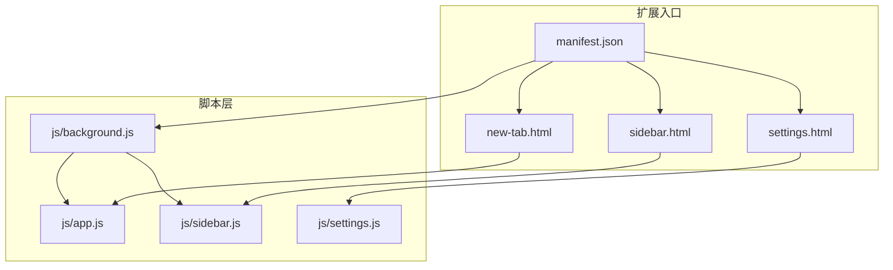
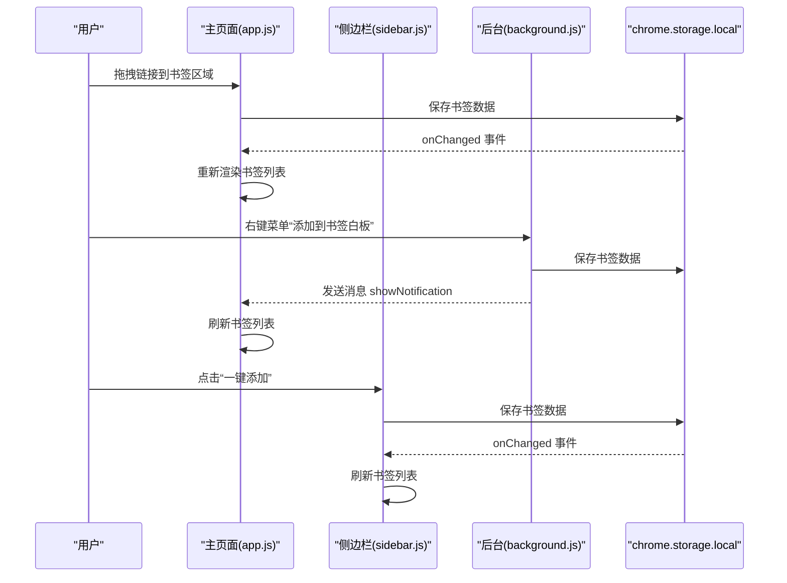
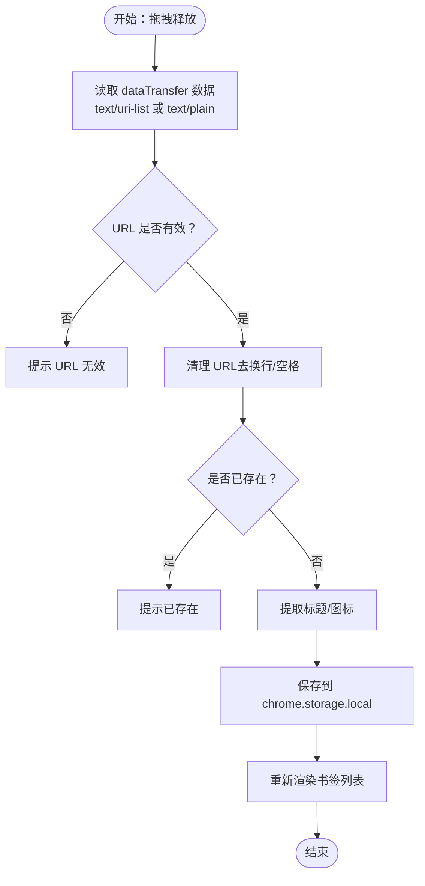
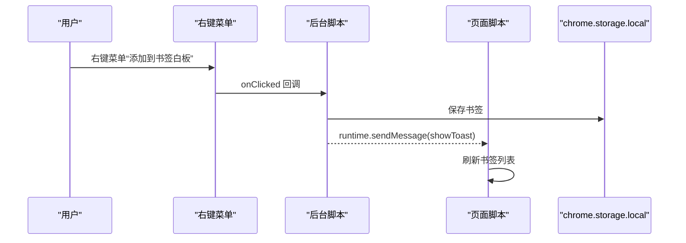
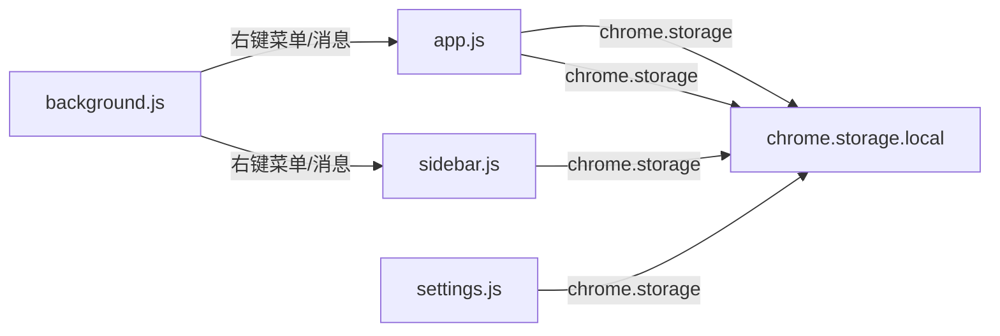
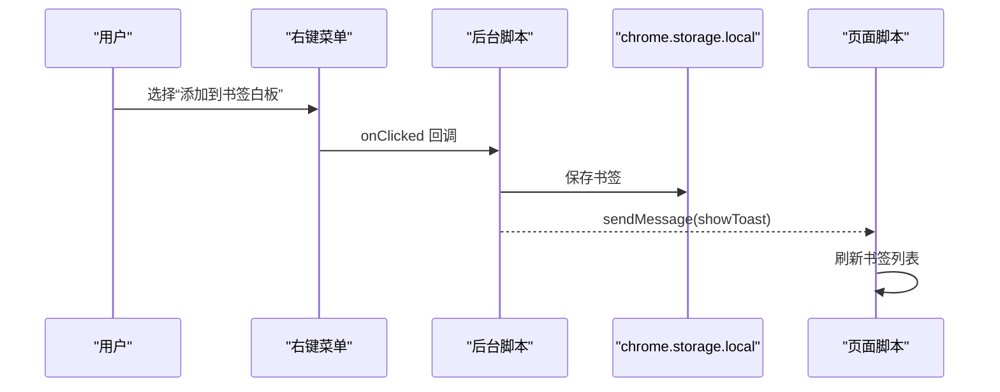
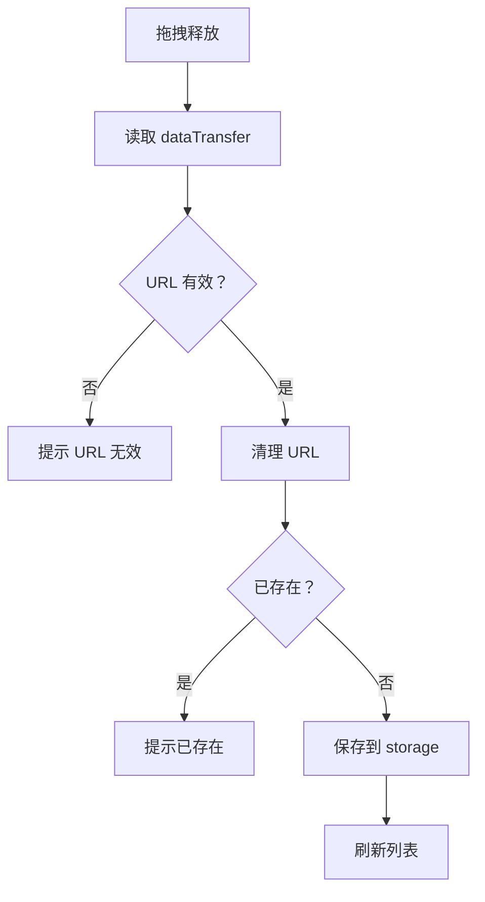

# 书签管理功能

<cite>
**本文引用的文件**
- [manifest.json](file://manifest.json)
- [new-tab.html](file://new-tab.html)
- [sidebar.html](file://sidebar.html)
- [settings.html](file://settings.html)
- [js/app.js](file://js/app.js)
- [js/background.js](file://js/background.js)
- [js/sidebar.js](file://js/sidebar.js)
- [js/settings.js](file://js/settings.js)
- [README.md](file://README.md)
</cite>

## 目录
1. [简介](#简介)
2. [项目结构](#项目结构)
3. [核心组件](#核心组件)
4. [架构总览](#架构总览)
5. [详细组件分析](#详细组件分析)
6. [依赖关系分析](#依赖关系分析)
7. [性能考量](#性能考量)
8. [故障排查指南](#故障排查指南)
9. [结论](#结论)
10. [附录](#附录)

## 简介
本技术文档围绕书签管理功能进行系统化梳理，覆盖以下方面：
- 五种添加方式：拖拽添加、右键菜单添加、手动添加、侧边栏一键添加、一键添加（通过快捷操作）
- 编辑与删除：单个编辑、批量编辑、置顶功能、删除确认机制
- 搜索与过滤：关键词匹配、实时搜索、结果高亮
- API 调用示例：chrome.storage 的使用、DOM 事件处理、用户界面交互
- 数据模型与存储结构：书签数据模型、分组与自动分组、存储位置与结构

## 项目结构
该项目采用 Manifest V3 的 Chrome 扩展架构，主要由以下模块组成：
- 主页面（新标签页）：负责书签展示、搜索、排序、分组筛选、置顶、批量管理等
- 侧边栏：快速浏览、搜索、一键添加、手动添加、拖拽添加
- 后台脚本：右键菜单、消息通信、通知提示
- 设置页面：书签管理、分组管理、数据导入导出、主题与显示设置
- 权限与入口：manifest.json 声明权限、新标签页覆盖、侧边栏路径、扩展图标

图表来源
- [manifest.json](file://manifest.json)
- [new-tab.html](file://new-tab.html)
- [sidebar.html](file://sidebar.html)
- [settings.html](file://settings.html)
- [js/app.js](file://js/app.js)
- [js/background.js](file://js/background.js)
- [js/sidebar.js](file://js/sidebar.js)
- [js/settings.js](file://js/settings.js)

章节来源
- [manifest.json](file://manifest.json)
- [new-tab.html](file://new-tab.html)
- [sidebar.html](file://sidebar.html)
- [settings.html](file://settings.html)

## 核心组件
- 主页面（新标签页）：提供拖拽添加、右键菜单、手动添加、置顶、搜索、排序、分组筛选、批量管理、导入导出等能力
- 侧边栏：提供快速添加、搜索、编辑、删除、主题切换、拖拽添加
- 后台脚本：注册右键菜单、处理右键添加、向页面发送通知、打开侧边栏
- 设置页面：书签管理、分组管理、数据导入导出、统计信息

章节来源
- [js/app.js](file://js/app.js)
- [js/sidebar.js](file://js/sidebar.js)
- [js/background.js](file://js/background.js)
- [js/settings.js](file://js/settings.js)

## 架构总览
整体采用“页面脚本 + 后台脚本 + 存储”的架构：
- 页面脚本负责 UI 交互与数据渲染（app.js、sidebar.js、settings.js）
- 后台脚本负责右键菜单与跨页面消息（background.js）
- 数据统一存储于 chrome.storage.local，页面通过监听 onChanged 实时同步

图表来源
- [js/app.js](file://js/app.js)
- [js/sidebar.js](file://js/sidebar.js)
- [js/background.js](file://js/background.js)

## 详细组件分析

### 1. 五种添加方式

#### 1.1 拖拽添加（浏览器书签栏/页面/地址栏）
- 主页面：监听 dragover/drop 事件，从 dataTransfer 中提取 URL，清理并校验后调用添加函数
- 侧边栏：同样监听 dragover/drop，支持从侧边栏区域拖拽添加
- 添加逻辑：去重检查、标题与图标提取、插入到数组首部、保存并渲染

图表来源
- [js/app.js](file://js/app.js)
- [js/sidebar.js](file://js/sidebar.js)

章节来源
- [js/app.js](file://js/app.js)
- [js/sidebar.js](file://js/sidebar.js)

#### 1.2 右键菜单添加（页面/链接）
- 注册右键菜单项：添加当前页面、添加链接、打开侧边栏
- 点击回调：根据上下文构造书签对象，写入 storage，向当前页面注入通知

图表来源
- [js/background.js](file://js/background.js)
- [js/app.js](file://js/app.js)

章节来源
- [js/background.js](file://js/background.js)

#### 1.3 手动添加（输入 URL 和标题）
- 主页面：弹出模态框，输入 URL 校验后添加
- 侧边栏：弹出对话框，输入 URL/标题，必要时抓取网站信息

章节来源
- [js/app.js](file://js/app.js)
- [js/sidebar.js](file://js/sidebar.js)

#### 1.4 侧边栏一键添加（快捷操作）
- 点击“添加当前页面”按钮，查询活动标签页，调用添加函数

章节来源
- [js/sidebar.js](file://js/sidebar.js)

#### 1.5 一键添加（通过快捷操作）
- 通过扩展图标点击打开侧边栏；侧边栏内部提供“一键添加”按钮

章节来源
- [js/background.js](file://js/background.js)
- [js/sidebar.js](file://js/sidebar.js)

### 2. 编辑与删除

#### 2.1 单个编辑
- 主页面：右键书签卡片弹出菜单，支持编辑名称、置顶/取消置顶、删除、分组选择
- 侧边栏：卡片内编辑按钮，弹出编辑对话框
- 设置页面：列表项编辑按钮，弹出编辑模态框

章节来源
- [js/app.js](file://js/app.js)
- [js/sidebar.js](file://js/sidebar.js)
- [js/settings.js](file://js/settings.js)

#### 2.2 批量编辑（设置页面）
- 批量模式：全选、取消全选、批量删除、批量添加到分组
- 分组选择弹窗：选择目标分组后批量更新

章节来源
- [js/settings.js](file://js/settings.js)

#### 2.3 置顶功能
- 右键菜单项“置顶/取消置顶”，更新标记后保存并渲染

章节来源
- [js/app.js](file://js/app.js)

#### 2.4 删除确认机制
- 所有删除均通过确认弹窗，防止误删
- 设置页面批量删除时也进行二次确认

章节来源
- [js/app.js](file://js/app.js)
- [js/sidebar.js](file://js/sidebar.js)
- [js/settings.js](file://js/settings.js)

### 3. 搜索与过滤

#### 3.1 关键词匹配
- 主页面：搜索框输入时实时过滤标题与 URL
- 设置页面：搜索框输入时过滤标题、URL 与域名
- 侧边栏：搜索框输入时过滤标题与 URL

章节来源
- [js/app.js](file://js/app.js)
- [js/settings.js](file://js/settings.js)
- [js/sidebar.js](file://js/sidebar.js)

#### 3.2 正则表达式支持
- 当前实现为简单包含匹配（includes），未发现正则表达式支持

章节来源
- [js/app.js](file://js/app.js)
- [js/settings.js](file://js/settings.js)
- [js/sidebar.js](file://js/sidebar.js)

#### 3.3 实时搜索与结果高亮
- 实时搜索：input 事件触发过滤与渲染
- 高亮：当前实现未对搜索关键词进行高亮显示

章节来源
- [js/app.js](file://js/app.js)
- [js/settings.js](file://js/settings.js)
- [js/sidebar.js](file://js/sidebar.js)

### 4. 数据模型与存储

#### 4.1 书签数据模型
- 字段：id、url、title、icon、groups、createdAt、pinned、clickCount、lastAccessed
- groups：用于分组关联
- pinned：置顶标记
- clickCount/lastAccessed：访问统计

章节来源
- [js/app.js](file://js/app.js)
- [js/settings.js](file://js/settings.js)
- [js/sidebar.js](file://js/sidebar.js)

#### 4.2 分组与自动分组
- 自定义分组：用户创建，可编辑名称，可删除
- 自动分组：基于域名聚合，不可删除，可自定义显示名称

章节来源
- [js/app.js](file://js/app.js)
- [js/settings.js](file://js/settings.js)

#### 4.3 存储结构与位置
- 存储位置：chrome.storage.local
- 结构：links 数组、groups 数组、autoGroupNames 映射、主题设置等

章节来源
- [js/app.js](file://js/app.js)
- [js/settings.js](file://js/settings.js)
- [js/sidebar.js](file://js/sidebar.js)
- [README.md](file://README.md)

### 5. API 调用示例（路径指引）

- chrome.storage 的使用
  - 读取数据：[chrome.storage.local.get](file://js/app.js)
  - 写入数据：[chrome.storage.local.set](file://js/app.js)
  - 监听变更：[chrome.storage.onChanged.addListener](file://js/app.js)
  - 侧边栏读取：[chrome.storage.local.get](file://js/sidebar.js)
  - 设置页面读取/写入：[chrome.storage.local.get/set](file://js/settings.js)

- DOM 事件处理
  - 拖拽事件：[dragover/drop](file://js/app.js)
  - 搜索输入：[input 事件](file://js/app.js)
  - 主题切换：[click 事件](file://js/app.js)
  - 手动添加：[click 事件](file://js/app.js)
  - 侧边栏事件：[点击/输入/拖拽](file://js/sidebar.js)

- 用户界面交互
  - 模态框：[showModal/closeModal](file://js/app.js)
  - Toast 通知：[showToast](file://js/app.js)
  - 右键菜单：[showBookmarkContextMenu](file://js/app.js)
  - 分组菜单：[showGroupContextMenu](file://js/app.js)

章节来源
- [js/app.js](file://js/app.js)
- [js/sidebar.js](file://js/sidebar.js)
- [js/settings.js](file://js/settings.js)

## 依赖关系分析

图表来源
- [js/background.js](file://js/background.js)
- [js/app.js](file://js/app.js)
- [js/sidebar.js](file://js/sidebar.js)
- [js/settings.js](file://js/settings.js)

章节来源
- [js/background.js](file://js/background.js)
- [js/app.js](file://js/app.js)
- [js/sidebar.js](file://js/sidebar.js)
- [js/settings.js](file://js/settings.js)

## 性能考量
- 域名缓存：getLinkDomain 使用 Map 缓存，减少 URL 解析开销
- 分批渲染：侧边栏对大量书签进行分批渲染，避免主线程阻塞
- 限制显示：侧边栏最多显示固定数量书签，超出部分提示使用搜索
- 实时同步：通过 storage onChanged 监听，避免轮询造成的性能浪费

章节来源
- [js/app.js](file://js/app.js)
- [js/sidebar.js](file://js/sidebar.js)

## 故障排查指南
- 右键菜单未显示
  - 重新安装扩展以重建右键菜单
  - 检查权限声明与注册逻辑

- 书签未同步
  - 确认 chrome.storage.onChanged 监听是否生效
  - 检查存储写入是否成功

- 侧边栏不自动刷新
  - 确认 storage onChanged 监听与 loadData 调用
  - 检查关闭侧边栏的逻辑与消息传递

- 拖拽添加失败
  - 检查 dataTransfer 数据类型与 URL 格式
  - 确认去重逻辑与保存流程

章节来源
- [js/background.js](file://js/background.js)
- [js/app.js](file://js/app.js)
- [js/sidebar.js](file://js/sidebar.js)

## 结论
本项目通过清晰的模块划分与稳定的存储架构，实现了多场景的书签添加、高效的编辑与删除、灵活的搜索与过滤以及良好的性能表现。未来可在搜索高亮、正则表达式支持、批量操作增强等方面进一步完善。

## 附录

### A. 关键流程图（代码级）

#### A.1 右键菜单添加流程

图表来源
- [js/background.js](file://js/background.js)
- [js/app.js](file://js/app.js)

#### A.2 侧边栏拖拽添加流程

图表来源
- [js/sidebar.js](file://js/sidebar.js)