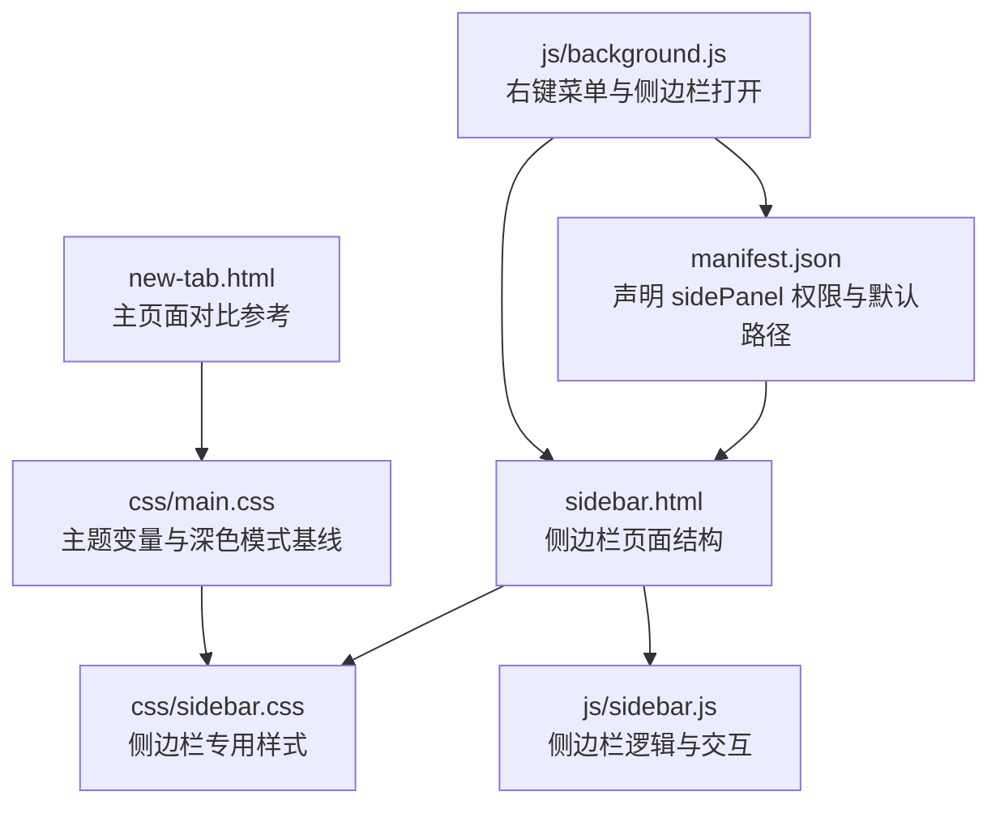
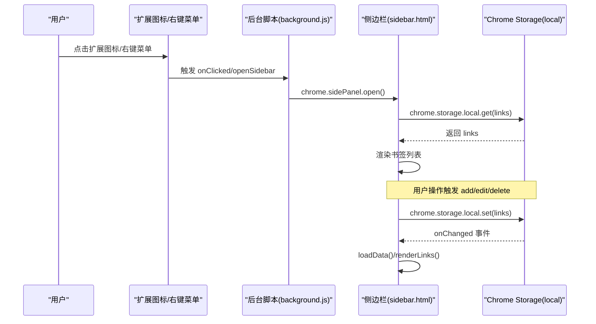
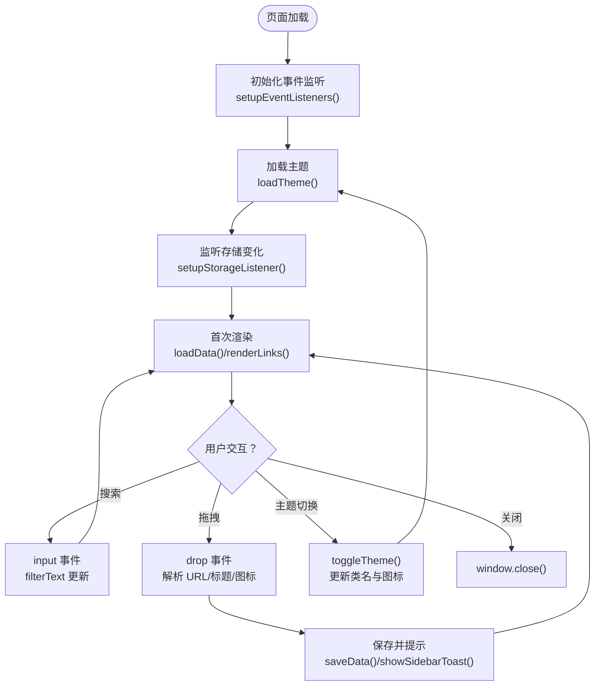
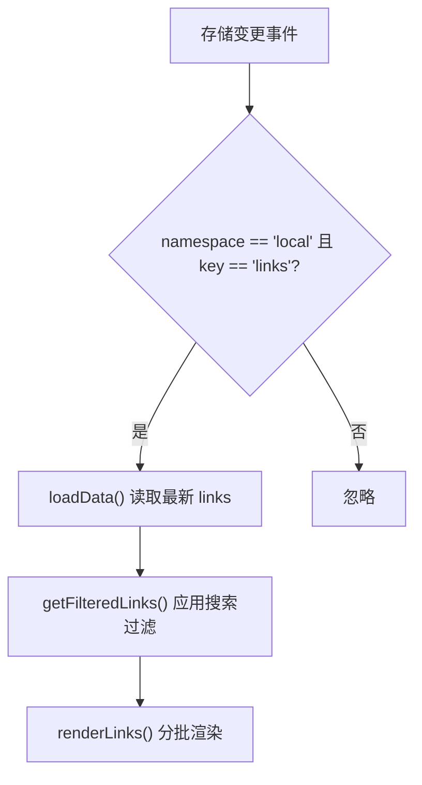
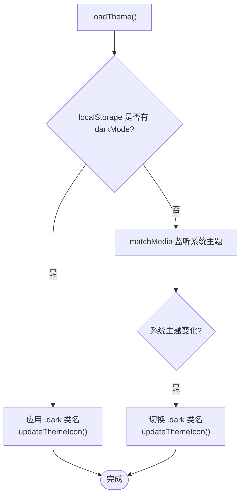
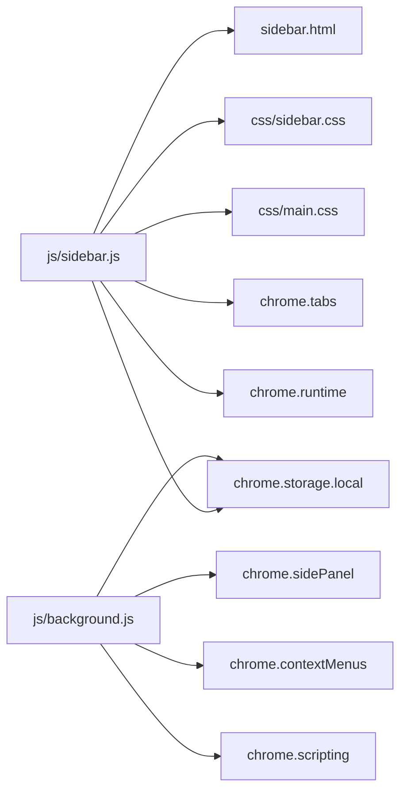

# 侧边栏功能

<cite>
**本文引用的文件**
- [manifest.json](file://manifest.json)
- [sidebar.html](file://sidebar.html)
- [js/sidebar.js](file://js/sidebar.js)
- [css/sidebar.css](file://css/sidebar.css)
- [css/main.css](file://css/main.css)
- [js/background.js](file://js/background.js)
- [README.md](file://README.md)
- [GUIDE.md](file://GUIDE.md)
- [new-tab.html](file://new-tab.html)
</cite>

## 目录
1. [简介](#简介)
2. [项目结构](#项目结构)
3. [核心组件](#核心组件)
4. [架构总览](#架构总览)
5. [详细组件分析](#详细组件分析)
6. [依赖关系分析](#依赖关系分析)
7. [性能考量](#性能考量)
8. [故障排查指南](#故障排查指南)
9. [结论](#结论)
10. [附录](#附录)

## 简介
本文件面向“侧边栏功能”的实现与使用，围绕以下目标展开：
- 侧边栏界面设计与布局：响应式设计、移动端优化、触摸手势支持
- 实时数据同步机制：数据变更监听、增量更新、冲突解决策略
- 独立主题切换：深色/浅色模式切换、主题变量管理、CSS变量动态更新
- 快速操作：书签快速添加、搜索快速执行
- 与主应用的数据交互：数据共享、状态同步、事件通信
- 侧边栏 API 使用指南：chrome.sidePanel API 的调用方法、权限配置、兼容性处理
- 代码示例路径与性能优化建议

## 项目结构
侧边栏功能由 Manifest V3 配置、侧边栏页面、样式与脚本共同组成，配合后台脚本实现右键菜单与侧边栏打开控制。

图表来源
- [manifest.json:1-38](file://manifest.json#L1-L38)
- [sidebar.html:1-51](file://sidebar.html#L1-L51)
- [css/sidebar.css:1-287](file://css/sidebar.css#L1-L287)
- [js/sidebar.js:1-602](file://js/sidebar.js#L1-L602)
- [js/background.js:1-174](file://js/background.js#L1-L174)
- [css/main.css:1-800](file://css/main.css#L1-L800)
- [new-tab.html:1-206](file://new-tab.html#L1-L206)

章节来源
- [manifest.json:1-38](file://manifest.json#L1-L38)
- [sidebar.html:1-51](file://sidebar.html#L1-L51)
- [js/sidebar.js:1-602](file://js/sidebar.js#L1-L602)
- [css/sidebar.css:1-287](file://css/sidebar.css#L1-L287)
- [js/background.js:1-174](file://js/background.js#L1-L174)
- [css/main.css:1-800](file://css/main.css#L1-L800)
- [new-tab.html:1-206](file://new-tab.html#L1-L206)

## 核心组件
- Manifest V3 配置：启用 sidePanel 权限与默认路径，注册上下文菜单与侧边栏打开入口
- 侧边栏页面：包含头部、搜索框、书签列表、手动添加入口
- 侧边栏逻辑：初始化、事件绑定、主题切换、搜索过滤、拖拽添加、存储监听与渲染
- 样式体系：基于 CSS 变量的主题系统，移动端横向卡片布局
- 后台脚本：右键菜单创建与点击处理、侧边栏打开、通知提示

章节来源
- [manifest.json:1-38](file://manifest.json#L1-L38)
- [sidebar.html:1-51](file://sidebar.html#L1-L51)
- [js/sidebar.js:1-602](file://js/sidebar.js#L1-L602)
- [css/sidebar.css:1-287](file://css/sidebar.css#L1-L287)
- [js/background.js:1-174](file://js/background.js#L1-L174)
- [css/main.css:1-800](file://css/main.css#L1-L800)

## 架构总览
侧边栏与主应用通过 Chrome Storage API 实现数据共享；通过 chrome.storage.onChanged 实现实时同步；通过 chrome.sidePanel API 控制侧边栏打开；通过 chrome.contextMenus 实现右键菜单触发。

图表来源
- [js/background.js:39-45](file://js/background.js#L39-L45)
- [js/background.js:46-69](file://js/background.js#L46-L69)
- [js/background.js:169-173](file://js/background.js#L169-L173)
- [js/sidebar.js:30-41](file://js/sidebar.js#L30-L41)
- [js/sidebar.js:142-149](file://js/sidebar.js#L142-L149)
- [js/sidebar.js:311-313](file://js/sidebar.js#L311-L313)

## 详细组件分析

### 1) 侧边栏界面与布局
- 结构组成：头部（Logo、主题切换、添加、关闭）、搜索框、书签列表、手动添加入口
- 响应式与移动端优化：强制横向卡片布局、绝对定位的操作按钮、粘性头部与底部手动添加区域
- 触摸手势支持：拖拽添加（dragover/drop），支持从标签页、地址栏、书签栏拖拽链接

图表来源
- [sidebar.html:10-48](file://sidebar.html#L10-L48)
- [js/sidebar.js:87-133](file://js/sidebar.js#L87-L133)
- [js/sidebar.js:43-85](file://js/sidebar.js#L43-L85)
- [js/sidebar.js:142-149](file://js/sidebar.js#L142-L149)
- [js/sidebar.js:151-202](file://js/sidebar.js#L151-L202)
- [js/sidebar.js:508-601](file://js/sidebar.js#L508-L601)

章节来源
- [sidebar.html:10-48](file://sidebar.html#L10-L48)
- [css/sidebar.css:122-287](file://css/sidebar.css#L122-L287)
- [js/sidebar.js:87-133](file://js/sidebar.js#L87-L133)
- [js/sidebar.js:508-601](file://js/sidebar.js#L508-L601)

### 2) 实时数据同步机制
- 数据变更监听：通过 chrome.storage.onChanged 监听 local 命名空间下的 links 变化
- 增量更新：读取最新数据，过滤搜索词，分批渲染（requestAnimationFrame + 批量片段）
- 冲突解决策略：当前实现为“后写覆盖”，未引入版本号/时间戳冲突检测；建议在需要时引入 lastModified 字段与合并策略

图表来源
- [js/sidebar.js:142-149](file://js/sidebar.js#L142-L149)
- [js/sidebar.js:30-41](file://js/sidebar.js#L30-L41)
- [js/sidebar.js:204-215](file://js/sidebar.js#L204-L215)
- [js/sidebar.js:151-202](file://js/sidebar.js#L151-L202)

章节来源
- [js/sidebar.js:142-149](file://js/sidebar.js#L142-L149)
- [js/sidebar.js:30-41](file://js/sidebar.js#L30-L41)
- [js/sidebar.js:151-202](file://js/sidebar.js#L151-L202)

### 3) 独立主题切换功能
- 深色/浅色模式：基于 CSS 变量与 .dark 类名切换；优先使用本地存储的用户偏好，否则跟随系统
- 主题图标：moon/sun 图标随主题切换
- 系统主题监听：matchMedia 监听 prefers-color-scheme 变化，自动同步

图表来源
- [js/sidebar.js:43-85](file://js/sidebar.js#L43-L85)
- [css/main.css:6-41](file://css/main.css#L6-L41)
- [css/sidebar.css:191-205](file://css/sidebar.css#L191-L205)

章节来源
- [js/sidebar.js:43-85](file://js/sidebar.js#L43-L85)
- [css/main.css:6-41](file://css/main.css#L6-L41)
- [css/sidebar.css:191-205](file://css/sidebar.css#L191-L205)

### 4) 快速操作功能
- 书签快速添加：点击“添加当前页面”按钮，查询当前活动标签页并调用 addBookmark
- 手动添加：弹出模态框，校验 URL，必要时自动获取网站标题
- 搜索快速执行：input 事件即时更新 filterText 并重绘
- 拖拽添加：支持从标签页、地址栏、书签栏拖拽链接，自动解析 URL、标题与图标

章节来源
- [js/sidebar.js:102-114](file://js/sidebar.js#L102-L114)
- [js/sidebar.js:367-488](file://js/sidebar.js#L367-L488)
- [js/sidebar.js:116-123](file://js/sidebar.js#L116-L123)
- [js/sidebar.js:508-601](file://js/sidebar.js#L508-L601)

### 5) 与主应用的数据交互
- 数据共享：所有书签数据存储于 chrome.storage.local.links
- 状态同步：chrome.storage.onChanged 实时刷新侧边栏
- 事件通信：右键菜单添加书签后，后台脚本通过 scripting.executeScript 在当前页面显示 Toast，同时侧边栏通过存储监听自动刷新

章节来源
- [js/background.js:72-109](file://js/background.js#L72-L109)
- [js/background.js:112-167](file://js/background.js#L112-L167)
- [js/sidebar.js:142-149](file://js/sidebar.js#L142-L149)

### 6) 侧边栏 API 使用指南
- chrome.sidePanel.open：点击扩展图标或右键菜单“打开侧边栏”时调用
- chrome.sidePanel.setOptions：扩展安装时启用侧边栏并设置默认路径
- 权限要求：manifest.json 中声明 "sidePanel" 权限
- 兼容性：Manifest V3 下的 sidePanel API 与 Chrome 88+ 兼容

章节来源
- [js/background.js:32-37](file://js/background.js#L32-L37)
- [js/background.js:169-173](file://js/background.js#L169-L173)
- [manifest.json:14](file://manifest.json#L14)
- [manifest.json:23-25](file://manifest.json#L23-L25)

## 依赖关系分析
- 侧边栏页面依赖样式系统（CSS 变量）与图标库
- 侧边栏逻辑依赖 Chrome Extension API（storage、tabs、sidePanel、runtime）
- 后台脚本负责右键菜单与侧边栏打开控制
- 主应用（new-tab.html）提供对比参考，展示完整主题与布局能力

图表来源
- [js/sidebar.js:1-602](file://js/sidebar.js#L1-L602)
- [css/sidebar.css:1-287](file://css/sidebar.css#L1-L287)
- [css/main.css:1-800](file://css/main.css#L1-L800)
- [js/background.js:1-174](file://js/background.js#L1-L174)

章节来源
- [js/sidebar.js:1-602](file://js/sidebar.js#L1-L602)
- [css/sidebar.css:1-287](file://css/sidebar.css#L1-L287)
- [css/main.css:1-800](file://css/main.css#L1-L800)
- [js/background.js:1-174](file://js/background.js#L1-L174)

## 性能考量
- 渲染性能
  - 分批渲染：renderLinks() 使用 requestAnimationFrame + 批量 DOM 片段插入，避免主线程阻塞
  - 显示上限：SIDEBAR_DISPLAY_LIMIT 限制一次性渲染数量，超过时提示“使用搜索筛选”
- 存储与同步
  - 使用 chrome.storage.onChanged 实时监听，减少轮询开销
  - 增量更新：仅在 links 变化时刷新，避免全量重载
- 交互体验
  - 拖拽事件：dragover/dragleave/drop 仅在目标区域生效，降低无关计算
  - 主题切换：通过类名切换与 CSS 变量，避免重排重绘

章节来源
- [js/sidebar.js:151-202](file://js/sidebar.js#L151-L202)
- [js/sidebar.js:7](file://js/sidebar.js#L7)
- [js/sidebar.js:142-149](file://js/sidebar.js#L142-L149)
- [js/sidebar.js:508-601](file://js/sidebar.js#L508-L601)

## 故障排查指南
- 侧边栏不自动刷新
  - 确认使用最新版本（v3.2.3+）
  - 检查 chrome.storage.onChanged 是否正常触发
  - 参考：[README.md:256-258](file://README.md#L256-L258)
- 右键菜单未显示
  - 需要完全重新安装扩展（移除后重新加载）
  - 参考：[README.md:250-252](file://README.md#L250-L252)
- 书签丢失
  - 数据保存在 chrome.storage.local，清除浏览器数据会导致丢失
  - 建议定期备份
  - 参考：[README.md:253-255](file://README.md#L253-L255)
- 侧边栏主题不同步
  - 首次使用自动跟随系统主题；手动设置后尊重用户选择
  - 系统主题变化时自动同步
  - 参考：[README.md:126-131](file://README.md#L126-L131)

章节来源
- [README.md:250-258](file://README.md#L250-L258)
- [README.md:126-131](file://README.md#L126-L131)

## 结论
侧边栏功能通过简洁的页面结构与高效的渲染策略，实现了移动端友好的卡片布局与流畅的交互体验。依托 Chrome Storage 的实时监听与 sidePanel API 的便捷打开，侧边栏与主应用形成一致的数据与状态同步。主题系统基于 CSS 变量，具备良好的可维护性与扩展性。未来可在冲突解决、键盘快捷键与云端同步等方面进一步增强。

## 附录
- 代码示例路径
  - 侧边栏初始化与事件绑定：[js/sidebar.js:9-16](file://js/sidebar.js#L9-L16)
  - 主题切换与图标更新：[js/sidebar.js:70-85](file://js/sidebar.js#L70-L85)
  - 搜索过滤与渲染：[js/sidebar.js:116-123](file://js/sidebar.js#L116-L123)、[js/sidebar.js:204-215](file://js/sidebar.js#L204-L215)
  - 拖拽添加实现：[js/sidebar.js:508-601](file://js/sidebar.js#L508-L601)
  - 侧边栏打开与右键菜单：[js/background.js:39-45](file://js/background.js#L39-L45)、[js/background.js:169-173](file://js/background.js#L169-L173)
- 性能优化建议
  - 引入 lastModified 字段与合并策略，避免并发写入冲突
  - 对搜索输入进行防抖（debounce）以减少频繁渲染
  - 对图标加载增加缓存与占位策略，提升首屏渲染速度