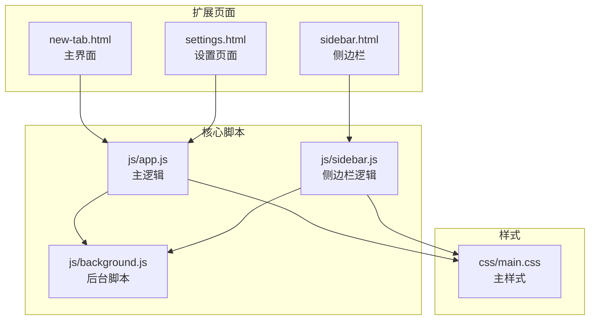
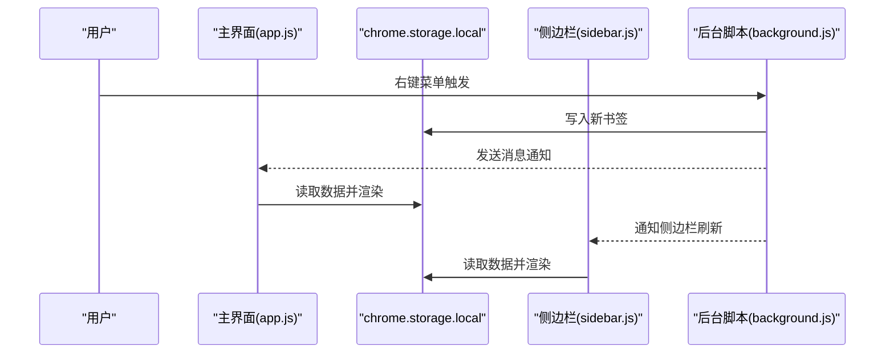
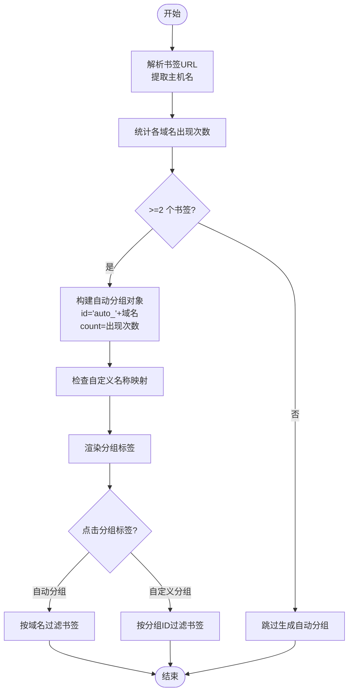
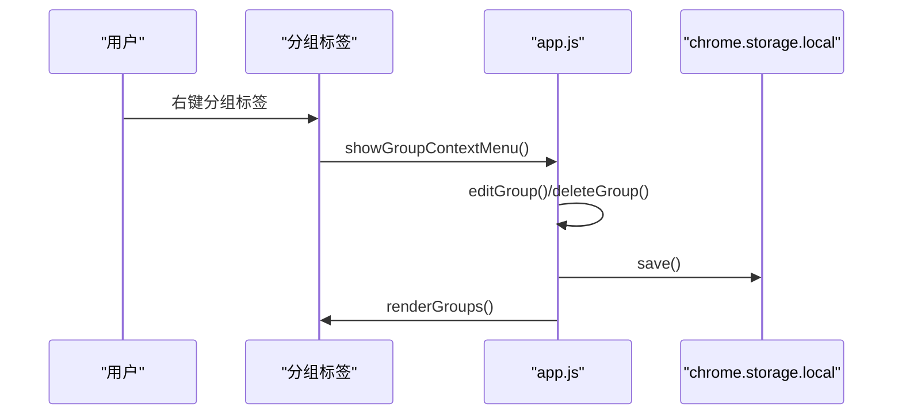
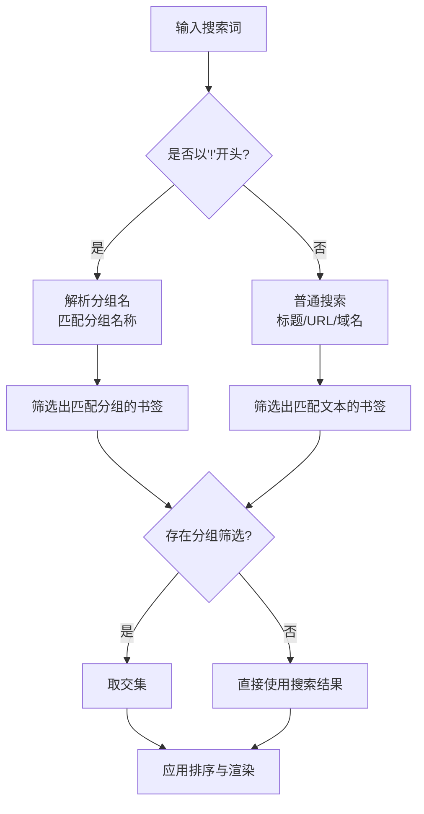
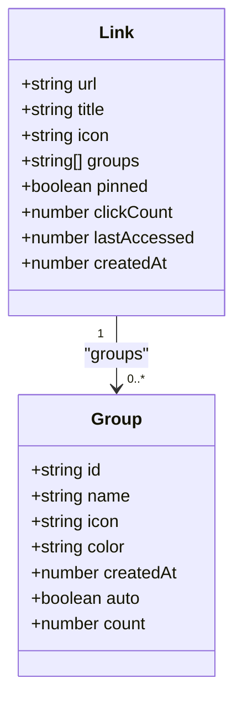
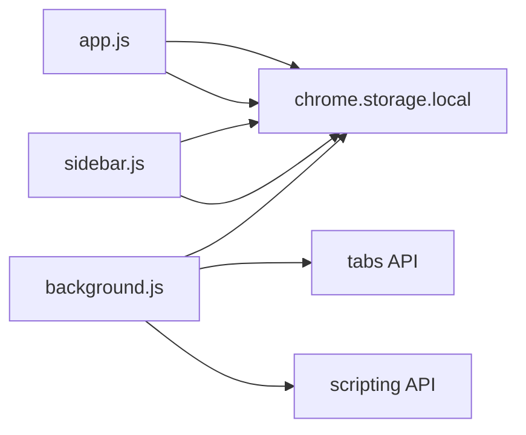

# 分组管理系统

<cite>
**本文引用的文件**
- [manifest.json](file://manifest.json)
- [README.md](file://README.md)
- [GUIDE.md](file://GUIDE.md)
- [UPDATE_LOG.md](file://UPDATE_LOG.md)
- [new-tab.html](file://new-tab.html)
- [sidebar.html](file://sidebar.html)
- [settings.html](file://settings.html)
- [js/app.js](file://js/app.js)
- [js/sidebar.js](file://js/sidebar.js)
- [js/background.js](file://js/background.js)
- [css/main.css](file://css/main.css)
</cite>

## 目录
1. [简介](#简介)
2. [项目结构](#项目结构)
3. [核心组件](#核心组件)
4. [架构总览](#架构总览)
5. [详细组件分析](#详细组件分析)
6. [依赖关系分析](#依赖关系分析)
7. [性能考量](#性能考量)
8. [故障排查指南](#故障排查指南)
9. [结论](#结论)
10. [附录](#附录)

## 简介
本项目是一个基于 Chrome 扩展（Manifest V3）的本地书签管理工具，提供卡片式布局、实时搜索、批量操作、主题切换等能力。本文档围绕“分组管理系统”的实现进行深入技术说明，涵盖：
- 自动分组机制（按域名、按日期、按访问频率）
- 手动分组功能（创建、重命名、删除、颜色与图标）
- 分组筛选与管理（分组选择器、统计信息、跨分组移动）
- 多分组支持（书签多重分组、分组层级与继承）
- 分组数据模型（ID 生成、优先级、排序规则）
- 分组 API 使用示例与最佳实践

## 项目结构
- 扩展入口与页面
  - 新标签页主界面：new-tab.html
  - 侧边栏界面：sidebar.html
  - 设置页面：settings.html
- 核心逻辑
  - 主页面逻辑：js/app.js
  - 侧边栏逻辑：js/sidebar.js
  - 后台脚本（右键菜单、消息通信）：js/background.js
- 样式
  - 主样式：css/main.css
- 扩展清单与文档
  - 清单：manifest.json
  - 说明文档：README.md、GUIDE.md、UPDATE_LOG.md

图表来源
- [new-tab.html:1-206](file://new-tab.html#L1-L206)
- [sidebar.html:1-51](file://sidebar.html#L1-L51)
- [settings.html:1-281](file://settings.html#L1-L281)
- [js/app.js:1-1514](file://js/app.js#L1-L1514)
- [js/sidebar.js:1-602](file://js/sidebar.js#L1-L602)
- [js/background.js:1-174](file://js/background.js#L1-L174)
- [css/main.css:1-200](file://css/main.css#L1-L200)

章节来源
- [manifest.json:1-38](file://manifest.json#L1-L38)
- [README.md:132-154](file://README.md#L132-L154)

## 核心组件
- 分组数据模型
  - 分组对象：id、name、icon、color、createdAt、auto/count（自动分组）
  - 书签对象：groups（字符串数组，指向分组ID）、pinned、clickCount、lastAccessed
- 状态与存储
  - 应用状态：activeGroupFilter、sortBy、currentView、domainCache、autoGroupNames
  - 存储：chrome.storage.local（links、groups、autoGroupNames、darkMode、tipHidden）

章节来源
- [UPDATE_LOG.md:26-43](file://UPDATE_LOG.md#L26-L43)
- [js/app.js:25-106](file://js/app.js#L25-L106)

## 架构总览
分组管理涉及三个主要界面与后台脚本协同：
- 主界面（new-tab.html + js/app.js）：渲染分组标签、分组筛选、智能搜索、排序、分区展示、右键菜单（置顶/分组）
- 侧边栏（sidebar.html + js/sidebar.js）：快速添加、搜索、编辑/删除、主题切换
- 后台脚本（js/background.js）：右键菜单、通知、侧边栏控制

图表来源
- [js/background.js:39-109](file://js/background.js#L39-L109)
- [js/app.js:116-121](file://js/app.js#L116-L121)
- [js/sidebar.js:142-149](file://js/sidebar.js#L142-L149)

## 详细组件分析

### 自动分组机制
- 域名聚合
  - 基于书签 URL 的主机名（去除 www. 并转小写）进行分组
  - 仅当同一域名出现≥2次时生成自动分组
  - 自动分组 ID 采用前缀“auto_”+域名
- 自定义名称映射
  - 用户可在设置中为自动分组自定义显示名称
  - 存储在 autoGroupNames 中，渲染时优先使用自定义名称
- 渲染与筛选
  - 自动分组与自定义分组合并渲染为分组标签
  - 点击自动分组标签时，按域名精确匹配筛选书签

图表来源
- [js/app.js:954-986](file://js/app.js#L954-L986)
- [js/app.js:808-818](file://js/app.js#L808-L818)
- [js/app.js:904-908](file://js/app.js#L904-L908)

章节来源
- [GUIDE.md:174-192](file://GUIDE.md#L174-L192)
- [UPDATE_LOG.md:15-43](file://UPDATE_LOG.md#L15-L43)

### 手动分组功能
- 创建分组
  - 点击“+”按钮，弹出模态框输入名称
  - 自动生成唯一ID（前缀“group_”+时间戳毫秒数）
  - 默认颜色与图标，创建后立即保存并渲染
- 重命名分组
  - 右键分组标签 → “编辑名称”
  - 对于自动分组，仅修改显示名称（不改变域名筛选）
  - 对于自定义分组，直接修改 name 字段
- 删除分组
  - 右键分组标签 → “删除分组”
  - 从所有书签的 groups 数组中移除该分组ID
  - 若当前处于该分组筛选，则切换回“全部”
- 颜色与图标
  - 当前实现：自定义分组默认颜色与图标，自动分组使用“全球”图标
  - 建议：支持自定义颜色与图标（UI 已预留样式）

图表来源
- [js/app.js:544-616](file://js/app.js#L544-L616)
- [js/app.js:475-542](file://js/app.js#L475-L542)

章节来源
- [GUIDE.md:149-172](file://GUIDE.md#L149-L172)
- [UPDATE_LOG.md:15-25](file://UPDATE_LOG.md#L15-L25)

### 分组筛选与管理
- 分组选择器
  - “全部分组”始终存在，点击切换 activeGroupFilter
  - 自动分组与自定义分组合并渲染，标签右侧显示书签数量
- 分组统计信息
  - 渲染时计算每个分组的书签数量（自动分组使用内置 count；自定义分组遍历 links.groups）
- 分组间书签移动
  - 右键书签卡片 → “选择分组”，勾选/取消勾选对应分组
  - 实际为向书签的 groups 数组添加/移除分组ID
- 智能搜索与分组筛选结合
  - 支持“!分组”语法（中英文全角兼容），按分组名称模糊匹配
  - 搜索结果与分组筛选同时生效

图表来源
- [js/app.js:820-857](file://js/app.js#L820-L857)
- [js/app.js:919-932](file://js/app.js#L919-L932)

章节来源
- [GUIDE.md:194-210](file://GUIDE.md#L194-L210)
- [UPDATE_LOG.md:80-99](file://UPDATE_LOG.md#L80-L99)

### 多分组支持与层级结构
- 多分组支持
  - 书签的 groups 字段为字符串数组，支持同时属于多个分组
  - 右键书签选择分组时，可多选
- 层级结构与继承
  - 当前版本不支持分组嵌套（分组只有一级）
  - 自动分组与自定义分组并列管理，无继承关系
- 建议
  - 可考虑引入分组层级（父子关系）与继承策略，但需评估 UI 与算法复杂度

章节来源
- [UPDATE_LOG.md:26-43](file://UPDATE_LOG.md#L26-L43)
- [GUIDE.md:436-437](file://GUIDE.md#L436-L437)

### 分组数据模型与排序规则
- 数据模型
  - 分组：id、name、icon、color、createdAt、auto、count
  - 书签：url、title、icon、groups、pinned、clickCount、lastAccessed、createdAt
- ID 生成
  - 自动分组：auto_ + 域名
  - 自定义分组：group_ + 时间戳毫秒数
- 优先级与排序
  - 置顶书签始终排在最前（不受排序影响）
  - 支持按创建时间（升/降）、标题（中文字母序）、使用频率（降序）排序
  - 中文标题使用 localeCompare 进行正确排序

图表来源
- [UPDATE_LOG.md:26-43](file://UPDATE_LOG.md#L26-L43)
- [UPDATE_LOG.md:53-58](file://UPDATE_LOG.md#L53-L58)

章节来源
- [UPDATE_LOG.md:53-58](file://UPDATE_LOG.md#L53-L58)
- [README.md:171-187](file://README.md#L171-L187)

### 分组 API 使用示例与最佳实践
以下为分组相关 API 的调用路径与最佳实践（以代码片段路径代替具体代码）：
- 创建分组
  - 触发：点击“+”按钮
  - 路径：[js/app.js:348-372](file://js/app.js#L348-L372)
  - 行为：生成唯一ID、默认颜色与图标、保存并渲染
- 编辑分组（含自动分组）
  - 触发：右键分组 → “编辑名称”
  - 路径：[js/app.js:475-513](file://js/app.js#L475-L513)
  - 行为：区分自动/自定义分组，自动分组仅更新显示名称映射
- 删除分组
  - 触发：右键分组 → “删除分组”
  - 路径：[js/app.js:515-542](file://js/app.js#L515-L542)
  - 行为：从所有书签移除该分组ID，必要时切换筛选
- 书签添加到分组
  - 触发：右键书签 → “选择分组”
  - 路径：[js/app.js:618-758](file://js/app.js#L618-L758)
  - 行为：切换 groups 数组，保存并渲染
- 智能搜索与分组筛选
  - 路径：[js/app.js:804-884](file://js/app.js#L804-L884)
  - 行为：支持“!分组”语法，与分组筛选叠加
- 分区展示与统计
  - 路径：[js/app.js:1093-1184](file://js/app.js#L1093-L1184)
  - 行为：置顶/最近添加/全部视图，统计数量与时间

最佳实践
- 自动分组命名：在设置中为常用域名配置自定义名称，提升可读性
- 多分组策略：为同一书签分配多个分组时，避免过度细分导致管理成本上升
- 排序策略：优先使用“使用频率”排序，配合置顶功能突出高频书签
- 数据持久化：所有分组与书签变更均通过 save() 写入 chrome.storage.local

章节来源
- [js/app.js:348-372](file://js/app.js#L348-L372)
- [js/app.js:475-542](file://js/app.js#L475-L542)
- [js/app.js:618-758](file://js/app.js#L618-L758)
- [js/app.js:804-884](file://js/app.js#L804-L884)
- [js/app.js:1093-1184](file://js/app.js#L1093-L1184)

## 依赖关系分析
- 组件耦合
  - app.js 与 sidebar.js 通过 chrome.storage.local 同步数据
  - background.js 通过消息与脚本注入向页面显示通知
- 外部依赖
  - Chrome Extension APIs：storage、contextMenus、tabs、scripting、sidePanel
  - CSS 变量与 Font Awesome 图标库

图表来源
- [manifest.json:9-25](file://manifest.json#L9-L25)
- [js/background.js:1-174](file://js/background.js#L1-L174)
- [js/app.js:116-121](file://js/app.js#L116-L121)
- [js/sidebar.js:142-149](file://js/sidebar.js#L142-L149)

章节来源
- [manifest.json:9-25](file://manifest.json#L9-L25)

## 性能考量
- 域名解析缓存
  - domainCache：避免重复解析 URL 主机名，减少计算开销
- 分区渲染优化
  - 置顶与最近添加分区独立渲染，减少 DOM 操作
- 侧边栏分批渲染
  - 使用 requestAnimationFrame 分批渲染，避免主线程阻塞
- 存储与同步
  - 通过 chrome.storage.onChanged 实时同步，避免轮询

章节来源
- [js/app.js:32-33](file://js/app.js#L32-L33)
- [js/app.js:1093-1184](file://js/app.js#L1093-L1184)
- [js/sidebar.js:174-201](file://js/sidebar.js#L174-L201)

## 故障排查指南
- 右键菜单未显示
  - 重新安装扩展（移除后重新加载）
- 侧边栏不自动刷新
  - 确保使用最新版本（v3.2.5+），关闭并重新打开侧边栏
- 删除分组不会删除书签
  - 正常行为：仅移除分组标签，不删除书签
- 一个书签可属于多个分组
  - 正常行为：支持多分组归属
- 导入数据后主题变化
  - 导入文件包含主题设置，可在设置中重新切换

章节来源
- [GUIDE.md:393-410](file://GUIDE.md#L393-L410)

## 结论
本分组管理系统通过“自动分组 + 手动分组”的组合，实现了灵活的书签组织与高效检索。系统具备良好的扩展性与性能表现，支持多分组、智能搜索、分区展示与实时同步。未来可进一步增强分组层级、颜色与图标自定义、导入导出与备份等功能，以满足更复杂的管理需求。

## 附录
- 数据结构参考
  - 书签：links[].groups 为分组ID数组
  - 分组：groups[] 与自动生成的自动分组
- 版本与更新
  - 当前版本：v3.2.5
  - 分组系统已实现，排序、置顶、分区展示等功能逐步完善

章节来源
- [README.md:171-187](file://README.md#L171-L187)
- [UPDATE_LOG.md:26-43](file://UPDATE_LOG.md#L26-L43)