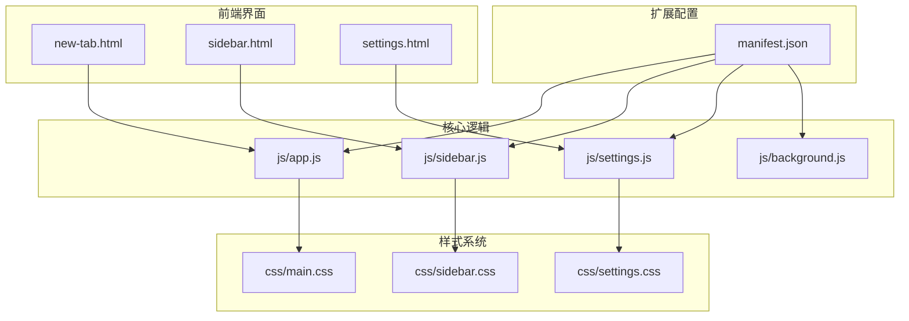
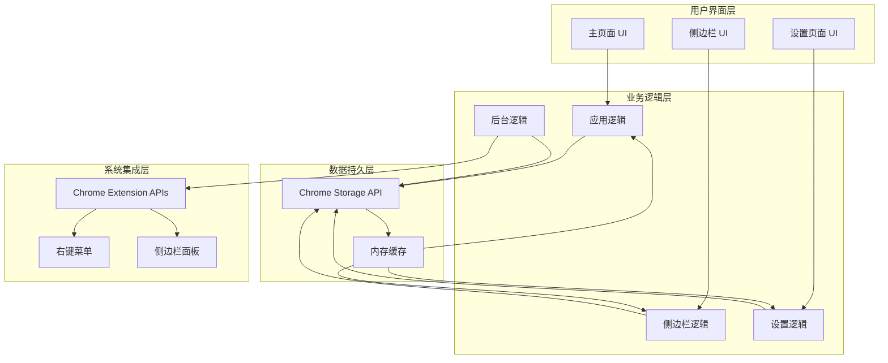
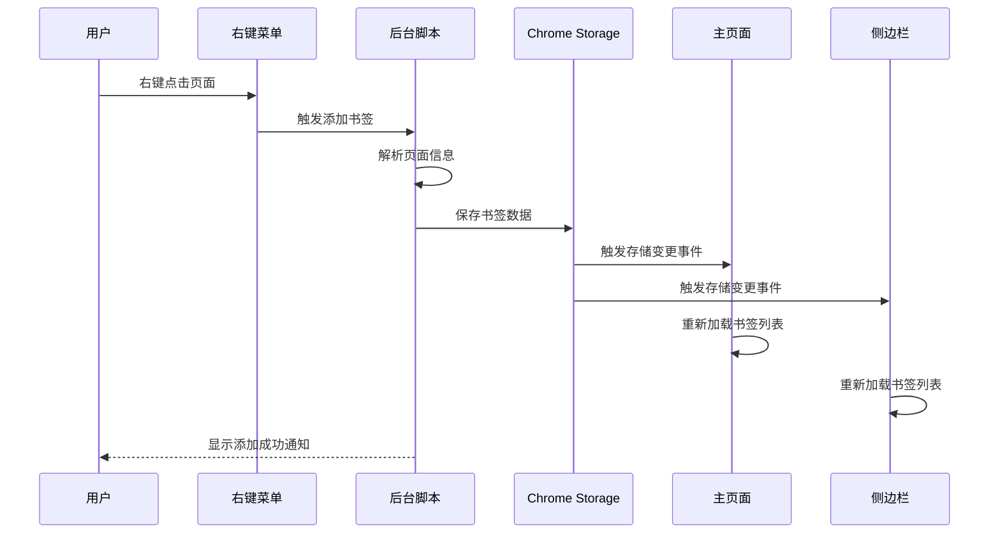
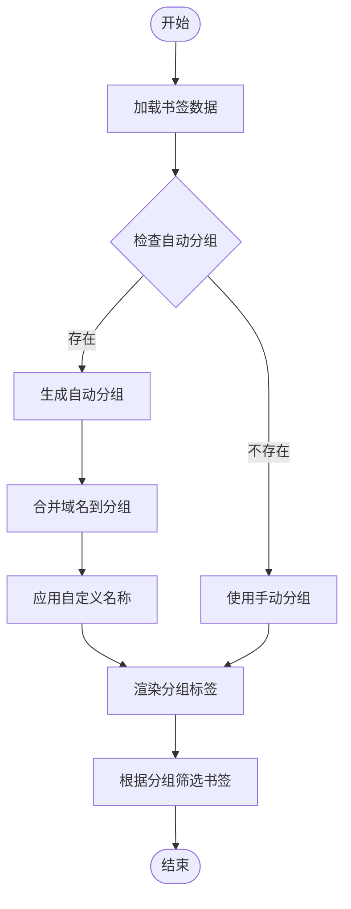
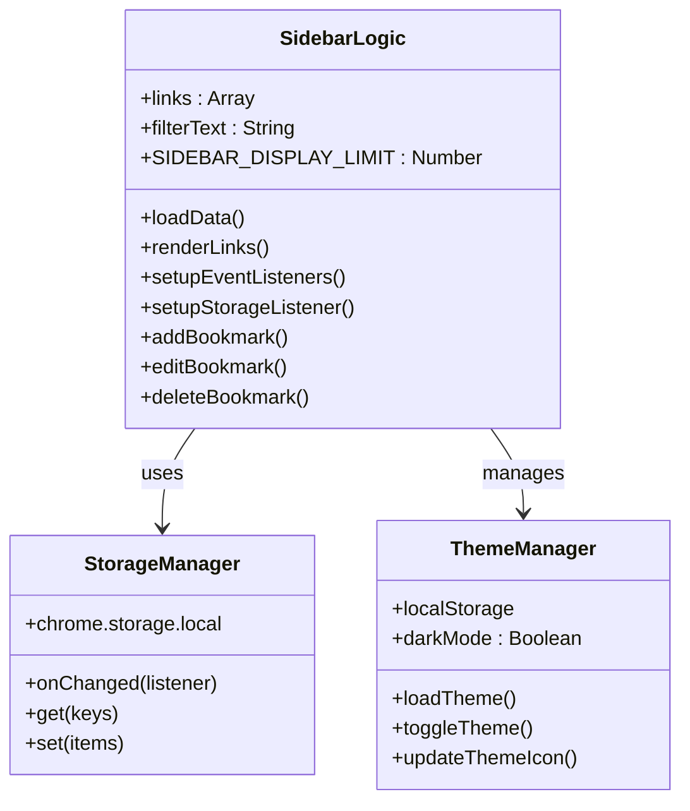
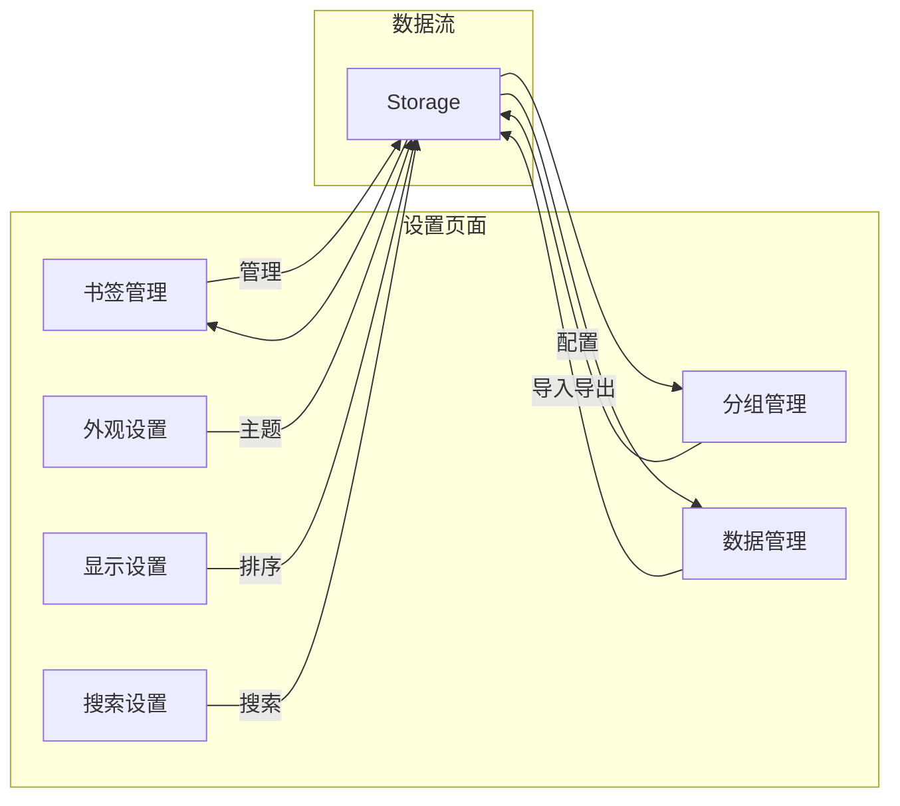
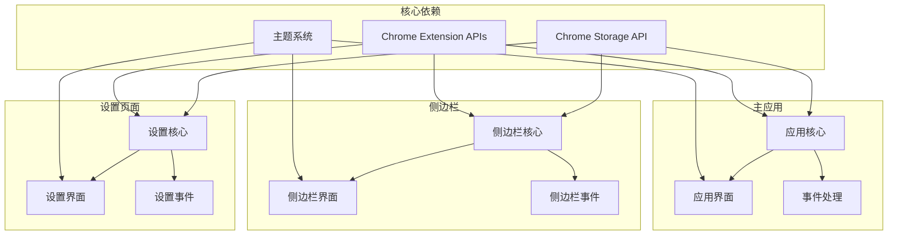

# 核心功能详解

<cite>
**本文档引用的文件**
- [manifest.json](file://manifest.json)
- [README.md](file://README.md)
- [GUIDE.md](file://GUIDE.md)
- [new-tab.html](file://new-tab.html)
- [sidebar.html](file://sidebar.html)
- [settings.html](file://settings.html)
- [js/app.js](file://js/app.js)
- [js/sidebar.js](file://js/sidebar.js)
- [js/settings.js](file://js/settings.js)
- [js/background.js](file://js/background.js)
- [css/main.css](file://css/main.css)
- [css/sidebar.css](file://css/sidebar.css)
- [css/settings.css](file://css/settings.css)
</cite>

## 目录
1. [简介](#简介)
2. [项目结构](#项目结构)
3. [核心组件](#核心组件)
4. [架构概览](#架构概览)
5. [详细组件分析](#详细组件分析)
6. [依赖关系分析](#依赖关系分析)
7. [性能考虑](#性能考虑)
8. [故障排除指南](#故障排除指南)
9. [结论](#结论)
10. [附录](#附录)

## 简介

书签白板是一个基于 Chrome 扩展的隐私优先本地书签管理工具。该项目采用 Manifest V3 标准，提供现代化的书签管理体验，支持多种添加方式、智能分组系统、实时同步和移动端优化设计。

## 项目结构

项目采用模块化架构，主要由以下核心部分组成：

**图表来源**
- [manifest.json:1-38](file://manifest.json#L1-L38)
- [new-tab.html:1-206](file://new-tab.html#L1-L206)
- [sidebar.html:1-51](file://sidebar.html#L1-L51)
- [settings.html:1-281](file://settings.html#L1-L281)

**章节来源**
- [manifest.json:1-38](file://manifest.json#L1-L38)
- [README.md:132-154](file://README.md#L132-L154)

## 核心组件

### 主页面组件 (new-tab.html + js/app.js)

主页面提供了完整的书签管理功能，包括：
- 五种添加方式：拖拽、右键菜单、手动添加、侧边栏添加、一键添加
- 实时搜索和过滤
- 分组管理和筛选
- 置顶功能和最近添加分区
- 批量操作支持

### 侧边栏组件 (sidebar.html + js/sidebar.js)

侧边栏专为快速访问设计，具有：
- 移动端优化的横向布局
- 独立的主题切换系统
- 实时数据同步
- 快速操作入口

### 设置中心 (settings.html + js/settings.js)

设置页面提供高级管理功能：
- 书签列表管理
- 分组系统配置
- 数据导入导出
- 排序和显示选项

**章节来源**
- [new-tab.html:1-206](file://new-tab.html#L1-L206)
- [sidebar.html:1-51](file://sidebar.html#L1-L51)
- [settings.html:1-281](file://settings.html#L1-L281)

## 架构概览

书签白板采用分层架构设计，各组件职责明确：

**图表来源**
- [js/app.js:1-800](file://js/app.js#L1-L800)
- [js/sidebar.js:1-602](file://js/sidebar.js#L1-L602)
- [js/settings.js:1-800](file://js/settings.js#L1-L800)
- [js/background.js:1-174](file://js/background.js#L1-L174)

## 详细组件分析

### 书签添加系统

书签白板提供了五种灵活的添加方式：

#### 1. 拖拽添加
- 支持从地址栏、网页链接、书签栏拖拽
- 自动提取标题和图标
- 智能 URL 清理和验证

#### 2. 右键菜单添加
- 页面右键菜单：添加当前页面
- 链接右键菜单：添加特定链接
- 侧边栏右键菜单：打开侧边栏

#### 3. 手动添加
- 输入完整 URL 和自定义标题
- 支持任意链接添加
- 实时格式验证

#### 4. 一键添加
- 侧边栏快速添加当前浏览页面
- 自动获取页面信息
- 无干扰的添加体验

#### 5. 侧边栏添加
- 专门的添加按钮
- 支持拖拽和手动输入
- 独立的主题和布局

**图表来源**
- [js/background.js:39-69](file://js/background.js#L39-L69)
- [js/app.js:116-121](file://js/app.js#L116-L121)
- [js/sidebar.js:142-149](file://js/sidebar.js#L142-L149)

**章节来源**
- [GUIDE.md:57-86](file://GUIDE.md#L57-L86)
- [js/background.js:1-174](file://js/background.js#L1-L174)

### 分组管理系统

分组系统支持两种模式：手动分组和自动分组。

#### 手动分组
- 用户创建和管理分组
- 支持编辑和删除
- 分组内书签管理

#### 自动分组
- 基于域名的智能分组
- 可自定义分组显示名称
- 支持域名合并

**图表来源**
- [js/app.js:475-542](file://js/app.js#L475-L542)
- [js/settings.js:712-733](file://js/settings.js#L712-L733)

**章节来源**
- [GUIDE.md:147-210](file://GUIDE.md#L147-L210)
- [js/app.js:475-542](file://js/app.js#L475-L542)

### 侧边栏功能系统

侧边栏采用独立的设计理念，专门为快速访问而优化：

#### 移动端优化
- 强制横向布局，每行一个卡片
- 优化触摸交互
- 紧凑的布局设计

#### 实时同步
- 使用 `chrome.storage.onChanged` 监听数据变化
- 自动刷新书签列表
- 无需手动操作

#### 独立主题切换
- 独立的深色/浅色模式
- 不影响主页面主题设置
- 本地存储主题偏好

**图表来源**
- [js/sidebar.js:1-602](file://js/sidebar.js#L1-L602)

**章节来源**
- [sidebar.html:1-51](file://sidebar.html#L1-L51)
- [js/sidebar.js:1-602](file://js/sidebar.js#L1-L602)

### 设置中心功能

设置页面提供全面的管理选项：

#### 书签管理
- 列表式书签管理
- 搜索和过滤功能
- 批量操作支持

#### 分组管理
- 手动分组创建和编辑
- 自动分组配置
- 分组统计信息

#### 数据管理
- 数据导入导出功能
- 加密保护机制
- 数据统计信息

**图表来源**
- [settings.html:1-281](file://settings.html#L1-L281)
- [js/settings.js:1-800](file://js/settings.js#L1-L800)

**章节来源**
- [settings.html:1-281](file://settings.html#L1-L281)
- [js/settings.js:1-800](file://js/settings.js#L1-L800)

## 依赖关系分析

项目采用松耦合设计，各组件间依赖关系清晰：

**图表来源**
- [manifest.json:9-25](file://manifest.json#L9-L25)
- [js/app.js:1-800](file://js/app.js#L1-L800)
- [js/sidebar.js:1-602](file://js/sidebar.js#L1-L602)
- [js/settings.js:1-800](file://js/settings.js#L1-L800)

**章节来源**
- [manifest.json:9-25](file://manifest.json#L9-L25)

## 性能考虑

项目在性能方面采用了多项优化策略：

### 内存管理
- 域名缓存机制，避免重复解析
- 分页渲染，控制侧边栏显示数量
- 事件委托减少内存占用

### 数据同步
- 使用 `chrome.storage.onChanged` 实现实时同步
- 避免不必要的数据重载
- 批量操作优化

### 用户体验
- 防止 FOUC 的 CSS 加载策略
- 动画性能优化
- 响应式设计减少重排

## 故障排除指南

### 常见问题及解决方案

#### 右键菜单不显示
- **原因**：扩展权限问题或缓存问题
- **解决**：完全重新安装扩展
- **预防**：定期更新扩展版本

#### 书签丢失
- **原因**：浏览器数据清理
- **解决**：使用导入功能恢复
- **预防**：定期导出备份

#### 侧边栏不自动刷新
- **原因**：版本兼容性问题
- **解决**：更新到最新版本
- **预防**：保持扩展更新

#### 主题切换异常
- **原因**：本地存储冲突
- **解决**：清除相关存储数据
- **预防**：避免同时使用多个主题扩展

**章节来源**
- [README.md:248-274](file://README.md#L248-L274)
- [GUIDE.md:379-410](file://GUIDE.md#L379-L410)

## 结论

书签白板是一个设计精良的 Chrome 扩展，提供了完整的书签管理解决方案。项目采用现代前端技术栈，实现了良好的用户体验和强大的功能性。通过模块化的架构设计，项目具备了良好的可维护性和扩展性。

主要优势包括：
- 多样化的书签添加方式
- 智能的分组管理系统
- 实时的数据同步
- 移动端优化的侧边栏
- 完善的设置中心
- 隐私优先的设计理念

## 附录

### 使用示例

#### 添加书签的最佳实践
1. **拖拽添加**：适用于快速保存网页链接
2. **右键菜单**：适合批量添加页面
3. **手动添加**：用于保存特殊链接
4. **侧边栏添加**：移动端快速访问
5. **一键添加**：保存当前浏览页面

#### 分组管理建议
- 按项目或主题创建分组
- 使用自动分组减少重复工作
- 定期整理和优化分组结构
- 利用分组进行快速筛选

#### 数据备份策略
- 建议每月导出一次备份
- 将备份文件保存在多个位置
- 定期测试备份文件的完整性
- 使用加密保护敏感数据