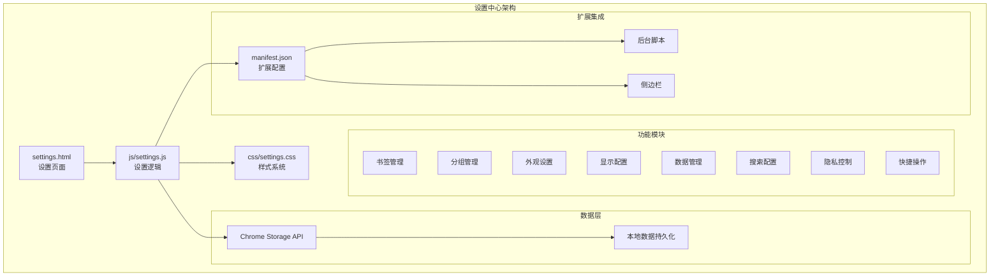
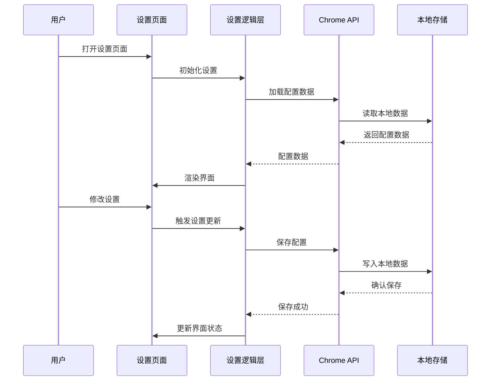
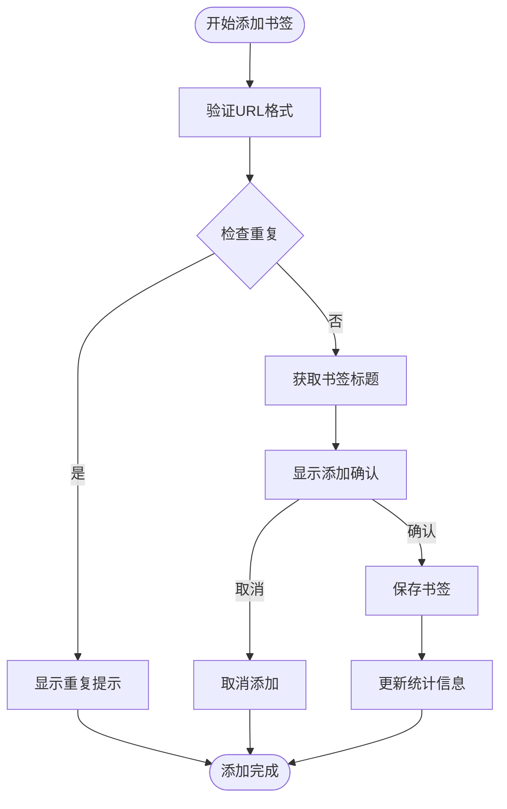
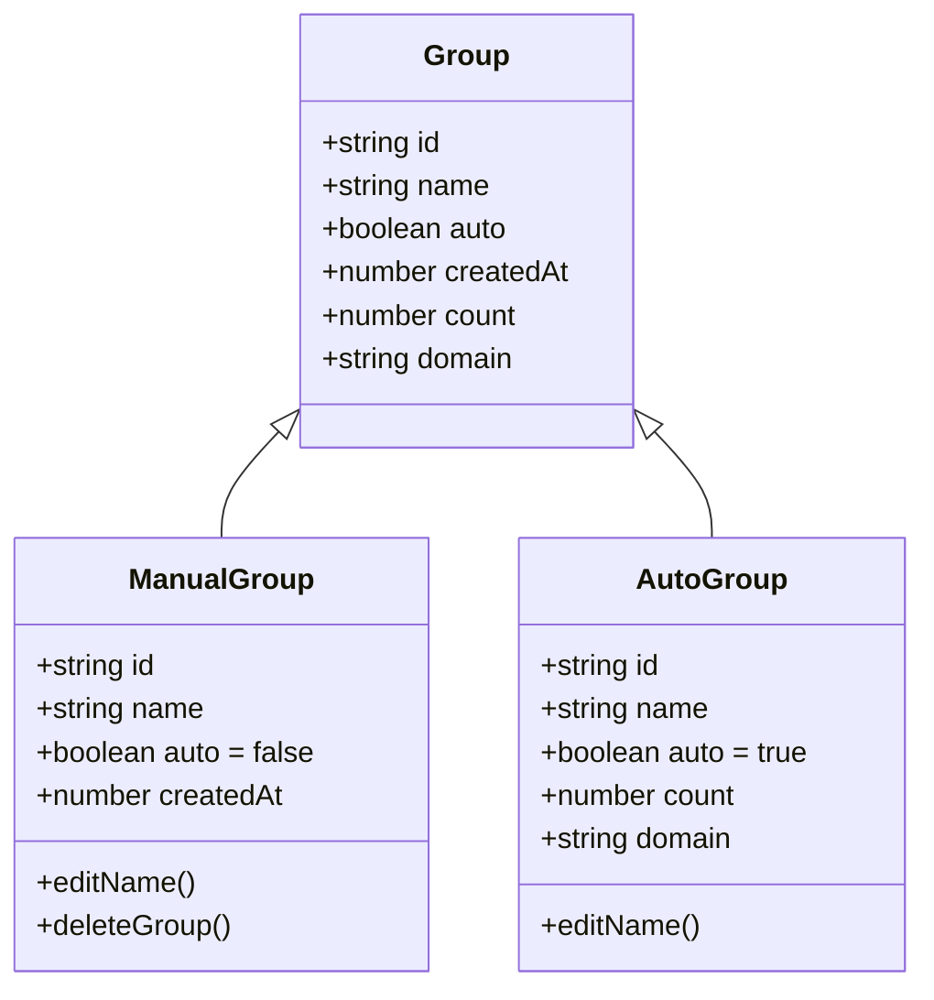
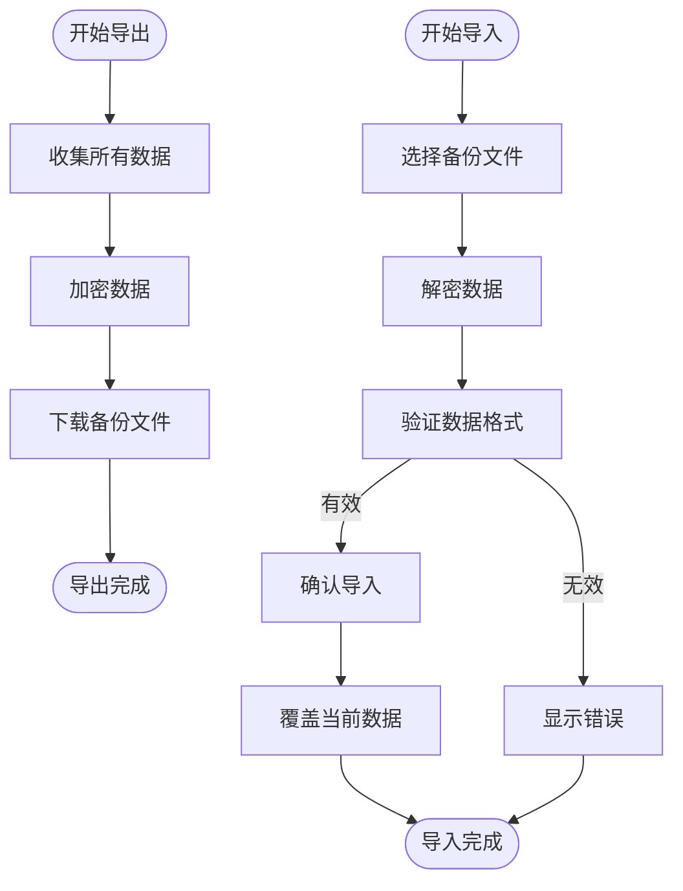
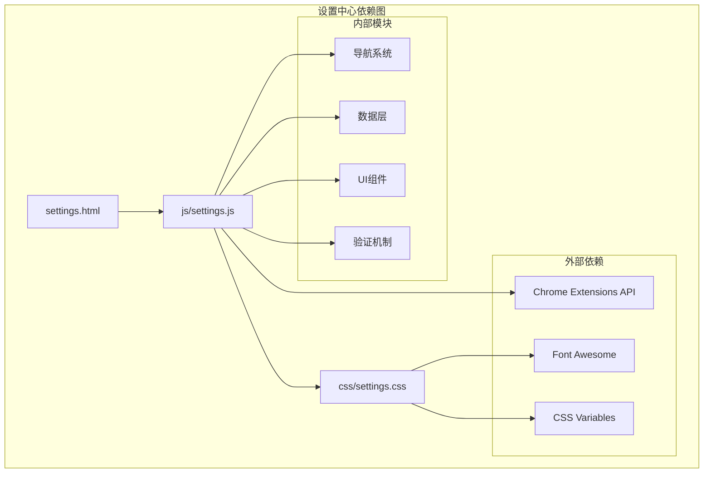

# 设置中心

<cite>
**本文引用的文件**
- [settings.html](file://settings.html)
- [js/settings.js](file://js/settings.js)
- [css/settings.css](file://css/settings.css)
- [manifest.json](file://manifest.json)
- [README.md](file://README.md)
- [GUIDE.md](file://GUIDE.md)
- [backup/app.js](file://backup/app.js)
- [backup/new-tab.html](file://backup/new-tab.html)
- [backup/tailwind.css](file://backup/tailwind.css)
</cite>

## 目录
1. [简介](#简介)
2. [项目结构](#项目结构)
3. [核心组件](#核心组件)
4. [架构概览](#架构概览)
5. [详细组件分析](#详细组件分析)
6. [依赖关系分析](#依赖关系分析)
7. [性能考虑](#性能考虑)
8. [故障排除指南](#故障排除指南)
9. [结论](#结论)
10. [附录](#附录)

## 简介
设置中心是书签白板 Chrome 扩展的核心配置管理模块，提供全面的书签管理、分组管理、外观设置、显示配置、数据管理和隐私控制功能。该系统基于 Manifest V3 架构，采用本地存储策略，确保用户数据的隐私性和安全性。

## 项目结构
书签白板项目采用模块化设计，设置中心位于独立的 HTML 页面中，通过 JavaScript 逻辑层实现完整的配置管理功能。



**图表来源**
- [settings.html:1-281](file://settings.html#L1-L281)
- [js/settings.js:1-1216](file://js/settings.js#L1-L1216)
- [manifest.json:1-38](file://manifest.json#L1-L38)

**章节来源**
- [settings.html:1-281](file://settings.html#L1-L281)
- [manifest.json:1-38](file://manifest.json#L1-L38)

## 核心组件
设置中心由九个主要功能模块组成，每个模块都提供特定的配置和管理能力：

### 1. 书签管理模块
提供书签的列表式管理、批量操作和搜索功能，支持多种排序方式和过滤条件。

### 2. 分组管理模块
管理手动创建的分组和自动分组，支持分组的创建、编辑、删除和统计分析。

### 3. 外观设置模块
当前版本显示占位符，未来将支持主题切换、字体大小、布局密度和动画效果配置。

### 4. 显示配置模块
当前版本显示占位符，未来将支持列表视图、网格视图、搜索框位置和快捷键显示。

### 5. 数据管理模块
提供完整的数据导入导出功能，支持加密备份和恢复，包含详细的统计数据。

### 6. 搜索配置模块
当前版本显示占位符，未来将支持搜索范围、匹配算法、结果排序和高亮显示配置。

### 7. 隐私控制模块
当前版本显示占位符，未来将支持数据本地化、访问日志和统计收集控制。

### 8. 快捷操作模块
当前版本显示占位符，未来将支持快捷键自定义、鼠标手势和批量操作配置。

### 9. 关于信息模块
显示扩展版本信息、使用文档链接和反馈渠道。

**章节来源**
- [settings.html:20-56](file://settings.html#L20-L56)
- [js/settings.js:27-65](file://js/settings.js#L27-L65)

## 架构概览
设置中心采用响应式架构设计，结合前端框架和 Chrome 扩展 API 实现完整的配置管理功能。



**图表来源**
- [js/settings.js:95-110](file://js/settings.js#L95-L110)
- [js/settings.js:176-191](file://js/settings.js#L176-L191)

## 详细组件分析

### 书签管理设置
书签管理模块提供全面的书签配置和管理功能，包括默认分组、添加确认、重复检测和批量操作限制。

#### 默认分组配置
系统自动为具有相同域名的书签创建分组，支持自定义分组名称：
- 自动分组基于域名识别（如 github.com → GitHub）
- 支持自定义分组名称（如将 "GitHub" 改为 "代码仓库"）
- 自动分组数量限制：至少2个书签才创建分组
- 自动分组排序：按书签数量降序排列

#### 添加确认机制
所有书签添加操作都包含确认机制：
- 重复书签检测：检查 URL 是否已存在于数据库中
- 添加确认弹窗：防止误操作
- 智能标题获取：优先使用网页标题，降级使用域名

#### 批量操作限制
批量操作功能包含完整的安全控制：
- 批量模式切换：需要明确启用批量模式
- 选择限制：支持全选、取消全选和逐项选择
- 操作确认：批量删除需要二次确认
- 选择状态：实时显示选中数量



**图表来源**
- [js/settings.js:170-190](file://js/settings.js#L170-L190)
- [js/settings.js:479-492](file://js/settings.js#L479-L492)

**章节来源**
- [js/settings.js:170-190](file://js/settings.js#L170-L190)
- [js/settings.js:479-492](file://js/settings.js#L479-L492)
- [GUIDE.md:216-238](file://GUIDE.md#L216-L238)

### 分组管理配置
分组管理模块提供灵活的分组系统，支持手动分组和自动分组的混合管理。

#### 分组类型
系统支持两种分组类型：
- **手动分组**：用户创建和管理的分组，可自由编辑和删除
- **自动分组**：系统根据域名自动生成的分组，不可删除但可重命名

#### 分组数量限制
- 自动分组：基于域名识别，至少2个书签才创建
- 手动分组：无数量限制，可无限创建
- 分组层级：支持一级分组，不支持嵌套文件夹

#### 颜色方案和图标库
当前版本使用统一的颜色方案：
- 手动分组：使用主色调（紫色）
- 自动分组：使用次要色调（灰色）
- 图标库：Font Awesome 图标库，支持文件夹和地球图标

#### 分组排序规则
分组排序遵循以下规则：
- 手动分组：按创建时间排序
- 自动分组：按书签数量降序排列
- 混合显示：手动分组在前，自动分组在后



**图表来源**
- [js/settings.js:539-548](file://js/settings.js#L539-L548)
- [js/settings.js:713-733](file://js/settings.js#L713-L733)

**章节来源**
- [js/settings.js:539-548](file://js/settings.js#L539-L548)
- [js/settings.js:713-733](file://js/settings.js#L713-L733)
- [GUIDE.md:147-210](file://GUIDE.md#L147-L210)

### 外观设置选项
外观设置模块提供主题切换和视觉定制功能，当前版本显示占位符，未来将支持更多配置选项。

#### 主题切换
- **深色模式**：护眼设计，适合夜间使用
- **浅色模式**：清晰明亮，适合白天使用
- **自动跟随系统**：首次使用自动检测系统主题偏好
- **手动切换**：用户可随时切换主题模式

#### 字体大小和布局密度
未来版本将支持：
- 字体大小调节（小/中/大）
- 布局密度控制（紧凑/标准/宽松）
- 动画效果开关

#### 颜色方案
- CSS 变量系统实现统一配色
- 支持主题色、辅助色和强调色
- 响应式颜色适配

**章节来源**
- [css/settings.css:34-167](file://css/settings.css#L34-L167)
- [README.md:28-34](file://README.md#L28-L34)

### 显示设置功能
显示设置模块提供界面布局和显示选项的配置，当前版本显示占位符。

#### 列表视图和网格视图
未来版本将支持：
- 列表视图：详细信息展示
- 网格视图：卡片式布局
- 视图切换动画

#### 搜索框位置
未来版本将支持：
- 顶部固定搜索框
- 悬浮搜索框
- 移动端专用搜索框

#### 快捷键显示
未来版本将支持：
- 快捷键提示显示
- 自定义快捷键
- 快捷键冲突检测

**章节来源**
- [settings.html:133-142](file://settings.html#L133-L142)

### 数据管理功能
数据管理模块提供完整的数据导入导出功能，确保用户数据的安全性和可移植性。

#### 数据导入导出
- **导出功能**：导出所有书签、分组和配置信息
- **导入功能**：从备份文件恢复所有数据
- **加密保护**：四层加密确保数据安全

#### 备份恢复机制


**图表来源**
- [js/settings.js:1037-1076](file://js/settings.js#L1037-L1076)
- [js/settings.js:1079-1150](file://js/settings.js#L1079-L1150)

#### 数据清理和统计报告
- **数据清理**：支持批量删除和重复项清理
- **统计报告**：显示书签总数、分组总数、访问次数等
- **版本兼容**：支持跨版本数据迁移

**章节来源**
- [js/settings.js:1037-1150](file://js/settings.js#L1037-L1150)
- [GUIDE.md:256-281](file://GUIDE.md#L256-L281)

### 搜索设置配置
搜索设置模块提供灵活的搜索和筛选功能，当前版本显示占位符。

#### 搜索范围
未来版本将支持：
- 全局搜索：搜索所有书签
- 分组搜索：仅搜索指定分组
- 标题搜索：仅搜索书签标题
- URL搜索：仅搜索书签URL

#### 匹配算法
未来版本将支持：
- 精确匹配：完全匹配关键词
- 模糊匹配：包含关键词即可
- 正则表达式：支持正则搜索
- 多关键词：支持多个关键词组合

#### 结果排序和高亮显示
未来版本将支持：
- 搜索结果排序（相关性/时间/标题）
- 关键词高亮显示
- 搜索历史记录
- 搜索建议

**章节来源**
- [settings.html:190-200](file://settings.html#L190-L200)

### 隐私设置选项
隐私设置模块提供数据保护和隐私控制功能，当前版本显示占位符。

#### 数据本地化
- **本地存储**：所有数据保存在 Chrome Storage Local
- **零服务器**：不上传数据到任何服务器
- **完全离线**：无需网络连接即可使用

#### 访问日志和统计收集
未来版本将支持：
- 访问日志记录控制
- 统计数据分析开关
- 隐私审计报告
- 数据匿名化处理

#### 数据安全措施
- **加密存储**：备份文件采用四层加密
- **权限最小化**：仅使用必要扩展权限
- **透明度**：公开所有数据使用情况

**章节来源**
- [settings.html:225-235](file://settings.html#L225-L235)
- [README.md:36-40](file://README.md#L36-L40)

## 依赖关系分析



**图表来源**
- [manifest.json:9-15](file://manifest.json#L9-L15)
- [css/settings.css:1-1036](file://css/settings.css#L1-L1036)

### 外部依赖
设置中心依赖以下外部组件：
- **Chrome Extensions API**：提供扩展功能接口
- **Font Awesome**：提供图标库支持
- **CSS Variables**：提供主题系统支持

### 内部模块依赖
各功能模块之间的依赖关系：
- 导航系统依赖数据层获取配置
- UI组件依赖验证机制进行数据校验
- 数据层依赖 Chrome API 进行数据持久化

**章节来源**
- [manifest.json:9-15](file://manifest.json#L9-L15)
- [css/settings.css:1-1036](file://css/settings.css#L1-L1036)

## 性能考虑
设置中心在设计时充分考虑了性能优化，采用多种策略确保良好的用户体验。

### 内存管理
- **懒加载**：非活动模块延迟加载
- **对象池**：复用 DOM 元素减少内存分配
- **垃圾回收**：及时清理事件监听器和定时器

### 网络优化
- **本地存储**：所有数据存储在本地，避免网络请求
- **缓存策略**：域名解析结果缓存
- **批量操作**：支持批量数据处理减少存储调用

### 用户体验优化
- **响应式设计**：适配不同屏幕尺寸
- **渐进式加载**：重要功能优先加载
- **错误处理**：完善的错误提示和恢复机制

## 故障排除指南

### 常见问题诊断
1. **设置页面无法加载**
   - 检查 Chrome 扩展权限
   - 确认 manifest.json 配置正确
   - 清除浏览器缓存

2. **数据导入失败**
   - 验证备份文件完整性
   - 检查文件格式是否正确
   - 确认文件未被病毒扫描软件修改

3. **主题切换异常**
   - 检查 CSS 变量定义
   - 确认系统主题偏好设置
   - 重启浏览器扩展

### 调试工具
- **Chrome 开发者工具**：检查控制台错误
- **扩展调试页面**：查看扩展状态
- **存储检查器**：验证数据存储情况

**章节来源**
- [README.md:248-274](file://README.md#L248-L274)

## 结论
设置中心作为书签白板的核心配置管理模块，提供了全面而灵活的设置选项。系统采用模块化设计，支持本地数据存储和加密保护，确保用户数据的隐私性和安全性。虽然部分高级功能仍在开发中，但现有的基础功能已经能够满足大多数用户的配置需求。

未来版本将重点完善外观设置、显示配置、搜索功能和隐私控制等方面的配置选项，进一步提升用户体验和功能完整性。

## 附录

### 设置API使用方法
设置中心提供完整的 JavaScript API 供其他模块调用：

```javascript
// 初始化设置系统
initSettings();

// 加载配置数据
loadSettings();

// 保存配置
saveSettings(config);

// 应用主题
applyTheme(themeType);

// 导入数据
importData(file);

// 导出数据
exportData();
```

### 配置验证机制
系统内置多重验证机制确保配置的完整性和安全性：
- **数据格式验证**：检查 JSON 数据结构
- **权限验证**：确认扩展权限配置
- **完整性验证**：验证数据文件完整性
- **兼容性验证**：检查版本兼容性

### 最佳实践建议
1. **定期备份**：建议每月导出一次备份
2. **权限管理**：仅授予必要的扩展权限
3. **数据清理**：定期清理重复和过期书签
4. **主题选择**：根据使用环境选择合适的主题