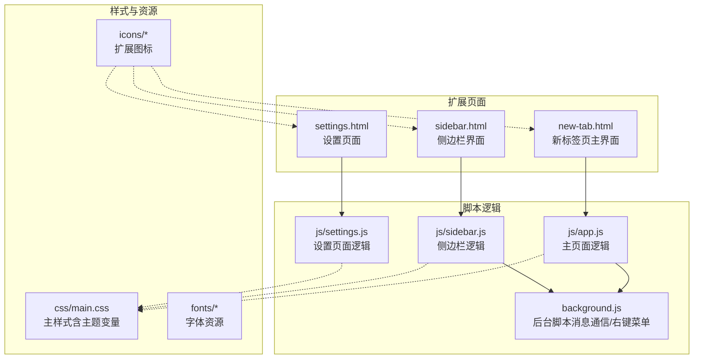
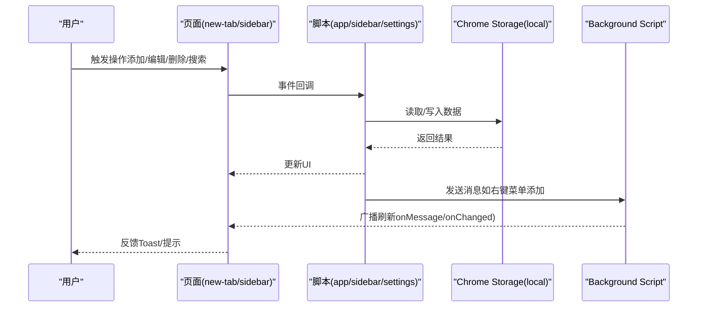
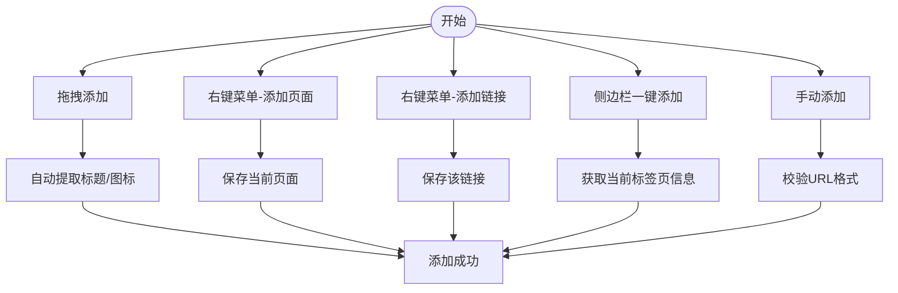
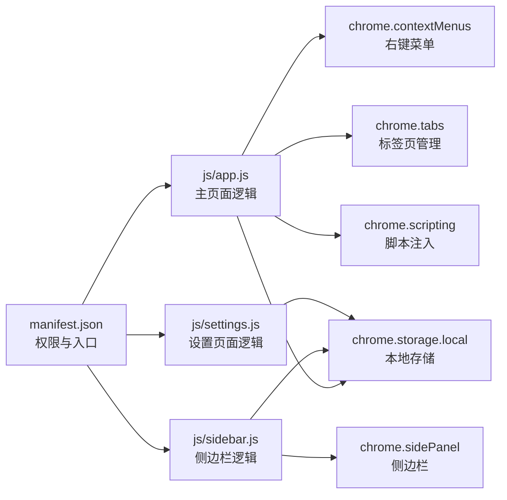

# 用户使用指南

<cite>
**本文引用的文件**
- [README.md](file://README.md)
- [GUIDE.md](file://GUIDE.md)
- [manifest.json](file://manifest.json)
- [new-tab.html](file://new-tab.html)
- [sidebar.html](file://sidebar.html)
- [settings.html](file://settings.html)
- [js/app.js](file://js/app.js)
- [js/sidebar.js](file://js/sidebar.js)
- [js/settings.js](file://js/settings.js)
- [css/main.css](file://css/main.css)
- [backup/app.js](file://backup/app.js)
</cite>

## 目录
1. [简介](#简介)
2. [项目结构](#项目结构)
3. [核心组件](#核心组件)
4. [架构总览](#架构总览)
5. [详细组件分析](#详细组件分析)
6. [依赖关系分析](#依赖关系分析)
7. [性能考虑](#性能考虑)
8. [故障排除指南](#故障排除指南)
9. [结论](#结论)
10. [附录](#附录)

## 简介
书签白板是一个基于 Chrome 扩展（Manifest V3）的本地书签管理工具，强调隐私优先与高效管理。它提供卡片式布局、实时搜索、分组管理、主题切换、侧边栏与右键菜单等多种使用方式，帮助用户快速整理网络资源，告别浏览器书签栏的混乱。

## 项目结构
项目采用“页面 + 脚本 + 样式”的模块化组织方式，核心页面包括新标签页主界面、侧边栏界面与设置页面；逻辑由独立的 JavaScript 文件负责；样式通过原生 CSS 与 CSS 变量实现主题系统与响应式布局。

图表来源
- [manifest.json](file://manifest.json)
- [new-tab.html](file://new-tab.html)
- [sidebar.html](file://sidebar.html)
- [settings.html](file://settings.html)
- [js/app.js](file://js/app.js)
- [js/sidebar.js](file://js/sidebar.js)
- [js/settings.js](file://js/settings.js)
- [css/main.css](file://css/main.css)

章节来源
- [manifest.json](file://manifest.json)
- [new-tab.html](file://new-tab.html)
- [sidebar.html](file://sidebar.html)
- [settings.html](file://settings.html)

## 核心组件
- 新标签页主界面：提供卡片式书签展示、搜索、分组筛选、视图分区（全部/置顶/最近添加）、主题切换与批量操作入口。
- 侧边栏界面：移动端友好布局，支持搜索、一键添加当前页面、手动添加、主题切换与拖拽添加。
- 设置页面：集中管理书签列表、分组、数据导入导出、显示与排序、搜索与筛选、外观与主题、隐私与安全、快捷操作、关于等。
- 背景脚本：负责右键菜单、消息通信与跨页面同步（通过 Chrome Storage API）。

章节来源
- [new-tab.html](file://new-tab.html)
- [sidebar.html](file://sidebar.html)
- [settings.html](file://settings.html)
- [js/app.js](file://js/app.js)
- [js/sidebar.js](file://js/sidebar.js)
- [js/settings.js](file://js/settings.js)

## 架构总览
书签白板采用“页面-脚本-存储”三层架构：
- 页面层：HTML 结构承载 UI 与交互入口。
- 脚本层：各页面逻辑通过 Chrome Extension API 与 Chrome Storage API 进行数据读写与消息通信。
- 存储层：使用 chrome.storage.local 保存书签、分组、主题与设置等数据，确保本地化与隐私保护。

图表来源
- [js/app.js](file://js/app.js)
- [js/sidebar.js](file://js/sidebar.js)
- [js/settings.js](file://js/settings.js)
- [manifest.json](file://manifest.json)

## 详细组件分析

### 新标签页主界面（添加书签的五种方式）
- 拖拽添加：从地址栏、网页链接或书签栏拖拽到页面或侧边栏，自动提取标题与图标。
- 右键菜单 - 添加页面：在空白处右键选择“添加到书签白板”，自动保存当前页面。
- 右键菜单 - 添加链接：在链接上右键选择“添加链接到书签白板”，自动保存该链接。
- 侧边栏一键添加：打开侧边栏，点击“+”按钮，自动添加当前浏览页面。
- 手动添加：点击“手动添加书签”按钮，输入 URL（需包含 http:// 或 https://），支持自定义标题。

图表来源
- [js/app.js](file://js/app.js)
- [js/sidebar.js](file://js/sidebar.js)
- [new-tab.html](file://new-tab.html)
- [sidebar.html](file://sidebar.html)

章节来源
- [GUIDE.md](file://GUIDE.md)
- [README.md](file://README.md)
- [js/app.js](file://js/app.js)
- [js/sidebar.js](file://js/sidebar.js)

### 管理书签（编辑、删除、打开、置顶）
- 打开书签：点击卡片在新标签页打开链接。
- 编辑名称：点击卡片上的编辑按钮，支持 Enter 确认、ESC 取消。
- 删除书签：点击卡片上的删除按钮，弹窗确认，支持 ESC 取消。
- 置顶书签：右键点击书签卡片，选择“置顶此书签”，置顶书签在“置顶”分区优先显示。

章节来源
- [GUIDE.md](file://GUIDE.md)
- [js/app.js](file://js/app.js)

### 搜索与筛选
- 实时搜索：在搜索框输入关键词，即时过滤书签标题与 URL，支持中英文搜索。
- 分组搜索：输入“!”或“！”+分组名称，快速筛选特定分组的书签。
- 分组筛选：点击分组标签进行筛选，再次点击取消筛选；“全部分组”按钮显示所有书签；分组标签右侧显示书签数量角标。

章节来源
- [GUIDE.md](file://GUIDE.md)
- [js/app.js](file://js/app.js)

### 分区浏览（视图分区）
- 所有书签：显示全部书签，支持分组筛选与书签总数角标。
- 置顶：仅显示置顶书签，快速访问重要书签。
- 最近添加：显示最近 7 天内添加的书签，基于 createdAt 字段，自动排除置顶书签。

章节来源
- [GUIDE.md](file://GUIDE.md)
- [js/app.js](file://js/app.js)

### 分组管理（最佳实践）
- 手动分组：创建/编辑/删除分组，支持多分组归属（一个书签可属于多个分组）。
- 自动分组：根据域名自动生成分组，支持自定义显示名称与合并子域名到同一分组。
- 分组筛选：点击分组标签快速筛选，支持“全部分组”与数量角标。

章节来源
- [GUIDE.md](file://GUIDE.md)
- [js/app.js](file://js/app.js)
- [js/settings.js](file://js/settings.js)

### 设置页面（数据管理、显示与排序、外观与主题）
- 书签管理：列表式管理，支持搜索过滤、批量操作（全选/取消全选、批量删除、批量移动分组）、排序选项（创建时间/标题/访问次数）。
- 分组管理：管理自定义分组（自动分组不可删除），显示分组统计。
- 数据管理：导出数据（包含书签、分组、主题设置、排序设置、自定义自动分组名称，采用四层加密）、导入数据（覆盖当前所有数据，谨慎操作）。
- 显示与排序：当前版本显示与排序功能处于开发中，后续将支持更多排序方式与显示选项。
- 外观与主题：当前版本外观与主题功能处于开发中，后续将支持主题切换、自定义颜色与布局设置。
- 搜索与筛选：当前版本搜索与筛选功能处于开发中，后续将支持搜索配置、标签管理与搜索建议。
- 隐私与安全：当前版本隐私与安全功能处于开发中，后续将支持加密存储、自动锁定与无痕模式。
- 快捷操作：当前版本快捷操作功能处于开发中，后续将支持快捷键自定义、鼠标手势与批量操作。
- 关于：显示版本信息与相关链接。

章节来源
- [settings.html](file://settings.html)
- [js/settings.js](file://js/settings.js)
- [GUIDE.md](file://GUIDE.md)

### 侧边栏（移动端样式与实时同步）
- 打开方式：点击工具栏扩展图标或右键菜单选择“打开书签白板侧边栏”。
- 功能：浏览所有书签（移动端样式，一行一个）、搜索书签、一键添加当前页面、编辑/删除书签、独立主题切换。
- 实时同步：使用 chrome.storage.onChanged API 实时同步主页面与侧边栏数据，无需手动刷新。

章节来源
- [sidebar.html](file://sidebar.html)
- [js/sidebar.js](file://js/sidebar.js)
- [GUIDE.md](file://GUIDE.md)

### 右键菜单（智能标题获取）
- 可用场景：网页空白处右键添加到书签白板（当前页）、链接上右键添加链接到书签白板（该链接）、任意位置右键打开书签白板侧边栏。
- 智能标题获取：优先获取网页 <title>，降级使用域名，保证书签名称有意义。

章节来源
- [js/app.js](file://js/app.js)
- [GUIDE.md](file://GUIDE.md)

### 数据导入导出（加密与覆盖）
- 导出步骤：进入设置页面 → 数据管理 → 导出数据 → 下载加密 JSON 文件 → 保存到安全位置。
- 导入步骤：进入设置页面 → 数据管理 → 导入数据 → 选择之前导出的 JSON 文件 → 查看数据统计 → 确认导入（会覆盖现有数据） → 等待导入完成 → 自动刷新界面。
- 加密说明：四层加密流程（UTF-8 → Base64 → XOR → Base64），密钥为 bookmark-board-2026，保护用户隐私。

章节来源
- [GUIDE.md](file://GUIDE.md)
- [js/app.js](file://js/app.js)
- [js/settings.js](file://js/settings.js)

### 主题切换（深色/浅色）
- 自动跟随系统：首次使用自动检测系统主题偏好，系统切换时自动同步（如果未手动设置）。
- 手动切换：点击顶部“🌙/☀️”图标，立即切换深色/浅色主题，设置保存到本地。
- 主题特点：深色主题护眼模式，浅色主题清晰明亮，CSS 变量系统实现全局统一配色。

章节来源
- [GUIDE.md](file://GUIDE.md)
- [css/main.css](file://css/main.css)
- [js/app.js](file://js/app.js)
- [js/sidebar.js](file://js/sidebar.js)

### 快捷键与键盘操作（计划中/当前可用）
- 计划中：搜索（点击搜索框或 /）、添加书签（点击按钮或 Ctrl/Cmd + D）。
- 当前可用：确认弹窗（Enter）、取消弹窗（ESC）。

章节来源
- [GUIDE.md](file://GUIDE.md)

## 依赖关系分析
- Manifest V3：声明权限（storage、contextMenus、tabs、scripting、sidePanel）、重写新标签页、侧边栏默认路径、图标与 CSP。
- Chrome Extension APIs：使用 chrome.storage.local 进行数据持久化，chrome.contextMenus 与 chrome.scripting 实现右键菜单与脚本注入，chrome.sidePanel 与 chrome.tabs 实现侧边栏与标签页管理。
- 页面与脚本：页面通过事件绑定与 DOM 操作驱动脚本，脚本通过 API 与存储交互，实现数据读写与消息通信。

图表来源
- [manifest.json](file://manifest.json)
- [js/app.js](file://js/app.js)
- [js/sidebar.js](file://js/sidebar.js)
- [js/settings.js](file://js/settings.js)

章节来源
- [manifest.json](file://manifest.json)
- [js/app.js](file://js/app.js)
- [js/sidebar.js](file://js/sidebar.js)
- [js/settings.js](file://js/settings.js)

## 性能考虑
- 防 FOUC：新标签页通过 CSS 类控制页面透明度，确保样式加载后再显示页面，避免闪烁。
- DOM 操作优化：主页面与设置页面均采用事件委托与最小化 DOM 更新，减少重排与重绘。
- 拖拽与搜索：通过节流与防抖策略降低频繁输入与拖拽导致的渲染压力。
- 侧边栏渲染：分批渲染（requestAnimationFrame）与数量限制（最多显示 50 个书签），提升性能与体验。
- 域名缓存：主页面与设置页面均维护域名缓存，避免重复解析 URL，提升渲染效率。

章节来源
- [css/main.css](file://css/main.css)
- [js/app.js](file://js/app.js)
- [js/sidebar.js](file://js/sidebar.js)
- [js/settings.js](file://js/settings.js)

## 故障排除指南
- 右键菜单没有显示：需要完全重新安装扩展（移除后重新加载）。
- 书签丢失：书签数据存储在浏览器本地（chrome.storage.local），清除浏览器数据会导致丢失。建议定期导出备份。
- 侧边栏不自动刷新：确保使用最新版本（v3.2.5+），若仍不刷新，关闭并重新打开侧边栏。
- 如何修改书签图标：系统自动获取网站的 favicon.ico，暂不支持手动修改。
- 导入数据后主题变了：导入文件包含主题设置，会自动应用导出时的主题，可在设置中重新切换。
- 删除分组会删除里面的书签吗：不会！删除分组只是移除分组标签，书签本身不会删除。
- 一个书签可以属于多个分组吗：可以！书签支持多分组归属。

章节来源
- [GUIDE.md](file://GUIDE.md)
- [README.md](file://README.md)

## 结论
书签白板通过简洁直观的界面与强大的本地化能力，为用户提供了高效、隐私友好的书签管理体验。结合多种添加方式、分组管理、搜索筛选、主题切换与数据导入导出功能，用户可以轻松构建个性化的书签体系，并在不同设备与场景中保持一致的使用体验。建议用户定期导出备份，合理利用分组与搜索，以获得最佳使用效果。

## 附录

### 不同使用场景下的最佳实践
- 日常管理：及时添加有价值的页面，合理分组，定期整理，将常用书签置顶，提升访问效率。
- 批量操作：在设置页面使用批量模式，进行全选、批量删除与批量移动分组，提高管理效率。
- 数据备份策略：建议每月导出一次备份，保存到云端（如 Google Drive），保留多个历史版本备份，确保数据安全。

章节来源
- [GUIDE.md](file://GUIDE.md)

### 面向不同技能水平用户的建议
- 新手用户：优先使用拖拽添加与右键菜单添加，逐步熟悉搜索与分组功能，避免一次性创建过多分组。
- 进阶用户：利用分组筛选与搜索语法（“!”或“！”+分组名称）快速定位书签，结合置顶与最近添加分区提升效率。
- 高级用户：通过设置页面的批量操作与数据导入导出，实现大规模书签的迁移与自动化管理。

章节来源
- [GUIDE.md](file://GUIDE.md)
- [js/settings.js](file://js/settings.js)