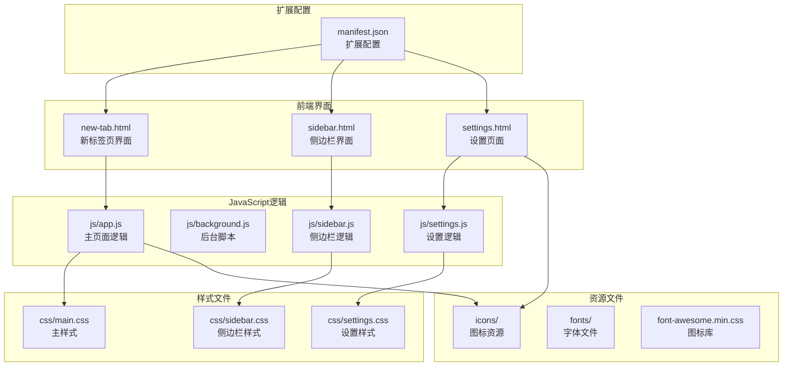
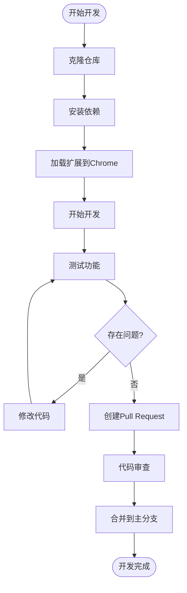

# 贡献指南

<cite>
**本文档引用的文件**
- [README.md](file://README.md)
- [GUIDE.md](file://GUIDE.md)
- [manifest.json](file://manifest.json)
- [UPDATE_LOG.md](file://UPDATE_LOG.md)
- [js/app.js](file://js/app.js)
- [js/background.js](file://js/background.js)
- [css/main.css](file://css/main.css)
- [css/settings.css](file://css/settings.css)
- [settings.html](file://settings.html)
- [.gitattributes](file://.gitattributes)
</cite>

## 目录
1. [简介](#简介)
2. [项目结构](#项目结构)
3. [开源协议](#开源协议)
4. [贡献政策](#贡献政策)
5. [开发流程](#开发流程)
6. [代码规范](#代码规范)
7. [质量要求](#质量要求)
8. [问题报告](#问题报告)
9. [功能建议](#功能建议)
10. [社区参与](#社区参与)
11. [新贡献者指南](#新贡献者指南)
12. [故障排除](#故障排除)
13. [结语](#结语)

## 简介

书签白板是一个隐私优先的本地书签管理Chrome扩展，旨在帮助用户快速整理网络资源，告别浏览器书签栏的混乱。该项目采用Manifest V3标准，使用原生HTML5、CSS和JavaScript构建，完全本地存储数据，无需服务器依赖。

## 项目结构

书签白板项目采用简洁的文件组织结构，主要包含以下核心组件：



**图表来源**
- [manifest.json:1-38](file://manifest.json#L1-L38)
- [js/app.js:1-200](file://js/app.js#L1-L200)
- [js/background.js:1-174](file://js/background.js#L1-L174)

**章节来源**
- [README.md:132-154](file://README.md#L132-L154)
- [manifest.json:1-38](file://manifest.json#L1-L38)

## 开源协议

书签白板项目采用MIT许可证，这是一个宽松的开源许可证，允许自由使用、修改和分发代码，但需要保留版权声明和许可证声明。

### MIT许可证条款

MIT许可证的核心条款包括：

- **使用权限**：可以自由使用、复制、修改、合并、发布、分发、再许可和销售软件副本
- **专利授权**：提供专利使用授权
- **商标保护**：不授予商标使用权
- **免责声明**：软件按"现状"提供，不提供任何担保
- **责任限制**：作者不对因使用软件而产生的任何索赔或损害承担责任

### 许可证要求

使用MIT许可证的项目需要满足以下基本要求：

1. **版权声明保留**：在分发的软件中必须包含原始版权通知
2. **许可证声明保留**：必须包含MIT许可证文本
3. **免责声明保留**：必须包含免责声明

**章节来源**
- [README.md:232-235](file://README.md#L232-L235)

## 贡献政策

### 贡献类型

项目欢迎各种形式的贡献，包括但不限于：

- **代码贡献**：修复bug、添加新功能、改进现有功能
- **文档改进**：修正文档错误、完善使用说明、添加示例
- **设计资源**：图标设计、主题配色、视觉元素
- **测试用例**：编写测试代码、提供测试反馈
- **社区建设**：回答问题、推广项目、提供使用反馈

### 行为准则

所有贡献者必须遵守以下行为准则：

- **尊重他人**：保持友善和专业的交流态度
- **包容多样性**：欢迎不同背景和经验水平的贡献者
- **专注解决方案**：专注于提出建设性的意见和解决方案
- **遵守法律**：确保贡献内容不违反任何法律法规
- **保护隐私**：不泄露任何个人信息或敏感数据

### 贡献流程

1. **Fork仓库**：在GitHub上fork项目到自己的账户
2. **创建分支**：基于master分支创建功能分支
3. **提交更改**：按照代码规范编写代码并提交
4. **推送分支**：将更改推送到远程分支
5. **创建PR**：发起Pull Request进行代码审查

**章节来源**
- [README.md:194-204](file://README.md#L194-L204)

## 开发流程

### 环境准备

1. **克隆仓库**：`git clone https://github.com/YinHeng89/bookmark-board.git`
2. **安装依赖**：项目为纯前端扩展，无需额外依赖
3. **加载扩展**：在Chrome中启用开发者模式，加载已解压的扩展程序

### 开发环境设置



**图表来源**
- [README.md:53-61](file://README.md#L53-L61)

### 分支策略

项目采用Git Flow分支模型：

- **master/main**：生产环境稳定版本
- **develop**：开发环境版本
- **feature/**：功能开发分支
- **hotfix/**：紧急修复分支
- **release/**：版本发布分支

### 提交规范

遵循Conventional Commits规范：

```
<type>(<scope>): <subject>

<body>

<footer>
```

示例：
- `feat(settings): 添加数据导入导出功能`
- `fix(app): 修复拖拽功能bug`
- `docs(readme): 更新安装说明`

**章节来源**
- [README.md:198-203](file://README.md#L198-L203)

## 代码规范

### JavaScript规范

#### 命名约定

- **变量**：使用camelCase命名法
- **函数**：使用camelCase命名法
- **类**：使用PascalCase命名法
- **常量**：使用UPPER_SNAKE_CASE命名法

#### 代码风格

- **缩进**：使用2个空格
- **行长度**：不超过80个字符
- **分号**：使用分号结尾
- **引号**：使用单引号

#### 注释规范

```javascript
/**
 * 函数描述
 * @param {参数类型} 参数名 - 参数描述
 * @returns {返回类型} 返回值描述
 */
function functionName(param) {
    // 单行注释
    const variable = param; // 行尾注释
    
    return variable;
}
```

### CSS规范

#### 命名约定

- **类名**：使用短横线分隔命名法
- **ID**：使用驼峰命名法
- **变量**：使用CSS自定义属性

#### 结构组织

```css
/* ========== 组件样式 ==========
.component-name {
    /* 组件基础样式 */
}

.component-name--modifier {
    /* 组件修饰样式 */
}

.component-name__element {
    /* 组件元素样式 */
}
```

### HTML规范

- **语义化**：使用语义化HTML标签
- **可访问性**：确保良好的可访问性
- **SEO友好**：优化搜索引擎友好性

**章节来源**
- [js/app.js:1-200](file://js/app.js#L1-L200)
- [css/main.css:1-200](file://css/main.css#L1-L200)

## 质量要求

### 代码质量

#### 代码审查标准

- **功能正确性**：代码实现符合需求规格
- **性能考虑**：避免性能瓶颈和内存泄漏
- **可维护性**：代码结构清晰，易于理解和修改
- **安全性**：防范常见的安全漏洞
- **兼容性**：支持目标浏览器版本

#### 测试要求

- **单元测试**：为关键函数编写单元测试
- **集成测试**：测试组件间的交互
- **用户验收测试**：模拟真实使用场景
- **跨浏览器测试**：在目标浏览器中验证功能

### 文档要求

#### 代码注释

- **函数注释**：每个公共函数都需要JSDoc注释
- **复杂逻辑**：需要详细解释算法和业务逻辑
- **API文档**：为公共接口提供完整文档

#### 用户文档

- **使用指南**：提供详细的使用说明
- **开发文档**：为开发者提供技术文档
- **变更日志**：记录重要的功能变更

**章节来源**
- [UPDATE_LOG.md:1-345](file://UPDATE_LOG.md#L1-L345)

## 问题报告

### Bug报告模板

当发现bug时，请使用以下模板创建Issue：

```
## Bug描述

**问题简述**：
简要描述遇到的问题

**重现步骤**：
1. 打开扩展
2. 执行操作...
3. 观察结果...

**期望行为**：
描述期望的结果

**实际行为**：
描述实际发生的情况

**环境信息**：
- 浏览器版本：Chrome XX.X
- 扩展版本：X.X.X
- 操作系统：Windows/Mac/Linux

**截图/录屏**：
提供相关截图或录屏

**其他信息**：
```

### 功能请求模板

```
## 功能请求

**功能描述**：
详细描述想要的功能

**使用场景**：
说明在什么情况下需要这个功能

**实现建议**：
如果有的话，提供实现思路

**替代方案**：
说明是否有其他解决方案

**相关链接**：
提供相关的Issue或讨论链接
```

### 问题分类

- **严重bug**：导致扩展无法使用或数据丢失
- **一般bug**：影响部分功能正常使用
- **轻微bug**：影响用户体验的小问题
- **功能建议**：新功能或改进现有功能的建议

**章节来源**
- [README.md:236-246](file://README.md#L236-L246)

## 功能建议

### 建议提交流程

1. **搜索现有Issue**：确认类似建议是否存在
2. **创建新Issue**：使用功能建议模板
3. **详细描述**：提供充分的背景和需求分析
4. **讨论和反馈**：参与社区讨论
5. **优先级评估**：维护者评估实现优先级

### 功能评估标准

- **用户价值**：对用户是否有显著价值
- **技术可行性**：评估实现难度和成本
- **维护负担**：考虑长期维护成本
- **向后兼容**：避免破坏现有功能
- **性能影响**：评估对性能的影响

### 开发建议

对于希望贡献代码的建议：

1. **先讨论**：在实现前与维护者讨论
2. **小步快跑**：分阶段实现复杂功能
3. **充分测试**：确保代码质量和稳定性
4. **文档齐全**：提供必要的文档和注释

## 社区参与

### 讨论参与

- **GitHub Discussions**：参与功能讨论和技术交流
- **Issue评论**：提供使用反馈和建议
- **代码审查**：参与Pull Request的代码审查
- **文档改进**：帮助完善项目文档

### 决策过程

1. **公开讨论**：所有决策都在公开场合讨论
2. **多数同意**：通过社区讨论达成共识
3. **维护者决定**：重大决策由项目维护者决定
4. **透明记录**：重要决策过程和结果公开记录

### 贡献认可

- **贡献者列表**：在README中列出主要贡献者
- **代码致谢**：在代码中致谢重要贡献
- **社区活动**：组织线上或线下技术分享

## 新贡献者指南

### 快速开始

1. **Fork项目**：在GitHub上fork到自己的账户
2. **克隆到本地**：`git clone https://github.com/YOUR_USERNAME/bookmark-board.git`
3. **创建分支**：`git checkout -b feature/your-feature`
4. **安装依赖**：项目无需额外依赖
5. **开始开发**：修改代码并测试功能

### 开发环境

#### 必需工具

- **Git**：版本控制工具
- **Chrome浏览器**：扩展开发和测试
- **代码编辑器**：推荐VS Code
- **Node.js**：可选，用于构建工具

#### 开发步骤

```bash
# 1. Fork并克隆仓库
git clone https://github.com/YOUR_USERNAME/bookmark-board.git
cd bookmark-board

# 2. 创建功能分支
git checkout -b feature/new-feature

# 3. 开发和测试
# 修改代码后，在Chrome中重新加载扩展测试

# 4. 提交更改
git add .
git commit -m "feat: add new feature"

# 5. 推送到远程
git push origin feature/new-feature

# 6. 创建Pull Request
```

### 学习资源

#### 技术文档

- **Chrome扩展开发**：官方扩展开发文档
- **Manifest V3**：最新的扩展配置规范
- **Chrome Extensions API**：扩展API参考文档

#### 开发工具

- **Chrome DevTools**：调试和性能分析
- **ESLint**：JavaScript代码检查
- **Prettier**：代码格式化工具

### 第一次贡献

1. **选择简单任务**：从简单的bug修复或文档改进开始
2. **阅读代码**：理解项目架构和代码风格
3. **运行测试**：确保开发环境正常工作
4. **提交小改动**：从简单的改动开始积累经验
5. **寻求指导**：遇到问题时主动寻求帮助

**章节来源**
- [README.md:53-77](file://README.md#L53-L77)

## 故障排除

### 常见问题

#### 扩展安装问题

**问题**：扩展无法安装或显示错误
**解决方案**：
1. 确认已启用Chrome开发者模式
2. 检查manifest.json配置是否正确
3. 清除浏览器缓存后重试

#### 功能异常

**问题**：某些功能无法正常工作
**排查步骤**：
1. 检查浏览器控制台是否有错误
2. 确认扩展权限是否正确
3. 尝试重新安装扩展

#### 数据丢失

**问题**：书签数据意外丢失
**预防措施**：
1. 定期使用设置页面导出数据
2. 了解数据存储机制
3. 备份重要数据

### 调试技巧

#### 开发者工具

- **Elements面板**：检查DOM结构和样式
- **Console面板**：查看JavaScript错误和日志
- **Sources面板**：设置断点调试代码
- **Network面板**：监控网络请求
- **Application面板**：检查存储的数据

#### 调试方法

```javascript
// 添加调试输出
console.log('变量值:', variable);

// 条件断点
if (condition) {
    debugger; // 断点触发
}

// 性能分析
console.time('操作耗时');
// 执行操作
console.timeEnd('操作耗时');
```

### 社区支持

#### 获取帮助

- **GitHub Issues**：报告bug和请求帮助
- **GitHub Discussions**：参与技术讨论
- **邮件联系**：通过官方邮箱联系维护者

#### 贡献反馈

- **代码审查**：积极参与Pull Request审查
- **文档改进**：帮助完善项目文档
- **测试反馈**：提供使用体验和改进建议

## 结语

感谢您对书签白板项目的关注和贡献！我们致力于创建一个高质量、易用且功能丰富的书签管理工具。无论您是第一次贡献还是经验丰富的开发者，我们都欢迎您的参与。

通过遵循本指南，您可以更有效地参与项目开发，帮助我们共同打造更好的用户体验。让我们一起努力，让书签白板成为最优秀的书签管理工具！

---

**项目维护者联系方式**：[项目维护者邮箱](mailto:your-email@example.com)

**项目主页**：[https://github.com/YinHeng89/bookmark-board](https://github.com/YinHeng89/bookmark-board)

**许可证**：MIT License