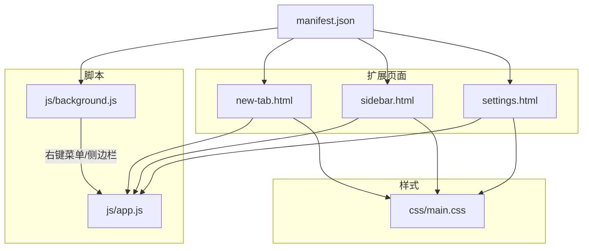
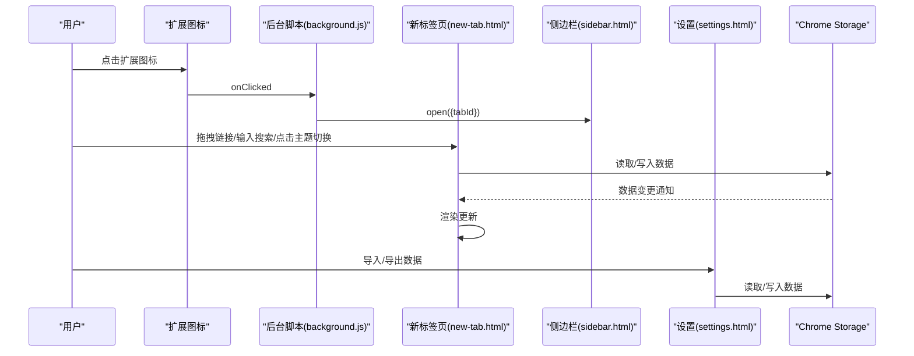
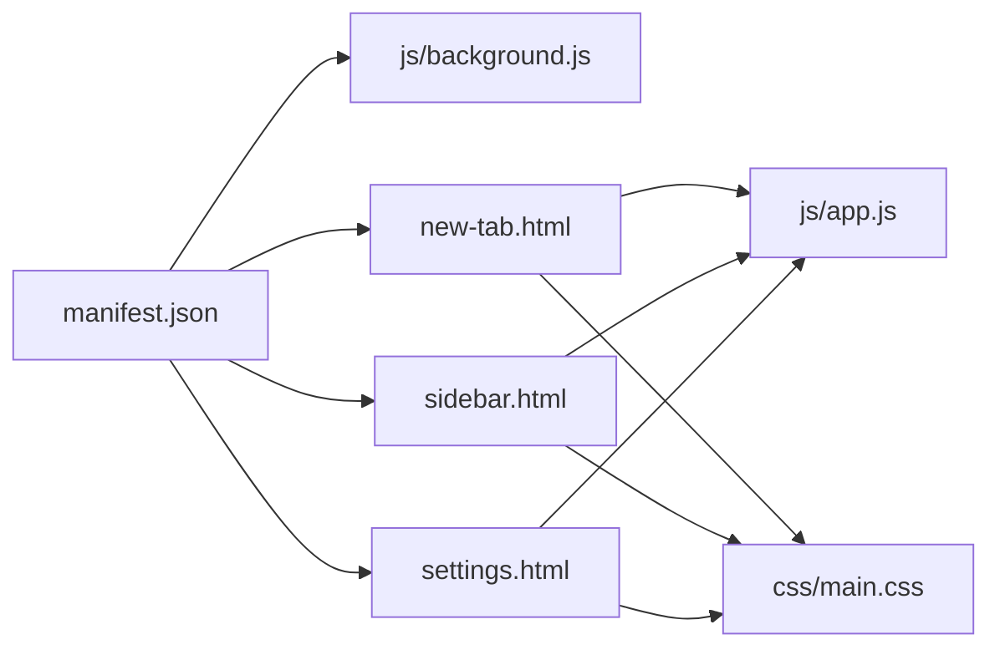

# 部署与发布

<cite>
**本文引用的文件**
- [manifest.json](file://manifest.json)
- [new-tab.html](file://new-tab.html)
- [sidebar.html](file://sidebar.html)
- [settings.html](file://settings.html)
- [js/app.js](file://js/app.js)
- [js/background.js](file://js/background.js)
- [css/main.css](file://css/main.css)
- [CHROME_STORE_PUBLISH.md](file://CHROME_STORE_PUBLISH.md)
- [README.md](file://README.md)
- [GUIDE.md](file://GUIDE.md)
- [UPDATE_LOG.md](file://UPDATE_LOG.md)
</cite>

## 目录
1. [简介](#简介)
2. [项目结构](#项目结构)
3. [核心组件](#核心组件)
4. [架构总览](#架构总览)
5. [详细组件分析](#详细组件分析)
6. [依赖关系分析](#依赖关系分析)
7. [性能与构建建议](#性能与构建建议)
8. [发布与部署流程](#发布与部署流程)
9. [版本管理与更新策略](#版本管理与更新策略)
10. [Chrome Web Store 发布指南](#chrome-web-store-发布指南)
11. [持续集成与自动化部署](#持续集成与自动化部署)
12. [发布后监控与维护](#发布后监控与维护)
13. [发布检查清单](#发布检查清单)
14. [故障排查](#故障排查)
15. [结论](#结论)

## 简介
本指南面向开发者，提供书签白板项目的部署与发布全流程说明，涵盖开发环境配置、生产构建、版本管理、Chrome Web Store 发布、持续集成与自动化部署、发布后监控与维护等。文档以仓库现有文件为基础，结合 Manifest V3 架构与实际页面/脚本组织，给出可落地的操作步骤与最佳实践。

## 项目结构
项目采用页面/脚本分离的结构，核心页面包括新标签页、侧边栏、设置页；逻辑由后台脚本与主页面脚本协同完成；样式采用原生 CSS 并通过 CSS 变量实现主题切换。

图表来源
- [manifest.json:1-38](file://manifest.json#L1-L38)
- [new-tab.html:1-206](file://new-tab.html#L1-L206)
- [sidebar.html:1-51](file://sidebar.html#L1-L51)
- [settings.html:1-281](file://settings.html#L1-L281)
- [js/app.js:1-200](file://js/app.js#L1-L200)
- [js/background.js:1-174](file://js/background.js#L1-L174)
- [css/main.css:1-200](file://css/main.css#L1-L200)

章节来源
- [manifest.json:1-38](file://manifest.json#L1-L38)
- [new-tab.html:1-206](file://new-tab.html#L1-L206)
- [sidebar.html:1-51](file://sidebar.html#L1-L51)
- [settings.html:1-281](file://settings.html#L1-L281)
- [js/app.js:1-200](file://js/app.js#L1-L200)
- [js/background.js:1-174](file://js/background.js#L1-L174)
- [css/main.css:1-200](file://css/main.css#L1-L200)

## 核心组件
- Manifest V3 配置：定义扩展名称、版本、权限、后台脚本、侧边栏默认路径、图标等。
- 新标签页页面：主界面，支持搜索、分组筛选、排序、分区展示、拖拽添加、主题切换等。
- 侧边栏页面：移动端友好布局，支持搜索、一键添加、手动添加、主题切换。
- 设置页面：集中管理书签、分组、外观与主题、显示与排序、数据管理、搜索与筛选、隐私与安全、快捷操作、关于等模块。
- 后台脚本：负责右键菜单创建与点击处理、侧边栏启用、通知注入、扩展图标点击打开侧边栏。
- 主页面脚本：负责主题加载、DOM 初始化、拖拽事件、搜索与排序、存储监听、渲染逻辑等。

章节来源
- [manifest.json:1-38](file://manifest.json#L1-L38)
- [new-tab.html:1-206](file://new-tab.html#L1-L206)
- [sidebar.html:1-51](file://sidebar.html#L1-L51)
- [settings.html:1-281](file://settings.html#L1-L281)
- [js/app.js:1-200](file://js/app.js#L1-L200)
- [js/background.js:1-174](file://js/background.js#L1-L174)

## 架构总览
扩展采用 MV3 架构，后台脚本作为服务工作流处理右键菜单与侧边栏；主页面与侧边栏通过 Chrome Storage API 实时同步数据；设置页提供数据导入导出与统计。

图表来源
- [js/background.js:1-174](file://js/background.js#L1-L174)
- [new-tab.html:1-206](file://new-tab.html#L1-L206)
- [sidebar.html:1-51](file://sidebar.html#L1-L51)
- [settings.html:1-281](file://settings.html#L1-L281)
- [js/app.js:1-200](file://js/app.js#L1-L200)

## 详细组件分析

### Manifest V3 配置
- 版本与名称：当前版本号与扩展名称已在清单中定义。
- 权限与主机权限：包含 storage、contextMenus、tabs、scripting、sidePanel，并允许 http/https。
- 后台脚本：使用 service_worker 指向后台脚本文件。
- 侧边栏：默认路径指向侧边栏页面。
- 图标：提供 16/48/128 尺寸图标路径。
- CSP：限制扩展页面脚本与对象源。

章节来源
- [manifest.json:1-38](file://manifest.json#L1-L38)

### 新标签页页面与主逻辑
- 页面结构：包含顶部导航、分组筛选区、搜索框、视图切换与排序、书签展示区、模态框与页脚。
- 主逻辑职责：主题加载、DOM 初始化、拖拽事件处理、搜索与排序、存储监听、渲染与空状态处理。
- 性能优化：防 FOUC（首屏闪烁）与延迟加载策略。

章节来源
- [new-tab.html:1-206](file://new-tab.html#L1-L206)
- [js/app.js:1-200](file://js/app.js#L1-L200)

### 侧边栏页面
- 结构：头部（Logo、主题切换、添加按钮、关闭）、搜索框、书签列表、手动添加入口。
- 与主页面协作：通过存储监听与消息通信实现数据同步。

章节来源
- [sidebar.html:1-51](file://sidebar.html#L1-L51)

### 设置页面
- 模块化导航：书签管理、分组管理、外观与主题、显示与排序、数据管理、搜索与筛选、隐私与安全、快捷操作、关于。
- 数据管理：提供导出与导入功能，支持统计信息展示。

章节来源
- [settings.html:1-281](file://settings.html#L1-L281)

### 后台脚本
- 右键菜单：添加当前页面、添加链接、打开侧边栏。
- 侧边栏启用：设置默认路径与启用状态。
- 通知注入：在当前页面注入 Toast 通知。
- 图标点击：打开侧边栏。

章节来源
- [js/background.js:1-174](file://js/background.js#L1-L174)

### 样式系统
- CSS 变量：通过 :root 与 .dark 类切换主题色。
- 响应式与动画：针对桌面与移动端的布局差异与过渡动画。

章节来源
- [css/main.css:1-200](file://css/main.css#L1-L200)

## 依赖关系分析
- 页面依赖：各页面均依赖主样式文件；新标签页与侧边栏依赖主逻辑脚本；设置页依赖设置脚本（在页面中引入）。
- 脚本依赖：主逻辑脚本依赖 Chrome Storage API 与 DOM；后台脚本依赖 Chrome Extension API。
- 清单依赖：清单决定后台脚本、侧边栏默认路径、图标、权限与 CSP。

图表来源
- [manifest.json:1-38](file://manifest.json#L1-L38)
- [new-tab.html:1-206](file://new-tab.html#L1-L206)
- [sidebar.html:1-51](file://sidebar.html#L1-L51)
- [settings.html:1-281](file://settings.html#L1-L281)
- [js/app.js:1-200](file://js/app.js#L1-L200)
- [js/background.js:1-174](file://js/background.js#L1-L174)
- [css/main.css:1-200](file://css/main.css#L1-L200)

## 性能与构建建议
- 构建产物：扩展以页面与脚本形式直接分发，无需额外打包工具链。
- 优化建议：
  - 延迟加载与防 FOUC：已在主页面中实现。
  - 资源缓存：通过版本号查询参数控制样式缓存。
  - 存储读写：批量读取与去重，减少频繁写入。
  - 主题切换：使用 CSS 变量，避免重排重绘。

章节来源
- [new-tab.html:1-206](file://new-tab.html#L1-L206)
- [css/main.css:1-200](file://css/main.css#L1-L200)
- [js/app.js:1-200](file://js/app.js#L1-L200)

## 发布与部署流程
- 开发环境：直接在 Chrome 扩展页面加载已解压的扩展进行调试。
- 生产构建：扩展无需编译，直接打包 .crx 文件并生成 .pem 私钥（首次打包）。
- 更新流程：修改代码后更新版本号，使用相同 .pem 重新打包并上传至开发者控制台。

章节来源
- [README.md:53-61](file://README.md#L53-L61)
- [CHROME_STORE_PUBLISH.md:94-125](file://CHROME_STORE_PUBLISH.md#L94-L125)

## 版本管理与更新策略
- 版本号规范：遵循语义化版本，小修复递增补丁版本，新增功能递增次版本，重大更新递增主版本。
- 更新日志：维护详细的更新日志，记录功能完成度、技术实现、已知问题与下一步计划。
- 兼容性：确保向后兼容，旧数据自动兼容，不影响现有功能。

章节来源
- [UPDATE_LOG.md:1-345](file://UPDATE_LOG.md#L1-L345)
- [manifest.json:5-5](file://manifest.json#L5-L5)

## Chrome Web Store 发布指南
- 开发者账号：注册并支付一次性费用。
- 商品创建：上传 .crx 文件，填写基本信息、截图、宣传图、图标、权限说明与隐私政策。
- 审核流程：提交审核后等待审核结果，常见拒绝原因包括图标不规范、描述不当、权限说明不清、隐私政策缺失等。
- 发布后检查：验证商店页面、测试安装流程、监控用户反馈并回复评价。

章节来源
- [CHROME_STORE_PUBLISH.md:128-386](file://CHROME_STORE_PUBLISH.md#L128-L386)

## 持续集成与自动化部署
- 自动化思路（概念性说明）：
  - 代码变更触发构建任务，校验清单与页面完整性。
  - 生成 .crx 与 .pem（首次生成），后续使用相同 .pem 更新。
  - 自动上传至开发者控制台并提交审核。
  - 审核通过后自动发布。
- 注意：本仓库未包含 CI 配置文件，上述为可选的工程化增强建议。

[本节为概念性说明，不直接分析具体文件]

## 发布后监控与维护
- 用户反馈：通过 GitHub Issues 收集问题与建议，定期汇总与处理。
- 问题跟踪：依据更新日志与问题清单进行回归测试与修复。
- 紧急修复：快速定位问题，准备热修复版本并走更新流程。
- 统计与分析：关注安装量、评分与评论，持续优化用户体验。

章节来源
- [GUIDE.md:413-446](file://GUIDE.md#L413-L446)
- [UPDATE_LOG.md:313-328](file://UPDATE_LOG.md#L313-L328)

## 发布检查清单
- 代码功能完整测试
- 清单文件检查
- 图标准备（16/48/128）
- 打包生成 .crx 文件
- 私钥文件 .pem 安全备份
- 截图与宣传图准备
- 详细描述与隐私政策编写
- 权限说明与分类语言设置
- 预览与提交审核
- 发布后验证与反馈监控

章节来源
- [CHROME_STORE_PUBLISH.md:453-487](file://CHROME_STORE_PUBLISH.md#L453-L487)

## 故障排查
- 打包失败：检查清单格式与文件路径。
- 审核被拒：根据拒绝原因修改描述、权限说明或隐私政策。
- 更新流程：使用相同 .pem 重新打包并上传。
- 信息修改：可在开发者控制台编辑后重新审核。

章节来源
- [CHROME_STORE_PUBLISH.md:533-554](file://CHROME_STORE_PUBLISH.md#L533-L554)

## 结论
本指南基于仓库现有文件，梳理了书签白板项目的部署与发布流程，明确了开发、构建、发布与维护的关键步骤与注意事项。建议在现有基础上逐步引入自动化与监控机制，以提升发布效率与质量。