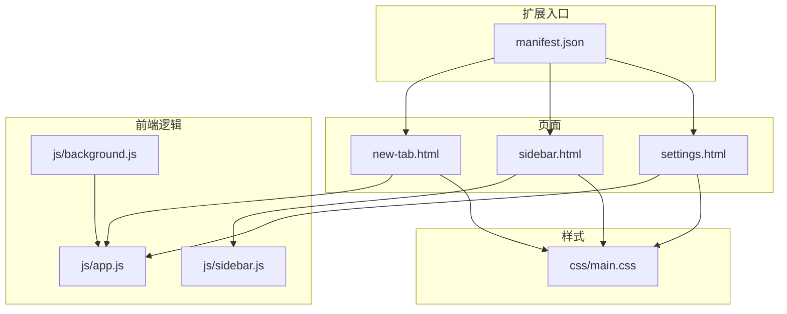
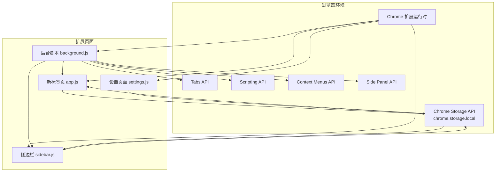
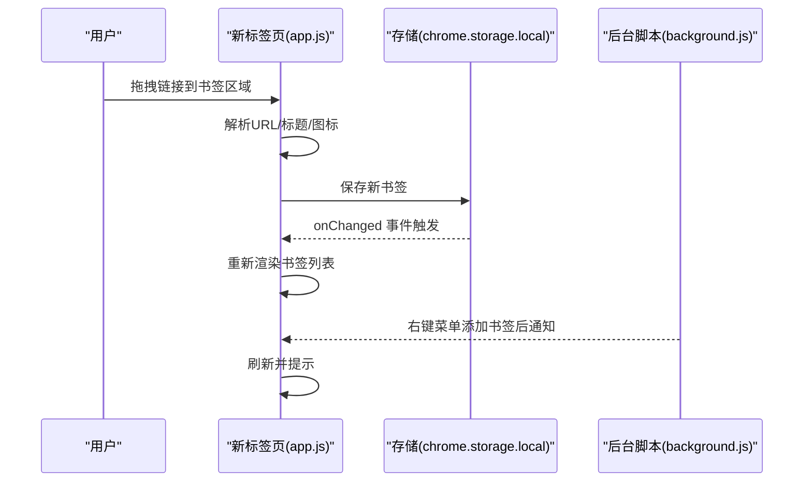
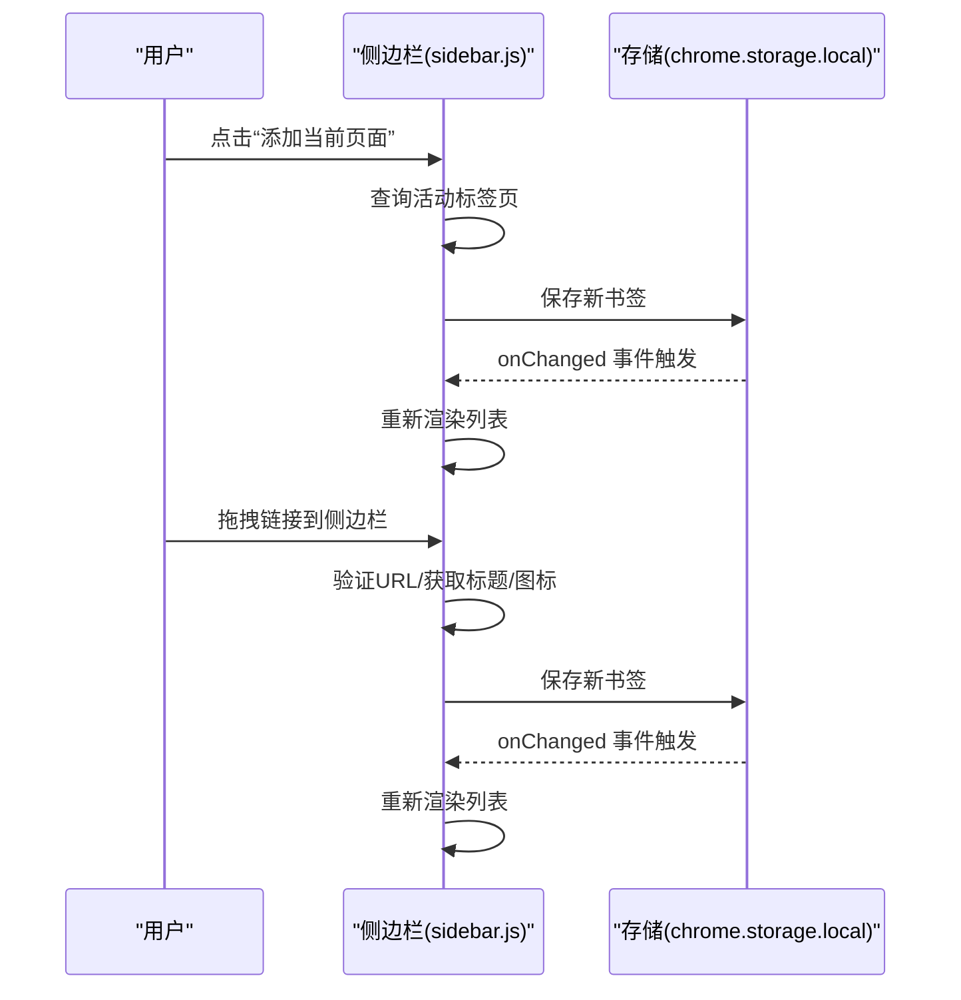
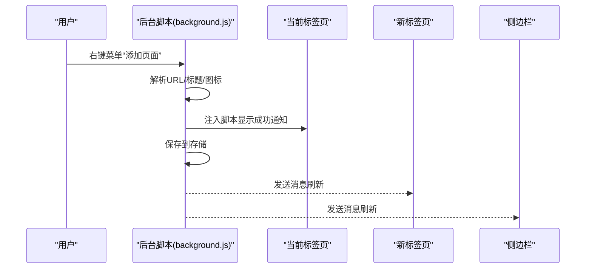
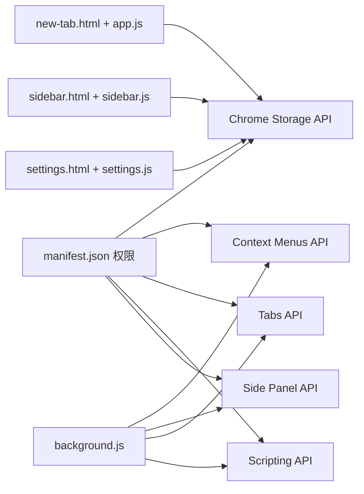

# 项目概述

<cite>
**本文引用的文件**
- [README.md](file://README.md)
- [GUIDE.md](file://GUIDE.md)
- [manifest.json](file://manifest.json)
- [new-tab.html](file://new-tab.html)
- [sidebar.html](file://sidebar.html)
- [settings.html](file://settings.html)
- [js/app.js](file://js/app.js)
- [js/sidebar.js](file://js/sidebar.js)
- [js/background.js](file://js/background.js)
- [css/main.css](file://css/main.css)
</cite>

## 目录
1. [简介](#简介)
2. [项目结构](#项目结构)
3. [核心组件](#核心组件)
4. [架构总览](#架构总览)
5. [详细组件分析](#详细组件分析)
6. [依赖关系分析](#依赖关系分析)
7. [性能考量](#性能考量)
8. [故障排查指南](#故障排查指南)
9. [结论](#结论)
10. [附录](#附录)

## 简介
书签白板是一个基于 Chrome Extension Manifest V3 的隐私优先型本地书签管理扩展，旨在帮助用户以卡片式布局、实时搜索与侧边栏功能高效整理网络资源。项目强调零服务器依赖、完全本地存储，确保用户数据始终掌握在自己手中。

- 核心价值主张
  - 隐私优先：所有数据保存在 Chrome storage.local，不上传服务器
  - 多场景添加：拖拽、右键菜单、一键添加、手动添加
  - 高效管理：卡片式布局、实时搜索、批量操作、置顶与最近添加分区
  - 侧边栏体验：移动端友好、独立主题、实时同步
  - 现代化界面：深浅主题、响应式设计、流畅动画、渐变卡片

- 目标用户群体
  - 需要集中管理大量书签的开发者、学生与研究人员
  - 注重隐私与数据主权的用户
  - 希望在不同设备间保持一致书签体验的用户

- 使用场景
  - 新标签页快速浏览与管理书签
  - 侧边栏随时添加与检索书签
  - 右键菜单一键保存页面或链接
  - 设置页面进行批量管理与数据导入导出

**章节来源**
- [README.md:1-274](file://README.md#L1-L274)
- [GUIDE.md:1-512](file://GUIDE.md#L1-L512)

## 项目结构
项目采用多页面架构，包含新标签页主界面、侧边栏界面与设置页面，配合后台脚本与前端逻辑实现完整功能闭环。

**图表来源**
- [manifest.json:1-38](file://manifest.json#L1-L38)
- [new-tab.html:1-206](file://new-tab.html#L1-L206)
- [sidebar.html:1-51](file://sidebar.html#L1-L51)
- [settings.html:1-281](file://settings.html#L1-L281)
- [js/app.js:1-800](file://js/app.js#L1-L800)
- [js/sidebar.js:1-602](file://js/sidebar.js#L1-L602)
- [js/background.js:1-174](file://js/background.js#L1-L174)
- [css/main.css:1-800](file://css/main.css#L1-L800)

**章节来源**
- [README.md:132-154](file://README.md#L132-L154)
- [manifest.json:6-29](file://manifest.json#L6-L29)

## 核心组件
- Manifest V3 配置
  - 新标签页覆盖、后台服务工作线程、侧边栏默认路径、扩展图标与内容安全策略
- 主页面（新标签页）
  - 卡片式布局、实时搜索、分组筛选、置顶与最近添加分区、主题切换、批量操作与导入导出
- 侧边栏
  - 移动端样式、搜索、一键添加、手动添加、编辑/删除、主题切换、拖拽添加
- 后台脚本
  - 右键菜单（添加页面、添加链接、打开侧边栏）、通知注入、侧边栏启用
- 设置页面
  - 书签管理（列表、搜索、批量操作）、分组管理、数据管理（导出/导入）、外观与主题、显示与排序、搜索与筛选、隐私与安全、快捷操作、关于

**章节来源**
- [manifest.json:1-38](file://manifest.json#L1-L38)
- [new-tab.html:25-206](file://new-tab.html#L25-L206)
- [sidebar.html:10-51](file://sidebar.html#L10-L51)
- [js/app.js:1-800](file://js/app.js#L1-L800)
- [js/sidebar.js:1-602](file://js/sidebar.js#L1-L602)
- [js/background.js:1-174](file://js/background.js#L1-L174)
- [settings.html:11-281](file://settings.html#L11-L281)

## 架构总览
书签白板采用 Manifest V3 的多页面架构，结合 Chrome Extension API 实现右键菜单、侧边栏、存储与脚本注入等能力。数据通过 Chrome Storage API 本地持久化，页面间通过存储变更监听与消息通信实现实时同步。

**图表来源**
- [manifest.json:9-29](file://manifest.json#L9-L29)
- [js/background.js:6-37](file://js/background.js#L6-L37)
- [js/app.js:116-121](file://js/app.js#L116-L121)
- [js/sidebar.js:143-149](file://js/sidebar.js#L143-L149)

**章节来源**
- [README.md:41-51](file://README.md#L41-L51)
- [manifest.json:9-29](file://manifest.json#L9-L29)
- [js/background.js:6-37](file://js/background.js#L6-L37)

## 详细组件分析

### 新标签页主界面（卡片式布局与实时搜索）
- 功能要点
  - 卡片式布局：响应式网格，支持多列自适应
  - 实时搜索：输入关键词即时过滤标题与 URL
  - 分组筛选：顶部分组标签，支持动态增删与筛选
  - 视图分区：所有书签、置顶、最近添加三个分区
  - 主题切换：深浅主题，自动跟随系统偏好
  - 批量操作：全选、批量删除、批量移动分组
  - 导入导出：空状态引导导入备份文件
- 技术实现
  - DOM 事件绑定：拖拽、搜索、排序、主题切换、分组筛选、Tab 切换
  - 存储监听：chrome.storage.onChanged 实时刷新
  - 数据持久化：chrome.storage.local.set/get
  - 模态框与 Toast 通知：统一交互反馈

**图表来源**
- [js/app.js:140-160](file://js/app.js#L140-L160)
- [js/app.js:116-121](file://js/app.js#L116-L121)
- [js/background.js:40-69](file://js/background.js#L40-L69)

**章节来源**
- [new-tab.html:76-175](file://new-tab.html#L76-L175)
- [js/app.js:108-373](file://js/app.js#L108-L373)
- [js/app.js:468-473](file://js/app.js#L468-L473)

### 侧边栏（移动端友好与实时同步）
- 功能要点
  - 顶部操作：主题切换、添加当前页面、关闭
  - 搜索：实时过滤书签
  - 列表：卡片式展示，支持编辑/删除
  - 手动添加：弹窗输入 URL/标题
  - 拖拽添加：支持从外部拖拽链接
  - 实时同步：存储变更监听，自动刷新
- 技术实现
  - 分批渲染：requestAnimationFrame 批量渲染，提升性能
  - 限制显示：最多显示固定数量，避免长列表卡顿
  - 主题独立：localStorage 保存用户偏好，不与主页面共享

**图表来源**
- [js/sidebar.js:102-114](file://js/sidebar.js#L102-L114)
- [js/sidebar.js:508-601](file://js/sidebar.js#L508-L601)
- [js/sidebar.js:143-149](file://js/sidebar.js#L143-L149)

**章节来源**
- [sidebar.html:10-51](file://sidebar.html#L10-L51)
- [js/sidebar.js:1-602](file://js/sidebar.js#L1-L602)

### 后台脚本（右键菜单与通知注入）
- 功能要点
  - 创建右键菜单：添加页面、添加链接、打开侧边栏
  - 侧边栏启用：设置默认路径与启用状态
  - 通知注入：在当前页面执行脚本显示 Toast
- 技术实现
  - contextMenus API：创建与监听右键菜单
  - sidePanel API：打开侧边栏
  - scripting API：向页面注入脚本以显示通知

**图表来源**
- [js/background.js:39-69](file://js/background.js#L39-L69)
- [js/background.js:111-167](file://js/background.js#L111-L167)

**章节来源**
- [js/background.js:1-174](file://js/background.js#L1-L174)

### 设置页面（数据管理与批量操作）
- 功能要点
  - 书签管理：列表展示、搜索、批量操作（全选、删除、添加到分组）
  - 分组管理：新建、编辑、删除（自定义分组）
  - 数据管理：导出（加密）、导入（覆盖）、统计
- 技术实现
  - 导航切换：左侧导航与右侧内容区联动
  - 批量操作：选中状态管理与批量处理
  - 数据导入：文件读取、解密、校验与覆盖写入

**章节来源**
- [settings.html:11-281](file://settings.html#L11-L281)

### 样式系统（CSS 变量与主题）
- 功能要点
  - CSS 变量：定义主色、背景、文本、阴影等变量
  - 深色/浅色主题：.dark 类切换，自动跟随系统偏好
  - 响应式布局：多断点网格布局
  - 动画与过渡：卡片入场动画、搜索框脉冲效果
- 技术实现
  - 变量驱动：统一配色与主题切换
  - 媒体查询：移动端与桌面端差异化样式
  - 动画帧：requestAnimationFrame 优化渲染性能

**章节来源**
- [css/main.css:6-41](file://css/main.css#L6-L41)
- [css/main.css:703-800](file://css/main.css#L703-L800)

## 依赖关系分析
- 扩展权限与 API
  - storage：本地数据存储
  - contextMenus：右键菜单
  - tabs：标签页管理
  - scripting：页面脚本注入（Toast 通知）
  - sidePanel：侧边栏功能
- 页面间依赖
  - 新标签页与侧边栏共享同一存储，通过存储变更监听实现实时同步
  - 后台脚本负责右键菜单与通知注入，向页面发送消息以刷新
- 外部依赖
  - Font Awesome 图标库
  - Chrome Extension APIs（Manifest V3）

**图表来源**
- [manifest.json:9-19](file://manifest.json#L9-L19)
- [js/background.js:6-37](file://js/background.js#L6-L37)
- [js/app.js:116-121](file://js/app.js#L116-L121)
- [js/sidebar.js:143-149](file://js/sidebar.js#L143-L149)

**章节来源**
- [README.md:158-169](file://README.md#L158-L169)
- [manifest.json:9-19](file://manifest.json#L9-L19)

## 性能考量
- 渲染优化
  - 新标签页：DOM 加载完成后延迟加载数据，避免阻塞渲染；拖拽事件中仅在 drop 时查询标签页标题，减少不必要的 API 调用
  - 侧边栏：分批渲染（requestAnimationFrame），限制最大显示数量，避免长列表卡顿
- 存储与缓存
  - 域名缓存（Map）：避免重复解析 URL，提升分组与自动分组性能
  - 存储监听：仅在 links 变更时刷新，减少无效渲染
- 主题与动画
  - CSS 变量与类切换实现主题切换，避免频繁重排
  - 动画使用 CSS 与 requestAnimationFrame，降低主线程压力

**章节来源**
- [js/app.js:35-49](file://js/app.js#L35-L49)
- [js/app.js:56-60](file://js/app.js#L56-L60)
- [js/sidebar.js:174-202](file://js/sidebar.js#L174-L202)
- [css/main.css:757-771](file://css/main.css#L757-L771)

## 故障排查指南
- 右键菜单未显示
  - 需要完全重新安装扩展（移除后重新加载）
- 书签丢失
  - 数据存储在 chrome.storage.local，清除浏览器数据会导致丢失
- 侧边栏不自动刷新
  - 确保使用最新版本（v3.2.5+），必要时关闭并重新打开侧边栏
- 导入数据失败
  - 确认文件为正确的加密 JSON 格式，检查数据完整性与版本兼容性
- 拖拽添加失败
  - 确认拖拽的 URL 格式正确，且未重复添加

**章节来源**
- [README.md:248-258](file://README.md#L248-L258)
- [GUIDE.md:379-410](file://GUIDE.md#L379-L410)

## 结论
书签白板以 Manifest V3 为基础，构建了隐私优先、功能完备的本地书签管理方案。通过多页面架构与 Chrome Extension API 的深度整合，实现了从右键菜单、侧边栏到新标签页的无缝体验。项目在性能与用户体验之间取得平衡，既适合初学者快速上手，也为开发者提供了清晰的扩展与优化空间。

## 附录
- 安装与使用
  - Chrome 扩展安装：开发者模式下加载已解压扩展
  - 使用方式：新标签页、侧边栏、右键菜单
- 版本与更新
  - 当前版本：v3.2.5
  - 更新日志与功能演进详见更新日志文件
- 许可证
  - MIT 许可证

**章节来源**
- [README.md:53-77](file://README.md#L53-L77)
- [README.md:205-235](file://README.md#L205-L235)